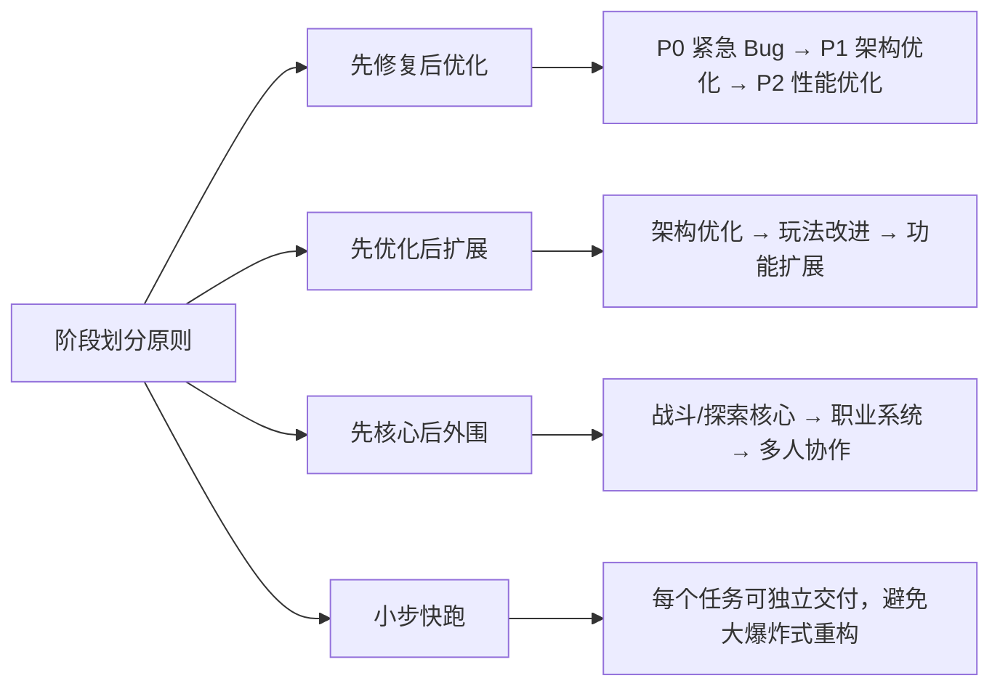
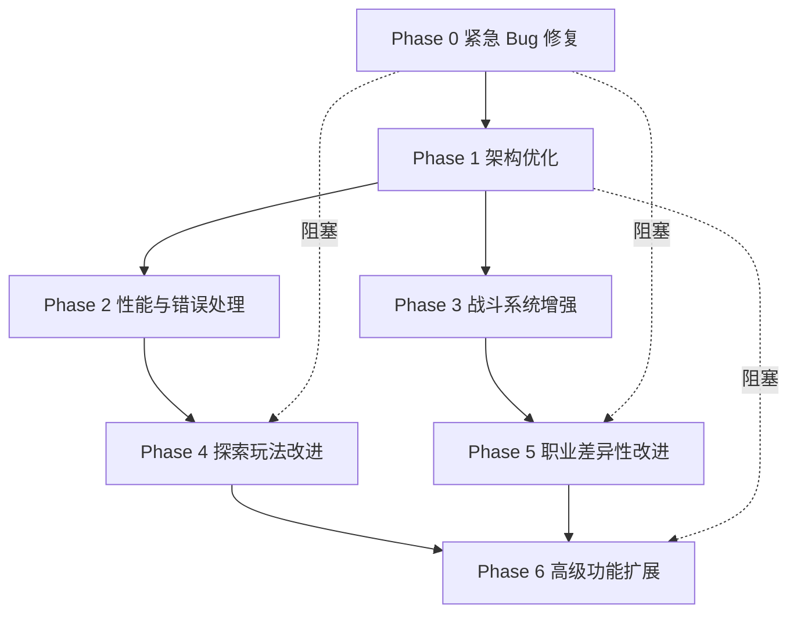
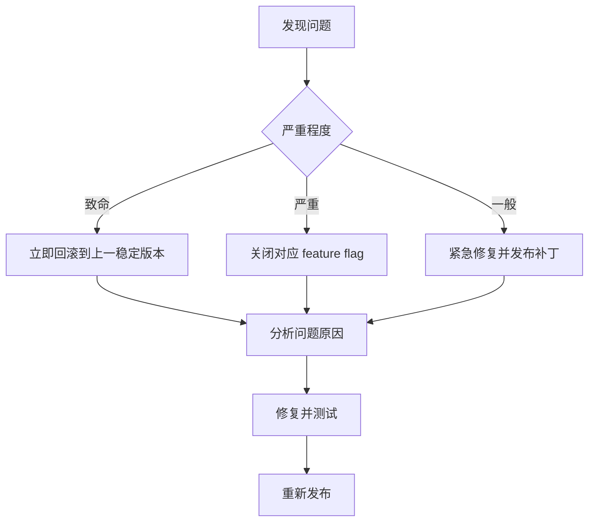
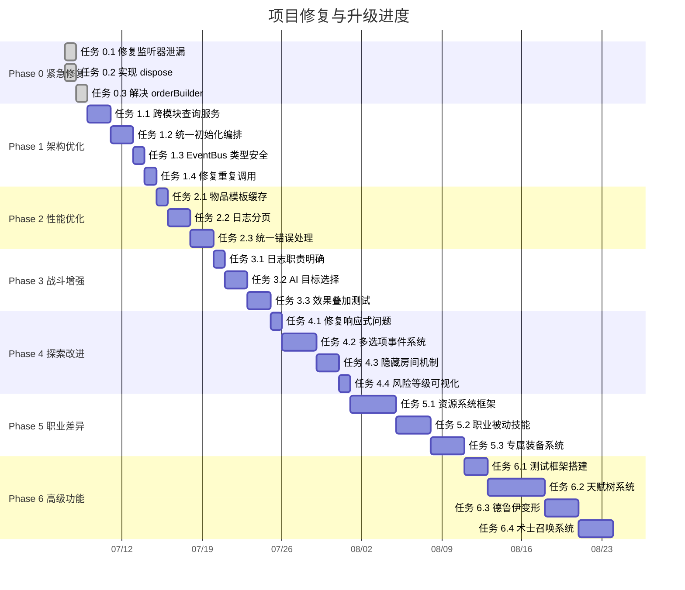

# WoW DnD 项目修复与升级完整计划

## 文档信息

| 项目 | 内容 |
|------|------|
| 标题 | WoW DnD 项目修复与升级完整计划 |
| 版本 | v1.0 |
| 生成日期 | 2026年7月6日 |
| 文档定位 | 项目修复与升级的执行手册，按阶段组织详细任务清单 |
| 输出目录 | `doc/` |
| 关联文档 | [plan/06_MODULE_ISSUES_AND_FIXES.md](./plan/06_MODULE_ISSUES_AND_FIXES.md)、[plan/07_UPGRADE_PLAN.md](./plan/07_UPGRADE_PLAN.md) |

---

## 一、计划总览

### 1.1 计划目标

本计划基于对项目源码的深入分析，系统性解决以下问题：

1. **修复紧急 Bug**：解决内存泄漏、状态错乱等影响功能正确性的问题
2. **优化架构质量**：消除循环依赖、跨层调用，提升可维护性
3. **提升性能体验**：解决日志膨胀、缓存缺失、错误处理缺失等问题
4. **改进核心玩法**：增强探索深度和职业差异性
5. **扩展功能边界**：为后续多人协作、赛季等内容扩展奠基

### 1.2 阶段划分原则



### 1.3 阶段总览

| 阶段 | 名称 | 目标 | 涉及缺陷 | 预估工作量 |
|------|------|------|----------|------------|
| **Phase 0** | 紧急 Bug 修复 | 解决内存泄漏和状态错乱 | EXP-1、EXP-2、CMB-1 | 小 |
| **Phase 1** | 架构优化与代码质量 | 消除循环依赖、跨层调用、类型不安全 | EXP-4、EXP-5、ST-1、ST-2、CMB-2 | 中 |
| **Phase 2** | 性能优化与错误处理 | 日志分页、缓存、统一错误处理 | PERF-1、PERF-2、PERF-3、ERR-1、ERR-2、ERR-3 | 中 |
| **Phase 3** | 战斗系统增强 | AI 协作、效果测试、日志职责明确 | CMB-3、CMB-4、CMB-5 | 中 |
| **Phase 4** | 探索玩法改进（核心新功能） | 多选项事件、隐藏房间、风险权衡 | EXP-6、EXP-3、EXP-7 | 大 |
| **Phase 5** | 职业差异性改进（核心新功能） | 资源系统、被动技能、专属装备 | CHR-1、CHR-2、CHR-3 | 大 |
| **Phase 6** | 高级功能扩展 | 天赋树、职业机制、多人协作 | - | 大 |

### 1.4 依赖关系



**关键依赖说明**：
- Phase 0 必须最先完成，否则后续重构会引入新 Bug
- Phase 4 和 Phase 5 是核心玩法改进，依赖 Phase 0 的稳定性
- Phase 6 依赖 Phase 1 的架构优化完成

---

## 二、Phase 0：紧急 Bug 修复

### 2.1 阶段目标

| 目标 | 描述 |
|------|------|
| 修复内存泄漏 | EventBus 监听器累积导致的状态错乱 |
| 消除 hack 代码 | 解决 orderBuilder 延迟绑定问题 |
| 保障数据安全 | 确保角色切换、组件重挂载时状态正确 |

### 2.2 任务清单

#### 任务 0.1：修复 combatListenerRegistered 不重置（EXP-1）

**优先级**：P0-紧急
**预估工作量**：小（0.5 天）
**涉及文件**：`src/modules/exploration/store.ts`

**当前问题代码**：
```typescript
// src/modules/exploration/store.ts:723
let combatListenerRegistered = false;  // 模块级变量，永不重置

function setupCombatListener(): void {
  if (combatListenerRegistered) return;
  combatListenerRegistered = true;
  eventBus.on(GameEvents.COMBAT_END, (data) => { ... });
}
```

**修复步骤**：

1. 移除 `combatListenerRegistered` 模块级变量
2. 改用 EventBus 分组订阅机制
3. 在 `init()` 中注册分组，在 `dispose()` 中清理分组

**修复后代码**：
```typescript
// 移除：let combatListenerRegistered = false;

function setupCombatListener(): void {
  // 使用分组订阅，便于清理
  eventBus.onGroup('exploration', GameEvents.COMBAT_END, (data) => {
    if (data && pendingBattleCell.value) {
      onBattleResult(data.result, pendingBattleCell.value);
      pendingBattleCell.value = null;
    }
  });
}

function dispose(): void {
  // 清理探索模块的所有监听器
  eventBus.clearGroup('exploration');
  uiCallbacks = null;
}
```

**验证方法**：
- 切换角色 5 次，检查 EventBus 监听器数量是否稳定（通过 `eventBus.listenerCount(GameEvents.COMBAT_END)` 或自定义统计方法）
- 触发战斗结束事件，确认 `onBattleResult` 仅被调用一次

**验收标准**：
- [ ] `combatListenerRegistered` 变量已移除
- [ ] 切换角色后监听器不累积
- [ ] 战斗结果回调正确执行
- [ ] 单元测试覆盖：`__tests__/exploration/store.test.ts` 新增"角色切换后监听器不重复注册"测试用例

---

#### 任务 0.2：实现 dispose() 清理逻辑（EXP-2）

**优先级**：P0-紧急
**预估工作量**：小（0.5 天）
**涉及文件**：`src/modules/exploration/store.ts`

**当前问题代码**：
```typescript
// src/modules/exploration/store.ts:771-773
function dispose(): void {
  // 预留：如需完全清理，可调用 eventBus.off
}
```

**修复步骤**：

1. 实现 `dispose()` 调用 `eventBus.clearGroup('exploration')`
2. 清理 `uiCallbacks`
3. 重置探索状态（可选，根据调用场景决定）
4. 在 `GameMain.vue` 的 `onUnmounted` 钩子中调用 `dispose()`

**修复后代码**：
```typescript
function dispose(): void {
  // 1. 清理 EventBus 监听器
  eventBus.clearGroup('exploration');

  // 2. 清理 UI 回调
  uiCallbacks = null;

  // 3. 重置内部状态（可选，视场景而定）
  pendingBattleCell.value = null;
}
```

**调用点**：
```typescript
// src/components/GameMain.vue
import { useExplorationStore } from '@/modules/exploration';

const explorationStore = useExplorationStore();

onUnmounted(() => {
  explorationStore.dispose();
});
```

**验证方法**：
- 在 `GameMain.vue` 卸载并重新挂载 5 次，检查内存中监听器数量
- 使用 Chrome DevTools 的 Memory 面板对比卸载前后的内存占用

**验收标准**：
- [ ] `dispose()` 实现清理逻辑
- [ ] `GameMain.vue` 卸载时调用 `dispose()`
- [ ] 监听器数量在卸载后减少
- [ ] 重新挂载后监听器重新注册且不重复

---

#### 任务 0.3：解决 orderBuilder 延迟绑定 hack（CMB-1）

**优先级**：P0-紧急
**预估工作量**：小（1 天）
**涉及文件**：`src/modules/combat/store.ts`、`src/modules/combat/composables/useBossMechanics.ts`

**当前问题代码**：
```typescript
// src/modules/combat/store.ts:52-53, 190
const orderBuilder: { build: ((cs) => void) | null } = { build: null };
const boss = useBossMechanics(state, log, (cs) => orderBuilder.build?.(cs));
// ...
orderBuilder.build = (cs) => initiative.buildInitiativeOrder(cs);  // 延迟绑定
```

**修复方案**：调整 composables 的初始化顺序，使 `initiative` 先于 `boss` 创建。

**修复步骤**：

1. 分析 `useBossMechanics` 对 `initiative` 的依赖点（仅在 `summon_minions` 时调用 `buildInitiativeOrder`）
2. 将 `initiative` 的创建提前到 `boss` 之前
3. `useBossMechanics` 直接接收 `initiative` 实例而非回调
4. 移除 `orderBuilder` 变量

**修复后代码**：
```typescript
export const useCombatStore = defineStore('combat', () => {
  // 1. 状态层
  const state = useCombatState();

  // 2. 日志层
  const log = useCombatLog(state);

  // 3. 敌人行动层（不依赖 initiative 的回调，仅依赖 state 和 log）
  const enemy = useEnemyAction(state, log);

  // 4. Boss 机制层（声明需要的回调接口，但不立即绑定）
  //    改为依赖 enemy，而非 initiative
  const boss = useBossMechanics(state, log, enemy);

  // 5. endCombat（依赖 state 和 log）
  function endCombat(result: CombatResult): void {
    // ... 保持不变
  }

  // 6. 先攻/调度层（依赖 enemy、boss、endCombat）
  const initiative = useInitiative(state, log, enemy, boss, endCombat);

  // 7. Boss 召唤回调绑定（initiative 已就位，直接注入）
  boss.setInitiativeCallback(initiative.buildInitiativeOrder);

  // 8. 玩家行动层
  const player = usePlayerAction(state, log, initiative, endCombat);

  // ... 其余保持不变
});
```

**`useBossMechanics` 改造**：
```typescript
// src/modules/combat/composables/useBossMechanics.ts
export function useBossMechanics(
  state: ReturnType<typeof useCombatState>,
  log: ReturnType<typeof useCombatLog>,
  enemy: ReturnType<typeof useEnemyAction>
) {
  // 声明回调变量，但不再通过构造函数传入
  let initiativeCallback: ((cs: ReturnType<typeof useCharacterStore>) => void) | null = null;

  function setInitiativeCallback(cb: typeof initiativeCallback): void {
    initiativeCallback = cb;
  }

  // summon_minions 时调用
  function summonMinions(bossId: string): void {
    // ... 召唤逻辑
    // 召唤后重建先攻顺序
    if (initiativeCallback) {
      const characterStore = useCharacterStore();
      initiativeCallback(characterStore);
    }
  }

  return {
    setInitiativeCallback,
    summonMinions,
    // ... 其他方法
  };
}
```

**验证方法**：
- 触发 Boss 战斗，召唤小怪后确认先攻顺序正确重建
- 检查战斗流程无异常

**验收标准**：
- [ ] `orderBuilder` 变量已移除
- [ ] `useBossMechanics` 通过 `setInitiativeCallback` 方法接收回调
- [ ] Boss 召唤小怪后先攻顺序正确更新
- [ ] 战斗流程无回归错误

---

### 2.3 Phase 0 验收清单

| 验收项 | 标准 | 验证方法 |
|--------|------|----------|
| 内存泄漏 | 监听器数量稳定 | 切换角色 10 次，监听器数量不变 |
| 状态错乱 | 战斗结果正确回调 | 切换角色后触发战斗，结果正确 |
| hack 消除 | orderBuilder 移除 | 代码搜索无 `orderBuilder` |
| 功能回归 | 所有现有功能正常 | 手动测试核心流程 |

---

## 三、Phase 1：架构优化与代码质量

### 3.1 阶段目标

| 目标 | 描述 |
|------|------|
| 消除跨层调用 | 探索模块不再直接 import 其他模块的 DbService |
| 解决循环依赖 | combat↔boss、exploration↔combat、inventory↔equipment |
| 强化类型安全 | EventBus 的 on/off 类型安全，移除 any 滥用 |
| 统一初始化 | Store 初始化由专门的 Bootstrap 服务编排 |

### 3.2 任务清单

#### 任务 1.1：抽取跨模块查询服务（EXP-4）

**优先级**：P1-高
**预估工作量**：中（2 天）
**涉及文件**：新建 `src/services/CrossModuleQuery.ts`、修改 `src/modules/exploration/store.ts`

**当前问题**：
```typescript
// src/modules/exploration/store.ts:13-16
import { mapDbService } from '../map/db';
import { inventoryDbService } from '../inventory/db';
import { questDbService } from '../quest/db';
import { shopDbService } from '../shop/db';
```

**修复步骤**：

1. 新建 `src/services/CrossModuleQuery.ts`，聚合跨模块查询
2. 探索模块改为依赖 `CrossModuleQuery` 而非具体 DbService
3. 为 `CrossModuleQuery` 编写单元测试

**新增文件**：
```typescript
// src/services/CrossModuleQuery.ts
import { mapDbService } from '@/modules/map/db';
import { inventoryDbService } from '@/modules/inventory/db';
import { questDbService } from '@/modules/quest/db';
import { shopDbService } from '@/modules/shop/db';
import type { LocationData } from '@/modules/map/types';
import type { ItemTemplate } from '@/modules/inventory/types';
import type { QuestDefinition } from '@/modules/quest/types';
import type { ShopConfig } from '@/modules/shop/types';

/**
 * 跨模块查询服务
 * 集中管理探索模块对其他模块数据的查询需求，避免 Store 直接依赖 DbService
 */
export class CrossModuleQueryService {
  /** 获取地点数据 */
  async getLocationData(areaId: string): Promise<LocationData | undefined> {
    return await mapDbService.getLocationData(areaId);
  }

  /** 获取所有物品模板（带缓存） */
  async getAllItemTemplates(): Promise<ItemTemplate[]> {
    return await inventoryDbService.getAllItemTemplates();
  }

  /** 获取区域相关的任务定义 */
  async getQuestDefinitionsByBoard(areaId: string): Promise<QuestDefinition[]> {
    return await questDbService.getQuestDefinitionsByBoard(areaId);
  }

  /** 获取所有商店配置 */
  async getAllShopConfigs(): Promise<ShopConfig[]> {
    return await shopDbService.getAllShopConfigs();
  }
}

export const crossModuleQuery = new CrossModuleQueryService();
```

**探索模块改造**：
```typescript
// src/modules/exploration/store.ts
// 移除：import { mapDbService } from '../map/db';
// 移除：import { inventoryDbService } from '../inventory/db';
// 移除：import { questDbService } from '../quest/db';
// 移除：import { shopDbService } from '../shop/db';

import { crossModuleQuery } from '@/services/CrossModuleQuery';

// buildAreaConfig 内部调用改为：
const allItems = await crossModuleQuery.getAllItemTemplates();
const location = await crossModuleQuery.getLocationData(areaId);
const quests = await crossModuleQuery.getQuestDefinitionsByBoard(areaId);
const shops = await crossModuleQuery.getAllShopConfigs();
```

**验收标准**：
- [ ] `src/services/CrossModuleQuery.ts` 创建完成
- [ ] 探索模块不再直接 import 其他模块的 DbService
- [ ] 单元测试覆盖 `CrossModuleQueryService` 的所有方法
- [ ] 功能回归测试通过

---

#### 任务 1.2：统一 Store 初始化编排（EXP-5）

**优先级**：P1-高
**预估工作量**：中（1.5 天）
**涉及文件**：新建 `src/services/GameBootstrap.ts`、修改各模块 `store.ts`

**当前问题**：
```typescript
// src/modules/exploration/store.ts:226-230
async function init(characterId: string): Promise<void> {
  currentCharacterId.value = characterId;
  useLogStore().initialize(characterId);          // 隐式初始化
  const inventoryStore = useInventoryStore();
  await inventoryStore.initialize(characterId);   // 隐式初始化
  // ...
}
```

**修复步骤**：

1. 新建 `GameBootstrap` 服务，统一编排各 Store 初始化顺序
2. 各模块的 `init` 方法只负责自身状态加载，假设依赖已初始化
3. 在 `GameMain.vue` 或应用入口调用 `GameBootstrap.initialize(characterId)`

**新增文件**：
```typescript
// src/services/GameBootstrap.ts
import { useCharacterStore } from '@/modules/character/store';
import { useInventoryStore } from '@/modules/inventory/store';
import { useLogStore } from '@/modules/log/store';
import { useExplorationStore } from '@/modules/exploration/store';
// ... 其他 Store

/**
 * 游戏初始化编排服务
 * 负责按正确顺序初始化各模块 Store
 */
export class GameBootstrapService {
  /**
   * 初始化指定角色的所有模块
   * 初始化顺序：character → log → inventory → equipment → skill → exploration → quest
   */
  async initialize(characterId: string): Promise<void> {
    // 1. 角色模块（基础数据）
    const characterStore = useCharacterStore();
    await characterStore.init(characterId);

    // 2. 日志模块（依赖 character）
    const logStore = useLogStore();
    logStore.initialize(characterId);

    // 3. 背包模块（依赖 character）
    const inventoryStore = useInventoryStore();
    await inventoryStore.initialize(characterId);

    // 4. 装备模块（依赖 character、inventory）
    const equipmentStore = useEquipmentStore();
    await equipmentStore.initialize(characterId);

    // 5. 技能模块（依赖 character）
    const skillStore = useSkillStore();
    await skillStore.initialize(characterId);

    // 6. 探索模块（依赖上述所有）
    const explorationStore = useExplorationStore();
    await explorationStore.init(characterId);

    // 7. 任务模块（依赖 character、exploration）
    const questStore = useQuestStore();
    await questStore.initialize(characterId);
  }

  /**
   * 清理所有模块（角色切换或退出时）
   */
  async dispose(): Promise<void> {
    // 按初始化的逆序清理
    useQuestStore().dispose?.();
    useExplorationStore().dispose();
    useSkillStore().dispose?.();
    useEquipmentStore().dispose?.();
    useInventoryStore().dispose?.();
    useLogStore().dispose?.();
    useCharacterStore().dispose?.();
  }
}

export const gameBootstrap = new GameBootstrapService();
```

**探索模块改造**：
```typescript
// src/modules/exploration/store.ts
async function init(characterId: string): Promise<void> {
  currentCharacterId.value = characterId;

  // 移除：useLogStore().initialize(characterId);
  // 移除：const inventoryStore = useInventoryStore();
  // 移除：await inventoryStore.initialize(characterId);

  // 仅加载自身状态
  const stored = await explorationDbService.getExplorationData(characterId);
  // ... 恢复状态逻辑保持不变

  setupCombatListener();
}
```

**验收标准**：
- [ ] `GameBootstrapService` 创建完成
- [ ] 探索模块 `init` 不再初始化其他 Store
- [ ] 各 Store 初始化顺序明确且正确
- [ ] 角色切换时正确清理并重新初始化

---

#### 任务 1.3：EventBus 类型安全强化（ST-1、ST-2）

**优先级**：P2-中
**预估工作量**：中（1 天）
**涉及文件**：`src/modules/bus/core.ts`、`src/modules/bus/types.ts`

**当前问题**：
```typescript
// on/off 使用裸 string，类型不安全
on(event: string, callback: EventCallback): void;
off(event: string, callback: EventCallback): void;

// EventCallback 使用 any[]
export type EventCallback = (...args: any[]) => void;
```

**修复步骤**：

1. 为 `on/off/once` 添加泛型约束
2. `EventCallback` 改为带类型参数的形式
3. 保持向后兼容（可选泛型）

**修复后代码**：
```typescript
// src/modules/bus/types.ts
export type EventCallback<T = any> = (data: T) => void;

// src/modules/bus/core.ts
export interface IEventBus {
  on<K extends keyof GameEventPayloadMap>(
    event: K,
    callback: EventCallback<GameEventPayloadMap[K]>
  ): void;

  off<K extends keyof GameEventPayloadMap>(
    event: K,
    callback: EventCallback<GameEventPayloadMap[K]>
  ): void;

  once<K extends keyof GameEventPayloadMap>(
    event: K,
    callback: EventCallback<GameEventPayloadMap[K]>
  ): void;

  emit<K extends keyof GameEventPayloadMap>(
    event: K,
    data: GameEventPayloadMap[K]
  ): void;

  // 分组订阅保持类型安全
  onGroup<K extends keyof GameEventPayloadMap>(
    group: string,
    event: K,
    callback: EventCallback<GameEventPayloadMap[K]>
  ): void;

  // ... 其他方法
}
```

**验收标准**：
- [ ] `on/off/once` 支持泛型约束
- [ ] 订阅时 payload 类型与事件名匹配
- [ ] 编译期捕获事件名拼写错误
- [ ] 现有代码迁移完成且编译通过

---

#### 任务 1.4：修复 endCombat 重复调用 useLogStore（CMB-2）

**优先级**：P3-低
**预估工作量**：小（0.5 天）
**涉及文件**：`src/modules/combat/store.ts`

**修复步骤**：
1. 在 `endCombat` 函数开头获取 `logStore` 实例
2. 后续复用该实例

**修复后代码**：
```typescript
function endCombat(result: CombatResult): void {
  if (state.state.value === 'ended' || state.state.value === 'idle') return;
  // ... 敌人检查逻辑

  try {
    const characterStore = useCharacterStore();
    const logStore = useLogStore();  // 获取一次，复用

    // ... 后续使用 logStore.addLogEntry(...)
  } catch (e) {
    // ...
  }
}
```

**验收标准**：
- [ ] `useLogStore()` 在 `endCombat` 中仅调用一次
- [ ] 功能无回归

---

### 3.3 Phase 1 验收清单

| 验收项 | 标准 | 验证方法 |
|--------|------|----------|
| 跨层调用 | 探索模块不直接 import DbService | 代码搜索 `import.*db'` 在 exploration/store.ts 中无结果 |
| 初始化顺序 | 各 Store 独立初始化 | 探索 `init` 不调用其他 Store 的 `init` |
| 类型安全 | EventBus on/off 泛型约束 | 编译期捕获错误事件名 |
| 循环依赖 | combat↔boss 解耦 | `orderBuilder` 移除，boss 通过接口接收回调 |

---

## 四、Phase 2：性能优化与错误处理

### 4.1 阶段目标

| 目标 | 描述 |
|------|------|
| 日志分页 | 避免日志无限增长导致内存问题 |
| 物品模板缓存 | 减少重复 IndexedDB 查询 |
| 统一错误处理 | 用户可感知的错误提示和重试机制 |

### 4.2 任务清单

#### 任务 2.1：实现物品模板缓存（PERF-1）

**优先级**：P2-中
**预估工作量**：中（1 天）
**涉及文件**：新建 `src/services/ItemTemplateCache.ts`、修改 `src/modules/inventory/store.ts`

**修复步骤**：

1. 新建 `ItemTemplateCache` 单例类
2. `inventoryStore.initialize` 时加载全部模板到缓存
3. 提供查询接口，替代直接查询 DbService

**新增文件**：
```typescript
// src/services/ItemTemplateCache.ts
import { inventoryDbService } from '@/modules/inventory/db';
import type { ItemTemplate } from '@/modules/inventory/types';

export class ItemTemplateCache {
  private cache = new Map<string, ItemTemplate>();
  private loaded = false;

  async loadAll(): Promise<void> {
    if (this.loaded) return;
    const templates = await inventoryDbService.getAllItemTemplates();
    templates.forEach(t => this.cache.set(t.id, t));
    this.loaded = true;
  }

  get(itemId: string): ItemTemplate | undefined {
    return this.cache.get(itemId);
  }

  getAll(): ItemTemplate[] {
    return Array.from(this.cache.values());
  }

  /** 按等级范围筛选 */
  filterByLevelRange(minLevel: number, maxLevel: number): ItemTemplate[] {
    return this.getAll().filter(t =>
      t.level >= minLevel && t.level <= maxLevel
    );
  }

  invalidate(): void {
    this.cache.clear();
    this.loaded = false;
  }
}

export const itemTemplateCache = new ItemTemplateCache();
```

**集成到 CrossModuleQuery**：
```typescript
// src/services/CrossModuleQuery.ts
import { itemTemplateCache } from './ItemTemplateCache';

export class CrossModuleQueryService {
  async getAllItemTemplates(): Promise<ItemTemplate[]> {
    await itemTemplateCache.loadAll();
    return itemTemplateCache.getAll();
  }

  // 新增：按等级范围筛选
  getItemTemplatesByLevelRange(minLevel: number, maxLevel: number): ItemTemplate[] {
    return itemTemplateCache.filterByLevelRange(minLevel, maxLevel);
  }
}
```

**验收标准**：
- [ ] `ItemTemplateCache` 创建完成
- [ ] 物品模板仅从 IndexedDB 加载一次
- [ ] 后续查询走内存缓存
- [ ] 性能基准：进入区域 10 次，IndexedDB 查询次数从 10 降为 1

---

#### 任务 2.2：实现日志分页（PERF-3）

**优先级**：P2-中
**预估工作量**：中（1.5 天）
**涉及文件**：`src/modules/log/store.ts`、相关 UI 组件

**修复步骤**：

1. 内存中仅保留最近 N 条日志（如 500 条）
2. 历史日志按需分页查询
3. UI 组件支持"加载更多"

**修改 `logStore`**：
```typescript
// src/modules/log/store.ts
const MAX_IN_MEMORY_LOGS = 500;

async function initialize(characterId: string): Promise<void> {
  currentCharacterId.value = characterId;
  // 仅加载最近的 MAX_IN_MEMORY_LOGS 条日志
  const allLogs = await logDbService.getLogsByCharacter(characterId);
  logs.value = allLogs.slice(0, MAX_INMEMORY_LOGS);
  totalCount.value = allLogs.length;
}

async function loadMore(limit: number = 100): Promise<void> {
  const offset = logs.value.length;
  const olderLogs = await logDbService.getLogsByCharacter(
    currentCharacterId.value!,
    { offset, limit }
  );
  logs.value.push(...olderLogs);
}

function addLogEntry(entry: LogEntry): void {
  logs.value.unshift(entry);
  // 超过上限时移除最旧的
  if (logs.value.length > MAX_IN_MEMORY_LOGS) {
    logs.value = logs.value.slice(0, MAX_IN_MEMORY_LOGS);
  }
  totalCount.value++;
  // 持久化
  logDbService.addLog(currentCharacterId.value!, entry);
}
```

**DbService 支持分页**：
```typescript
// src/modules/log/db.ts
async getLogsByCharacter(
  characterId: string,
  options?: { offset?: number; limit?: number }
): Promise<LogEntry[]> {
  let collection = db.runtime_adventureLogs
    .where('characterId')
    .equals(characterId)
    .reverse();

  if (options?.limit) {
    collection = collection.limit(options.limit);
  }
  if (options?.offset) {
    collection = collection.offset(options.offset);
  }

  return await collection.toArray();
}
```

**验收标准**：
- [ ] 内存日志数量上限为 500
- [ ] UI 支持"加载更多"按钮
- [ ] 分页查询性能 < 100ms
- [ ] 旧日志不丢失，可按需加载

---

#### 任务 2.3：统一错误处理机制（ERR-1、ERR-2、ERR-3）

**优先级**：P2-中
**预估工作量**：中（2 天）
**涉及文件**：新建 `src/utils/ErrorHandler.ts`、修改各模块

**修复步骤**：

1. 新建 `ErrorHandler` 工具类
2. 定义错误事件类型
3. 关键操作包裹错误处理
4. UI 层显示错误提示

**新增文件**：
```typescript
// src/utils/ErrorHandler.ts
import { eventBus, GameEvents } from '@/modules/bus';

export enum ErrorLevel {
  INFO = 'info',
  WARNING = 'warning',
  ERROR = 'error',
  CRITICAL = 'critical'
}

export interface GameError {
  level: ErrorLevel;
  module: string;
  operation: string;
  message: string;
  originalError?: Error;
  recoverable: boolean;
}

export class ErrorHandler {
  static handle(error: GameError): void {
    // 1. 控制台输出（开发环境）
    if (import.meta.env.DEV) {
      console.error(`[${error.module}.${error.operation}]`, error.message, error.originalError);
    }

    // 2. 通过 EventBus 发布错误事件
    eventBus.emit(GameEvents.SYSTEM_ERROR, {
      level: error.level,
      module: error.module,
      operation: error.operation,
      message: error.message,
      recoverable: error.recoverable
    });

    // 3. 关键错误记录到冒险日志
    if (error.level === ErrorLevel.CRITICAL || error.level === ErrorLevel.ERROR) {
      // 由 logStore 订阅 SYSTEM_ERROR 事件统一处理
    }
  }

  static wrap<T>(
    operation: string,
    module: string,
    fn: () => T,
    recoverable: boolean = true
  ): T {
    try {
      return fn();
    } catch (e) {
      ErrorHandler.handle({
        level: ErrorLevel.ERROR,
        module,
        operation,
        message: e instanceof Error ? e.message : String(e),
        originalError: e instanceof Error ? e : undefined,
        recoverable
      });
      throw e;  // 重新抛出，由调用方决定是否处理
    }
  }

  static async wrapAsync<T>(
    operation: string,
    module: string,
    fn: () => Promise<T>,
    recoverable: boolean = true
  ): Promise<T> {
    try {
      return await fn();
    } catch (e) {
      ErrorHandler.handle({
        level: ErrorLevel.ERROR,
        module,
        operation,
        message: e instanceof Error ? e.message : String(e),
        originalError: e instanceof Error ? e : undefined,
        recoverable
      });
      throw e;
    }
  }
}
```

**新增事件类型**：
```typescript
// src/modules/bus/events.ts
export const GameEvents = {
  // ... 现有事件
  SYSTEM_ERROR: 'SYSTEM_ERROR',
  STORAGE_ERROR: 'STORAGE_ERROR',
} as const;

export interface GameEventPayloadMap {
  // ... 现有类型
  SYSTEM_ERROR: {
    level: ErrorLevel;
    module: string;
    operation: string;
    message: string;
    recoverable: boolean;
  };
  STORAGE_ERROR: {
    operation: string;
    message: string;
  };
}
```

**改造 `endCombat`**：
```typescript
// src/modules/combat/store.ts
function endCombat(result: CombatResult): void {
  // ...
  try {
    // ... 战斗结算逻辑
  } catch (e) {
    ErrorHandler.handle({
      level: ErrorLevel.CRITICAL,
      module: 'combat',
      operation: 'endCombat',
      message: '战斗结算失败，可能丢失奖励',
      originalError: e instanceof Error ? e : undefined,
      recoverable: false
    });
    state.cleanup();
  }
}
```

**改造 `dbService.withRetry`**：
```typescript
// src/services/dbService.ts
async withRetry<T>(operation: string, fn: () => Promise<T>): Promise<T> {
  const maxRetries = 3;
  for (let i = 0; i < maxRetries; i++) {
    try {
      return await fn();
    } catch (e) {
      if (i === maxRetries - 1) {
        ErrorHandler.handle({
          level: ErrorLevel.CRITICAL,
          module: 'db',
          operation,
          message: `存储操作失败（重试 ${maxRetries} 次后仍失败）`,
          originalError: e instanceof Error ? e : undefined,
          recoverable: false
        });
        eventBus.emit(GameEvents.STORAGE_ERROR, {
          operation,
          message: '存档失败，请手动备份'
        });
        throw e;
      }
      await new Promise(resolve => setTimeout(resolve, 100 * (i + 1)));
    }
  }
  throw new Error('unreachable');
}
```

**UI 错误提示组件**：
```typescript
// GameMain.vue 中监听错误事件
import { useToastStore } from '@/modules/toast/store';

eventBus.on(GameEvents.SYSTEM_ERROR, (error) => {
  if (error.level === ErrorLevel.CRITICAL) {
    useToastStore().showToast({
      type: 'error',
      message: error.message,
      duration: 5000
    });
  }
});

eventBus.on(GameEvents.STORAGE_ERROR, (error) => {
  useToastStore().showToast({
    type: 'warning',
    message: `${error.message}（${error.operation}）`,
    duration: 10000
  });
});
```

**验收标准**：
- [ ] `ErrorHandler` 工具类创建完成
- [ ] `SYSTEM_ERROR`、`STORAGE_ERROR` 事件定义
- [ ] `endCombat` 错误通过 EventBus 上报
- [ ] `dbService.withRetry` 失败后通知用户
- [ ] UI 显示错误提示

---

### 4.3 Phase 2 验收清单

| 验收项 | 标准 | 验证方法 |
|--------|------|----------|
| 物品缓存 | 模板仅加载一次 | 进入区域 10 次，IndexedDB 查询 1 次 |
| 日志分页 | 内存日志上限 500 | 添加 600 条日志，内存中仅保留 500 条 |
| 错误处理 | 用户可感知 | 模拟存储失败，UI 显示错误提示 |

---

## 五、Phase 3：战斗系统增强

### 5.1 阶段目标

| 目标 | 描述 |
|------|------|
| 日志职责明确 | 战斗日志与冒险日志不冗余 |
| AI 协作 | 多敌人场景下的目标选择和协作 |
| 效果测试 | 叠加策略有完整测试覆盖 |

### 5.2 任务清单

#### 任务 3.1：明确战斗日志与冒险日志职责（CMB-3）

**优先级**：P2-中
**预估工作量**：小（1 天）

**修复步骤**：

1. 明确 `combatLogs` 记录战斗回合详细数据（供战斗回放）
2. 明确 `adventureLogs` 记录摘要（供冒险日志 UI）
3. 移除冗余记录

**职责定义**：

| 日志类型 | 存储表 | 内容 | 用途 |
|----------|--------|------|------|
| 战斗日志 | `runtime_combatLogs` | 每个行动的详细数据（伤害值、暴击、闪避、效果） | 战斗回放、数据分析 |
| 冒险日志 | `runtime_adventureLogs` | 摘要事件（战斗开始/结束、获得经验/金币） | 冒险日志 UI 展示 |

**修复后**：
```typescript
// endCombat 中仅记录摘要到 adventureLogs
useLogStore().addLogEntry({
  id: generateLogId(),
  timestamp: Date.now(),
  type: 'combat',
  message: `击败 ${enemyNames}！获得 ${totalExp} 经验和 ${totalGold} 金币`,
  icon: 'game-icons:laurel-crown'
});

// 详细回合数据仅记录到 combatLogs
log.addCombatLog({
  actorType: 'system',
  eventType: 'combat_end',
  message: `战斗胜利！`
});
```

**验收标准**：
- [ ] 战斗日志与冒险日志职责明确
- [ ] 无冗余记录
- [ ] 战斗回放功能正常（使用 combatLogs）
- [ ] 冒险日志 UI 正常显示（使用 adventureLogs）

---

#### 任务 3.2：增强 AI 目标选择逻辑（CMB-4）

**优先级**：P1-高
**预估工作量**：中（2 天）
**涉及文件**：`src/modules/combat/ai/strategies.ts`

**修复步骤**：

1. 扩展 `AiDecision` 类型，增加 `targetId` 字段
2. 实现目标选择策略（优先低 HP、优先高威胁、随机）
3. 实现敌人协作策略（集火同一目标、低 HP 优先治疗队友）

**扩展类型**：
```typescript
// src/modules/combat/ai/types.ts
export interface AiDecision {
  action: 'attack' | 'skill' | 'defend' | 'flee';
  skillId?: string;
  targetId?: string;  // 新增：目标 ID
  reasoning?: string;  // 新增：决策理由（用于日志）
}

export type TargetSelectionStrategy =
  | 'lowest_hp'        // 优先攻击血量最低的目标
  | 'highest_threat'   // 优先攻击威胁最高的目标
  | 'random'           // 随机选择
  | 'focus_fire'       // 集火（与队友攻击同一目标）
  | 'heal_ally';       // 治疗队友（低 HP 时）
```

**目标选择实现**：
```typescript
// src/modules/combat/ai/targetSelection.ts
export class TargetSelector {
  /** 选择攻击目标 */
  static selectTarget(
    enemies: EnemyInstance[],
    strategy: TargetSelectionStrategy,
    context: AiContext
  ): string | null {
    const aliveTargets = enemies.filter(e => e.hp > 0);
    if (aliveTargets.length === 0) return null;

    switch (strategy) {
      case 'lowest_hp':
        return aliveTargets.reduce((min, e) =>
          e.hp < min.hp ? e : min
        ).id;

      case 'highest_threat':
        // 威胁度 = 攻击力 + 技能伤害潜力
        return aliveTargets.reduce((max, e) =>
          this.calculateThreat(e) > this.calculateThreat(max) ? e : max
        ).id;

      case 'focus_fire':
        // 攻击队友最近攻击的目标
        return context.lastAttackedTargetId || aliveTargets[0].id;

      case 'random':
        return aliveTargets[Math.floor(Math.random() * aliveTargets.length)].id;

      case 'heal_ally':
        // 选择 HP 最低的队友（用于治疗）
        return null;  // 由技能逻辑处理

      default:
        return aliveTargets[0].id;
    }
  }

  private static calculateThreat(enemy: EnemyInstance): number {
    return enemy.attack + (enemy.magicAttack || 0);
  }
}
```

**协作策略**：
```typescript
// src/modules/combat/ai/strategies.ts
export class CooperativeStrategy implements IAiStrategy {
  decide(context: AiContext): AiDecision {
    const self = context.self;
    const allies = context.allies.filter(a => a.hp > 0);
    const enemies = context.enemies.filter(e => e.hp > 0);

    // 1. 队友濒死时优先治疗
    const lowHpAlly = allies.find(a => a.hp / a.maxHp < 0.3);
    if (lowHpAlly && self.healSkill) {
      return {
        action: 'skill',
        skillId: self.healSkill,
        targetId: lowHpAlly.id,
        reasoning: '队友濒死，优先治疗'
      };
    }

    // 2. 集火模式：攻击队友最近攻击的目标
    const focusTarget = TargetSelector.selectTarget(enemies, 'focus_fire', context);
    if (focusTarget) {
      return {
        action: 'attack',
        targetId: focusTarget,
        reasoning: '集火攻击队友的目标'
      };
    }

    // 3. 默认攻击血量最低的目标
    const target = TargetSelector.selectTarget(enemies, 'lowest_hp', context);
    return {
      action: 'attack',
      targetId: target!,
      reasoning: '攻击血量最低的目标'
    };
  }
}
```

**验收标准**：
- [ ] AI 决策包含 `targetId`
- [ ] 多敌人场景下有协作行为（集火、治疗）
- [ ] 决策理由记录到战斗日志
- [ ] 单元测试覆盖各目标选择策略

---

#### 任务 3.3：补充效果叠加测试（CMB-5）

**优先级**：P2-中
**预估工作量**：中（1.5 天）
**涉及文件**：新建 `src/modules/combat/effects/__tests__/stacking.test.ts`

**修复步骤**：

1. 为每种 stackStrategy 编写测试用例
2. 明确默认 stackStrategy
3. 测试同名效果重复施加的行为

**测试用例**：
```typescript
// src/modules/combat/effects/__tests__/stacking.test.ts
import { describe, it, expect } from 'vitest';
import { EffectContainer } from '../container';
import { createMockEffect } from './helpers';

describe('Effect 叠加策略', () => {
  let container: EffectContainer;

  beforeEach(() => {
    container = new EffectContainer();
  });

  describe('replace 策略', () => {
    it('同名效果应替换旧效果', () => {
      const effect1 = createMockEffect({ id: 'buff_str', type: 'buff', value: 10, duration: 3 });
      const effect2 = createMockEffect({ id: 'buff_str', type: 'buff', value: 20, duration: 5 });

      container.add(effect1);
      container.add(effect2);

      const effects = container.getByType('buff');
      expect(effects).toHaveLength(1);
      expect(effects[0].value).toBe(20);
      expect(effects[0].duration).toBe(5);
    });
  });

  describe('additive 策略', () => {
    it('同名效果应叠加数值', () => {
      const effect1 = createMockEffect({
        id: 'poison_dot', type: 'dot', value: 10,
        stackStrategy: 'additive'
      });
      const effect2 = createMockEffect({
        id: 'poison_dot', type: 'dot', value: 15,
        stackStrategy: 'additive'
      });

      container.add(effect1);
      container.add(effect2);

      const effects = container.getByType('dot');
      expect(effects).toHaveLength(1);
      expect(effects[0].value).toBe(25);
    });
  });

  describe('max 策略', () => {
    it('同名效果应取最大值', () => {
      const effect1 = createMockEffect({
        id: 'buff_def', type: 'buff', value: 10,
        stackStrategy: 'max'
      });
      const effect2 = createMockEffect({
        id: 'buff_def', type: 'buff', value: 5,
        stackStrategy: 'max'
      });

      container.add(effect1);
      container.add(effect2);

      const effects = container.getByType('buff');
      expect(effects).toHaveLength(1);
      expect(effects[0].value).toBe(10);
    });
  });

  describe('independent 策略', () => {
    it('同名效果应独立存在', () => {
      const effect1 = createMockEffect({
        id: 'buff_atk', type: 'buff', value: 10,
        stackStrategy: 'independent'
      });
      const effect2 = createMockEffect({
        id: 'buff_atk', type: 'buff', value: 15,
        stackStrategy: 'independent'
      });

      container.add(effect1);
      container.add(effect2);

      const effects = container.getByType('buff');
      expect(effects).toHaveLength(2);
    });
  });

  describe('默认策略', () => {
    it('未指定 stackStrategy 时应使用 replace', () => {
      const effect = createMockEffect({ id: 'buff_test', type: 'buff', value: 10 });
      expect(effect.stackStrategy).toBe('replace');  // 默认值
    });
  });
});
```

**验收标准**：
- [ ] 4 种叠加策略均有测试覆盖
- [ ] 默认 stackStrategy 明确为 `replace`
- [ ] 测试覆盖率 ≥ 90%

---

## 六、Phase 4：探索玩法改进（核心新功能）

### 6.1 阶段目标

| 目标 | 描述 |
|------|------|
| 决策深度 | 每次探索至少有 3 次有意义的决策点 |
| 探索惊喜 | 隐藏房间、连锁事件增加探索新鲜感 |
| 风险权衡 | 选项有明确的风险收益权衡 |

### 6.2 任务清单

#### 任务 4.1：修复 UI 回调响应式问题（EXP-3、EXP-7）

**优先级**：P2-中
**预估工作量**：中（1 天）
**涉及文件**：`src/modules/exploration/store.ts`

**修复步骤**：

1. `uiCallbacks` 改为 `ref`
2. 统一封装 `updateCell` 方法处理深层响应式

**修复后代码**：
```typescript
// src/modules/exploration/store.ts
import { ref, shallowRef, triggerRef } from 'vue';

// 改为响应式
const uiCallbacks = ref<ExplorationUICallbacks | null>(null);

function registerUICallbacks(callbacks: ExplorationUICallbacks): void {
  uiCallbacks.value = callbacks;
}

function unregisterUICallbacks(): void {
  uiCallbacks.value = null;
}

// 统一的格子更新方法
function updateCell(x: number, y: number, patch: Partial<ExplorationCell>): void {
  const row = grid.value[y];
  if (!row || !row[x]) return;

  // 创建新对象确保响应式
  row[x] = { ...row[x], ...patch };
  // 触发整个 grid 的响应式更新
  triggerRef(grid);
}
```

**验收标准**：
- [ ] `uiCallbacks` 是响应式
- [ ] 格子属性修改正确触发 UI 更新
- [ ] 无需手动调用 `updateAccessibleCells` 强制刷新

---

#### 任务 4.2：实现多选项事件系统

**优先级**：P1-玩法
**预估工作量**：大（3 天）
**涉及文件**：新建 `src/modules/exploration/events/`、修改 `src/modules/exploration/types.ts`、`store.ts`

**实施步骤**：

1. 定义事件配置数据结构
2. 创建事件配置数据文件
3. 修改 `revealGrid` 支持多选项事件
4. 新建事件选择 UI 组件

**新增类型定义**：
```typescript
// src/modules/exploration/types.ts
export interface ExplorationEventOption {
  id: string;
  label: string;
  description: string;
  requirements?: EventRequirement[];
  riskLevel: 'safe' | 'moderate' | 'high' | 'extreme';
  outcomes: EventOutcome[];
}

export interface EventOutcome {
  probability: number;  // 0-1
  rewards: EventReward[];
  penalties: EventPenalty[];
  flagChanges?: Record<string, any>;
}

export interface EventReward {
  type: 'item' | 'gold' | 'exp' | 'buff' | 'flag';
  value: string | number;
  amount?: number;
}

export interface EventPenalty {
  type: 'damage' | 'gold_loss' | 'debuff' | 'flag';
  value: number | string;
  amount?: number;
}

export interface ExplorationEventConfig {
  id: string;
  title: string;
  description: string;
  icon: string;
  options: ExplorationEventOption[];
}

export interface EventRequirement {
  type: 'level' | 'item' | 'class' | 'flag';
  value: string | number;
  min?: number;
}
```

**事件配置示例**：
```typescript
// src/data/exploration_events.ts
export const EXPLORATION_EVENTS: ExplorationEventConfig[] = [
  {
    id: 'ancient_altar',
    title: '古老祭坛',
    description: '你发现了一座布满符文的古老祭坛，上面似乎还残留着神圣的力量。',
    icon: 'game-icons:stone-block',
    options: [
      {
        id: 'leave',
        label: '离开',
        description: '不冒险，直接离开',
        riskLevel: 'safe',
        outcomes: [{ probability: 1, rewards: [], penalties: [] }]
      },
      {
        id: 'small_offer',
        label: '献祭 10% 生命',
        description: '献祭少量生命值，获得临时增益',
        riskLevel: 'moderate',
        outcomes: [{
          probability: 1,
          rewards: [{ type: 'buff', value: 'blessing_minor', amount: 5 }],
          penalties: [{ type: 'damage', value: 10 }]  // 百分比
        }]
      },
      {
        id: 'big_offer',
        label: '献祭 30% 生命',
        description: '冒险献祭大量生命值，有概率获得强力装备',
        riskLevel: 'high',
        outcomes: [
          {
            probability: 0.5,
            rewards: [{ type: 'item', value: 'rare_weapon', amount: 1 }],
            penalties: [{ type: 'damage', value: 30 }]
          },
          {
            probability: 0.5,
            rewards: [],
            penalties: [
              { type: 'damage', value: 30 },
              { type: 'debuff', value: 'curse', amount: 3 }
            ]
          }
        ]
      },
      {
        id: 'extreme_offer',
        label: '献祭 50% 生命',
        description: '极端冒险，有概率获得传说装备，也可能死亡',
        riskLevel: 'extreme',
        requirements: [{ type: 'level', value: 0, min: 15 }],
        outcomes: [
          {
            probability: 0.2,
            rewards: [{ type: 'item', value: 'legendary_item', amount: 1 }],
            penalties: [{ type: 'damage', value: 50 }]
          },
          {
            probability: 0.8,
            rewards: [],
            penalties: [{ type: 'damage', value: 50 }]  // 可能致死
          }
        ]
      }
    ]
  },
  // ... 更多事件
];
```

**Store 改造**：
```typescript
// src/modules/exploration/store.ts
async function triggerEvent(cell: ExplorationCell, x: number, y: number): Promise<void> {
  const eventConfig = await getEventConfig(cell.eventId);

  // 通过 UI 回调通知显示事件面板
  uiCallbacks.value?.onEventTriggered?.({
    event: eventConfig,
    onOptionSelected: async (optionId: string) => {
      await resolveEvent(cell, eventConfig, optionId, x, y);
    }
  });
}

async function resolveEvent(
  cell: ExplorationCell,
  eventConfig: ExplorationEventConfig,
  optionId: string,
  x: number, y: number
): Promise<void> {
  const option = eventConfig.options.find(o => o.id === optionId);
  if (!option) return;

  // 检查前置条件
  if (option.requirements && !checkRequirements(option.requirements)) {
    eventBus.emit(GameEvents.SYSTEM_ERROR, {
      level: 'warning',
      message: '不满足选项条件'
    });
    return;
  }

  // 随机选择结果
  const outcome = selectOutcome(option.outcomes);

  // 应用奖励和惩罚
  await applyRewards(outcome.rewards);
  await applyPenalties(outcome.penalties);

  // 标记格子已完成
  updateCell(x, y, { completed: true, explored: true });
  grid.value = updateAccessibleCells(grid.value);

  checkCompletion();
  await persistState();
}
```

**验收标准**：
- [ ] 事件配置数据结构定义完成
- [ ] 至少 20 个多选项事件配置
- [ ] 事件选择 UI 组件实现
- [ ] 风险等级可视化（颜色标识）
- [ ] 选项前置条件检查

---

#### 任务 4.3：实现隐藏房间机制

**优先级**：P2-玩法
**预估工作量**：中（2 天）
**涉及文件**：`src/modules/exploration/service.ts`、`store.ts`

**实施步骤**：

1. 扩展 `ExplorationCell` 类型，增加 `hidden` 和 `hiddenRevealed` 字段
2. 网格生成时按概率生成隐藏房间
3. 提供隐藏房间发现机制（职业能力、物品、概率）

**类型扩展**：
```typescript
// src/modules/exploration/types.ts
export interface ExplorationCell {
  // ... 现有字段
  hidden?: boolean;           // 是否为隐藏房间
  hiddenRevealed?: boolean;   // 隐藏房间是否已被发现
  revealCondition?: {
    type: 'item' | 'class' | 'level' | 'probability';
    value?: string | number;
    probability?: number;
  };
}

export interface HiddenRoomConfig {
  revealConditions: RevealCondition[];
  rewards: HiddenRoomReward[];
}

export interface RevealCondition {
  type: 'item' | 'class' | 'level' | 'probability' | 'skill';
  value: string | number;
  probability?: number;
}
```

**网格生成改造**：
```typescript
// src/modules/exploration/service.ts
export function generateGrid(config: GridConfig): ExplorationCell[][] {
  const grid = generateBaseGrid(config);

  // 随机放置隐藏房间（5% 概率）
  const hiddenRoomCount = Math.floor(config.size * config.size * 0.05);
  for (let i = 0; i < hiddenRoomCount; i++) {
    const x = Math.floor(Math.random() * config.size);
    const y = Math.floor(Math.random() * config.size);
    if (grid[y][x].type === 'empty' && !grid[y][x].hidden) {
      grid[y][x] = {
        ...grid[y][x],
        type: 'hidden_room',
        hidden: true,
        hiddenRevealed: false,
        revealCondition: generateRevealCondition()
      };
    }
  }

  return grid;
}

function generateRevealCondition(): RevealCondition {
  const conditions: RevealCondition[] = [
    { type: 'class', value: 'rogue' },           // 盗贼可发现
    { type: 'item', value: 'true_sight_scroll' }, // 真视卷轴
    { type: 'level', value: 20 },                 // 等级 20+
    { type: 'probability', value: 0, probability: 0.1 }  // 10% 概率发现
  ];
  return conditions[Math.floor(Math.random() * conditions.length)];
}
```

**发现机制**：
```typescript
// src/modules/exploration/store.ts
function checkHiddenRoomReveal(x: number, y: number): boolean {
  const cell = grid.value[y]?.[x];
  if (!cell?.hidden || cell.hiddenRevealed) return false;

  const condition = cell.revealCondition;
  if (!condition) return false;

  const characterStore = useCharacterStore();

  switch (condition.type) {
    case 'class':
      if (characterStore.classId === condition.value) {
        cell.hiddenRevealed = true;
        return true;
      }
      break;
    case 'item':
      if (useInventoryStore().hasItem(condition.value as string)) {
        cell.hiddenRevealed = true;
        return true;
      }
      break;
    case 'level':
      if (characterStore.level >= (condition.value as number)) {
        cell.hiddenRevealed = true;
        return true;
      }
      break;
    case 'probability':
      if (Math.random() < (condition.probability || 0)) {
        cell.hiddenRevealed = true;
        return true;
      }
      break;
  }
  return false;
}

// 在 revealGrid 中调用
async function revealGrid(x: number, y: number): Promise<boolean> {
  // 先检查是否发现隐藏房间
  checkHiddenRoomReveal(x, y);
  // ... 原有逻辑
}
```

**验收标准**：
- [ ] 网格生成时按 5% 概率生成隐藏房间
- [ ] 4 种发现机制（职业、物品、等级、概率）实现
- [ ] 隐藏房间发现后可进入
- [ ] 隐藏房间有特殊奖励

---

#### 任务 4.4：实现风险等级可视化

**优先级**：P2-玩法
**预估工作量**：小（1 天）
**涉及文件**：新建 `src/components/exploration/EventOptionButton.vue`

**实施步骤**：

1. 创建事件选项按钮组件
2. 根据风险等级显示不同颜色和图标
3. 显示选项的前置条件

**组件实现**：
```vue
<!-- src/components/exploration/EventOptionButton.vue -->
<template>
  <button
    class="event-option"
    :class="`risk-${option.riskLevel}`"
    :disabled="!canSelect"
    @click="$emit('select', option.id)"
  >
    <div class="option-header">
      <span class="option-label">{{ option.label }}</span>
      <span class="risk-badge" :class="`risk-${option.riskLevel}`">
        {{ riskLabel }}
      </span>
    </div>
    <p class="option-description">{{ option.description }}</p>
    <div v-if="option.requirements?.length" class="requirements">
      <span
        v-for="req in option.requirements"
        :key="req.type"
        class="requirement"
        :class="{ unmet: !checkRequirement(req) }"
      >
        {{ formatRequirement(req) }}
      </span>
    </div>
  </button>
</template>

<script setup lang="ts">
import { computed } from 'vue';
import type { ExplorationEventOption, EventRequirement } from '@/modules/exploration/types';
import { useCharacterStore } from '@/modules/character/store';
import { useInventoryStore } from '@/modules/inventory/store';

const props = defineProps<{
  option: ExplorationEventOption;
}>();

defineEmits<{
  select: [optionId: string];
}>();

const characterStore = useCharacterStore();
const inventoryStore = useInventoryStore();

const riskLabel = computed(() => {
  const labels = {
    safe: '安全',
    moderate: '中等',
    high: '高风险',
    extreme: '极端'
  };
  return labels[props.option.riskLevel];
});

const canSelect = computed(() => {
  if (!props.option.requirements) return true;
  return props.option.requirements.every(checkRequirement);
});

function checkRequirement(req: EventRequirement): boolean {
  switch (req.type) {
    case 'level':
      return characterStore.level >= (req.min || 0);
    case 'item':
      return inventoryStore.hasItem(req.value as string);
    case 'class':
      return characterStore.classId === req.value;
    default:
      return true;
  }
}

function formatRequirement(req: EventRequirement): string {
  switch (req.type) {
    case 'level': return `等级 ≥ ${req.min}`;
    case 'item': return `需要物品：${req.value}`;
    case 'class': return `需要职业：${req.value}`;
    default: return '';
  }
}
</script>

<style scoped lang="less">
.risk-safe { --risk-color: #4caf50; }
.risk-moderate { --risk-color: #ff9800; }
.risk-high { --risk-color: #f44336; }
.risk-extreme { --risk-color: #9c27b0; }

.event-option {
  border: 2px solid var(--risk-color);
  /* ... 其他样式 */
}
</style>
```

**验收标准**：
- [ ] 选项按钮按风险等级显示不同颜色
- [ ] 前置条件不满足时按钮禁用
- [ ] 显示选项描述和条件

---

### 6.3 Phase 4 验收清单

| 验收项 | 标准 | 验证方法 |
|--------|------|----------|
| 多选项事件 | 每次探索至少 3 次决策点 | 完整探索 5 次，统计决策次数 |
| 隐藏房间 | 5% 概率出现 | 探索 100 次，统计隐藏房间数量 |
| 风险可视化 | 4 种风险等级颜色 | UI 检查 |
| 响应式 | 格子状态变更触发 UI 更新 | 修改 cell 属性，UI 自动刷新 |

---

## 七、Phase 5：职业差异性改进（核心新功能）

### 7.1 阶段目标

| 目标 | 描述 |
|------|------|
| 资源系统差异化 | 12 个职业有专属资源系统 |
| 被动技能 | 每个职业有 3 个专属被动 |
| 专属装备 | 每个职业有专属装备池 |

### 7.2 任务清单

#### 任务 5.1：设计并实现资源系统框架

**优先级**：P1-玩法
**预估工作量**：大（4 天）
**涉及文件**：新建 `src/modules/combat/resources/`、修改 `src/modules/combat/store.ts`

**实施步骤**：

1. 定义 `ResourceSystem` 抽象接口
2. 为每个职业实现资源系统类
3. 在战斗 Store 中集成资源系统
4. 战斗 UI 显示资源条

**抽象接口**：
```typescript
// src/modules/combat/resources/types.ts
export type ResourceType =
  | 'rage' | 'holy_power' | 'focus' | 'energy' | 'combo_point'
  | 'insanity' | 'elemental' | 'arcane_charge' | 'soul_shard'
  | 'chi' | 'drunken_stack' | 'lunar_solar' | 'rune' | 'fury' | 'pain' | 'essence';

export interface ResourceSystem {
  readonly type: ResourceType;
  readonly currentValue: number;
  readonly maxValue: number;

  generate(amount: number, source: ResourceSource): void;
  consume(amount: number): boolean;
  hasEnough(amount: number): boolean;
  reset(): void;

  onTurnStart?(): void;
  onTurnEnd?(): void;
  onAttack?(): void;
  onDamaged?(amount: number): void;
  onKill?(): void;
}

export type ResourceSource = 'attack' | 'damaged' | 'turn' | 'skill' | 'kill';
```

**战士怒气系统实现**：
```typescript
// src/modules/combat/resources/RageSystem.ts
import { ref, type Ref } from 'vue';
import type { ResourceSystem, ResourceSource } from './types';

export class RageSystem implements ResourceSystem {
  readonly type = 'rage' as const;
  readonly maxValue = 100;

  private _value: Ref<number>;

  constructor(initialValue: number = 0) {
    this._value = ref(initialValue);
  }

  get currentValue(): number {
    return this._value.value;
  }

  generate(amount: number, source: ResourceSource): void {
    let actualAmount = amount;
    // 怒气获取规则
    switch (source) {
      case 'attack':
        actualAmount = Math.min(amount, 5);  // 攻击获取上限
        break;
      case 'damaged':
        actualAmount = Math.min(amount, 10);  // 受伤获取上限
        break;
      case 'turn':
        actualAmount = 1;  // 每回合被动获取
        break;
    }
    this._value.value = Math.min(this.maxValue, this._value.value + actualAmount);
  }

  consume(amount: number): boolean {
    if (!this.hasEnough(amount)) return false;
    this._value.value -= amount;
    return true;
  }

  hasEnough(amount: number): boolean {
    return this._value.value >= amount;
  }

  reset(): void {
    this._value.value = 0;
  }

  onTurnStart(): void {
    this.generate(1, 'turn');
  }

  onAttack(): void {
    this.generate(5, 'attack');
  }

  onDamaged(amount: number): void {
    // 受到伤害时获取怒气（伤害的 10%，上限 10）
    this.generate(Math.min(Math.floor(amount * 0.1), 10), 'damaged');
  }

  onKill(): void {
    this.generate(10, 'kill');
  }

  // 暴露响应式 ref 供 UI 使用
  get valueRef(): Ref<number> {
    return this._value;
  }
}
```

**资源系统工厂**：
```typescript
// src/modules/combat/resources/ResourceSystemFactory.ts
import type { ResourceSystem } from './types';
import { RageSystem } from './RageSystem';
import { HolyPowerSystem } from './HolyPowerSystem';
import { EnergyComboSystem } from './EnergyComboSystem';
import { SoulShardSystem } from './SoulShardSystem';
// ... 其他资源系统

export class ResourceSystemFactory {
  static create(classId: string): ResourceSystem | ResourceSystem[] {
    switch (classId) {
      case 'warrior':
        return new RageSystem(0);  // 战斗开始 0 怒气

      case 'paladin':
        return new HolyPowerSystem();

      case 'rogue':
        return new EnergyComboSystem();

      case 'warlock':
        return new SoulShardSystem();

      case 'mage':
        return new ArcaneChargeSystem();

      case 'monk':
        return [new ChiSystem(), new DrunkenStackSystem()];

      case 'druid':
        return new LunarSolarSystem();

      case 'death_knight':
        return new RuneSystem();

      case 'demon_hunter':
        return [new FurySystem(), new PainSystem()];

      case 'evoker':
        return new EssenceSystem();

      case 'hunter':
        return new FocusSystem();

      case 'shaman':
        return new ElementalSystem();

      case 'priest':
        return new InsanitySystem();

      default:
        return new ManaSystem();  // 回退到 MP 系统
    }
  }
}
```

**集成到战斗 Store**：
```typescript
// src/modules/combat/store.ts
import { ResourceSystemFactory } from './resources/ResourceSystemFactory';
import type { ResourceSystem } from './resources/types';

export const useCombatStore = defineStore('combat', () => {
  // ... 现有状态

  // 新增：资源系统
  const resourceSystems = ref<ResourceSystem[]>([]);

  function startCombat(enemiesData: EnemyInstance[]): void {
    // ... 现有逻辑

    // 初始化资源系统
    const characterStore = useCharacterStore();
    const systemOrArray = ResourceSystemFactory.create(characterStore.classId);
    resourceSystems.value = Array.isArray(systemOrArray) ? systemOrArray : [systemOrArray];

    // 战斗开始钩子
    resourceSystems.value.forEach(sys => sys.reset?.());

    // ... 其余逻辑
  }

  function endCombat(result: CombatResult): void {
    // ... 现有逻辑
    resourceSystems.value = [];
  }

  // 资源系统事件钩子
  function onPlayerAttack(): void {
    resourceSystems.value.forEach(sys => sys.onAttack?.());
  }

  function onPlayerDamaged(amount: number): void {
    resourceSystems.value.forEach(sys => sys.onDamaged?.(amount));
  }

  function onEnemyKilled(): void {
    resourceSystems.value.forEach(sys => sys.onKill?.());
  }

  // 检查技能资源是否足够
  function canCastSkill(skill: Skill): boolean {
    if (!skill.resourceCost) return true;
    for (const sys of resourceSystems.value) {
      if (skill.resourceType === sys.type) {
        return sys.hasEnough(skill.resourceCost);
      }
    }
    return false;
  }

  // 消耗技能资源
  function consumeSkillResource(skill: Skill): boolean {
    if (!skill.resourceCost) return true;
    for (const sys of resourceSystems.value) {
      if (skill.resourceType === sys.type) {
        return sys.consume(skill.resourceCost);
      }
    }
    return false;
  }

  return {
    // ... 现有导出
    resourceSystems,
    canCastSkill,
    consumeSkillResource,
  };
});
```

**验收标准**：
- [ ] `ResourceSystem` 抽象接口定义完成
- [ ] 至少实现 4 个职业资源系统（战士、潜行者、术士、武僧）
- [ ] 战斗 Store 集成资源系统
- [ ] 技能消耗检查支持资源系统
- [ ] 战斗 UI 显示资源条（至少 4 个职业）

---

#### 任务 5.2：实现职业被动技能

**优先级**：P2-玩法
**预估工作量**：大（3 天）
**涉及文件**：新建 `src/data/class_passives.ts`、修改 `src/modules/character/store.ts`

**实施步骤**：

1. 定义被动技能数据结构
2. 为每个职业设计 3 个被动技能
3. 在战斗中应用被动效果

**被动技能定义**：
```typescript
// src/modules/character/types.ts
export interface PassiveSkill {
  id: string;
  name: string;
  description: string;
  icon: string;
  classId: string;
  trigger: PassiveTrigger;
  effect: PassiveEffect;
}

export type PassiveTrigger =
  | 'on_combat_start'
  | 'on_turn_start'
  | 'on_attack'
  | 'on_damaged'
  | 'on_low_hp'
  | 'on_kill'
  | 'passive';  // 持续生效

export interface PassiveEffect {
  type: 'stat_modifier' | 'resource_gen' | 'damage_reduction' | 'heal' | 'buff';
  target: 'self' | 'enemy';
  stat?: string;
  value: number;
  condition?: string;
}
```

**职业被动数据**：
```typescript
// src/data/class_passives.ts
export const CLASS_PASSIVES: PassiveSkill[] = [
  // 战士
  {
    id: 'warrior_iron_will',
    name: '钢铁意志',
    description: '生命低于 30% 时，受到伤害减少 20%',
    icon: 'game-icons:shield',
    classId: 'warrior',
    trigger: 'on_low_hp',
    effect: {
      type: 'damage_reduction',
      target: 'self',
      value: 0.2,
      condition: 'hp < 0.3'
    }
  },
  {
    id: 'warrior_rage_mastery',
    name: '怒气掌控',
    description: '战斗开始时获得 30 怒气',
    icon: 'game-icons:flame',
    classId: 'warrior',
    trigger: 'on_combat_start',
    effect: {
      type: 'resource_gen',
      target: 'self',
      stat: 'rage',
      value: 30
    }
  },
  {
    id: 'warrior_bloodlust',
    name: '嗜血',
    description: '攻击时恢复造成伤害 5% 的生命',
    icon: 'game-icons:droplet',
    classId: 'warrior',
    trigger: 'on_attack',
    effect: {
      type: 'heal',
      target: 'self',
      value: 0.05  // 百分比
    }
  },

  // 潜行者
  {
    id: 'rogue_lethal_strike',
    name: '致命一击',
    description: '暴击伤害 +50%',
    icon: 'game-icons:archery-target',
    classId: 'rogue',
    trigger: 'passive',
    effect: {
      type: 'stat_modifier',
      target: 'self',
      stat: 'crit_damage_multiplier',
      value: 0.5
    }
  },
  {
    id: 'rogue_shadowstep',
    name: '影遁',
    description: '战斗开始时获得 2 连击点',
    icon: 'game-icons:ninja-mask',
    classId: 'rogue',
    trigger: 'on_combat_start',
    effect: {
      type: 'resource_gen',
      target: 'self',
      stat: 'combo_point',
      value: 2
    }
  },
  {
    id: 'rogue_evasion',
    name: '闪避大师',
    description: '闪避率 +10%',
    icon: 'game-icons:dodging',
    classId: 'rogue',
    trigger: 'passive',
    effect: {
      type: 'stat_modifier',
      target: 'self',
      stat: 'dodge_rate',
      value: 0.1
    }
  },

  // 术士
  {
    id: 'warlock_soul_siphon',
    name: '灵魂虹吸',
    description: '造成伤害的 5% 转化为灵魂碎片',
    icon: 'game-icons:soul',
    classId: 'warlock',
    trigger: 'on_attack',
    effect: {
      type: 'resource_gen',
      target: 'self',
      stat: 'soul_shard',
      value: 0.05
    }
  },
  // ... 其他职业被动
];
```

**集成到战斗系统**：
```typescript
// src/modules/combat/composables/usePassiveSkills.ts
import { CLASS_PASSIVES } from '@/data/class_passives';
import type { PassiveSkill } from '@/modules/character/types';

export function usePassiveSkills(
  state: ReturnType<typeof useCombatState>,
  log: ReturnType<typeof useCombatLog>
) {
  const characterStore = useCharacterStore();

  // 获取当前职业的被动技能
  const passives = CLASS_PASSIVES.filter(
    p => p.classId === characterStore.classId
  );

  function onCombatStart(): void {
    passives
      .filter(p => p.trigger === 'on_combat_start')
      .forEach(applyPassive);
  }

  function onAttack(damage: number): void {
    passives
      .filter(p => p.trigger === 'on_attack')
      .forEach(p => applyPassive(p, { damage }));
  }

  function onDamaged(amount: number): void {
    passives
      .filter(p => p.trigger === 'on_damaged')
      .forEach(p => applyPassive(p, { damage: amount }));

    // 低血量触发
    if (characterStore.hp / characterStore.maxHp < 0.3) {
      passives
        .filter(p => p.trigger === 'on_low_hp')
        .forEach(applyPassive);
    }
  }

  function applyPassive(passive: PassiveSkill, context?: any): void {
    log.addCombatLog({
      actorType: 'system',
      eventType: 'passive_trigger',
      message: `触发被动：${passive.name}`
    });

    switch (passive.effect.type) {
      case 'resource_gen':
        // 生成资源
        break;
      case 'damage_reduction':
        // 减伤
        break;
      case 'heal':
        // 治疗
        break;
      case 'stat_modifier':
        // 属性修改
        break;
    }
  }

  return { onCombatStart, onAttack, onDamaged };
}
```

**验收标准**：
- [ ] 12 个职业各有 3 个被动技能
- [ ] 被动技能在战斗中正确触发
- [ ] 被动效果正确应用
- [ ] 战斗日志记录被动触发

---

#### 任务 5.3：实现专属装备系统

**优先级**：P3-玩法
**预估工作量**：大（3 天）
**涉及文件**：修改 `src/data/config_items.ts`、`src/modules/equipment/`

**实施步骤**：

1. 扩展物品类型，增加 `classRestriction` 字段
2. 为每个职业设计 3-5 件专属装备
3. 装备时检查职业限制

**类型扩展**：
```typescript
// src/modules/inventory/types.ts
export interface ItemTemplate {
  // ... 现有字段
  classRestriction?: string[];  // 可装备的职业 ID 列表，空表示无限制
  setId?: string;               // 所属套装 ID
}

export interface ItemSet {
  id: string;
  name: string;
  pieces: number;
  setBonuses: SetBonus[];
}

export interface SetBonus {
  requiredPieces: number;  // 2、4、6
  bonus: {
    stat?: string;
    value?: number;
    effect?: string;
  };
}
```

**专属装备数据**：
```typescript
// src/data/class_items.ts
export const CLASS_SPECIFIC_ITEMS: ItemTemplate[] = [
  // 战士专属
  {
    id: 'warrior_helm_rage',
    name: '愤怒之盔',
    icon: 'game-icons:knight-helmet',
    slot: 'head',
    classRestriction: ['warrior'],
    baseStats: { str: 5, con: 3 },
    specialEffect: 'rage_generation_50',  // 怒气生成 +50%
    flavor: '传说中战士首领的战盔，见证了无数战役'
  },
  {
    id: 'warrior_chest_might',
    name: '力量胸甲',
    icon: 'game-icons:breastplate',
    slot: 'chest',
    classRestriction: ['warrior'],
    baseStats: { str: 8, con: 5 },
    setId: 'warrior_might'
  },
  // ... 其他职业专属装备
];

// 套装定义
export const ITEM_SETS: ItemSet[] = [
  {
    id: 'warrior_might',
    name: '力量套装',
    pieces: 6,
    setBonuses: [
      { requiredPieces: 2, bonus: { stat: 'rage_max', value: 20 } },
      { requiredPieces: 4, bonus: { effect: 'rage_on_crit_10' } },
      { requiredPieces: 6, bonus: { effect: 'damage_bonus_30_when_full_rage' } }
    ]
  }
];
```

**装备检查**：
```typescript
// src/modules/equipment/store.ts
function canEquip(item: ItemTemplate): boolean {
  // 职业限制检查
  if (item.classRestriction && item.classRestriction.length > 0) {
    const characterStore = useCharacterStore();
    if (!item.classRestriction.includes(characterStore.classId)) {
      return false;
    }
  }
  // ... 其他检查（等级、属性等）
  return true;
}

// 套装效果计算
function getActiveSetBonuses(): SetBonus[] {
  const equippedItems = /* 已装备物品列表 */;
  const setCounts = new Map<string, number>();

  for (const item of equippedItems) {
    if (item.setId) {
      setCounts.set(item.setId, (setCounts.get(item.setId) || 0) + 1);
    }
  }

  const activeBonuses: SetBonus[] = [];
  for (const [setId, count] of setCounts) {
    const set = ITEM_SETS.find(s => s.id === setId);
    if (set) {
      activeBonuses.push(
        ...set.setBonuses.filter(b => count >= b.requiredPieces)
      );
    }
  }
  return activeBonuses;
}
```

**验收标准**：
- [ ] 12 个职业各有 3-5 件专属装备
- [ ] 装备时检查职业限制
- [ ] 套装效果正确计算和应用
- [ ] UI 显示套装进度和效果

---

### 7.3 Phase 5 验收清单

| 验收项 | 标准 | 验证方法 |
|--------|------|----------|
| 资源系统 | 4 个职业有专属资源 | 战斗中观察资源条 |
| 被动技能 | 12 职业各 3 个被动 | 战斗日志记录被动触发 |
| 专属装备 | 12 职业各 3-5 件 | 装备界面显示职业限制 |
| 套装系统 | 至少 6 个套装 | 穿戴 2/4/6 件查看效果 |

---

## 八、Phase 6：高级功能扩展

### 8.1 阶段目标

| 目标 | 描述 |
|------|------|
| 天赋树 | 每个职业有 3 系天赋 |
| 职业机制 | 德鲁伊变形、术士召唤、武僧醉拳 |
| 测试体系 | 核心模块单元测试覆盖 |

### 8.2 任务清单

#### 任务 6.1：搭建测试框架

**优先级**：P2-中
**预估工作量**：中（2 天）
**涉及文件**：`package.json`、新建 `vitest.config.ts`、`__tests__/`

**实施步骤**：

1. 安装 Vitest 和相关依赖
2. 配置 Vitest
3. 为核心模块编写单元测试
4. 配置 CI 自动运行测试

**安装依赖**：
```bash
npm install -D vitest @vue/test-utils @pinia/testing fake-indexeddb @vitest/coverage-v8
```

**Vitest 配置**：
```typescript
// vitest.config.ts
import { defineConfig } from 'vitest/config';
import vue from '@vitejs/plugin-vue';
import path from 'path';

export default defineConfig({
  plugins: [vue()],
  test: {
    environment: 'jsdom',
    globals: true,
    setupFiles: ['./src/__tests__/setup.ts'],
    coverage: {
      provider: 'v8',
      reporter: ['text', 'json', 'html'],
      include: ['src/modules/**/*.ts'],
      exclude: ['src/modules/**/types.ts', 'src/modules/**/index.ts']
    }
  },
  resolve: {
    alias: {
      '@': path.resolve(__dirname, './src')
    }
  }
});
```

**测试 setup**：
```typescript
// src/__tests__/setup.ts
import 'fake-indexeddb/auto';
import { vi } from 'vitest';

// 全局 mock
global.console = {
  ...console,
  error: vi.fn(),
  warn: vi.fn()
};
```

**核心模块测试用例**：
```typescript
// src/modules/combat/__tests__/effects.test.ts
import { describe, it, expect, beforeEach } from 'vitest';
import { EffectPipeline } from '../effects';

describe('EffectPipeline', () => {
  // ... 测试用例
});

// src/modules/exploration/__tests__/service.test.ts
import { describe, it, expect } from 'vitest';
import { generateGrid, findStartPosition } from '../service';

describe('ExplorationService', () => {
  describe('generateGrid', () => {
    it('应该生成指定大小的网格', () => {
      const grid = generateGrid({ size: 10, /* ... */ });
      expect(grid).toHaveLength(10);
      expect(grid[0]).toHaveLength(10);
    });
  });
});
```

**验收标准**：
- [ ] Vitest 配置完成
- [ ] 战斗模块测试覆盖率 ≥ 80%
- [ ] 探索模块测试覆盖率 ≥ 75%
- [ ] 数据持久化模块测试覆盖率 ≥ 85%
- [ ] `npm run test` 命令可用

---

#### 任务 6.2：实现天赋树系统

**优先级**：P3-玩法
**预估工作量**：大（5 天）
**涉及文件**：新建 `src/modules/character/talents/`、`src/data/class_talents.ts`

**实施步骤**：

1. 定义天赋树数据结构
2. 为每个职业设计 3 系天赋
3. 实现天赋点数分配逻辑
4. 天赋效果应用到战斗
5. 天赋树 UI 组件

**验收标准**：
- [ ] 12 个职业各有 3 系天赋
- [ ] 天赋点数分配逻辑正确
- [ ] 天赋效果在战斗中生效
- [ ] 天赋树 UI 可视化

---

#### 任务 6.3：实现德鲁伊变形系统

**优先级**：P3-玩法
**预估工作量**：大（3 天）
**涉及文件**：新建 `src/modules/combat/forms/`

**实施步骤**：

1. 定义德鲁伊形态类型
2. 实现形态切换逻辑
3. 不同形态的属性和技能
4. 形态切换 UI

**验收标准**：
- [ ] 4 种形态（人形、熊、猎豹、枭兽）
- [ ] 形态切换消耗回合
- [ ] 不同形态有不同属性和技能
- [ ] 形态切换时恢复 10% 生命

---

#### 任务 6.4：实现术士召唤系统

**优先级**：P3-玩法
**预估工作量**：大（3 天）
**涉及文件**：新建 `src/modules/combat/pets/`

**实施步骤**：

1. 定义召唤物数据结构
2. 实现 5 种召唤物（小鬼、虚空行者、魅魔、地狱犬、末日守卫）
3. 召唤物 AI 和行动逻辑
4. 召唤物 UI

**验收标准**：
- [ ] 5 种召唤物
- [ ] 召唤消耗灵魂碎片
- [ ] 召唤物有独立行动
- [ ] 召唤物 UI 显示

---

### 8.3 Phase 6 验收清单

| 验收项 | 标准 | 验证方法 |
|--------|------|----------|
| 测试覆盖 | 核心模块 ≥ 80% | `npm run test:coverage` |
| 天赋树 | 12 职业各 3 系 | UI 检查 |
| 德鲁伊变形 | 4 种形态 | 战斗中切换形态 |
| 术士召唤 | 5 种召唤物 | 战斗中召唤 |

---

## 九、风险控制与回滚方案

### 9.1 风险评估

| 风险 | 概率 | 影响 | 缓解措施 |
|------|------|------|----------|
| 资源系统重构破坏存档 | 中 | 高 | 数据迁移脚本、保留旧字段、灰度发布 |
| 探索玩法改进不被接受 | 中 | 中 | 玩家调研、A/B 测试、feature flag |
| 架构重构引入新 Bug | 高 | 中 | 充分测试、小步快跑、可回滚 |
| 性能优化反而降低性能 | 低 | 中 | 性能基准测试、对比评估 |

### 9.2 回滚方案

**每个阶段部署前准备**：

1. **Git 标签**：每个阶段完成时打 tag，如 `v1.1.0-phase0`
2. **Feature Flag**：新功能通过 flag 控制，可快速关闭
3. **数据备份**：升级前自动备份用户存档
4. **灰度发布**：先对 10% 用户开放，观察 3 天后全量

**回滚流程**：



### 9.3 数据迁移方案

**资源系统升级的数据迁移**：

```typescript
// src/migrations/v1_1_0_resource_system.ts
export async function migrateToResourceSystem(characterId: string): Promise<void> {
  const character = await characterDbService.getCharacter(characterId);
  if (!character) return;

  // 检查是否已迁移
  if (character.resourceSystemVersion === 2) return;

  // 旧存档：仅有 mp 字段
  // 新存档：增加 resourceType、resourceValue 字段

  const updated = {
    ...character,
    resourceType: getDefaultResourceType(character.classId),
    resourceValue: 0,  // 初始值
    resourceSystemVersion: 2
  };

  await characterDbService.updateCharacter(characterId, updated);
}

function getDefaultResourceType(classId: string): string {
  const map: Record<string, string> = {
    warrior: 'rage',
    rogue: 'energy',
    warlock: 'soul_shard',
    // ... 其他职业
    default: 'mana'
  };
  return map[classId] || map.default;
}
```

---

## 十、整体进度跟踪

### 10.1 里程碑

| 里程碑 | 内容 | 验收标准 |
|--------|------|----------|
| **M1** | Phase 0 完成 | 内存泄漏修复、hack 消除 |
| **M2** | Phase 1 完成 | 架构优化、类型安全 |
| **M3** | Phase 2 完成 | 性能优化、错误处理 |
| **M4** | Phase 3 完成 | 战斗系统增强 |
| **M5** | Phase 4 完成 | 探索玩法改进 |
| **M6** | Phase 5 完成 | 职业差异性改进 |
| **M7** | Phase 6 完成 | 高级功能扩展 |

### 10.2 进度看板



### 10.3 验收检查表

每个阶段完成时，需确认以下检查表全部通过：

#### Phase 0 检查表
- [ ] `combatListenerRegistered` 变量已移除
- [ ] `dispose()` 实现清理逻辑
- [ ] `orderBuilder` hack 已消除
- [ ] 切换角色 10 次监听器数量稳定
- [ ] Boss 召唤小怪后先攻顺序正确

#### Phase 1 检查表
- [ ] 探索模块不直接 import 其他模块的 DbService
- [ ] `GameBootstrapService` 统一编排初始化
- [ ] EventBus `on/off` 支持泛型约束
- [ ] 编译期捕获错误事件名

#### Phase 2 检查表
- [ ] 物品模板仅从 IndexedDB 加载一次
- [ ] 内存日志上限 500 条
- [ ] 错误通过 EventBus 上报
- [ ] UI 显示错误提示

#### Phase 3 检查表
- [ ] 战斗日志与冒险日志职责明确
- [ ] AI 决策包含 `targetId`
- [ ] 效果叠加测试覆盖率 ≥ 90%

#### Phase 4 检查表
- [ ] 每次探索至少 3 次决策点
- [ ] 隐藏房间 5% 概率出现
- [ ] 风险等级 4 种颜色可视化
- [ ] 格子状态变更触发 UI 更新

#### Phase 5 检查表
- [ ] 4 个职业有专属资源系统
- [ ] 12 职业各 3 个被动技能
- [ ] 12 职业各 3-5 件专属装备
- [ ] 至少 6 个套装

#### Phase 6 检查表
- [ ] 核心模块测试覆盖率 ≥ 80%
- [ ] 12 职业各 3 系天赋
- [ ] 德鲁伊 4 种形态
- [ ] 术士 5 种召唤物

---

## 十一、附录

### 11.1 缺陷与任务对应表

| 缺陷编号 | 任务编号 | 阶段 | 优先级 |
|----------|----------|------|--------|
| EXP-1 | 任务 0.1 | Phase 0 | P0 |
| EXP-2 | 任务 0.2 | Phase 0 | P0 |
| CMB-1 | 任务 0.3 | Phase 0 | P0 |
| EXP-4 | 任务 1.1 | Phase 1 | P1 |
| EXP-5 | 任务 1.2 | Phase 1 | P1 |
| ST-1、ST-2 | 任务 1.3 | Phase 1 | P2 |
| CMB-2 | 任务 1.4 | Phase 1 | P3 |
| PERF-1 | 任务 2.1 | Phase 2 | P2 |
| PERF-3 | 任务 2.2 | Phase 2 | P2 |
| ERR-1、ERR-2、ERR-3 | 任务 2.3 | Phase 2 | P2 |
| CMB-3 | 任务 3.1 | Phase 3 | P2 |
| CMB-4 | 任务 3.2 | Phase 3 | P1 |
| CMB-5 | 任务 3.3 | Phase 3 | P2 |
| EXP-3、EXP-7 | 任务 4.1 | Phase 4 | P2 |
| EXP-6 | 任务 4.2、4.3、4.4 | Phase 4 | P1 |
| CHR-1 | 任务 5.1、5.2、5.3 | Phase 5 | P1 |
| CHR-2 | 任务 5.3 | Phase 5 | P1 |
| CHR-3 | 任务 5.2 | Phase 5 | P2 |

### 11.2 新增文件清单

| 文件路径 | 用途 | 所属阶段 |
|----------|------|----------|
| `src/services/CrossModuleQuery.ts` | 跨模块查询服务 | Phase 1 |
| `src/services/GameBootstrap.ts` | Store 初始化编排 | Phase 1 |
| `src/utils/ErrorHandler.ts` | 统一错误处理 | Phase 2 |
| `src/services/ItemTemplateCache.ts` | 物品模板缓存 | Phase 2 |
| `src/modules/exploration/events/` | 探索事件系统 | Phase 4 |
| `src/data/exploration_events.ts` | 事件配置数据 | Phase 4 |
| `src/components/exploration/EventOptionButton.vue` | 事件选项组件 | Phase 4 |
| `src/modules/combat/resources/` | 资源系统 | Phase 5 |
| `src/data/class_passives.ts` | 职业被动数据 | Phase 5 |
| `src/data/class_items.ts` | 职业专属装备 | Phase 5 |
| `src/data/class_talents.ts` | 天赋树数据 | Phase 6 |
| `src/modules/character/talents/` | 天赋树系统 | Phase 6 |
| `src/modules/combat/forms/` | 德鲁伊变形 | Phase 6 |
| `src/modules/combat/pets/` | 术士召唤 | Phase 6 |
| `vitest.config.ts` | 测试配置 | Phase 6 |

### 11.3 命令清单

```bash
# 开发
npm run dev                    # 启动开发服务器
npm run build                  # 构建
npm run preview                # 预览构建

# 测试
npm run test:unit              # 运行单元测试
npm run test:unit:watch        # 监听模式
npm run test:coverage          # 测试覆盖率
npm run test:e2e               # E2E 测试

# 代码质量
npm run lint                   # ESLint 检查
npm run lint:fix               # ESLint 自动修复
npm run type-check             # TypeScript 类型检查
npm run format                 # Prettier 格式化

# 依赖分析
npx madge --circular src/      # 检测循环依赖
```

### 11.4 关联文档

- [plan/README.md](./plan/README.md) - 项目研发计划索引
- [plan/01_MODULE_FUNCTIONS.md](./plan/01_MODULE_FUNCTIONS.md) - 各模块功能整理
- [plan/02_DEPENDENCY_GRAPH.md](./plan/02_DEPENDENCY_GRAPH.md) - 依赖关系梳理
- [plan/03_ARCHITECTURE_DIAGRAMS.md](./plan/03_ARCHITECTURE_DIAGRAMS.md) - 架构图
- [plan/04_DATA_FLOW.md](./plan/04_DATA_FLOW.md) - 数据流
- [plan/05_BUSINESS_PROCESSES.md](./plan/05_BUSINESS_PROCESSES.md) - 业务流程
- [plan/06_MODULE_ISSUES_AND_FIXES.md](./plan/06_MODULE_ISSUES_AND_FIXES.md) - 模块缺陷和修复方案
- [plan/07_UPGRADE_PLAN.md](./plan/07_UPGRADE_PLAN.md) - 升级方案

---

**文档结束**
