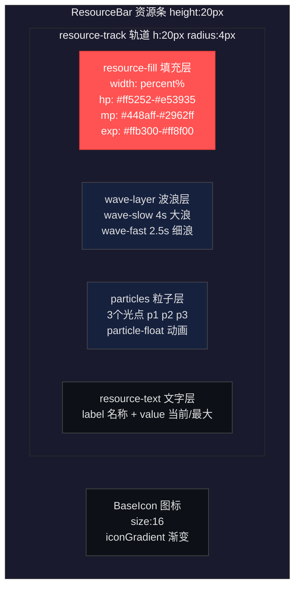
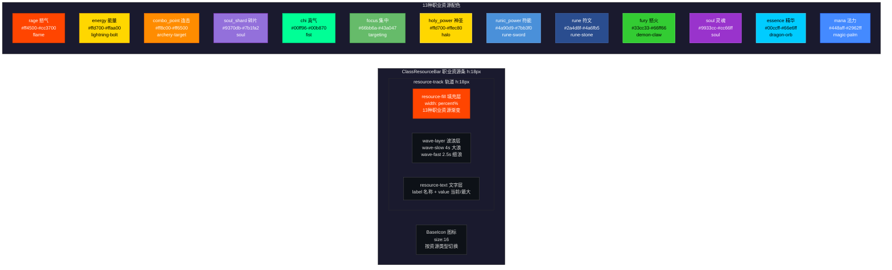
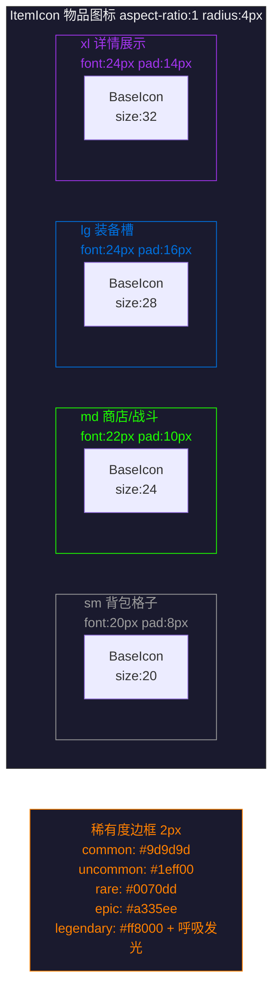
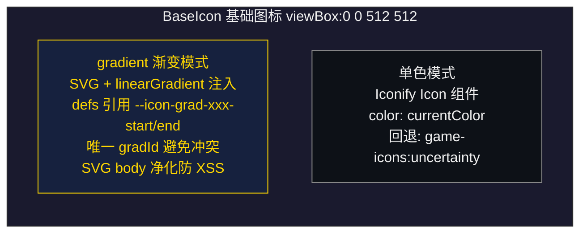

# UI界面设计文档 - 通用规范

## 文档信息

| 项目   | 内容                                                                 |
| ------ | -------------------------------------------------------------------- |
| 标题   | UI界面设计文档 - 通用规范                                            |
| 版本   | v1.3                                                                 |
| 生成日期 | 2026年8月3日                                                      |
| 适用平台 | PC端、移动端                                                         |
| 更新说明 | 依据 2026-08-03 源码复核通用组件与样式：ClassResourceBar 职业资源类型由 6 种扩展为 13 种，补充完整配置表与 Props（resourceSystem）；BaseIcon 补充 name 简写自动补前缀、SVG 净化与全局唯一渐变 ID 说明；ConfirmPopup 补充 UI_CLICK 音效事件；EffectTag 补充 type 类型收窄与 stat 特殊处理；SkillTags 补充 skill Prop 说明；ItemIcon 补充 fallback/px 与渐变优先级；新增"公共组合函数（Composables）"章节（useToast / useSkillDisplay / useResponsiveGrid）；核实 P3-116 为 GameState 迁移至 GameStore 的重构，对通用组件无影响 |

***

## 设计原则

| 原则   | 说明                                |
| ------ | ----------------------------------- |
| 一致性 | 全局使用统一的设计语言和交互模式    |
| 清晰性 | 界面层级清晰，信息一目了然          |
| 易用性 | 操作直观，减少用户学习成本          |
| 响应式 | 适配PC端和移动端不同屏幕尺寸        |

***

## 色彩方案

来源：`src/styles/variables.less`

### 主题主色

| 颜色用途       | Less 变量            | 颜色值     | 说明                |
| -------------- | -------------------- | ---------- | ------------------- |
| 主色调         | @primary-bg          | #1a1a2e    | 深紫蓝色背景       |
| 副色调         | @secondary-bg        | #0d1117    | 纯黑背景           |
| 深蓝背景       | @bg-deep-blue        | #16213e    | 渐变中间色         |
| 中暗背景       | @bg-mid-dark         | #2a2a3e    | 卡片中间色         |
| 强调色         | @accent-color        | #ffd700    | 金色强调           |
| 成功色         | @success-color       | #00ff88    | 翡翠绿             |
| 警告色         | @warning-color       | #ff9d00    | 琥珀橙             |
| 危险色         | @danger-color        | #ff4444    | 猩红               |
| 文本主色       | @text-primary        | #f0f0f0    | 灰白色主文本       |
| 文本次色       | @text-secondary      | #8b8b8b    | 浅灰次要文本       |
| 边框色         | @border-color        | #2d2d2d    | 深灰边框分隔线     |
| 技能蓝         | @skill-blue          | #0099ff    | 技能按钮蓝色       |

### 通用灰色系

| Less 变量          | 颜色值   | 说明           |
| ------------------ | -------- | -------------- |
| @color-dim-gray    | #666666  | 暗灰           |
| @color-dark-line   | #333333  | 深线条         |
| @color-mid-gray    | #555555  | 中灰           |
| @color-fallback    | #9d9d9d  | 回退灰         |
| @color-text-dark   | #000000  | 深色文本       |

### 功能色

| Less 变量              | 颜色值   | 说明           |
| ---------------------- | -------- | -------------- |
| @color-danger-accent   | #e94560  | 危险强调       |
| @color-ally            | #00d2d3  | 友军色         |
| @color-flame           | #ff4500  | 火焰色         |
| @color-delete          | #ff4400  | 删除色         |
| @color-skip            | #fbbf24  | 跳过色         |
| @skill-purple          | #8b5cf6  | 技能紫         |

### 战斗日志角色色

| Less 变量     | 颜色值   | 说明         |
| ------------- | -------- | ------------ |
| @log-player   | #60a5fa  | 玩家日志色   |
| @log-enemy    | #f87171  | 敌人日志色   |
| @log-system   | #fbbf24  | 系统日志色   |

### 物品品质色

| Less 变量             | 颜色值   | 说明           |
| --------------------- | -------- | -------------- |
| @quality-common       | #ffffff  | 普通品质       |
| @quality-uncommon     | #1eff00  | 优秀品质       |
| @quality-rare         | #0070dd  | 稀有品质       |
| @quality-epic         | #a335ee  | 史诗品质       |
| @quality-legendary    | #ff8000  | 传说品质       |

### 战斗伤害/恢复颜色

来源：`src/styles/variables.less` 与 `src/config/combat-colors.ts`（TS 常量 `CombatColors` 同步维护）

| 用途            | Less 变量 / TS 字段        | 颜色值     | 背景色                          |
| --------------- | -------------------------- | ---------- | ------------------------------- |
| 物理伤害        | @damage-physical           | #ff6b6b    | rgba(255, 107, 107, 0.2)        |
| 法术伤害        | @damage-magic              | #a855f7    | rgba(168, 85, 247, 0.2)         |
| 暴击伤害        | @damage-crit               | #ffd700    | rgba(255, 215, 0, 0.2)          |
| 生命恢复        | @heal-hp                   | #4CAF50    | rgba(76, 175, 80, 0.2)          |
| 法力恢复        | @heal-mp                   | #6e9bff    | rgba(110, 155, 255, 0.2)        |
| 闪避            | @color-dodge               | #888888    | rgba(136, 136, 136, 0.15)       |
| 暴击屏幕闪白    | @flash-crit                | rgba(255, 215, 0, 0.4) | 淡出 rgba(255, 215, 0, 0.15) |
| 闪避屏幕闪白    | @flash-dodge               | rgba(255, 255, 255, 0.2) | 淡出 rgba(255, 255, 255, 0.05) |

### Buff / Debuff 通用色

| 用途       | 主色 Less 变量    | 颜色值   | 背景                              | 边框                              |
| ---------- | ----------------- | -------- | --------------------------------- | --------------------------------- |
| Buff       | @buff-color       | #4CAF50  | rgba(76, 175, 80, 0.2)            | rgba(76, 175, 80, 0.5)            |
| Debuff     | @debuff-color     | #e74c3c  | rgba(231, 76, 60, 0.18)           | rgba(231, 76, 60, 0.5)            |

### Buff/Debuff 子类型细分色

| 子类型     | 主色变量                | 颜色值   |
| ---------- | ----------------------- | -------- |
| 中毒 poison    | @poison-color       | #8bc34a  |
| 燃烧 burn      | @burn-color         | #ff9800  |
| 眩晕 stun      | @stun-color          | #ffeb3b  |
| 冰冻 freeze    | @freeze-color        | #00bcd4  |
| 沉默 silence   | @silence-color       | #ce93d8  |
| 易伤 vulnerable | @vulnerable-color   | #ff5722  |

### 遮罩系列

| Less 变量        | 颜色值                  |
| ---------------- | ----------------------- |
| @overlay-light   | rgba(0, 0, 0, 0.3)      |
| @overlay-dim     | rgba(0, 0, 0, 0.4)      |
| @overlay-mid     | rgba(0, 0, 0, 0.5)      |
| @overlay-dark    | rgba(0, 0, 0, 0.6)      |
| @overlay-deep    | rgba(0, 0, 0, 0.7)      |
| @overlay-heavy   | rgba(0, 0, 0, 0.8)      |

### 半透明叠加系列

| 用途             | Less 变量                                                                                     |
| ---------------- | --------------------------------------------------------------------------------------------- |
| 白色半透明       | @white-03 / @white-05 / @white-08 / @white-10 / @white-15 / @white-18 / @white-20            |
| 金色半透明       | @gold-bg (0.1) / @gold-bg-hover (0.15) / @gold-bg-active (0.2) / @gold-bg-strong (0.25) / @gold-border (0.3) |
| 绿色半透明       | @green-bg (0.1) / @green-bg-hover (0.15)                                                     |

### 弹窗色

| Less 变量              | 颜色值                  |
| ---------------------- | ----------------------- |
| @popup-bg              | rgba(13, 17, 23, 0.98)  |
| @popup-border-color    | #4a4a4a                 |
| @popup-title-color     | #ffd700                 |
| @popup-text-color      | #fff                    |
| @popup-overlay-bg      | rgba(0, 0, 0, 0.8)      |

### 阵营颜色

来源：`src/data/config_factions.ts`（FACTIONS 数据，驱动 UI 渲染）

| 阵营     | color 字段   | 图标                              | 说明           |
| -------- | ------------ | --------------------------------- | -------------- |
| 光辉盟约 | #0078ff      | game-icons:checked-shield         | 经典蓝色标识   |
| 铁血盟约 | #ff4400      | game-icons:crossed-axes           | 经典红色标识   |
| 中立     | #4CAF50      | game-icons:scales                 | 经典绿色标识   |

> 注：`variables.less` 中 @faction-horde 为 #b40000，但阵营卡片/种族卡片实际渲染使用 FACTIONS 数据中的 #ff4400。

### 职业颜色

来源：`src/data/config_classes.ts`（CLASSES 数据，color 字段驱动 UI 渲染）

| 职业     | color 字段   | 图标                            | 主属性 |
| -------- | ------------ | ------------------------------- | ------ |
| 战士     | #C79C6E      | game-icons:broadsword           | str    |
| 圣骑士   | #F58CBA      | game-icons:templar-shield       | cha    |
| 猎人     | #ABD473      | game-icons:arrow-dunk           | dex    |
| 潜行者   | #FFF569      | game-icons:hooded-assassin      | dex    |
| 牧师     | #FFFFFF      | game-icons:holy-grail           | wis    |
| 萨满祭司 | #0070DE      | game-icons:lightning-storm      | wis    |
| 法师     | #69CCF0      | game-icons:magic-swirl          | int    |
| 术士     | #9482C9      | game-icons:evil-book            | int    |
| 武僧     | #00FF96      | game-icons:fist                 | dex    |
| 德鲁伊   | #FF7D0A      | game-icons:oak-leaf             | wis    |
| 亡灵骑士 | #C41F3B      | game-icons:rune-sword           | str    |
| 影刃猎手 | #A330C9      | game-icons:sharp-halberd        | dex    |
| 龙脉术士 | #33937F      | game-icons:spiked-dragon-head   | int    |

***

## 字体规范

来源：`src/styles/variables.less`

### 字体大小系统

| Less 变量      | 字号   | 典型用途                 |
| -------------- | ------ | ------------------------ |
| @font-3xs      | 9px    | 移动端底部导航文字       |
| @font-2xs      | 10px   | 资源条文字               |
| @font-xs       | 11px   | 标签文字（Tag）          |
| @font-sm       | 12px   | 小字提示                 |
| @font-base     | 13px   | 卡片名称                 |
| @font-md       | 14px   | 正文/按钮文字            |
| @font-lg       | 16px   | 副标题                   |
| @font-xl       | 18px   | 标题                     |
| @font-2xl      | 20px   | 弹窗确认标题             |
| @font-3xl      | 22px   | 创建角色标题             |
| @font-4xl      | 24px   | 底部导航图标             |
| @font-5xl      | 28px   | 大标题                   |
| @font-6xl      | 32px   | 创建角色加号             |

### 字重系统

| Less 变量              | 字重 |
| ---------------------- | ---- |
| @font-weight-normal    | 500  |
| @font-weight-semibold  | 600  |
| @font-weight-bold      | 700  |
| @font-weight-heavy     | 900  |

### 行高

| Less 变量          | 值   |
| ------------------ | ---- |
| @line-height-body  | 1.5  |

***

## 装备稀有度颜色规范

来源：`src/config/inventory.ts`（RARITY_CONFIG）

| 稀有度   | 英文名       | 中文名 | 颜色代码    | 价格倍率 | 出售折扣 |
| -------- | ------------ | ------ | ----------- | -------- | -------- |
| 普通     | common       | 普通   | #ffffff     | 1        | 0.5      |
| 优秀     | uncommon     | 优秀   | #1eff00     | 2.5      | 0.4      |
| 稀有     | rare         | 稀有   | #0070dd     | 5        | 0.35     |
| 史诗     | epic         | 史诗   | #a335ee     | 15       | 0.3      |
| 传说     | legendary    | 传说   | #ff8000     | 50       | 0.25     |

> 价格倍率来自 `RARITY_PRICE_MULTIPLIER`，出售折扣来自 `RARITY_SELL_DISCOUNT`。商店模块 `shop/service.ts` 内 `getRarityMultiplier` 另有一套计算用倍率（common 1.0 / uncommon 2.0 / rare 5.0 / epic 10.0 / legendary 20.0），用于 `calculatePrice`。

### 稀有度颜色显示规则

1. **物品名称颜色**：根据稀有度显示对应颜色
2. **物品槽位边框**：已装备槽位显示装备稀有度对应的边框颜色
3. **属性数值颜色**：属性加成数值使用稀有度颜色显示
4. **提示框边框**：物品详情提示框边框使用稀有度颜色

### 物品类型配置

来源：`src/config/inventory.ts`（ITEM_TYPES）

| 类型 ID   | 中文名   | 可堆叠   | 最大堆叠   | 可使用 |
| --------- | -------- | -------- | ---------- | ------ |
| gold      | 货币     | 是       | 999999     | -      |
| potion    | 药水     | 是       | 20         | 是     |
| scroll    | 卷轴     | 是       | 10         | 是     |
| food      | 食物     | 是       | 20         | 是     |
| material  | 材料     | 是       | 99         | -      |
| quest     | 任务物品 | 是       | 1          | -      |
| weapon    | 武器     | 否       | 1          | -      |
| armor     | 护甲     | 否       | 1          | -      |
| misc      | 杂项     | 是       | 1          | -      |

***

## 间距规范

来源：`src/styles/variables.less`

### 间距系统

| Less 变量     | 值    |
| ------------- | ----- |
| @spacing-2xs  | 2px   |
| @spacing-xs   | 4px   |
| @spacing-sm   | 6px   |
| @spacing-md   | 8px   |
| @spacing-lg   | 10px  |
| @spacing-xl   | 12px  |
| @spacing-2xl  | 14px  |
| @spacing-3xl  | 16px  |
| @spacing-4xl  | 20px  |
| @spacing-5xl  | 24px  |

### 圆角系统

| Less 变量   | 值    |
| ----------- | ----- |
| @radius-xs  | 3px   |
| @radius-sm  | 4px   |
| @radius-md  | 6px   |
| @radius-lg  | 8px   |
| @radius-xl  | 12px  |

### 透明度系统

| Less 变量          | 值   |
| ------------------ | ---- |
| @opacity-disabled  | 0.3  |
| @opacity-faded     | 0.4  |
| @opacity-dimmed    | 0.5  |
| @opacity-subtle    | 0.6  |
| @opacity-high      | 0.85 |

***

## 边框/阴影/渐变规范

来源：`src/styles/variables.less`

### 边框变量

| Less 变量       | 值                                |
| --------------- | --------------------------------- |
| @border-card    | 2px solid @popup-border-color     |
| @border-sm      | 1px solid @popup-border-color     |
| @border-dashed  | 2px dashed @popup-border-color    |
| @border-hover   | 2px solid @color-dim-gray         |
| @border-gold    | 1px solid @gold-border            |

### 阴影变量

| Less 变量    | 值                                       |
| ------------ | ---------------------------------------- |
| @shadow-card | 0 4px 12px @overlay-light                |
| @shadow-gold | 0 4px 12px @gold-bg-strong               |

### 文字阴影

| Less 变量            | 值                                                              |
| -------------------- | --------------------------------------------------------------- |
| @text-glow-gold      | 0 0 12px rgba(0, 0, 0, 0.8), 0 0 32px rgba(255, 215, 0, 0.6)   |
| @text-shadow-label   | 0 1px 2px rgba(0, 0, 0, 0.7)                                   |
| @text-shadow-title   | 2px 2px 4px rgba(0, 0, 0, 0.5)                                 |

### 渐变

| Less 变量                | 值                                                                                     |
| ------------------------ | -------------------------------------------------------------------------------------- |
| @gradient-panel          | linear-gradient(145deg, @primary-bg 0%, @bg-deep-blue 100%)                            |
| @gradient-attr-panel     | linear-gradient(135deg, rgba(13, 17, 23, 0.98) 0%, rgba(20, 25, 35, 0.98) 100%)       |
| @gradient-gold-btn       | linear-gradient(135deg, #ffd700, #ff8c00)                                              |

***

## 动画规范

来源：`src/styles/animations.less`

### 通用进出场动画

| 动画名           | 说明                                       |
| ---------------- | ------------------------------------------ |
| fadeIn           | 透明度 0→1 淡入                            |
| scaleIn          | scale(0.9)→1 配合透明度淡入                |
| panel-in         | translateY(8px)→0 配合透明度淡入（地图面板）|
| view-enter       | translateY(12px)→0 配合透明度淡入（页面进入）|
| view-leave       | translateY(0)→-12px 配合透明度淡出（页面离开）|

### Toast 进出场

| 动画名     | 说明                                              |
| ---------- | ------------------------------------------------- |
| toast-in   | translateX(-50%) translateY(-20px)→0 配合淡入     |
| toast-out  | translateX(-50%) translateY(0)→-20px 配合淡出     |

### 脉冲与发光动画

| 动画名           | 说明                                       |
| ---------------- | ------------------------------------------ |
| pulse            | opacity 1↔0.5 脉冲                         |
| legendary-glow   | box-shadow 5px↔15px #ff8000 传说品质发光   |
| boss-pulse       | opacity 1↔0.7 BOSS 脉冲                    |
| level-up-glow    | box-shadow 金色发光 + scale 1→1.05→1 升级  |
| level-up-text    | scale 1→1.4→0.95→1 升级文字弹跳            |

### 物品/装备动画

| 动画名            | 说明                                       |
| ----------------- | ------------------------------------------ |
| item-bounce       | scale 1→1.2→0.95→1 物品获得弹跳            |
| item-fade-out     | scale 1→0.8 + 透明度 1→0 物品使用淡出      |
| equip-slot-fill   | 装备槽填充：边框/背景金色闪烁              |
| equip-slot-empty  | 装备槽卸下：边框/背景橙红闪烁              |

### 其他动画

| 动画名          | 说明                                       |
| --------------- | ------------------------------------------ |
| wave-drift      | 资源条流体波浪漂移                         |
| particle-float  | 资源条粒子光点上浮                         |
| card-slide-in   | 任务卡片 translateX(20px)→0 滑入           |
| gold-flash     | 金币数字 #ffd700↔#fff 闪烁                 |
| buy-success    | 商店购买 scale 1→1.05→0.9 + 透明度淡出     |

### 过渡时长

| Less 变量          | 值     |
| ------------------ | ------ |
| @transition-fast   | 0.15s  |
| @transition-quick  | 0.2s   |
| @transition-normal | 0.3s   |
| @transition-card   | 0.35s  |
| @transition-glow   | 0.5s   |
| @transition-equip  | 0.6s   |

***

## Z-Index 分层

来源：`src/styles/variables.less`

| Less 变量              | 值    | 用途           |
| ---------------------- | ----- | -------------- |
| @z-base                | 1     | 基础层         |
| @z-dropdown            | 10    | 下拉层         |
| @z-overlay             | 100   | 遮罩层         |
| @z-popup               | 1000  | 弹窗层         |
| @z-toast               | 1100  | Toast 层       |
| @z-combat-overlay      | 2000  | 战斗遮罩层     |
| @z-combat-result       | 2100  | 战斗结果层     |
| @z-item-modal          | 2200  | 物品弹窗层     |

***

## 弹窗通用样式

来源：`src/styles/popup.less`

### 弹窗结构

| 类名                 | 说明                                                         |
| -------------------- | ------------------------------------------------------------ |
| .popup-overlay       | 全屏遮罩层，背景 rgba(0,0,0,0.8)，z-index 1000，flex 居中   |
| .popup-content       | 弹窗容器，背景 rgba(13,17,23,0.98)，圆角 12px，边框 2px，max-width 600px，max-height 90vh |
| .popup-header        | 标题栏，min-height 48px，底边框 1px，gap 10px                |
| .popup-title         | 标题文字，字号 16px，金色 #ffd700，加粗                      |
| .popup-close-btn     | 关闭按钮，28×28px 圆形，字号 18px                            |
| .popup-body          | 内容区，flex:1，可滚动，padding 16px                         |
| .popup-footer        | 底部操作栏，min-height 52px，flex wrap，gap 10px             |
| .popup-footer-btn    | 底部按钮，padding 10px 16px，圆角 8px，加粗                  |

### 底部按钮变体

| 类名                       | 背景色       | 文字色     | 说明           |
| -------------------------- | ------------ | ---------- | -------------- |
| .popup-footer-btn          | @white-10    | 主文本色   | 默认           |
| .popup-footer-btn.cancel   | @white-10    | 主文本色   | 取消           |
| .popup-footer-btn.confirm  | @accent-color| #000       | 确认（金色）   |
| .popup-footer-btn.danger   | @danger-color| 主文本色   | 危险（红色）   |
| .popup-footer-btn.warn     | @warning-color| 主文本色  | 警告（橙色）   |
| .popup-footer-btn.organize | @skill-blue  | 主文本色   | 整理（蓝色）   |

### 弹窗进出场动画

| 类名                          | 动画                              |
| ----------------------------- | --------------------------------- |
| .popup-enter-active           | fadeIn 0.2s                       |
| .popup-enter-active .popup-content | scaleIn 0.25s                 |
| .popup-leave-active           | fadeIn 0.15s reverse              |

***

## Mixin 规范

来源：`src/styles/mixins.less`

| Mixin 名                | 说明                                                       |
| ----------------------- | ---------------------------------------------------------- |
| .flex-center()          | flex 居中（align+justify center）                          |
| .flex-col()             | flex 纵向排列                                              |
| .flex-col-center()      | flex 纵向 + align center                                   |
| .flex-between()         | flex 两端对齐                                              |
| .text-ellipsis()        | 文本省略号                                                 |
| .custom-scrollbar()     | 自定义滚动条（6px 宽，@white-15 滑块）                     |
| .tag-base()             | 标签基础样式（字号 11px，加粗，圆角 4px）                  |
| .popup-message-text()   | 弹窗消息文本（#aaa，字号 14px，居中）                      |
| .popup-container-base() | 弹窗容器通用样式                                           |
| .shadow-glow(@color)    | 动态发光阴影 0 0 8px                                       |
| .shadow-bright(@color)  | 动态高亮阴影 0 0 15px                                      |

***

## 图标渐变色体系

来源：`src/styles/icon-gradients.less`，供 `BaseIcon.vue` SVG linearGradient 引用，变量格式 `--icon-grad-xxx-start` / `--icon-grad-xxx-end`

### 职业渐变色

| 职业键名         | start      | end        |
| ---------------- | ---------- | ---------- |
| warrior          | #e8c89c    | #C79C6E    |
| mage             | #a5e5ff    | #69CCF0    |
| paladin          | #ffb3dd    | #F58CBA    |
| hunter           | #d0ff9c    | #ABD473    |
| rogue            | #fffba3    | #FFF569    |
| priest           | #ffffff    | #cccccc    |
| shaman           | #3399ff    | #0070DE    |
| warlock          | #bfb0f5    | #9482C9    |
| monk             | #66ffbf    | #00FF96    |
| druid            | #ffb366    | #FF7D0A    |
| death_knight     | #f0627a    | #C41F3B    |
| demon_hunter     | #d06bff    | #A330C9    |
| evoker           | #66ccb3    | #33937F    |

### 阵营渐变色

| 阵营键名   | start      | end        |
| ---------- | ---------- | ---------- |
| alliance   | #66b0ff    | #0078ff    |
| horde      | #ff3333    | #b40000    |
| neutral    | #81e085    | #4caf50    |

### 主题功能色渐变

| 键名       | start      | end        |
| ---------- | ---------- | ---------- |
| gold       | #fff3b0    | #ffd700    |
| physical   | #ffb3b3    | #ff6b6b    |
| magic      | #d0a0ff    | #a855f7    |
| crit       | #fff3b0    | #ffd700    |
| heal       | #81e085    | #4CAF50    |
| mana       | #b0ccff    | #6e9bff    |
| dodge      | #cccccc    | #888888    |
| buff       | #81e085    | #4CAF50    |
| debuff     | #ff8080    | #e74c3c    |

### 品质色渐变

| 键名       | start      | end        |
| ---------- | ---------- | ---------- |
| common     | #ffffff    | #bbbbbb    |
| uncommon   | #80ff66    | #1eff00    |
| rare       | #3399ff    | #0070dd    |
| epic       | #cc80ff    | #a335ee    |
| legendary  | #ffb366    | #ff8000    |

### 元素色渐变

| 键名       | start      | end        |
| ---------- | ---------- | ---------- |
| fire       | #ff6600    | #ffcc00    |
| ice        | #00bcd4    | #a8d8ff    |
| shadow     | #a855f7    | #4a148c    |
| nature     | #81e085    | #1b5e20    |
| ocean      | #66ccff    | #01579b    |
| poison     | #a3d977    | #33691e    |
| lightning  | #ffea00    | #ff6d00    |
| earth      | #e8c89c    | #8b5a2b    |
| dragon     | #ff3d00    | #ff9100    |
| blood      | #ff8080    | #880000    |
| metal      | #cccccc    | #666666    |

***

## 控制台样式

来源：`src/config/console-style.ts`（CONSOLE_STYLE，配合 console.log %c 占位符）

| 字段      | 样式                                                                  |
| --------- | --------------------------------------------------------------------- |
| tag       | color: #111; background: #f59e0b; padding: 1px 5px; border-radius: 3px; font-weight: bold |
| ok        | color: #4ade80                                                        |
| err       | color: #ef4444                                                        |
| label     | color: #a78bfa                                                        |
| value     | color: #e2e8f0                                                        |
| hint      | color: #94a3b8; font-style: italic                                    |
| section   | color: #f59e0b; font-weight: bold                                     |
| rarity.common    | color: #9d9d9d                                                |
| rarity.uncommon  | color: #1eff00                                                |
| rarity.rare      | color: #0070dd                                                |
| rarity.epic      | color: #a335ee                                                |
| rarity.legendary | color: #ff8000                                                |

***

## 通用组件

来源：`src/components/common/`

当前共 13 个组件：AlertPopup.vue、BaseIcon.vue、BasePopup.vue、ClassResourceBar.vue、ConfirmPopup.vue、EffectTag.vue、EmptyState.vue、ItemIcon.vue、ResourceBar.vue、RiskIndicator.vue、SkillTags.vue、Tag.vue、Toast.vue。

> 注（P3-116 影响核实）：P3-116 为游戏状态（GameState）迁移至 GameStore 的重构，涉及 `modules/audio`、`modules/character`、`modules/shop`、`modules/game` 及 `App.vue` 初始化顺序，对 `src/components/common/` 通用组件（含 Toast 与弹出类组件）无接口与样式影响，本节描述均与 2026-08-03 源码一致。

### BasePopup.vue

基础弹窗容器，提供标题栏、内容区、底部操作栏的插槽布局。

| Prop              | 类型    | 默认值    | 说明                       |
| ----------------- | ------- | --------- | -------------------------- |
| visible           | boolean | -         | 是否显示                   |
| title             | string  | ''        | 标题                       |
| maxWidth          | string  | '600px'   | 最大宽度                   |
| showClose         | boolean | true      | 显示标题栏关闭按钮         |
| showFooterClose   | boolean | true      | 显示底部"关闭"按钮         |
| bodyClass         | string  | ''        | 内容区自定义类名           |

插槽：默认插槽（内容区）、`header-extra`（标题栏额外内容）、`footer`（底部操作区）。事件：`close`。遮罩点击（`@click.self`）与关闭按钮均触发 `close`。

### AlertPopup.vue

提示弹窗，基于 BasePopup，max-width 400px，无关闭按钮，仅底部"确定"按钮（使用 confirm 变体样式）。Props：`visible`、`title`（默认"提示"）、`message`。事件：`close`。

### ConfirmPopup.vue

确认弹窗，基于 BasePopup，max-width 400px，底部"取消"+"确认"双按钮。Props：`visible`、`title`（默认"确认"）、`message`、`type`（'normal' / 'danger'，默认 normal，danger 时确认按钮使用危险样式）、`action`（操作标识，默认 'unknown'，随事件广播）。事件：`confirm`、`cancel`。

确认/取消时除触发对应事件外，还会通过 eventBus 发送：
- 确认：`UI_CLICK`（source: 'confirm_ok'）+ `CONFIRM_CONFIRMED`（{ action }）
- 取消：`UI_CLICK`（source: 'confirm_cancel'）+ `CONFIRM_CANCELED`（{ action }）

### Toast.vue

顶部浮动消息提示，位于 top:120px，z-index 1100，pointer-events: none。Props：`visible`、`message`、`type`（info/success/warning/danger，默认 info）、`icon`（图标字符，默认 ''）。

| 类型    | 背景色                       |
| ------- | ---------------------------- |
| info    | rgba(0, 150, 255, 0.9)       |
| success | rgba(76, 175, 80, 0.9)       |
| warning | rgba(255, 152, 0, 0.9)       |
| danger  | rgba(255, 87, 34, 0.9)       |

进出场动画：`toast-in` / `toast-out`（0.3s）。

### BaseIcon.vue

通用游戏图标组件，基于 @iconify/vue + game-icons 图标集。

| Prop     | 类型    | 默认值 | 说明                                             |
| -------- | ------- | ------ | ------------------------------------------------ |
| name     | string  | -      | 图标名，支持 'game-icons:xxx' 全名或 'xxx' 简写（自动补 game-icons: 前缀） |
| size     | number  | 24     | 图标尺寸（像素）                                 |
| gradient | string  | -      | 渐变色键名（对应 --icon-grad-xxx-start/end），不传则使用单色模式 |
| color    | string  | -      | 单色模式颜色（仅在无 gradient 时生效）            |

两种渲染模式：
- **渐变模式**：通过 `loadIcon` 加载 SVG 后注入 `linearGradient`（defs 引用 `--icon-grad-${grad}-start/end`），每个实例分配全局唯一 `gradId`（`nextGradId`）避免多实例 SVG ID 冲突；SVG body 经 `sanitizeSvgBody` 净化（移除 script 标签、`on*` 事件属性、`javascript:` href 等）防 XSS。
- **单色模式**：Iconify `Icon` 组件渲染，`color` 取 `currentColor`。

viewBox 固定 0 0 512 512；图标找不到（空 name、loadIcon 失败）时回退为 `game-icons:uncertainty`（渐变模式失败则降级为单色）。

### ResourceBar.vue

资源进度条组件，用于 HP/MP/EXP。包含液态波浪（wave-slow 4s 大浪 + wave-fast 2.5s 细浪）、粒子光点（p1/p2/p3，particle-float 动画）、外发光。轨道高度 20px。Props：`icon`、`iconName`（可选，优先于 icon）、`iconGradient`、`name`、`current`、`max`、`percent`、`type`（默认 'hp'）。

| 类型 | 填充渐变                              | 图标色   |
| ---- | ------------------------------------- | -------- |
| hp   | linear-gradient(90deg, #ff5252, #e53935) | #ff5252  |
| mp   | linear-gradient(90deg, #448aff, #2962ff) | #448aff  |
| exp  | linear-gradient(90deg, #ffb300, #ff8f00) | #ffb300  |

### ClassResourceBar.vue

职业专属资源条组件，与战斗职业资源系统对应（`@/modules/combat/resources`）。结构类似 ResourceBar 但轨道更矮（18px），无粒子层；数值取整显示（`Math.floor(currentValue)`）。Prop：`resourceSystem`（`ResourceSystem`，含 `type` / `currentValue` / `maxValue` 等字段）。

内置 `RESOURCE_DISPLAY_CONFIG` 共 **13 种**资源类型配置（键名与 `ResourceType` 对齐）：

| 类型          | 名称   | 图标                             | 渐变键      | 填充渐变                        |
| ------------- | ------ | -------------------------------- | ----------- | ------------------------------- |
| rage          | 怒气   | game-icons:flame                 | physical    | #ff4500 → #cc3700              |
| energy        | 能量   | game-icons:lightning-bolt        | gold        | #ffd700 → #ffaa00              |
| combo_point   | 连击   | game-icons:archery-target        | gold        | #ff8c00 → #ff6500              |
| soul_shard    | 碎片   | game-icons:soul                  | debuff      | #9370db → #7b1fa2              |
| chi           | 真气   | game-icons:fist                  | heal        | #00ff96 → #00b870              |
| focus         | 集中   | game-icons:targeting             | physical    | #66bb6a → #43a047              |
| holy_power    | 神圣   | game-icons:halo                  | holy        | #ffd700 → #ffec80              |
| runic_power   | 符能   | game-icons:rune-sword            | blood       | #4a90d9 → #7bb3f0              |
| rune          | 符文   | game-icons:rune-stone            | blood       | #2a4d8f → #4a6fb5              |
| fury          | 怒火   | game-icons:demon-claw            | debuff      | #33cc33 → #66ff66              |
| soul          | 灵魂   | game-icons:soul                  | debuff      | #9933cc → #cc66ff              |
| essence       | 精华   | game-icons:dragon-orb            | mana        | #00ccff → #66e6ff              |
| mana          | 法力   | game-icons:magic-palm            | mana        | #448aff → #2962ff              |

> 未匹配到的资源类型回退为 mana 配置。

### 其他通用组件

| 组件               | 说明                                       |
| ------------------ | ------------------------------------------ |
| Tag.vue            | 标签组件，Props：`text`、`type`（'race'/'class'/'faction'）、`color`（可选，通过 --tag-color 变量驱动 class/faction 背景） |
| EffectTag.vue      | 效果标签（Buff/Debuff），Props：`type`（ItemEffectType，即 SkillType 各值或物品专属 'stat'）；'stat' 显示"属性加成"，其余经 useSkillDisplay 映射中文名；6 种效果样式（physical_damage/magic_damage/health_restore/mana_restore/buff/debuff） |
| SkillTags.vue      | 技能标签组，Props：`skill`（Skill）；复用 EffectTag 展示技能类型，附加 MP 消耗（固定显示 `{{ skill.mpCost ?? 0 }} MP`）、冷却回合（可选）、目标类型（可选，经 useSkillDisplay.getTargetTypeName）三个标签 |
| ItemIcon.vue       | 物品图标，Props：`icon`、`fallback`（默认 'uncertainty'）、`size`（sm/md/lg/xl，默认 md）、`px`（自定义像素，优先于 size）、`rarity`、`gradient`；渐变优先级：gradient > rarity（品质色渐变）> 'common' |
| EmptyState.vue     | 空状态占位，Props：`icon`、`text`、`size`（默认 32）、`gradient` |
| RiskIndicator.vue  | 风险指示器，Props：`cellType`、`areaLevel`；5 种风险等级（safe/low/medium/high/extreme） |

***

## 公共组合函数（Composables）

来源：`src/composables/`

### useToast.ts

全局 Toast 提示组合函数，与 Toast.vue 配套。**单例设计**：同一时刻仅展示一个 Toast，新调用 `show()` 会清除旧计时器并覆盖。

- 导出：`useToast()` 返回 `{ visible, message, type, icon, show, close }`；另有 `disposeToast()`（清理计时器，供 HMR 热替换使用）。
- `show(options: ToastOptions | string)`：options 为字符串时按 info 类型提示；`ToastOptions = { message, type?, icon?, duration? }`，`duration` 默认 2500ms，超时自动关闭。

### useSkillDisplay.ts

技能展示公共工具函数，供 SkillsPopup、CombatPopup、EffectTag、SkillTags 等复用。

- 导出：`useSkillDisplay()` 返回 `getSkillTypeName` / `getSkillTypeIcon` / `getTargetTypeName` / `getEffectTypeName` / `getSkillEffectText` / `getSkillEffectBrief`。
- 内置映射表：
  - 技能类型中文名与图标：physical_damage（物理伤害）、magic_damage（魔法伤害）、health_restore（生命恢复）、mana_restore（法力恢复）、buff（增益）、debuff（减益）
  - 目标类型中文名：single（单体）/ all_enemies（多目标）/ self（自身）/ ally（友方）
  - 效果类型中文名：poison（中毒）、burn（灼烧）、stun（眩晕）、freeze（冰冻）、silence（沉默）、shield（护盾）、attack_up/attack_down、defense_up/defense_down、speed_up/speed_down、regen（回复）、thorn（荆棘）、vulnerable（易伤）
- `getSkillEffectText` 生成详细效果描述（用于技能详情面板）；`getSkillEffectBrief` 生成紧凑描述（用于战斗按钮）。

### useResponsiveGrid.ts

响应式虚拟网格列数计算 composable，为 RecycleScroller 的 gridItems 模式提供响应式列数与单元格尺寸，用于优化弹窗内长列表（如背包/商店列表）的渲染性能。

- 导出：`useResponsiveGrid(containerRef, minItemSize, gap)` 返回 `{ gridItems, itemSize }`。
- 通过 `ResizeObserver` 监听容器宽度变化自动重算列数（P3-123 起使用 `requestAnimationFrame` 节流避免布局抖动），使虚拟网格在不同屏幕尺寸下保持与 CSS auto-fill 网格相近的视觉效果；卸载时清理 observer 与未执行的 raf。

***

## 通用组件布局草图

本章节为 `src/components/common/` 下的通用组件提供 mermaid 布局草图，配合前文"通用组件"章节的 Props/说明阅读。配色与尺寸均来源于组件源码与 `src/styles/variables.less`。

### 1. ResourceBar 资源条

通用资源进度条，用于 HP/MP/EXP。横向布局：左侧图标 + 右侧轨道（内含填充层、波浪层、粒子层、文字层）。轨道高度 20px，填充层按 `percent` 设置宽度，三种类型对应不同渐变色。



### 2. ClassResourceBar 职业资源条

职业专属资源条，结构与 ResourceBar 类似但轨道更矮（18px）、无粒子层，用于战斗界面显示怒气/能量/连击点/灵魂碎片/真气等整数型资源。共 13 种资源类型，每种对应独立图标、渐变键名与填充渐变色（详细配置见"通用组件"章节表格）。



### 3. ItemIcon 物品图标

统一物品/装备图标组件，正方形容器（aspect-ratio:1，圆角 4px），内置 4 种预设尺寸和 5 种稀有度边框。传说品质带呼吸发光动画。图标渐变默认按稀有度匹配品质色渐变。



### 4. Tag 标签

单行文本标签，用于展示种族、职业、阵营。inline-flex 布局，padding 3px 10px，字号 12px，字重 600。种族使用白色半透明背景，职业与阵营通过 `--tag-color` CSS 变量传入对应颜色。

```mermaid
flowchart LR
    subgraph tag["Tag 标签 font:12px weight:600 min-w:40px max-w:80px"]
        direction LR
        race["tag-race 种族<br>bg: @white-20<br>rgba(255,255,255,0.2)"]
        cls["tag-class 职业<br>bg: --tag-color<br>例: #C79C6E 战士"]
        faction["tag-faction 阵营<br>bg: --tag-color<br>例: #0078ff 光辉盟约"]
    end

    classDef tagCls fill:#1a1a2e,stroke:#2d2d2d,color:#f0f0f0
    classDef raceCls fill:rgba(255,255,255,0.2),stroke:rgba(255,255,255,0.3),color:#fff
    classDef classCls fill:#C79C6E,stroke:rgba(255,255,255,0.3),color:#fff
    classDef factionCls fill:#0078ff,stroke:rgba(255,255,255,0.3),color:#fff

    class tag tagCls
    class race raceCls
    class cls classCls
    class faction factionCls
```

### 5. EffectTag 效果标签

效果类型徽章，纯展示组件，基于 `.tag-base()` Mixin（字号 11px，加粗，圆角 4px）。共 6 种效果类型，每种对应独立的前景色与半透明背景色，来源于 `variables.less` 的伤害/恢复/Buff/Debuff 色；物品专属类型 'stat' 显示"属性加成"。

```mermaid
flowchart LR
    subgraph tag["EffectTag 效果标签 font:11px weight:600 radius:4px"]
        direction LR
        physical["physical_damage<br>物理伤害<br>color:#ff6b6b<br>bg:rgba(255,107,107,0.2)"]
        magic["magic_damage<br>魔法伤害<br>color:#a855f7<br>bg:rgba(168,85,247,0.2)"]
        healHp["health_restore<br>生命恢复<br>color:#4CAF50<br>bg:rgba(76,175,80,0.2)"]
        healMp["mana_restore<br>法力恢复<br>color:#6e9bff<br>bg:rgba(110,155,255,0.2)"]
        buff["buff<br>增益<br>color:#4CAF50<br>bg:rgba(76,175,80,0.2)"]
        debuff["debuff<br>减益<br>color:#e74c3c<br>bg:rgba(231,76,60,0.18)"]
    end

    classDef tagCls fill:#1a1a2e,stroke:#2d2d2d,color:#f0f0f0
    classDef physicalCls fill:rgba(255,107,107,0.2),stroke:#ff6b6b,color:#ff6b6b
    classDef magicCls fill:rgba(168,85,247,0.2),stroke:#a855f7,color:#a855f7
    classDef healHpCls fill:rgba(76,175,80,0.2),stroke:#4CAF50,color:#4CAF50
    classDef healMpCls fill:rgba(110,155,255,0.2),stroke:#6e9bff,color:#6e9bff
    classDef buffCls fill:rgba(76,175,80,0.2),stroke:#4CAF50,color:#4CAF50
    classDef debuffCls fill:rgba(231,76,60,0.18),stroke:#e74c3c,color:#e74c3c

    class tag tagCls
    class physical physicalCls
    class magic magicCls
    class healHp healHpCls
    class healMp healMpCls
    class buff buffCls
    class debuff debuffCls
```

### 6. SkillTags 技能标签

技能标签组，横向排列（flex，gap 6px，可换行）。复用 EffectTag 展示技能类型，并附加 MP 消耗、冷却回合、目标类型三个可选标签。

```mermaid
flowchart LR
    subgraph group["SkillTags 技能标签组 gap:6px flex-wrap"]
        direction LR
        type["EffectTag<br>技能类型<br>复用效果标签配色"]
        cost["skill-tag-cost<br>MP消耗<br>color:#6e9bff<br>bg:rgba(110,155,255,0.15)"]
        cooldown["skill-tag-cooldown<br>冷却回合 可选<br>color:#ffa500<br>bg:rgba(255,165,0,0.15)"]
        target["skill-tag-target<br>目标类型 可选<br>color:#a064ff<br>bg:rgba(160,100,255,0.15)"]
    end

    classDef groupCls fill:#1a1a2e,stroke:#2d2d2d,color:#f0f0f0
    classDef typeCls fill:rgba(255,107,107,0.2),stroke:#ff6b6b,color:#ff6b6b
    classDef costCls fill:rgba(110,155,255,0.15),stroke:#6e9bff,color:#6e9bff
    classDef cooldownCls fill:rgba(255,165,0,0.15),stroke:#ffa500,color:#ffa500
    classDef targetCls fill:rgba(160,100,255,0.15),stroke:#a064ff,color:#a064ff

    class group groupCls
    class type typeCls
    class cost costCls
    class cooldown cooldownCls
    class target targetCls
```

### 7. EmptyState 空状态

通用空状态占位组件，纵向布局：图标在上、文字在下。容器带虚线边框、半透明遮罩背景，padding 32px。文字色为 #888888（@color-dodge），字号 14px。

```mermaid
flowchart TB
    subgraph empty["EmptyState 空状态 padding:32px 虚线边框"]
        direction TB
        icon["BaseIcon 图标<br>size: 默认32<br>gradient 渐变"]
        text["empty-state-text 文本<br>font:14px<br>color: #888888 即 @color-dodge"]
    end

    classDef emptyCls fill:rgba(0,0,0,0.5),stroke:#4a4a4a,color:#888888,stroke-dasharray: 5 5
    classDef iconCls fill:#16213e,stroke:#4a4a4a,color:#f0f0f0
    classDef textCls fill:#0d1117,stroke:#4a4a4a,color:#888888

    class empty emptyCls
    class icon iconCls
    class text textCls
```

### 8. BaseIcon 基础图标

通用游戏图标组件，基于 @iconify/vue + game-icons 图标集。两种渲染模式：渐变模式（加载 SVG 后注入 linearGradient）与单色模式（Iconify Icon + currentColor）。viewBox 固定 0 0 512 512，图标找不到时回退为 `game-icons:uncertainty`。



### 9. RiskIndicator 风险指示器

风险等级可视化组件，横向小标签：图标 + 文本。inline-flex 布局，padding 1px 4px，圆角 3px，字号 10px。根据格子类型与区域等级计算 5 种风险等级，每种对应独立颜色与图标。

```mermaid
flowchart LR
    subgraph indicator["RiskIndicator 风险指示器 font:10px weight:600"]
        direction LR
        icon["BaseIcon 图标<br>size:10"]
        label["risk-label 文本<br>font:9px"]
    end

    subgraph levels["5种风险等级"]
        direction LR
        safe["safe 安全<br>#4caf50<br>shield 图标<br>empty/start/rest/shop/board"]
        low["low 低风险<br>#2196f3<br>checked-shield<br>treasure/event"]
        medium["medium 中风险<br>#ff9800<br>exclamation-orb<br>trap 小于10 / monster 小于8"]
        high["high 高风险<br>#f44336<br>skull-crack<br>trap 大于等于10 / monster 8-14"]
        extreme["extreme 极危<br>#ce93d8<br>death-skull<br>boss / monster 大于等于15"]
    end

    classDef indicatorCls fill:#1a1a2e,stroke:#2d2d2d,color:#f0f0f0
    classDef safeCls fill:rgba(76,175,80,0.2),stroke:#4caf50,color:#4caf50
    classDef lowCls fill:rgba(33,150,243,0.2),stroke:#2196f3,color:#2196f3
    classDef mediumCls fill:rgba(255,152,0,0.2),stroke:#ff9800,color:#ff9800
    classDef highCls fill:rgba(244,67,54,0.2),stroke:#f44336,color:#f44336
    classDef extremeCls fill:rgba(156,39,176,0.3),stroke:#ce93d8,color:#ce93d8

    class indicator,levels indicatorCls
    class icon,label indicatorCls
    class safe safeCls
    class low lowCls
    class medium mediumCls
    class high highCls
    class extreme extremeCls
```

***

## 附录：属性中文对照表

来源：`src/config/character.ts`（STAT_NAMES）

| 英文缩写 | 中文名称 |
| -------- | -------- |
| str      | 力量     |
| dex      | 敏捷     |
| con      | 体质     |
| int      | 智力     |
| wis      | 感知     |
| cha      | 魅力     |

***

## 版本历史

| 版本   | 日期         | 说明                                                                 |
| ------ | ------------ | -------------------------------------------------------------------- |
| v1.0   | 2026年7月10日 | 初始版本：比对 src/styles、config、data 与 common 组件后建立完整规范 |
| v1.1   | 2026年7月14日 | 新增"通用组件布局草图"章节，为 9 个通用组件添加 mermaid 布局图       |
| v1.2   | 2026年7月10日 | 修复 mermaid 渲染问题并对照源码重写布局草图                         |
| v1.3   | 2026年8月3日 | 复核通用组件：ClassResourceBar 职业资源由 6 种扩展为 13 种并补充完整配置表与 Props；BaseIcon 补充 name 简写/SVG 净化/唯一渐变 ID 说明；ConfirmPopup 补充 UI_CLICK 音效事件；EffectTag、SkillTags、ItemIcon 描述修正；新增"公共组合函数（Composables）"章节（useToast/useSkillDisplay/useResponsiveGrid）；核实 P3-116 为 GameState 迁移 GameStore 重构，对通用组件无影响 |