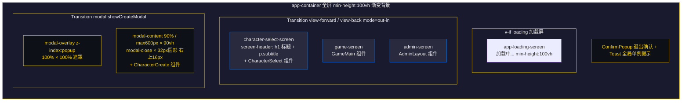
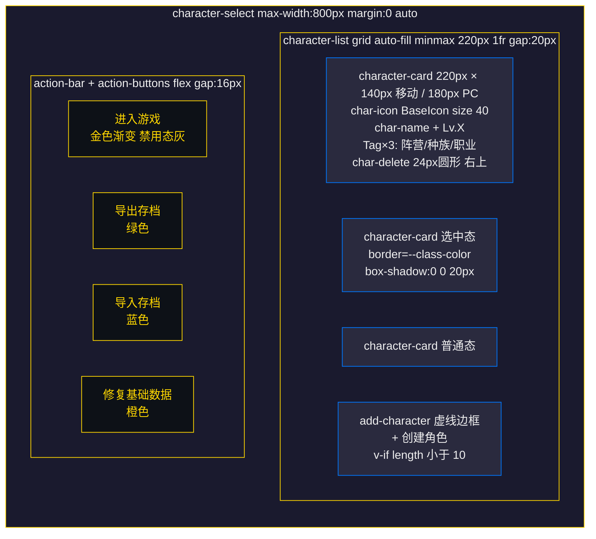

# UI界面设计文档 - 主界面

## 文档信息

| 项目 | 内容 |
|------|------|
| 标题 | UI界面设计文档 - 主界面 |
| 版本 | v1.6 |
| 生成日期 | 2026年8月13日 |
| 适用平台 | PC端、移动端 |
| 更新说明 | 第7章后台管理全面更新：AdminLayout 侧边栏一级/二级菜单重构 + DashboardPanel 提取 + AdminTable 增加分页/排序/列显隐/批量选择/行详情/行克隆 + AdminForm 拆分 7 个字段子组件 + useFormValidation 校验引擎 + ImportDialog 导入预览 + ConfigManager 增加导出/导入/重置/批量删除 + admin 模块新增 queryService/referenceGraph/defaultData 三文件 + CONFIG_TABLES 从 11 张扩展到 15 张 |

***

## 版本历史

| 版本 | 日期 | 更新内容 | 作者 |
|------|------|----------|------|
| v1.0 | 2026-07-10 | 初始版本：完整梳理主界面各组件布局与交互规范 | System |
| v1.1 | 2026-07-10 | 新增各界面 mermaid 布局草图 | System |
| v1.2 | 2026-07-10 | 修复 mermaid 渲染问题并对照源码重写布局 | System |
| v1.3 | 2026-08-03 | P3-116 后同步源码：更新 App.vue 初始化流程与进入游戏失败提示、GameMain 顶栏职业资源条与异步视图懒加载、后台管理 11 张配置表与 ConfigManager/useConfigTableMeta/useConfigCrud 章节、角色创建次级属性文案、探索 grid-wrapper 描述 | System |
| v1.4 | 2026-08-03 | 补全角色创建步骤3（职业）/步骤4（角色名）章节并修正次级属性文案；新增游戏主界面（GameMain）、地图视图（MapView）、探索视图（ExplorationView）、后台管理（admin 模块）与 useResponsiveGrid 共 5 个章节 | System |
| v1.5 | 2026-08-03 | 补全第6章探索视图（格子类型与图标、格子状态样式、拖拽点击交互、探索进度、初始化与生命周期）；新增第7章后台管理（AdminLayout/AdminTable/AdminForm/ConfigManager/useConfigTableMeta/useConfigCrud/admin 模块五层结构与 11 张配置表）及第8章 useResponsiveGrid 章节 | System |
| v1.6 | 2026-08-13 | 第7章后台管理全面更新：DashboardPanel 提取、AdminLayout 侧边栏重构、AdminTable 分页/排序/列显隐/批量选择/行详情/行克隆、AdminForm 拆分 7 个字段子组件 + 校验引擎、ImportDialog 导入预览、ConfigManager 导出/导入/重置/批量删除、admin 模块新增 queryService/referenceGraph/defaultData、CONFIG_TABLES 11→15 张 | System |

***

## 1. 应用根组件（App.vue）

### 1.1 组件概述

应用根组件，管理三种游戏界面状态（`character-select` | `game` | `admin`），通过 `defineAsyncComponent` 懒加载 CharacterSelect / CharacterCreate / GameMain / AdminLayout 四个大型视图组件（delay=200ms，timeout=10000ms），首屏仅包含角色选择所需代码。初始化时按序执行 gameStore → baseStore → characterStore 三个 Store 的 initialize（P3-116 修复：GameStore 最先初始化，提供 currentCharacterId / currentShopId / gameSettings 等全局状态；characterStore.initialize 依赖 baseStore 的阵营/种族/职业数据，必须串行），随后从 GameStore 读取当前角色 ID，若存在则直接进入游戏。开发环境将 gameState 暴露到 window.__gameState 供控制台切换视图。页面切换通过 gameState 响应式变量驱动，配合 Vue Transition（view-forward / view-back）实现转场动画。

### 1.2 状态转换

```
                    onMounted 初始化完成
                           │
                           ▼
              ┌──────── character-select ────────┐
              │                                  │
              │  (无当前角色)                     │  (有当前角色)
              │                                  │
              ▼                                  ▼
       character-select                        game
              │                                  │
              │ handleCharacterSelect            │ handleExit
              │ (view-forward)                   │ (showExitConfirm)
              ▼                                  ▼
            game                       showExitConfirm=true
              │                                  │
              │                                  │ confirmExit
              │                                  │ (view-back + logout)
              │                                  ▼
              │                          character-select
              │
              │ handleAdminExit (view-back)
              ▼
            admin
```

### 1.3 布局结构

```
┌─────────────────────────────────────────────────────────────┐
│  #app.app-container                                          │
│                                                             │
│  ┌─ Transition(name="view-forward"/"view-back") ─┐          │
│  │                                               │          │
│  │  [loading] → app-loading-screen               │          │
│  │              "加载中..."                       │          │
│  │                                               │          │
│  │  [character-select]                           │          │
│  │    screen-header                              │          │
│  │      h1 "战争艺术：地下城"                     │          │
│  │      p.subtitle "Art of War: Dungeons"        │          │
│  │    <CharacterSelect />                        │          │
│  │                                               │          │
│  │  [game]                                       │          │
│  │    <GameMain />                               │          │
│  │                                               │          │
│  │  [admin]                                      │          │
│  │    <AdminLayout />                            │          │
│  └───────────────────────────────────────────────┘          │
│                                                             │
│  ┌─ Transition(name="modal") ─┐                             │
│  │  [showCreateModal]          │                             │
│  │    modal-overlay            │                             │
│  │      modal-content          │                             │
│  │        modal-close "×"      │                             │
│  │        <CharacterCreate />  │                             │
│  └─────────────────────────────┘                             │
│                                                             │
│  <ConfirmPopup /> (退出确认)                                 │
│  <Toast /> (全局单例提示)                                    │
└─────────────────────────────────────────────────────────────┘
```

### 1.4 界面布局草图



### 1.5 元素尺寸

| 元素 | 宽度 | 高度 | 说明 |
|------|------|------|------|
| app-container | 100% | min-height: 100vh | 背景 linear-gradient(135deg, @primary-bg 0%, #16213e 50%, #0f3460 100%) |
| character-select-screen | 100% | min-height: 100vh | padding: 40px 20px |
| modal-content | 90% / max 600px | 90vh | max-height: 90vh |
| modal-close | 32px | 32px | 圆形按钮，右 上 16px |
| screen-header h1 | - | - | font-size: 36px，color: @accent-color |

### 1.6 交互说明

| 交互 | 触发方式 | 响应 |
|------|----------|------|
| 选择角色进入游戏 | CharacterSelect emit select | transitionName='view-forward'，调用 characterStore.selectCharacter（失败时 Toast 提示"角色加载失败，请重试"并停留在角色选择界面），成功后 gameState='game' |
| 打开创建弹窗 | CharacterSelect emit create | showCreateModal=true |
| 角色创建完成 | CharacterCreate emit created | 关闭弹窗，调用 characterSelectRef.refreshData() 刷新列表 |
| 退出游戏 | GameMain emit exit | showExitConfirm=true |
| 确认退出 | ConfirmPopup confirm | transitionName='view-back'，characterStore.logout()，gameState='character-select' |
| 取消退出 | ConfirmPopup cancel | showExitConfirm=false |
| 退出后台管理 | AdminLayout emit exit | transitionName='view-back'，gameState='character-select' |

### 1.7 异步组件加载占位

| 状态 | 组件 | 说明 |
|------|------|------|
| loadingComponent | AsyncLoading | div.async-loading-placeholder，文本"加载中..."，min-height: 100vh |
| errorComponent | AsyncError | div.async-loading-placeholder.async-error，文本"加载失败，请刷新页面"，color: #ff6b6b |

***

## 2. 角色选择界面（CharacterSelect.vue）

### 2.1 界面概述

展示已有角色列表（grid 自适应布局），支持选择角色进入游戏、创建新角色（角色数 < 10 时显示创建按钮）、删除角色（带二次确认）、导出存档、导入存档、修复基础数据。角色卡片使用 Tag 组件展示阵营/种族/职业信息，选中状态边框使用职业色（--class-color）。

### 2.2 布局结构

```
┌─────────────────────────────────────────────────────────────┐
│  .character-select (max-width: 800px, margin: 0 auto)       │
│                                                             │
│  .character-list (grid: repeat(auto-fill, minmax(220px,1fr)) │
│    gap: 20px)                                               │
│  ┌─────────────┐ ┌─────────────┐ ┌─────────────┐           │
│  │ character-  │ │ character-  │ │ character-  │           │
│  │ card        │ │ card        │ │ card        │           │
│  │ (selected)  │ │             │ │             │           │
│  │             │ │             │ │             │           │
│  │ [char-icon] │ │ [char-icon] │ │ [char-icon] │           │
│  │  char-name  │ │  char-name  │ │  char-name  │           │
│  │  Lv.X       │ │  Lv.X       │ │  Lv.X       │           │
│  │ [Tag][Tag][Tag] │ [Tag]... │ │ [Tag]...    │           │
│  │        [del]│ │        [del]│ │        [del]│           │
│  └─────────────┘ └─────────────┘ └─────────────┘           │
│  ┌─────────────┐                                            │
│  │ add-        │  (v-if="characters.length < 10")          │
│  │ character   │                                            │
│  │  "+"        │                                            │
│  │  创建角色   │                                            │
│  └─────────────┘                                            │
│                                                             │
│  .action-bar                                                │
│    .action-buttons (flex, gap: 16px, flex-wrap: wrap)       │
│    [进入游戏] [导出存档] [导入存档] [修复基础数据]            │
└─────────────────────────────────────────────────────────────┘
```

### 2.3 界面布局草图



### 2.4 角色卡片结构

```
┌─────────────────────────────┐
│                       [del] │  ← char-delete（absolute top:4 right:4, 24x24 圆形）
│        [char-icon]          │  ← BaseIcon 种族图标 size=40
│                            │
│   char-name    Lv.X        │  ← char-header（名称 + 等级标签）
│                            │
│  [Tag阵营] [Tag种族] [Tag职业] │  ← char-details（3 个 Tag 组件）
└─────────────────────────────┘
```

卡片通过 inline style 注入两个 CSS 变量：
- `--class-color`: `baseStore.getClassColor(char.classId)`
- `--faction-color`: `baseStore.getFactionColor(char.factionId)`

### 2.5 元素尺寸

| 元素 | 宽度 | 高度 | 间距 | 说明 |
|------|------|------|------|------|
| character-list | 100% | - | gap: 20px | grid: repeat(auto-fill, minmax(220px, 1fr)) |
| character-card | 100%（min 220px） | 140px（移动）/ 180px（PC>=769px） | - | padding: @spacing-2xl @spacing-lg |
| char-icon | - | font-size: 40px（移动）/ 52px（PC） | - | BaseIcon size=40 |
| char-name | - | font-size: @font-md（移动）/ 16px（PC） | - | - |
| char-level | - | font-size: @font-xs（移动）/ 13px（PC） | - | padding: 1px 6px，背景 @gold-bg-active |
| char-delete | 24px | 24px | - | 圆形，背景 rgba(255, 68, 0, 0.2) |
| add-character | 100%（min 130px） | 140px（移动）/ 180px（PC） | - | 虚线边框 @border-dashed |
| action-btn | - | - | gap: 16px | padding: @spacing-3xl 64px，font-size: @font-xl |

### 2.6 移动端适配（max-width: 480px）

| 元素 | 调整 |
|------|------|
| character-list | grid-template-columns: 1fr（单列），gap: 12px |
| action-buttons | flex-direction: column，gap: 12px |
| action-btn | width: 100% |

### 2.7 操作按钮样式

| 按钮 | class | 背景色 | 边框色 | 文本色 |
|------|-------|--------|--------|--------|
| 进入游戏 | action-btn-primary | linear-gradient(135deg, @accent-color, #daa520) | @accent-color | @primary-bg |
| 导出存档 | action-btn-export | rgba(0, 200, 100, 0.15) | rgba(0, 200, 100, 0.4) | #00c864 |
| 导入存档 | action-btn-import | rgba(0, 150, 255, 0.15) | rgba(0, 150, 255, 0.4) | #0096ff |
| 修复基础数据 | action-btn-repair | rgba(255, 165, 0, 0.15) | rgba(255, 165, 0, 0.4) | #ffa500 |

进入游戏按钮禁用态：背景 @popup-border-color，color: @color-dodge，opacity: @opacity-dimmed。

### 2.8 内置确认弹窗

组件内置 5 个模态确认弹窗，均使用 `confirm-modal-overlay` + `confirm-modal` 结构（v-motion 进场动画）：

| 弹窗 | 触发 | 标题 | 图标 | 确认按钮 |
|------|------|------|------|----------|
| 删除确认 | 点击 char-delete | 确认删除 | caltrops (gradient=fire) | 删除（红色渐变） |
| 导入确认 | 文件验证通过 | 确认导入存档 | cloud-download (gradient=fire) | 导入（红色渐变） |
| 导入结果 | 导入完成 | 导入成功/导入失败 | check-mark 或 cancel（gradient=heal 或 debuff） | 确定 |
| 修复确认 | 点击修复按钮 | 确认修复基础数据 | toolbox | 修复（红色渐变） |
| 修复结果 | 修复完成 | 修复成功/修复失败 | check-mark 或 cancel（gradient=heal 或 debuff） | 确定 |

确认弹窗尺寸：max-width: 360px，width: 90%，padding: 24px，border: 2px solid @color-delete。

### 2.9 交互说明

| 交互 | 触发方式 | 响应 |
|------|----------|------|
| 选中角色 | 点击 character-card | selectedId 高亮（border-color: var(--class-color)，box-shadow: 0 0 20px var(--class-color)），发送 UI_CLICK 事件 |
| 进入游戏 | 点击进入游戏按钮（需选中） | characterStore.selectCharacter，emit select |
| 创建角色 | 点击 add-character | emit create（App.vue 打开创建弹窗） |
| 删除角色 | 点击 char-delete | 弹出删除确认弹窗 |
| 确认删除 | 点击删除按钮 | characterStore.deleteCharacter，刷新列表 |
| 导出存档 | 点击导出存档按钮 | characterStore.exportBackup（导出 JSON 文件） |
| 导入存档 | 点击导入存档按钮 | 触发隐藏 file input，选择文件后验证 → 弹出导入确认 |
| 确认导入 | 点击导入按钮 | characterStore.importBackup，刷新数据与列表，显示结果弹窗 |
| 修复基础数据 | 点击修复按钮 | 弹出修复确认弹窗 |
| 确认修复 | 点击修复按钮 | characterStore.repairBaseData，刷新数据与列表，显示结果弹窗 |

> **交互规则1**：首次加载时若已有角色，默认选中第一个角色。
> **交互规则2**：创建角色按钮仅在 `characters.length < 10` 时显示。
> **交互规则3**：进入游戏按钮在未选中角色时为禁用状态。
> **交互规则4**：卡片选中边框使用 `--class-color`（职业色），非阵营色。

### 2.10 状态转换

```
角色列表 ──点击卡片──→ 选中角色（职业色高亮）──→ 点击进入游戏 ──→ 进入游戏界面
            │
            ├──点击创建按钮──→ 打开创建弹窗（App.vue）
            │
            ├──点击删除──→ 删除确认弹窗──→ 确认──→ 刷新列表
            │
            ├──点击导出──→ 直接导出 JSON
            │
            ├──点击导入──→ 选择文件──→ 验证──→ 导入确认弹窗──→ 确认──→ 导入结果弹窗
            │
            └──点击修复──→ 修复确认弹窗──→ 确认──→ 修复结果弹窗
```

***

## 3. 角色创建界面（CharacterCreate.vue）

### 3.1 界面概述

4 步骤角色创建流程：1=选择阵营 → 2=选择种族 → 3=选择职业 → 4=输入角色名。采用三段式布局（顶部标题 / 中间滚动内容 / 底部固定属性预览与导航）。底部固定区域在步骤 1-3 显示"属性预览"，步骤 4 显示"最终属性"含次级属性。内置校验与确认弹窗。

### 3.2 布局结构

```
┌─────────────────────────────────────────────────────────────┐
│  .character-create (flex-col, height: 100%, padding: @spacing-3xl) │
│                                                             │
│  .create-header (flex: 0 0 auto)                            │
│    h2 "创建新角色 - 步骤 X/4"                                │
│    .step-title "请选择阵营/种族/职业/输入角色名"             │
│  ─────────────────────────────────────────────────────────  │
│  .scrollable-content (flex: 1, overflow-y: auto)            │
│                                                             │
│  [步骤1] .faction-grid (2列) + .neutral-faction-row         │
│  [步骤2] .race-grid (auto-fit minmax(100px,1fr))            │
│  [步骤3] .class-grid (auto-fit minmax(110px,1fr))           │
│  [步骤4] .character-preview (preview-row + preview-details) │
│                                                             │
│  ─────────────────────────────────────────────────────────  │
│  .fixed-footer (flex: 0 0 auto)                             │
│    [步骤1-3] .attribute-preview (属性预览 3列网格)           │
│    [步骤4]   .final-attributes (最终属性 3列 + 次级属性 2列) │
│    .navigation-buttons: [上一步] [下一步/创建角色]           │
└─────────────────────────────────────────────────────────────┘
```

### 3.3 界面布局草图

```mermaid
flowchart TB
    subgraph createRoot["character-create flex-col height:100%"]
        direction TB
        subgraph header["create-header flex:0 0 auto"]
            title["h2 创建新角色 - 步骤 X/4<br>font-size:font-3xl"]
            stepTitle["step-title 请选择阵营/种族/职业/输入角色名"]
        end
        subgraph scrollArea["scrollable-content flex:1 overflow-y:auto"]
            direction TB
            step1["步骤1: faction-grid 2列<br>2张主阵营卡 min-h160px + 1张中立卡 max360px"]
            step2["步骤2: race-grid auto-fit minmax 100px 1fr<br>种族卡 icon+name+bonus"]
            step3["步骤3: class-grid auto-fit minmax 110px 1fr<br>职业卡 icon+name+bonus"]
            step4["步骤4: character-preview<br>preview-avatar + name-input + Tag×3"]
        end
        subgraph footer["fixed-footer flex:0 0 auto"]
            direction TB
            attrPreview["步骤1-3: attribute-preview 3列网格<br>6项基础属性 力敏体智感魅"]
            finalAttr["步骤4: final-attributes<br>3列基础属性 + 2列次级属性 8项<br>物攻/物防/魔攻/魔防/暴击/闪避/最大生命/最大法力"]
            navBtns["navigation-buttons space-between<br>上一步 + spacer + 下一步/创建角色"]
        end
    end

    classDef containerCls fill:#1a1a2e,stroke:#ffd700,color:#f0f0f0
    classDef stepCls fill:#2a2a3e,stroke:#9C27B0,color:#f0f0f0
    classDef btnCls fill:#0d1117,stroke:#ffd700,color:#ffd700

    class createRoot,header,scrollArea,footer containerCls
    class step1,step2,step3,step4,attrPreview,finalAttr stepCls
    class navBtns btnCls
```



### 3.4 步骤1：选择阵营

```
┌─────────────────────────────────────────────────────────────┐
│  .faction-grid (grid: repeat(2, 1fr), gap: @spacing-xl)     │
│  ┌─────────────────────┐  ┌─────────────────────┐           │
│  │ faction-card        │  │ faction-card        │           │
│  │ main-faction        │  │ main-faction        │           │
│  │ (min-height: 160px) │  │ (min-height: 160px) │           │
│  │                     │  │                     │           │
│  │   [faction-icon]    │  │   [faction-icon]    │           │
│  │   阵营名称          │  │   阵营名称          │           │
│  │   种族1 · 种族2...  │  │   种族1 · 种族2...  │           │
│  │ (--faction-color)   │  │ (--faction-color)   │           │
│  └─────────────────────┘  └─────────────────────┘           │
│  .neutral-faction-row (flex, justify-content: center)       │
│  ┌─────────────────────────────────────┐                    │
│  │ faction-card neutral-faction        │                    │
│  │ (max-width: 360px)                  │                    │
│  │   [faction-icon]                    │                    │
│  │   中立                              │                    │
│  │   种族名                            │                    │
│  │ (--faction-color: #4CAF50)          │                    │
│  └─────────────────────────────────────┘                    │
└─────────────────────────────────────────────────────────────┘
```

阵营卡片 active 状态：border-color: var(--faction-color)，background: @gold-bg，box-shadow: 0 0 15px var(--faction-color)。

### 3.5 步骤2：选择种族

```
┌─────────────────────────────────────────────────────────────┐
│  .race-grid.[selectedFaction]                               │
│  (grid: repeat(auto-fit, minmax(100px, 1fr)), gap: @spacing-lg) │
│  ┌───────┐ ┌───────┐ ┌───────┐ ┌───────┐                   │
│  │race-  │ │race-  │ │race-  │ │race-  │                   │
│  │card   │ │card   │ │card   │ │card   │                   │
│  │[icon] │ │[icon] │ │[icon] │ │[icon] │                   │
│  │种族名 │ │种族名 │ │种族名 │ │种族名 │                   │
│  │+bonus │ │+bonus │ │+bonus │ │+bonus │                   │
│  └───────┘ └───────┘ └───────┘ └───────┘                   │
└─────────────────────────────────────────────────────────────┘
```

- 种族列表按已选阵营过滤（`availableRaces = races.filter(r => r.factionId === selectedFaction)`）。
- 种族卡 active 状态按阵营区分高亮色：
  - `.race-grid.alliance`：border-color: #0078ff，box-shadow: 0 0 15px #0078ff
  - `.race-grid.horde`：border-color: #ff4400，box-shadow: 0 0 15px #ff4400
  - `.race-grid.neutral`：border-color: #4caf50，box-shadow: 0 0 15px #4caf50
- 种族 bonus 显示为绿色文本（color: @heal-hp），如 `+2 力量`。

### 3.6 步骤3：选择职业

```
┌─────────────────────────────────────────────────────────────┐
│  .class-grid                                                │
│  (grid: repeat(auto-fit, minmax(110px, 1fr)), gap: @spacing-lg) │
│  ┌───────┐ ┌───────┐ ┌───────┐ ┌───────┐                   │
│  │class- │ │class- │ │class- │ │class- │                   │
│  │card   │ │card   │ │card   │ │card   │                   │
│  │[icon] │ │[icon] │ │[icon] │ │[icon] │                   │
│  │职业名 │ │职业名 │ │职业名 │ │职业名 │                   │
│  │+bonus │ │-bonus │ │+bonus │ │+bonus │                   │
│  └───────┘ └───────┘ └───────┘ └───────┘                   │
└─────────────────────────────────────────────────────────────┘
```

- 职业列表按已选种族 + 阵营过滤（`availableClasses = classes.filter(c => c.raceIds.includes(selectedRace) && c.factionsIds.includes(selectedFaction))`）。
- 职业卡通过 inline style 注入 `--class-color`（职业色），active 状态：border-color: var(--class-color)，background: @gold-bg，box-shadow: 0 0 15px var(--class-color)。
- 职业 bonus 显示属性加成，负值使用红色（.negative，color: #ff4444），正值绿色（color: @heal-hp）。
- 选择职业后自动选中该职业的 `primaryStat`（主属性）。

### 3.7 步骤4：输入角色名与最终属性

```
┌─────────────────────────────────────────────────────────────┐
│  .character-preview (padding: @spacing-4xl, border: @border-card) │
│  ┌───────────────────────────────────────────────────┐      │
│  │  .preview-row                                     │      │
│  │  [preview-avatar]  ┌───────────────────────────┐  │      │
│  │  (种族图标 40px)   │ .name-input 输入角色名     │  │      │
│  │                    │ placeholder: 最多8个汉字   │  │      │
│  │                    │ 或16个英文字母             │  │      │
│  │                    └───────────────────────────┘  │      │
│  │  .preview-details                                 │      │
│  │  [Tag阵营] [Tag种族] [Tag职业]                    │      │
│  └───────────────────────────────────────────────────┘      │
└─────────────────────────────────────────────────────────────┘
```

- 名称校验规则（validateName）：
  - 非空：`角色名不能为空`
  - 仅允许中文/英文/数字：`角色名只能包含中文、英文和数字，不允许特殊符号`
  - 长度限制（中文计 2、英文/数字计 1，上限 16）：`角色名过长，最多8个汉字或16个英文字母`
- 校验失败弹出 error 弹窗（图标 caltrops，标题"角色名不符合要求"，按钮"返回修改"）。
- 校验通过弹出 confirm 弹窗（图标 check-mark gradient=heal，标题"确认创建角色"，按钮"确认创建"），确认后调用 `characterStore.createCharacter(name, faction, race, class)` 并 emit created。

底部"最终属性"面板（.final-attributes）：

| 区块 | 网格 | 内容 |
|------|------|------|
| 基础属性 | attr-grid（3 列） | 力量 / 敏捷 / 体质 / 智力 / 感知 / 魅力（BaseIcon + 名称 + 数值） |
| 次级属性 | secondary-attrs（2 列） | 物理攻击 / 物理防御 / 魔法攻击 / 魔法防御 / 暴击率 / 闪避率 / 最大生命 / 最大法力（sword-clash / shield / magic-swirl / magic-shield / explosion-rays / dodge / health-normal / magic-palm 图标） |

次级属性由 `utils/calculations` 中的 8 个计算函数（calculatePhysicalAttack / calculatePhysicalDefense / calculateMagicAttack / calculateMagicDefense / calculateCritChance / calculateDodgeChance / calculateMaxHp / calculateMaxMana）基于基础属性实时派生。

导航按钮：

| 按钮 | 显示条件 | 样式 |
|------|----------|------|
| 上一步 | currentStep > 1 | nav-btn.prev，背景 @popup-border-color |
| 下一步 | currentStep < 4 | nav-btn.next，蓝色渐变 linear-gradient(135deg, #0078ff, #0056cc)，canProceed=false 时禁用 |
| 创建角色 | currentStep === 4 | nav-btn.create，金色渐变 @gradient-gold-btn，canCreate=false 时禁用 |

### 3.8 移动端适配（max-width: 480px）

| 元素 | 调整 |
|------|------|
| character-create | padding: 12px，max-height: calc(100vh - 40px) |
| faction-grid | grid-template-columns: 1fr（单列），gap: 10px |
| race-grid / class-grid | grid-template-columns: repeat(3, 1fr)，gap: 8px |
| attr-list | grid-template-columns: repeat(2, 1fr) |
| secondary-attrs | grid-template-columns: repeat(2, 1fr) |

***

## 4. 游戏主界面（GameMain.vue）

### 4.1 界面概述

游戏核心枢纽页面，采用三段式布局：顶部状态栏（角色信息 + 资源条）、中间内容区（地图/探索两个标签页）、底部功能菜单栏（角色/背包/技能/任务/日志/系统六入口）。MapView / ExplorationView 及 10 个弹窗组件均通过 defineAsyncComponent 懒加载（delay=200ms，timeout=10000ms，战斗弹窗 delay=0），首屏不包含弹窗代码。进入界面时由 gameBootstrap.initialize 统一初始化各模块，并按角色从数据库恢复上次标签页状态。

### 4.2 布局结构

```
┌─────────────────────────────────────────────────────────────┐
│  .game-main (flex-col, height: 100vh, overflow: hidden)     │
│                                                             │
│  .game-header (flex-wrap, padding: @spacing-xl 24px)        │
│  ┌─────────────────────────────────────────────────────┐    │
│  │  .player-info                 .player-resources      │    │
│  │  [player-avatar 48px]         [HP  生命 ResourceBar] │    │
│  │  player-name                  [MP  法力 v-if showManaBar]│
│  │  Lv.X  金币(two-coins)        [ClassResourceBar×N]   │    │
│  │                               [EXP 经验 ResourceBar] │    │
│  │                               (max-width: 400px)     │    │
│  └─────────────────────────────────────────────────────┘    │
│                                                             │
│  .game-content (flex: 1)                                    │
│  ┌─ .content-tabs ──────────────────────────────────────┐   │
│  │  [地图] [探索]                    区域: 当前区域      │   │
│  │  (探索按钮 v-if hasCurrentLocation，否则禁用)          │   │
│  └──────────────────────────────────────────────────────┘   │
│  ┌─ .content-view (padding: @spacing-3xl) ──────────────┐   │
│  │  [map]    → <MapView />                              │   │
│  │  [explore]→ <ExplorationView />                      │   │
│  └──────────────────────────────────────────────────────┘   │
│                                                             │
│  .game-footer (flex, justify-content: space-around)         │
│  ┌──────────────────────────────────────────────────────┐   │
│  │ [角色] [背包] [技能] [任务] [日志] [系统]             │   │
│  │  person  backpack  sword-spin notebook scroll cog     │   │
│  └──────────────────────────────────────────────────────┘   │
│                                                             │
│  [10 个懒加载弹窗]                                           │
└─────────────────────────────────────────────────────────────┘
```

### 4.3 顶栏资源条

| 资源条 | 组件 | 图标 | 渐变 | 说明 |
|--------|------|------|------|------|
| 生命 HP | ResourceBar type=hp | health-normal | blood | current=hp，max=maxHp，percent=hpPercentage |
| 法力 MP | ResourceBar type=mp（v-if showManaBar） | magic-palm | mana | current=mana，max=maxMana；仅非替代型资源职业显示 |
| 职业专属资源 | ClassResourceBar（v-for classResourceSystems） | - | - | 怒气/能量/集中值等替代型资源，由 ResourceSystemFactory.getManaReplacingSystems(classId) 派生，非战斗时携带初始值展示 |
| 经验 EXP | ResourceBar type=exp | star-formation | gold | current=exp，max=expToNextLevel，percent=expPercentage |

- `showManaBar = !ResourceSystemFactory.replacesMana(classId)`：战士/盗贼/猎人等使用替代型资源的职业隐藏 MP 条。
- 角色信息区：player-avatar（BaseIcon 种族图标 28px，48×48 圆角容器）+ player-name + Lv 等级标签（.player-level，升级时触发 level-up 动画 class，1500ms 后复位）+ 金币（two-coins 图标，gradient=gold）。
- 移动端（max-width: 768px）：player-resources 宽度 100%、order: 3 移至最下方。

### 4.4 内容标签页

| 标签 | 图标 | 行为 |
|------|------|------|
| 地图 | treasure-map (gradient=nature) | currentContentTab='map'，mapStore.saveCurrentTab('map') |
| 探索 | campfire (gradient=heal) | 无当前区域时 Toast"请先在地图上选择一个区域"且按钮禁用（.disabled）；否则切换至探索并 saveCurrentTab('explore') |
| 区域信息 | - | 右侧 area-info 显示 mapStore.getCurrentLocation?.name，无则"未知区域" |

- 地图视图 emit `enter-zone` 时自动切换到探索标签。
- 初始化时从数据库恢复上次标签页：`mapStore.getCurrentTab()` 若为 'explore' 且有当前区域则恢复探索页。

### 4.5 底栏功能菜单

| 按钮 | 图标 | 打开面板 | 说明 |
|------|------|----------|------|
| 角色 | person | CharacterInfoPopup | 角色信息 |
| 背包 | backpack | InventoryPopup | 背包（虚拟网格） |
| 技能 | sword-spin | SkillsPopup | 技能（虚拟网格） |
| 任务 | notebook | QuestPopup | 任务面板 |
| 日志 | scroll-unfurled | AdventureLogPopup | 冒险日志，传入当前区域 |
| 系统 | cog | SystemPopup | 系统设置：退出游戏（emit exit）、打开音量设置（openAudioFromSystem） |

按钮样式：flex-col-center，hover 时金色文字 + 底部金色下划线动画（.footer-btn::after width 0→70%）、translateY(-2px)，active 缩放 0.95。图标 size=16，gold 渐变。

### 4.6 弹窗列表（defineAsyncComponent 懒加载）

| 弹窗 | 打开方式 | 说明 |
|------|----------|------|
| CharacterInfoPopup | 底栏"角色" | - |
| InventoryPopup | 底栏"背包" | - |
| SkillsPopup | 底栏"技能" | - |
| QuestPopup | 底栏"任务" | - |
| AdventureLogPopup | 底栏"日志" | 传入 current-area |
| ShopPopup | 探索格子（cellType=shop） | shopStore.openShop(shopId) 后打开 |
| QuestBoardPopup | 探索格子（cellType=board） | 任务看板 |
| CombatPopup | 探索战斗触发 | 全屏遮罩（.combat-async-loading 与 .combat-overlay 一致），delay=0 |
| AudioSettingsPopup | 系统菜单 → 打开音量设置 | - |
| SystemPopup | 底栏"系统" | emit exit / open-audio |

弹窗懒挂载机制：`popupMounted` reactive 标志记录每个弹窗是否首次打开，v-if 包裹的异步组件仅在用户实际需要时才挂载，避免进入游戏瞬间加载全部弹窗 chunk。面板打开/关闭通过事件总线发送 UI_PANEL_OPENED / UI_PANEL_CLOSED 事件。

### 4.7 探索交互回调

GameMain 在 onMounted 中通过 `explorationStore.registerUICallbacks` 注册探索 UI 回调：

| 回调 | 处理逻辑 |
|------|----------|
| onCellExplored | cellType=shop → 打开商店；cellType=board → 打开任务看板 |
| onBattleTriggered | useEnemyStore().createEnemy(monsterId, areaLevel) 创建敌人 → useCombatStore().startCombat([enemy]) → 打开 CombatPopup |
| onItemFound | Toast"发现物品: {name} x{count}"（success） |
| onTrapTriggered | Toast"触发{trapType}，受到 {damage} 点伤害"（danger） |
| onRandomEvent | Toast 展示随机事件消息（info） |
| onMultiOptionEvent | Toast 展示事件描述并自动应用第一个选项（applyEventChoice） |

### 4.8 初始化与生命周期

- onMounted：注册探索 UI 回调 → `gameBootstrap.initialize(cid)` 统一初始化所有角色相关模块（EXP-5）→ 恢复上次标签页 → 监听 CHARACTER_LEVEL_UP 升级事件。
- 升级事件：levelUpTriggered=true + Toast"升级了！"，1500ms 后复位（定时器在 onUnmounted 清理）。
- onUnmounted：移除升级监听、清理定时器、`gameBootstrap.dispose()` 按初始化逆序清理。
- 组件暴露 `showNotif` 方法供外部调用。
- 进入游戏失败/未选中区域等提示通过全局 Toast 单例展示。

***

## 5. 地图视图（MapView.vue）

### 5.1 界面概述

世界地图交互界面，支持滚轮缩放与拖拽平移，点击区域标记查看详情并可进入对应探索区域。区域列表依赖角色等级自动计算（`mapStore.getZones(characterStore.level)`）。地图尺寸按容器动态适配（宽高比 1201/800）。

### 5.2 布局结构

```
┌─────────────────────────────────────────────────────────────┐
│  .map-view (flex: 1, border-radius: @radius-xl)             │
│  ┌───────────────────────────────────────────────────────┐  │
│  │  .map-container (relative, min-height: 400px)         │  │
│  │                                                       │  │
│  │  .world-map (position: relative, 1201/800 比例)       │  │
│  │    background: url(worldBg.jpg) cover center          │  │
│  │    transform: translate(panX,panY) scale(zoom)        │  │
│  │    ┌─ zone-marker (absolute) ─┐                       │  │
│  │    │  [marker-icon BaseIcon]  │  ← 36×36 圆形标记      │  │
│  │    └──────────────────────────┘                       │  │
│  │                                                       │  │
│  │  .zoom-controls (absolute top:16 right:16)            │  │
│  │    [+] 2.0x [-]                                       │  │
│  │                                                       │  │
│  │  .zone-info-panel (absolute bottom:16 right:16, 280px)│  │
│  │    区域名 / 等级 / 状态 / 描述 / [进入探索|未解锁]      │  │
│  └───────────────────────────────────────────────────────┘  │
│                                                             │
│  <ConfirmPopup /> 切换区域确认                                │
└─────────────────────────────────────────────────────────────┘
```

### 5.3 区域标记状态

| 状态 | 触发条件 | 边框/样式 |
|------|----------|-----------|
| locked | 区域未解锁 | @color-dim-gray，半透明（opacity: @opacity-dimmed） |
| unlocked | 区域已解锁 | @color-ally，box-shadow: 0 0 8px rgba(0,210,211,0.3) |
| high-risk | requiredLevel >= 10 | @color-danger-accent，box-shadow: 0 0 8px rgba(233,69,96,0.3) |
| is-current | 当前所在区域 | @accent-color，box-shadow: 0 0 10px rgba(255,215,0,0.4) |

标记定位：`left/top = 坐标百分比`，`transform: translate(-50%,-50%) scale(1/zoom)` 反向抵消缩放。点击标记 → selectedZone 高亮并发送 UI_CLICK 事件。

### 5.4 区域信息面板

| 元素 | 内容 |
|------|------|
| panel-name | 区域名称（未选中时显示"区域信息"） |
| panel-row 等级 | requiredLevel + "+" |
| panel-row 状态 | 已解锁/未解锁/已完成（status-locked 灰 / status-unlocked 绿 #58d68d / status-completed 黄 #f4d03f） |
| panel-row 描述 | zone.description |
| 进入探索 | 未锁定区域显示"进入探索"按钮（金色 @accent-color 背景），点击弹出切换区域确认；锁定区域显示禁用"未解锁"按钮 |

### 5.5 缩放与平移

| 交互 | 操作 | 范围/步进 |
|------|------|-----------|
| 滚轮缩放 | onMapWheel（deltaY<0 放大 / >0 缩小） | zoomLevel 0.5 ~ 3.0，步进 0.2 |
| 缩放按钮 | zoom-controls [+]/[-] | 同上，点击发送 UI_CLICK（map_zoom_in/map_zoom_out） |
| 鼠标拖拽 | mousedown/mousemove/mouseup | panX/panY 跟随位移 |
| 触摸拖拽 | touchstart/touchmove/touchend | 单指拖拽，preventDefault 阻止页面滚动 |

地图尺寸自适应：ResizeObserver 监听容器尺寸变化（onUnmounted 断开），配合 rAF 兜底重算；优先按高度适配，宽度超出容器时改为按宽度适配。

### 5.6 进入探索流程

```
点击区域标记 → 选中区域 → 点击"进入探索"
    → ConfirmPopup "切换区域将清空当前探索进度，确定继续？"
    → mapStore.enterZone(zoneId)（失败则停留在确认弹窗）
    → emit('enter-zone') → GameMain 切换至探索标签页
```

> **交互规则**：移动端（max-width: 768px）zone-info-panel 宽度改为 calc(100% - 32px) 全宽铺底，map-container min-height 300px。

***

## 6. 探索视图（ExplorationView.vue）

### 6.1 界面概述

基于网格的探索玩法界面，支持拖拽平移、点击翻开格子触发战斗/商店/任务板等交互事件。网格数据直接从 explorationStore.state.grid 响应式派生，切换区域时才重新生成。未选择区域时显示提示引导。

### 6.2 布局结构

```
┌─────────────────────────────────────────────────────────────┐
│  .exploration-view (flex-col, height: 100%, @primary-bg,    │
│    border-radius: @radius-xl, border: @border-card)         │
│                                                             │
│  [未选择区域] .no-location-hint                              │
│    treasure-map 图标 + "请先在地图上选择一个区域"             │
│    + "点击地图标签，选择想要探索的区域后开始冒险"              │
│                                                             │
│  [已选择区域]                                                │
│  ┌─ .exploration-grid-container (flex:1, cursor: grab) ─┐   │
│  │  .grid-wrapper (transform: translate(panX,panY))      │   │
│  │    background: rgba(0,0,0,0.5)                        │   │
│  │    padding: @spacing-xl, border-radius: 10px          │   │
│  │    border: 2px solid @color-mid-gray                  │   │
│  │    box-shadow: @shadow-card                           │   │
│  │    ┌─ .grid (flex-col, gap: 3px) ──────────────────┐  │   │
│  │    │  .grid-row (flex, gap: 3px)                   │  │   │
│  │    │   [cell] [cell] [cell] ...  52×52px           │  │   │
│  │    │   [cell] [cell] [cell] ...                    │  │   │
│  │    └───────────────────────────────────────────────┘  │   │
│  └───────────────────────────────────────────────────────┘   │
│                                                             │
│  .exploration-footer (padding: @spacing-lg @spacing-3xl)    │
│    探索进度: XX%  (color: @color-ally)                       │
└─────────────────────────────────────────────────────────────┘
```

### 6.3 格子类型与图标

探索网格由 `ExplorationCell` 描述，每种格子类型对应不同的 BaseIcon 图标与渐变（`cellIcons` 映射）：

| 类型 | 图标 | 渐变 | 说明 |
|------|------|------|------|
| empty | plain-circle | metal | 空地 |
| monster | sword-clash | physical | 怪物（触发战斗） |
| treasure | treasure-map | magic | 物品（触发物品发现） |
| shop | shop | gold | 商店（打开商店弹窗） |
| rest | campfire | heal | 营地 |
| boss | dragon-head | dragon | BOSS（boss-pulse 脉冲动画） |
| event | perspective-dice-six | gold | 随机事件 |
| trap | caltrops | debuff | 陷阱 |
| start | entry-door | heal | 起点 |
| board | notebook | gold | 任务看板（打开任务看板弹窗） |

未探索格子统一显示 `uncertainty`（shadow 渐变）图标；已探索格子显示对应类型图标（图标 size=20）。

### 6.4 格子状态样式

`getCellClasses(cell)` 依据格子的 explored / accessible / completed / type 派生 class：

| class | 状态 | 样式 |
|------|------|------|
| hidden | 未探索且不可访问 | 底色 @primary-bg，边框 @bg-mid-dark，cursor: default |
| accessible | 可访问的未探索格子 | 边框 @popup-border-color（金），hover 时边框 @color-ally + 光晕 0 0 8px rgba(0,210,211,0.3) |
| revealed | 已探索 | 底色 @bg-mid-dark，边框 @popup-border-color |
| 类型 class | 已探索未完成且非空地的格子 | 各类型高亮底色与边框色（见下表） |

类型高亮色：

| 类型 | 底色 | 边框色 |
|------|------|--------|
| rest 营地 | rgba(76,175,80,0.3) | @heal-hp |
| shop 商店 | rgba(33,150,243,0.3) | #2196F3 |
| event 随机事件 | rgba(255,193,7,0.3) | #FFC107 |
| board 任务看板 | rgba(0,188,212,0.3) | #00BCD4 |
| boss BOSS | rgba(244,67,54,0.3) | #F44336（boss-pulse 1.5s 无限动画） |
| monster 怪物 | rgba(255,152,0,0.3) | #FF9800 |
| treasure 物品 | rgba(156,39,176,0.3) | #9C27B0 |
| trap 陷阱 | rgba(244,67,54,0.2) | #F44336 |
| start 起点 | rgba(0,210,211,0.2) | @color-ally |
| empty 空地 | @primary-bg | - |

> **交互规则**：已完成的事件格子褪色显示（不添加类型高亮 class），未完成（如战斗逃跑后）保留类型高亮色。

### 6.5 拖拽与点击交互

| 交互 | 事件 | 说明 |
|------|------|------|
| 鼠标拖拽 | mousedown / mousemove / mouseup / mouseleave | startDrag 记录起点；onDrag 中移动超过 DRAG_THRESHOLD=5px 才视为拖动，panX/panY 更新（rAF 节流），e.preventDefault() |
| 触摸拖拽 | touchstart / touchmove / touchend / touchcancel | 单指拖拽（touches.length===1），超过阈值后拖动并阻止页面滚动 |
| 点击格子 | 拖拽未超过阈值时触发 | target.closest('.cell') 读取 data-x / data-y → handleCellClick → explorationStore.revealGrid(x, y) |

点击有效性（handleCellClick）：
- 允许点击 `accessible` 的格子（新探索）以及已探索但未完成的格子。
- `completed` 格子不可再点击；未探索且不可访问的格子点击无效。

### 6.6 探索进度

底部 `.exploration-footer` 居中显示"探索进度: XX%"（`.exploration-progress`，color: @color-ally），由已探索格子数 / 总格子数百分比取整得出（`explorationProgress` computed）。

### 6.7 初始化与生命周期

- onMounted：`explorationStore.init(characterId)` 从数据库加载探索状态 → `initExploration()`。
- initExploration：仅当 `explorationStore.currentAreaId` 与当前区域不一致时才 `explorationStore.enterArea(targetArea)` 重新生成网格（切换区域才重建）。
- onUnmounted：清理拖拽 rAF（P2-68）。
- 未选择区域时显示 no-location-hint 提示引导。
- 移动端（max-width: 768px）：格子缩至 44×44px。

***

## 7. 后台管理（admin）

### 7.1 模块概述

后台管理是内嵌于单机游戏中的配置管理后台，由视图层与数据层两部分组成：

- 视图层：`src/components/admin/`（AdminLayout.vue / DashboardPanel.vue / AdminTable.vue / AdminForm.vue / ConfigManager.vue / ImportDialog.vue + `fields/` 7 个字段子组件 + `composables/` 3 个 composable + `config-meta/` 3 个元信息文件）
- 数据层：`src/modules/admin/`（index.ts / types.ts / db.ts / service.ts / store.ts / queryService.ts / referenceGraph.ts / defaultData.ts）

App.vue 中 `gameState === 'admin'` 时渲染 AdminLayout（懒加载），支持 `dashboard`（仪表盘）与 `config`（配置管理）两种视图（AdminView）切换。service 层不做权限校验是单机场景的设计意图（DISC-1），访问控制由 UI 路由层负责。

### 7.2 布局结构（AdminLayout.vue）

```
┌─────────────────────────────────────────────────────────────┐
│  .admin-layout (flex, height: 100vh)                        │
│  ┌─ .admin-sidebar (260px) ──┐  ┌─ .admin-main (flex:1) ─┐ │
│  │  sidebar-header "后台管理"  │  │  [dashboard]           │ │
│  │  sidebar-nav (overflow-y)   │  │    <DashboardPanel />   │ │
│  │    仪表盘 (一级菜单)        │  │  [config]              │ │
│  │    配置管理 (一级菜单)      │  │    <ConfigManager />   │ │
│  │    · 阵营 (二级菜单)        │  │                        │ │
│  │    · 种族                   │  │                        │ │
│  │    · ...                    │  │                        │ │
│  │    · 职业套装               │  │                        │ │
│  │  sidebar-footer            │  │                        │ │
│  │    [返回游戏]               │  │                        │ │
│  └────────────────────────────┘  └────────────────────────┘ │
└─────────────────────────────────────────────────────────────┘
```

- 侧边栏（260px，@secondary-bg）：头部固定（sidebar-header "后台管理"），底部固定（sidebar-footer "返回游戏"按钮），中间导航区域可滚动（sidebar-nav overflow-y: auto）。
- 导航采用一级/二级菜单结构：仪表盘与配置管理为一级菜单项（.nav-item），配置管理下方展开 15 张配置表为二级菜单项（.nav-item.nav-sub-item，显示 label）。二级菜单仅在 currentView === 'config' 时可见（v-show）。
- 二级菜单项左侧有圆点指示器（::before 伪元素，6px 圆点），active 时圆点变金色。
- active 状态：背景 @gold-bg + 文字 @accent-color + 右侧 3px 金色边框（border-right: 3px solid @accent-color）。
- 点击一级"配置管理"→ `navigateToConfigManager()`（保持当前选中表，切换到 config 视图）；点击二级配置表 → `navigateToConfig(key)`（switchView + selectConfigTable）；底部"返回游戏"按钮 emit exit。
- onMounted 调用 `store.loadDashboardStats()`。

### 7.3 仪表盘（DashboardPanel.vue）

从 AdminLayout 中提取的独立组件，展示数据概览与快捷操作：

**统计卡片网格**（stats-grid: repeat(auto-fill, minmax(180px, 1fr)), gap: 16px）：为 15 张配置表各渲染一张统计卡（.stat-card.stat-card-small），点击跳转到对应配置表。每张卡显示记录数（stat-value，@font-4xl 金色）和表中文名（stat-label）。

**数据概览**（overview-grid: repeat(auto-fill, minmax(220px, 1fr)), gap: 16px）：

| 卡片 | 内容 |
|------|------|
| 总记录数 | 15 张表记录数之和 |
| 最活跃的表 | 记录数 Top 3（label + count） |
| 空表 | 记录数为 0 的表列表（有空表时卡片边框变红色警告） |
| 版本信息 | 游戏版本（APP_VERSION）+ 数据库版本（BACKUP_CONFIG.backupVersion） |

**快捷操作**：

| 按钮 | 功能 |
|------|------|
| 全局备份 | 调用 `backupService.exportBackup()` 下载全量备份 JSON |
| 全局恢复 | 选择 JSON 文件 → `importService.importBackup(file)` 恢复数据 |
| 重置全部配置 | 确认弹窗 → 遍历 15 张表调用 `store.resetTable()`，Toast 报告成功/失败数 |

### 7.4 通用表格（AdminTable.vue）

泛型组件（`generic="T extends Record<string, unknown>"`），提供搜索、排序、分页、批量选择、行详情展开的通用表格：

```
┌─ .table-toolbar ────────────────────────────────────────┐
│ [搜索框(300ms防抖)]  [批量删除(N)] [+新增] [刷新] [列设置] [导出JSON] [导出CSV] [导入] [重置] │
├─ .table-wrapper (flex:1, overflow-y: auto) ─────────────┤
│  thead: [☑] 列定义(可排序) + 操作列（sticky top:0/right:0）│
│  tbody: [☑] 单元格 + [编辑][克隆][删除]                   │
│         ↳ 行详情展开（全字段 grid 展示）                  │
│  空数据: "暂无数据"                                       │
├─ .table-footer ─────────────────────────────────────────┤
│  共 N 条记录 | 已选 M 项    10/20/50条/页 [上一页] X/Y [下一页] │
└─────────────────────────────────────────────────────────┘
```

- 列定义 `TableColumn { key, label, width?, format?, hidden? }`。
- **列显隐**：通过 `visibleColumnKeys` prop 控制可见列，为空时显示全部。ConfigManager 中通过列设置面板（checkbox 列表）切换，配置持久化到 `localStorage`（key: `admin_columns_{tableName}`），默认显示前 5 列。
- **搜索**：输入框 300ms 防抖（P12-029 修复），emit search 事件。
- **排序**：列头点击切换排序（sortBy + sortOrder），同一列点击切换 asc/desc，新列默认 asc。表头显示 ▲/▼ 指示器。emit sort 事件。
- **分页**：底部分页栏显示总记录数、每页条数选择（10/20/50）、当前页/总页数、上一页/下一页按钮。emit page-change / page-size-change 事件。
- **批量选择**：selectable prop 开启，表头全选 checkbox（含半选 indeterminate 状态），行 checkbox 选中。emit selection-change 事件。通过 `#batch-actions` 插槽注入批量删除按钮，暴露 `clearSelection` 方法。
- **行详情展开**：expandedRows Set 管理，通过 `#row-detail` 插槽自定义详情内容（ConfigManager 注入全字段 grid 展示）。暴露 `toggleRowDetail` 方法。
- **行克隆**：emit clone 事件，ConfigManager 处理（清空 ID + 切换为 create 模式）。
- 单元格格式化（formatCellValue）：null/undefined → '-'；boolean → 是/否；数组/对象 → JSON.stringify；定义 format 函数时优先使用。
- 行 key（getRowKey）：`row.id ?? row.characterId ?? row.__pk ?? 'row-' + index`。
- 事件：create / edit / delete / clone / refresh / search / sort / page-change / page-size-change / selection-change；支持 `cell-{key}`、`actions`、`batch-actions`、`column-settings`、`row-detail` 插槽。

### 7.5 通用表单（AdminForm.vue）

按字段配置动态渲染的表单弹窗（.form-dialog 宽 500px，max-height: 80vh），通过 `fieldComponentMap` 将各字段类型的渲染委托给 `fields/` 目录下的独立子组件：

| 类型 | 子组件 | 说明 |
|------|--------|------|
| text / number | TextField.vue | 单行输入（number 类型提交时转 Number） |
| textarea | TextareaField.vue | 多行文本 |
| select | SelectField.vue | 下拉选择 |
| multiselect | MultiselectField.vue | 复选网格 |
| switch | SwitchField.vue | 开关 |
| color | ColorField.vue | 颜色选择器 |
| json | JsonField.vue | JSON 编辑器（文本模式），提交时 JSON.parse，解析失败标记 jsonSubmitErrors |

- 字段定义 `FormField { key, label, type, placeholder?, options?, disabled?, required?, pattern?, patternMessage?, min?, max?, minLength?, maxLength? }`（字段类型定义在 `fields/types.ts`）。
- **表单校验**（useFormValidation composable）：支持 5 种校验规则——required（非空）、pattern（正则，对 text/textarea 生效）、min/max（数值范围，对 number 生效）、minLength/maxLength（文本长度）、json（JSON 格式校验）。字段 blur 时触发单字段校验（validateField），提交时全量校验（validate）。校验失败在字段下方显示红色错误提示。
- **键盘快捷键**：Esc 取消、Ctrl+S / Cmd+S 保存（onKeydown 处理）。
- 表单数据通过 watch `[initialData, visible]` 初始化/重置，multiselect 默认 []、number 默认 0。visible 变化时自动 focus 第一个输入框（nextTick）。
- 提交时 number 字段转 Number，json 字段尝试 JSON.parse（失败时阻止提交并标记错误）。
- 事件：submit(data) / cancel；支持 `custom-fields` 插槽（透传 formData）。
- 底部按钮：取消（btn-secondary）/ 保存（btn-primary 金色），左侧显示快捷键提示"Esc 取消 · Ctrl+S 保存"。

### 7.6 配置管理（ConfigManager.vue）

根据当前选中的配置表动态切换表格列定义与表单字段，编排 AdminTable + AdminForm + ImportDialog + 多个确认弹窗，实现全部 15 个配置表的统一管理：

- 列定义、表单字段、字典翻译下沉至 `config-meta/` 目录（columns.ts / formFields.ts / dictionaries.ts），由 useConfigTableMeta composable 调度注入。
- CRUD 逻辑下沉至 useConfigCrud composable（含关联完整性检查）。
- AdminTable 的 create / edit / delete / clone / refresh / search / sort / page-change / page-size-change / selection-change 分别接入对应 handler 和 store 方法。

**功能清单**：

| 功能 | 实现 |
|------|------|
| 新增 | handleCreate → store.openCreateForm → AdminForm（create 模式）→ handleFormSubmit → store.saveRecord |
| 编辑 | handleEdit → store.openEditForm → AdminForm（edit 模式）→ handleFormSubmit → store.saveRecord |
| 删除 | handleDelete → checkReferences 关联检查 → 删除确认弹窗（含引用警告）→ confirmDelete → store.deleteRecord |
| 克隆 | handleClone → 清空 ID → store.openEditForm（修正为 create 模式）→ AdminForm |
| 批量删除 | 选中行 → 批量删除确认弹窗 → Promise.allSettled 并发删除 → Toast 报告结果 |
| 列显隐 | 列设置面板（checkbox 列表）→ localStorage 持久化（`admin_columns_{tableName}`） |
| 导出 JSON | `adminService.getAll` → `exportJSON(data, tableName)` 下载 |
| 导出 CSV | `adminService.getAll` → `exportCSV(data, columns, tableName)` 下载（BOM + 列定义） |
| 导入 | ImportDialog 选择文件 → 解析预览前 5 条 → 确认导入 → store.importRecords |
| 重置默认 | 重置确认弹窗 → store.resetTable → adminService.resetToDefaults（清空 + 写入 DEFAULT_DATA_MAP） |

- 删除确认弹窗：标题"确认删除"，文案"确定要删除此记录吗？此操作不可撤销。"，若存在关联引用则追加黄色警告文本（formatReferenceWarning）。
- onMounted 调用 `store.loadReferenceData()` 加载参考数据（阵营/种族/职业/地点/大陆）供下拉选项使用。

### 7.7 导入预览弹窗（ImportDialog.vue）

文件导入预览组件，支持 JSON / CSV 格式：

- 文件选择后调用 `readFileAsText` → 自动判断格式（按扩展名或内容首字符）→ `parseJSON` / `parseCSV` 解析。
- 解析成功后显示预览表格（前 5 列 × 前 5 行），提示总记录数。
- 解析失败显示错误信息（parseError）。
- CSV 解析支持引号内换行、逗号转义、BOM 移除、值类型推断（JSON/数字/布尔）。
- 确认导入 emit import 事件，取消 emit cancel。

### 7.8 状态与数据层（modules/admin）

| 文件 | 职责 |
|------|------|
| types.ts | 类型定义与 CONFIG_TABLES 常量（AdminView / ConfigTableName / ConfigTableMeta / AdminOperationResult / ReferenceOption / AdminRecord / FormMode / FormConfig） |
| db.ts | AdminDbService：对任意 Dexie 表（tableName 受 keyof GameDatabaseSchema 约束）提供 getAll / getById / add / update / delete / count / clear / search / bulkPut / getPaged；复用 gameDb 与 dbService.withRetry；写入前经 toRawData JSON 序列化去除 Proxy 包装；update 在事务内 get+put 避免并发不一致；search 采用"name/id 索引 startsWithIgnoreCase + distinct"优先策略，索引缺失时回退全字段过滤；getPaged 支持排序（索引优先→内存回退）+ 搜索过滤 + 分页切片 |
| service.ts | AdminService：CRUD 业务封装（错误经 errorHandler 上报，返回 AdminOperationResult）；WRITABLE_TABLES 白名单（P4-002：仅 config_* 表可写，拒绝 char_*/runtime_* 写入）；getPagedData 分页查询代理；getDashboardStats（Promise.all 并发统计 15 张表记录数）；resetToDefaults（从 DEFAULT_DATA_MAP 获取源码默认值，清空+bulkPut 重置）；单机场景不做权限校验（DISC-1） |
| store.ts | useAdminStore（Pinia）：currentView / selectedConfigTable（默认 'mobs'）/ tableData / isLoading / dashboardStats / formConfig / editingRecord / searchKeyword / currentPage / pageSize / totalCount / sortBy / sortOrder / 5 组参考数据；方法 switchView / selectConfigTable（重置分页排序）/ loadDashboardStats / loadTableData（分页+排序+搜索）/ doSearch / toggleSort / changePageSize / changePage / openCreateForm / openEditForm / closeForm / saveRecord（含 ConfigCache 精准失效）/ deleteRecord（含 ConfigCache 精准失效）/ importRecords / resetTable / loadReferenceData |
| queryService.ts | AdminQueryService：收口控制台命令模块对 enemy/boss/inventory/equipment DbService 的查询依赖（CHR-5），提供 queryAllItemTemplates / queryItemTemplate / queryAllEnemyTemplates；查询失败不抛出，记录错误并返回空列表 |
| referenceGraph.ts | 配置表间引用关系图（REFERENCE_GRAPH）与关联检查（checkReferences / formatReferenceWarning）；删除前检查记录是否被其他表引用，支持 string 和 string[] 字段值匹配 |
| defaultData.ts | DEFAULT_DATA_MAP：将 config_*.ts 源文件静态常量映射到 Dexie 表名，供"单表重置默认值"使用；skills 表需从 CLASS_ABILITIES + MONSTER_ABILITIES 展平为 SkillTemplateStorage 格式 |

### 7.9 composables

**useConfigTableMeta**（`composables/useConfigTableMeta.ts`）：按 store.selectedConfigTable 动态分发当前表的元信息。列定义和表单字段定义拆分到 `config-meta/` 目录（columns.ts / formFields.ts / dictionaries.ts），本文件仅保留调度逻辑：

| 返回值 | 说明 |
|--------|------|
| currentTable | 当前配置表名（ComputedRef\<ConfigTableName\>） |
| currentDbTable | 当前表对应的 Dexie 表名（ComputedRef\<string\>） |
| currentColumns | 当前表的列定义（注入字典翻译 format） |
| currentFormFields | 当前表的表单字段定义（注入下拉/多选 options） |

- 字典翻译映射定义在 `config-meta/dictionaries.ts`：阵营、属性（str~cha）、稀有度（common~legendary）、物品类型、装备类型、地点类型、任务类型（kill/collect/explore）、技能类型、商店类型。
- 根据 store 参考数据为 factionId / raceId / classId / factionsIds / raceIds / slots / classRestriction / boardId / continent / rarity / dangerLevel 等字段注入 select / multiselect 下拉选项。

**useConfigCrud**（`composables/useConfigCrud.ts`）：封装配置表 CRUD 交互逻辑，通过依赖注入接收 currentDbTable：

| 返回值 | 说明 |
|--------|------|
| showDeleteConfirm | 删除确认弹窗可见状态（内部 ref 管理） |
| referenceWarning | 引用完整性警告文本（删除确认弹窗中展示） |
| handleCreate / handleEdit | 打开创建/编辑表单（"新增XX"/"编辑XX"） |
| handleDelete | 记录待删数据 + checkReferences 关联检查 + 打开删除确认 |
| confirmDelete | 执行 store.deleteRecord（`id ?? characterId` 作为主键）并关闭弹窗 |
| handleFormSubmit | 执行 store.saveRecord |

**useFormValidation**（`composables/useFormValidation.ts`）：表单校验引擎，基于 FormField 定义提供客户端校验：

| 返回值 | 说明 |
|--------|------|
| errors | 响应式错误信息映射（Record\<string, string\>） |
| validate | 全量校验，返回 true 表示全部通过 |
| validateField | 校验单个字段并更新 errors（blur 时触发） |
| clearErrors | 清空所有错误 |

校验规则：required（非空，含空数组检测）、pattern（正则，text/textarea）、min/max（数值范围，number）、minLength/maxLength（文本长度）、json（JSON 格式校验）。

### 7.10 字段子组件（fields/）

AdminForm 的字段渲染委托给 `fields/` 目录下 7 个独立子组件，通过 `fieldComponentMap` 映射字段类型到组件：

| 子组件 | 对应类型 | 说明 |
|--------|----------|------|
| TextField.vue | text / number | 单行输入，number 类型提交时转 Number |
| TextareaField.vue | textarea | 多行文本 |
| SelectField.vue | select | 下拉选择 |
| MultiselectField.vue | multiselect | 复选网格 |
| SwitchField.vue | switch | 开关 |
| ColorField.vue | color | 颜色选择器 |
| JsonField.vue | json | JSON 文本编辑器，支持 submitError 状态 |

类型定义在 `fields/types.ts`：FormFieldType（8 种类型联合）+ FormField 接口（含校验属性）+ FormFieldValue 联合类型。

### 7.11 配置表清单（CONFIG_TABLES）

共 15 张配置表（B1 定义型 4 张 + B2 调参型 11 张，其中 DATA-4 职业扩展系统 4 张于 2026-08-06 补入）：

| key | 中文名 | 说明 | Dexie 表名 | 分层 |
|-----|--------|------|------------|------|
| factions | 阵营 | 阵营模板 | config_factions | B1 定义型 |
| races | 种族 | 种族模板 | config_races | B1 定义型 |
| classes | 职业 | 职业模板 | config_classes | B1 定义型 |
| locations | 地点 | 大陆/地点数据 | config_locations | B1 定义型 |
| items | 物品 | 消耗品/材料模板 | config_items | B2 调参型 |
| equipmentItems | 装备 | 武器装备模板 | config_equipment_items | B2 调参型 |
| mobs | 普通怪物 | 普通怪物模板 | config_mobs | B2 调参型 |
| bosses | Boss | Boss 模板 | config_bosses | B2 调参型 |
| quests | 任务 | 任务模板 | config_quests | B2 调参型 |
| skills | 技能 | 职业技能模板 | config_skills | B2 调参型 |
| shops | 商店 | 商店配置 | config_shops | B2 调参型 |
| classEquipment | 职业装备 | 职业装备模板 | config_class_equipment | DATA-4 |
| classPassives | 职业被动 | 职业被动技能配置 | config_class_passives | DATA-4 |
| classTalents | 职业天赋 | 职业天赋树配置 | config_class_talents | DATA-4 |
| setDefinitions | 职业套装 | 套装规则配置 | config_set_definitions | DATA-4 |

***

## 8. useResponsiveGrid（响应式网格）

### 8.1 概述

`src/composables/useResponsiveGrid.ts`：为 vue-virtual-scroller 的 RecycleScroller gridItems 模式提供响应式列数与单元格尺寸计算。通过 ResizeObserver 监听容器宽度变化自动重算，使虚拟网格在不同屏幕尺寸下保持与 CSS auto-fill 网格相近的视觉效果。

### 8.2 参数与返回值

| 项 | 说明 |
|----|------|
| 参数 containerRef | 网格容器元素 ref（Ref\<HTMLElement \| null\>） |
| 参数 minItemSize | 单元格最小边长（px），等价于 CSS minmax(Npx, 1fr) 的 N |
| 参数 gap | 单元格间距（px），等价于 CSS gap |
| 返回值 gridItems | 列数（默认 6） |
| 返回值 itemSize | 单元格实际边长（含 gap，默认 minItemSize + gap） |

### 8.3 计算逻辑

- 读取容器 clientWidth 并经 getComputedStyle 减去左右 padding 得到内容区宽度（width <= 0 时直接返回）。
- `totalSlot = minItemSize + gap`；`cols = max(1, floor((width + gap) / totalSlot))`；`itemSize = floor((width + gap) / cols)`（单元格实际边长 = 内容区宽度均分含 gap，保证网格填满容器）。
- onMounted：首次 update 并建立 ResizeObserver；回调经 requestAnimationFrame 节流（P3-123 修复，避免高频触发导致布局抖动）。
- onUnmounted：取消未执行的 rAF 并断开 observer（P3-123 修复）。

### 8.4 使用位置

| 组件 | 调用参数 | 用途 |
|------|----------|------|
| InventoryPopup.vue | useResponsiveGrid(gridContainerRef, 48, 6) | 背包物品 RecycleScroller 虚拟网格列数 |
| SkillsPopup.vue | useResponsiveGrid(skillsGridContainerRef, 48, 6) | 技能列表 RecycleScroller 虚拟网格列数 |