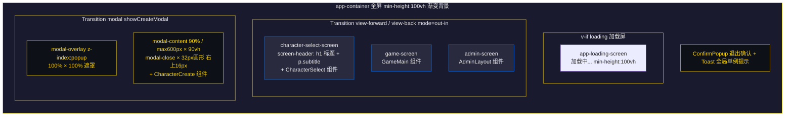
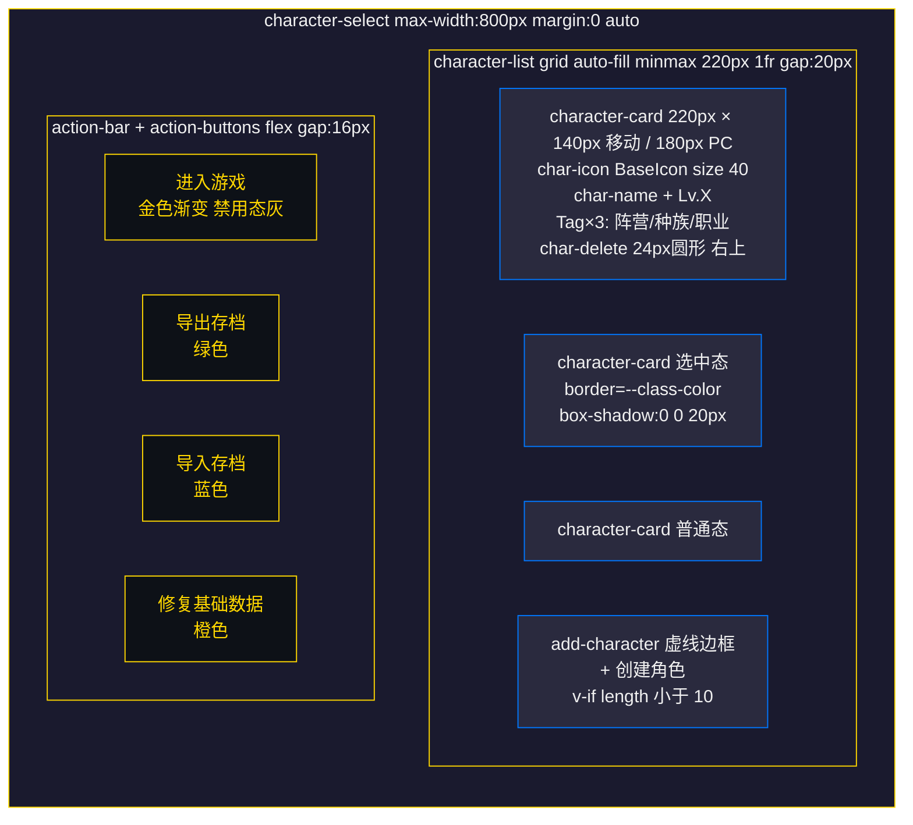
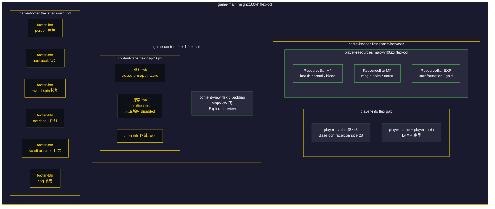
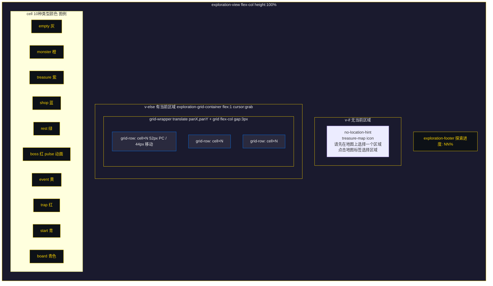
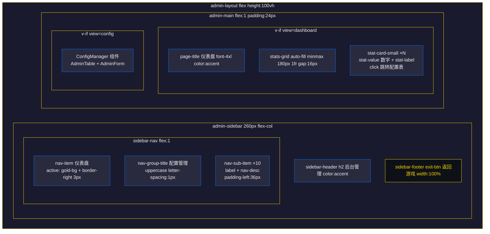

# UI界面设计文档 - 主界面

## 文档信息

| 项目 | 内容 |
|------|------|
| 标题 | UI界面设计文档 - 主界面 |
| 版本 | v1.2 |
| 生成日期 | 2026年7月10日 |
| 适用平台 | PC端、移动端 |
| 更新说明 | 比对 App.vue / CharacterSelect.vue / CharacterCreate.vue / GameMain.vue / MapView.vue / ExplorationView.vue / AdminLayout.vue / AdminTable.vue / AdminForm.vue / useResponsiveGrid.ts / useToast.ts 源码后重写：修正角色卡片为 220px 网格（高度 140px 移动 / 180px PC）并补全 Tag 组件与 4 个操作按钮（进入游戏/导出/导入/修复）；修正卡片选中边框使用 --class-color（职业色）而非阵营色；补全角色创建 4 步骤流程含属性预览/最终属性/次级属性/校验确认弹窗；新增 App.vue 根组件状态机与异步加载说明；新增 GameMain.vue 三段式布局（header/content-tabs/footer）与 10 个弹窗懒挂载机制；补全地图缩放（0.5~3）/拖拽平移/zone-info-panel/4 种标记状态；修正探索格子为 52px（PC）/44px（移动）并补全 10 种 cell 类型颜色与拖拽阈值 5px；新增后台管理 AdminLayout 侧边栏 + 仪表盘 + 配置管理章节；移除原"战斗界面"章节（CombatPopup 属弹窗，归入 POPUPS 文档）+ 新增各界面 mermaid 布局草图 + 修复 mermaid 语法（ASCII ID/br标签）并对照 Vue 模板重写布局草图 |

***

## 版本历史

| 版本 | 日期 | 更新内容 | 作者 |
|------|------|----------|------|
| v1.0 | 2026-07-10 | 初始版本：完整梳理主界面各组件布局与交互规范 | System |
| v1.1 | 2026-07-10 | 新增各界面 mermaid 布局草图 | System |
| v1.2 | 2026-07-10 | 修复 mermaid 渲染问题并对照源码重写布局 | System |

***

## 1. 应用根组件（App.vue）

### 1.1 组件概述

应用根组件，管理三种游戏界面状态（`character-select` | `game` | `admin`），通过 `defineAsyncComponent` 懒加载 CharacterSelect / CharacterCreate / GameMain / AdminLayout 四个大型视图组件（delay=200ms，timeout=10000ms），首屏仅包含角色选择所需代码。初始化时先加载基础数据（阵营/种族/职业）再初始化角色模块，若有当前角色 ID 则直接进入游戏。

### 1.2 状态转换

```
                    onMounted 初始化完成
                           │
                           ▼
              ┌──────── character-select ────────┐
              │                                  │
              │  (无当前角色)                     │  (有当前角色)
              │                                  │
              ▼                                  ▼
       character-select                        game
              │                                  │
              │ handleCharacterSelect            │ handleExit
              │ (view-forward)                   │ (showExitConfirm)
              ▼                                  ▼
            game                       showExitConfirm=true
              │                                  │
              │                                  │ confirmExit
              │                                  │ (view-back + logout)
              │                                  ▼
              │                          character-select
              │
              │ handleAdminExit (view-back)
              ▼
            admin
```

### 1.3 布局结构

```
┌─────────────────────────────────────────────────────────────┐
│  #app.app-container                                          │
│                                                             │
│  ┌─ Transition(name="view-forward"/"view-back") ─┐          │
│  │                                               │          │
│  │  [loading] → app-loading-screen               │          │
│  │              "加载中..."                       │          │
│  │                                               │          │
│  │  [character-select]                           │          │
│  │    screen-header                              │          │
│  │      h1 "战争艺术：地下城"                     │          │
│  │      p.subtitle "Art of War: Dungeons"        │          │
│  │    <CharacterSelect />                        │          │
│  │                                               │          │
│  │  [game]                                       │          │
│  │    <GameMain />                               │          │
│  │                                               │          │
│  │  [admin]                                      │          │
│  │    <AdminLayout />                            │          │
│  └───────────────────────────────────────────────┘          │
│                                                             │
│  ┌─ Transition(name="modal") ─┐                             │
│  │  [showCreateModal]          │                             │
│  │    modal-overlay            │                             │
│  │      modal-content          │                             │
│  │        modal-close "×"      │                             │
│  │        <CharacterCreate />  │                             │
│  └─────────────────────────────┘                             │
│                                                             │
│  <ConfirmPopup /> (退出确认)                                 │
│  <Toast /> (全局单例提示)                                    │
└─────────────────────────────────────────────────────────────┘
```

### 1.4 界面布局草图



### 1.5 元素尺寸

| 元素 | 宽度 | 高度 | 说明 |
|------|------|------|------|
| app-container | 100% | min-height: 100vh | 背景 linear-gradient(135deg, @primary-bg 0%, #16213e 50%, #0f3460 100%) |
| character-select-screen | 100% | min-height: 100vh | padding: 40px 20px |
| modal-content | 90% / max 600px | 90vh | max-height: 90vh |
| modal-close | 32px | 32px | 圆形按钮，右 上 16px |
| screen-header h1 | - | - | font-size: 36px，color: @accent-color |

### 1.6 交互说明

| 交互 | 触发方式 | 响应 |
|------|----------|------|
| 选择角色进入游戏 | CharacterSelect emit select | transitionName='view-forward'，调用 characterStore.selectCharacter 后 gameState='game' |
| 打开创建弹窗 | CharacterSelect emit create | showCreateModal=true |
| 角色创建完成 | CharacterCreate emit created | 关闭弹窗，调用 characterSelectRef.refreshData() 刷新列表 |
| 退出游戏 | GameMain emit exit | showExitConfirm=true |
| 确认退出 | ConfirmPopup confirm | transitionName='view-back'，characterStore.logout()，gameState='character-select' |
| 取消退出 | ConfirmPopup cancel | showExitConfirm=false |
| 退出后台管理 | AdminLayout emit exit | transitionName='view-back'，gameState='character-select' |

### 1.7 异步组件加载占位

| 状态 | 组件 | 说明 |
|------|------|------|
| loadingComponent | AsyncLoading | div.async-loading-placeholder，文本"加载中..."，min-height: 100vh |
| errorComponent | AsyncError | div.async-loading-placeholder.async-error，文本"加载失败，请刷新页面"，color: #ff6b6b |

***

## 2. 角色选择界面（CharacterSelect.vue）

### 2.1 界面概述

展示已有角色列表（grid 自适应布局），支持选择角色进入游戏、创建新角色（角色数 < 10 时显示创建按钮）、删除角色（带二次确认）、导出存档、导入存档、修复基础数据。角色卡片使用 Tag 组件展示阵营/种族/职业信息，选中状态边框使用职业色（--class-color）。

### 2.2 布局结构

```
┌─────────────────────────────────────────────────────────────┐
│  .character-select (max-width: 800px, margin: 0 auto)       │
│                                                             │
│  .character-list (grid: repeat(auto-fill, minmax(220px,1fr)) │
│    gap: 20px)                                               │
│  ┌─────────────┐ ┌─────────────┐ ┌─────────────┐           │
│  │ character-  │ │ character-  │ │ character-  │           │
│  │ card        │ │ card        │ │ card        │           │
│  │ (selected)  │ │             │ │             │           │
│  │             │ │             │ │             │           │
│  │ [char-icon] │ │ [char-icon] │ │ [char-icon] │           │
│  │  char-name  │ │  char-name  │ │  char-name  │           │
│  │  Lv.X       │ │  Lv.X       │ │  Lv.X       │           │
│  │ [Tag][Tag][Tag] │ [Tag]... │ │ [Tag]...    │           │
│  │        [del]│ │        [del]│ │        [del]│           │
│  └─────────────┘ └─────────────┘ └─────────────┘           │
│  ┌─────────────┐                                            │
│  │ add-        │  (v-if="characters.length < 10")          │
│  │ character   │                                            │
│  │  "+"        │                                            │
│  │  创建角色   │                                            │
│  └─────────────┘                                            │
│                                                             │
│  .action-bar                                                │
│    .action-buttons (flex, gap: 16px, flex-wrap: wrap)       │
│    [进入游戏] [导出存档] [导入存档] [修复基础数据]            │
└─────────────────────────────────────────────────────────────┘
```

### 2.3 界面布局草图



### 2.4 角色卡片结构

```
┌─────────────────────────────┐
│                       [del] │  ← char-delete（absolute top:4 right:4, 24x24 圆形）
│        [char-icon]          │  ← BaseIcon 种族图标 size=40
│                            │
│   char-name    Lv.X        │  ← char-header（名称 + 等级标签）
│                            │
│  [Tag阵营] [Tag种族] [Tag职业] │  ← char-details（3 个 Tag 组件）
└─────────────────────────────┘
```

卡片通过 inline style 注入两个 CSS 变量：
- `--class-color`: `baseStore.getClassColor(char.classId)`
- `--faction-color`: `baseStore.getFactionColor(char.factionId)`

### 2.5 元素尺寸

| 元素 | 宽度 | 高度 | 间距 | 说明 |
|------|------|------|------|------|
| character-list | 100% | - | gap: 20px | grid: repeat(auto-fill, minmax(220px, 1fr)) |
| character-card | 100%（min 220px） | 140px（移动）/ 180px（PC>=769px） | - | padding: @spacing-2xl @spacing-lg |
| char-icon | - | font-size: 40px（移动）/ 52px（PC） | - | BaseIcon size=40 |
| char-name | - | font-size: @font-md（移动）/ 16px（PC） | - | - |
| char-level | - | font-size: @font-xs（移动）/ 13px（PC） | - | padding: 1px 6px，背景 @gold-bg-active |
| char-delete | 24px | 24px | - | 圆形，背景 rgba(255, 68, 0, 0.2) |
| add-character | 100%（min 130px） | 140px（移动）/ 180px（PC） | - | 虚线边框 @border-dashed |
| action-btn | - | - | gap: 16px | padding: @spacing-3xl 64px，font-size: @font-xl |

### 2.6 移动端适配（max-width: 480px）

| 元素 | 调整 |
|------|------|
| character-list | grid-template-columns: 1fr（单列），gap: 12px |
| action-buttons | flex-direction: column，gap: 12px |
| action-btn | width: 100% |

### 2.7 操作按钮样式

| 按钮 | class | 背景色 | 边框色 | 文本色 |
|------|-------|--------|--------|--------|
| 进入游戏 | action-btn-primary | linear-gradient(135deg, @accent-color, #daa520) | @accent-color | @primary-bg |
| 导出存档 | action-btn-export | rgba(0, 200, 100, 0.15) | rgba(0, 200, 100, 0.4) | #00c864 |
| 导入存档 | action-btn-import | rgba(0, 150, 255, 0.15) | rgba(0, 150, 255, 0.4) | #0096ff |
| 修复基础数据 | action-btn-repair | rgba(255, 165, 0, 0.15) | rgba(255, 165, 0, 0.4) | #ffa500 |

进入游戏按钮禁用态：背景 @popup-border-color，color: @color-dodge，opacity: @opacity-dimmed。

### 2.8 内置确认弹窗

组件内置 5 个模态确认弹窗，均使用 `confirm-modal-overlay` + `confirm-modal` 结构（v-motion 进场动画）：

| 弹窗 | 触发 | 标题 | 图标 | 确认按钮 |
|------|------|------|------|----------|
| 删除确认 | 点击 char-delete | 确认删除 | caltrops (gradient=fire) | 删除（红色渐变） |
| 导入确认 | 文件验证通过 | 确认导入存档 | cloud-download (gradient=fire) | 导入（红色渐变） |
| 导入结果 | 导入完成 | 导入成功/导入失败 | check-mark 或 cancel（gradient=heal 或 debuff） | 确定 |
| 修复确认 | 点击修复按钮 | 确认修复基础数据 | toolbox | 修复（红色渐变） |
| 修复结果 | 修复完成 | 修复成功/修复失败 | check-mark 或 cancel（gradient=heal 或 debuff） | 确定 |

确认弹窗尺寸：max-width: 360px，width: 90%，padding: 24px，border: 2px solid @color-delete。

### 2.9 交互说明

| 交互 | 触发方式 | 响应 |
|------|----------|------|
| 选中角色 | 点击 character-card | selectedId 高亮（border-color: var(--class-color)，box-shadow: 0 0 20px var(--class-color)），发送 UI_CLICK 事件 |
| 进入游戏 | 点击进入游戏按钮（需选中） | characterStore.selectCharacter，emit select |
| 创建角色 | 点击 add-character | emit create（App.vue 打开创建弹窗） |
| 删除角色 | 点击 char-delete | 弹出删除确认弹窗 |
| 确认删除 | 点击删除按钮 | characterStore.deleteCharacter，刷新列表 |
| 导出存档 | 点击导出存档按钮 | characterStore.exportBackup（导出 JSON 文件） |
| 导入存档 | 点击导入存档按钮 | 触发隐藏 file input，选择文件后验证 → 弹出导入确认 |
| 确认导入 | 点击导入按钮 | characterStore.importBackup，刷新数据与列表，显示结果弹窗 |
| 修复基础数据 | 点击修复按钮 | 弹出修复确认弹窗 |
| 确认修复 | 点击修复按钮 | characterStore.repairBaseData，刷新数据与列表，显示结果弹窗 |

> **交互规则1**：首次加载时若已有角色，默认选中第一个角色。
> **交互规则2**：创建角色按钮仅在 `characters.length < 10` 时显示。
> **交互规则3**：进入游戏按钮在未选中角色时为禁用状态。
> **交互规则4**：卡片选中边框使用 `--class-color`（职业色），非阵营色。

### 2.10 状态转换

```
角色列表 ──点击卡片──→ 选中角色（职业色高亮）──→ 点击进入游戏 ──→ 进入游戏界面
            │
            ├──点击创建按钮──→ 打开创建弹窗（App.vue）
            │
            ├──点击删除──→ 删除确认弹窗──→ 确认──→ 刷新列表
            │
            ├──点击导出──→ 直接导出 JSON
            │
            ├──点击导入──→ 选择文件──→ 验证──→ 导入确认弹窗──→ 确认──→ 导入结果弹窗
            │
            └──点击修复──→ 修复确认弹窗──→ 确认──→ 修复结果弹窗
```

***

## 3. 角色创建界面（CharacterCreate.vue）

### 3.1 界面概述

4 步骤角色创建流程：1=选择阵营 → 2=选择种族 → 3=选择职业 → 4=输入角色名。采用三段式布局（顶部标题 / 中间滚动内容 / 底部固定属性预览与导航）。底部固定区域在步骤 1-3 显示"属性预览"，步骤 4 显示"最终属性"含次级属性。内置校验与确认弹窗。

### 3.2 布局结构

```
┌─────────────────────────────────────────────────────────────┐
│  .character-create (flex-col, height: 100%, padding: @spacing-3xl) │
│                                                             │
│  .create-header (flex: 0 0 auto)                            │
│    h2 "创建新角色 - 步骤 X/4"                                │
│    .step-title "请选择阵营/种族/职业/输入角色名"             │
│  ─────────────────────────────────────────────────────────  │
│  .scrollable-content (flex: 1, overflow-y: auto)            │
│                                                             │
│  [步骤1] .faction-grid (2列) + .neutral-faction-row         │
│  [步骤2] .race-grid (auto-fit minmax(100px,1fr))            │
│  [步骤3] .class-grid (auto-fit minmax(110px,1fr))           │
│  [步骤4] .character-preview (preview-row + preview-details) │
│                                                             │
│  ─────────────────────────────────────────────────────────  │
│  .fixed-footer (flex: 0 0 auto)                             │
│    [步骤1-3] .attribute-preview (属性预览 3列网格)           │
│    [步骤4]   .final-attributes (最终属性 3列 + 次级属性 2列) │
│    .navigation-buttons: [上一步] [下一步/创建角色]           │
└─────────────────────────────────────────────────────────────┘
```

### 3.3 界面布局草图

```mermaid
flowchart TB
    subgraph createRoot["character-create flex-col height:100%"]
        direction TB
        subgraph header["create-header flex:0 0 auto"]
            title["h2 创建新角色 - 步骤 X/4<br>font-size:font-3xl"]
            stepTitle["step-title 请选择阵营/种族/职业/输入角色名"]
        end
        subgraph scrollArea["scrollable-content flex:1 overflow-y:auto"]
            direction TB
            step1["步骤1: faction-grid 2列<br>2张主阵营卡 min-h160px + 1张中立卡 max360px"]
            step2["步骤2: race-grid auto-fit minmax 100px 1fr<br>种族卡 icon+name+bonus"]
            step3["步骤3: class-grid auto-fit minmax 110px 1fr<br>职业卡 icon+name+bonus"]
            step4["步骤4: character-preview<br>preview-avatar + name-input + Tag×3"]
        end
        subgraph footer["fixed-footer flex:0 0 auto"]
            direction TB
            attrPreview["步骤1-3: attribute-preview 3列网格<br>6项基础属性 力敏体智感魅"]
            finalAttr["步骤4: final-attributes<br>3列基础属性 + 2列次级属性 8项<br>物攻/物防/魔攻/魔防/暴击/闪避/HP/MP"]
            navBtns["navigation-buttons space-between<br>上一步 + spacer + 下一步/创建角色"]
        end
    end

    classDef containerCls fill:#1a1a2e,stroke:#ffd700,color:#f0f0f0
    classDef stepCls fill:#2a2a3e,stroke:#9C27B0,color:#f0f0f0
    classDef btnCls fill:#0d1117,stroke:#ffd700,color:#ffd700

    class createRoot,header,scrollArea,footer containerCls
    class step1,step2,step3,step4,attrPreview,finalAttr stepCls
    class navBtns btnCls
```



### 3.4 步骤1：选择阵营

```
┌─────────────────────────────────────────────────────────────┐
│  .faction-grid (grid: repeat(2, 1fr), gap: @spacing-xl)     │
│  ┌─────────────────────┐  ┌─────────────────────┐           │
│  │ faction-card        │  │ faction-card        │           │
│  │ main-faction        │  │ main-faction        │           │
│  │ (min-height: 160px) │  │ (min-height: 160px) │           │
│  │                     │  │                     │           │
│  │   [faction-icon]    │  │   [faction-icon]    │           │
│  │   阵营名称          │  │   阵营名称          │           │
│  │   种族1 · 种族2...  │  │   种族1 · 种族2...  │           │
│  │ (--faction-color)   │  │ (--faction-color)   │           │
│  └─────────────────────┘  └─────────────────────┘           │
│  .neutral-faction-row (flex, justify-content: center)       │
│  ┌─────────────────────────────────────┐                    │
│  │ faction-card neutral-faction        │                    │
│  │ (max-width: 360px)                  │                    │
│  │   [faction-icon]                    │                    │
│  │   中立                              │                    │
│  │   种族名                            │                    │
│  │ (--faction-color: #4CAF50)          │                    │
│  └─────────────────────────────────────┘                    │
└─────────────────────────────────────────────────────────────┘
```

阵营卡片 active 状态：border-color: var(--faction-color)，background: @gold-bg，box-shadow: 0 0 15px var(--faction-color)。

### 3.5 步骤2：选择种族

```
┌─────────────────────────────────────────────────────────────┐
│  .race-grid.[selectedFaction]                               │
│  (grid: repeat(auto-fit, minmax(100px, 1fr)), gap: @spacing-lg) │
│  ┌───────┐ ┌───────┐ ┌───────┐ ┌───────┐                   │
│  │race-  │ │race-  │ │race-  │ │race-  │                   │
│  │card   │ │card   │ │card   │ │card   │                   │
│  │[icon] │ │[icon] │ │[icon] │ │[icon] │                   │
│  │种族名 │ │种族名 │ │种族名 │ │种族名 │                   │
│  │+X属性 │ │+X属性 │ │+X属性 │ │+X属性 │                   │
│  └───────┘ └───────┘ └───────┘ └───────┘                   │
└─────────────────────────────────────────────────────────────┘
```

种族卡片 active 状态按阵营区分颜色：

| 阵营 | active border-color | active box-shadow |
|------|---------------------|-------------------|
| alliance（光辉盟约） | #0078ff | 0 0 15px #0078ff |
| horde（铁血盟约） | #ff4400 | 0 0 15px #ff4400 |
| neutral（中立） | #4caf50 | 0 0 15px #4caf50 |

### 3.6 步骤3：选择职业

```
┌─────────────────────────────────────────────────────────────┐
│  .class-grid                                                │
│  (grid: repeat(auto-fit, minmax(110px, 1fr)), gap: @spacing-lg) │
│  ┌─────────┐ ┌─────────┐ ┌─────────┐ ┌─────────┐           │
│  │class-   │ │class-   │ │class-   │ │class-   │           │
│  │card     │ │card     │ │card     │ │card     │           │
│  │[icon]   │ │[icon]   │ │[icon]   │ │[icon]   │           │
│  │职业名   │ │职业名   │ │职业名   │ │职业名   │           │
│  │+X属性   │ │+X属性   │ │+X属性   │ │+X属性   │           │
│  │(-X属性) │ │         │ │         │ │         │           │
│  │(--class-color) │ │(... )  │ │(... )  │ │(... )  │           │
│  └─────────┘ └─────────┘ └─────────┘ └─────────┘           │
└─────────────────────────────────────────────────────────────┘
```

职业卡片 active 状态：border-color: var(--class-color)，background: @gold-bg，box-shadow: 0 0 15px var(--class-color)。负值属性加成显示为红色（#ff4444）。

### 3.7 步骤4：输入角色名

```
┌─────────────────────────────────────────────────────────────┐
│  .character-preview (padding: @spacing-4xl)                 │
│  ┌─────────────────────────────────────────────────────┐    │
│  │ .preview-row (flex, gap: @spacing-xl)               │    │
│  │   [preview-avatar]  [name-input-wrapper]            │    │
│  │   BaseIcon size=40  input.name-input                │    │
│  │                      placeholder="输入角色名..."     │    │
│  └─────────────────────────────────────────────────────┘    │
│  .preview-details (flex, gap: @spacing-xs)                  │
│  [Tag阵营] [Tag种族] [Tag职业]                               │
└─────────────────────────────────────────────────────────────┘
```

### 3.8 底部固定区域

#### 步骤 1-3：属性预览

```
┌─────────────────────────────────────────────────────────────┐
│  .attribute-preview (背景 @gradient-attr-panel)             │
│  .preview-title "属性预览"                                   │
│  .attr-list (grid: repeat(3, 1fr), gap: @spacing-xs)        │
│  ┌──────────┐ ┌──────────┐ ┌──────────┐                    │
│  │[icon]力量│ │[icon]敏捷│ │[icon]体质│                    │
│  │  11      │ │  10      │ │  10      │                    │
│  └──────────┘ └──────────┘ └──────────┘                    │
│  ┌──────────┐ ┌──────────┐ ┌──────────┐                    │
│  │[icon]智力│ │[icon]感知│ │[icon]魅力│                    │
│  │  10      │ │  10      │ │  10      │                    │
│  └──────────┘ └──────────┘ └──────────┘                    │
└─────────────────────────────────────────────────────────────┘
```

基础属性值均为 10，叠加种族与职业的 bonus。属性图标映射：

| 属性 | 图标 name | gradient |
|------|-----------|----------|
| str（力量） | biceps | physical |
| dex（敏捷） | boot-kick | lightning |
| con（体质） | heart-organ | blood |
| int（智力） | brain | magic |
| wis（感知） | eye-target | nature |
| cha（魅力） | charm | gold |

#### 步骤 4：最终属性

```
┌─────────────────────────────────────────────────────────────┐
│  .final-attributes                                          │
│  .final-title "最终属性"                                     │
│  .attr-grid (grid: repeat(3, 1fr))                          │
│  ┌────────┐ ┌────────┐ ┌────────┐                          │
│  │[icon]  │ │[icon]  │ │[icon]  │                          │
│  │ 力量   │ │ 敏捷   │ │ 体质   │                          │
│  │  13    │ │  10    │ │  11    │                          │
│  └────────┘ └────────┘ └────────┘                          │
│  ┌────────┐ ┌────────┐ ┌────────┐                          │
│  │ 智力   │ │ 感知   │ │ 魅力   │                          │
│  │  9     │ │  10    │ │  10    │                          │
│  └────────┘ └────────┘ └────────┘                          │
│  ─── .divider ───                                          │
│  .secondary-section                                         │
│  .secondary-title "次级属性"                                 │
│  .secondary-attrs (grid: repeat(2, 1fr))                    │
│  ┌──────────────────┐ ┌──────────────────┐                 │
│  │[icon] 物理攻击 26│ │[icon] 物理防御 16│                 │
│  └──────────────────┘ └──────────────────┘                 │
│  ┌──────────────────┐ ┌──────────────────┐                 │
│  │[icon] 魔法攻击 18│ │[icon] 魔法防御 14│                 │
│  └──────────────────┘ └──────────────────┘                 │
│  ┌──────────────────┐ ┌──────────────────┐                 │
│  │[icon] 暴击率 5%  │ │[icon] 闪避率 3%  │                 │
│  └──────────────────┘ └──────────────────┘                 │
│  ┌──────────────────┐ ┌──────────────────┐                 │
│  │[icon] 最大HP 210 │ │[icon] 最大MP 98  │                 │
│  └──────────────────┘ └──────────────────┘                 │
└─────────────────────────────────────────────────────────────┘
```

次级属性图标映射：

| 属性 | 图标 name | gradient |
|------|-----------|----------|
| 物理攻击 | sword-clash | physical |
| 物理防御 | shield | earth |
| 魔法攻击 | magic-swirl | magic |
| 魔法防御 | magic-shield | magic |
| 暴击率 | explosion-rays | crit |
| 闪避率 | dodge | dodge |
| 最大HP | health-normal | blood |
| 最大MP | magic-palm | mana |

#### 导航按钮

```
.navigation-buttons (flex, justify-content: space-between, gap: @spacing-xl)
[上一步 .nav-btn.prev]  [spacer]  [下一步 .nav-btn.next / 创建角色 .nav-btn.create]
```

| 按钮 | class | 背景色 | 文本色 |
|------|-------|--------|--------|
| 上一步 | nav-btn.prev | @popup-border-color | @text-primary |
| 下一步 | nav-btn.next | linear-gradient(135deg, #0078ff, #0056cc) | @popup-text-color |
| 创建角色 | nav-btn.create | @gradient-gold-btn | @color-text-dark |

### 3.9 元素尺寸

| 元素 | 宽度 | 高度 | 说明 |
|------|------|------|------|
| character-create | 100% | 100% | padding: @spacing-3xl |
| create-header h2 | - | - | font-size: @font-3xl，color: @accent-color |
| step-title | - | - | font-size: @font-xl |
| faction-card main-faction | - | min-height: 160px | padding: @spacing-4xl @spacing-xl |
| faction-card neutral-faction | max 360px | - | - |
| race-card | min 100px | - | padding: @spacing-2xl @spacing-md |
| class-card | min 110px | - | padding: @spacing-2xl @spacing-md |
| name-input | 100% | - | padding: @spacing-xl @spacing-2xl，font-size: @font-lg |
| nav-btn | - | - | padding: @spacing-xl 24px，font-size: @font-base |

### 3.10 角色名校验规则

| 规则 | 说明 |
|------|------|
| 非空 | trim 后长度 > 0 |
| 字符限制 | 仅允许中文（\u4e00-\u9fff）、英文（a-zA-Z）、数字（0-9） |
| 长度计算 | 中文计 2 字符，英文/数字计 1 字符 |
| 最大长度 | 16 字符（即最多 8 个汉字或 16 个英文字母） |

### 3.11 内置校验/确认弹窗

```
┌─────────────────────────────────────────────────────────────┐
│  .modal-overlay (z-index: @z-popup)                         │
│  ┌─────────────────────────────────────────────────────┐    │
│  │ .modal-box (max-width: 360px, border: 2px solid @accent-color) │
│  │   [modal-icon] BaseIcon size=48                     │    │
│  │   h3 标题                                            │    │
│  │   p 消息                                             │    │
│  │   .modal-buttons                                     │    │
│  │     [modal-btn-cancel] [modal-btn-confirm]          │    │
│  └─────────────────────────────────────────────────────┘    │
└─────────────────────────────────────────────────────────────┘
```

| 弹窗类型 | modalType | 图标 | 标题 | 确认按钮文本 |
|----------|-----------|------|------|--------------|
| 错误提示 | error | caltrops (gradient=warning) | 角色名不符合要求 | 返回修改 |
| 创建确认 | confirm | check-mark (gradient=heal) | 确认创建角色 | 确认创建 |

### 3.12 交互说明

| 交互 | 触发方式 | 响应 |
|------|----------|------|
| 选择阵营 | 点击 faction-card | selectedFaction 更新，清空 selectedRace，发送 UI_CLICK |
| 选择种族 | 点击 race-card | selectedRace 更新，发送 UI_CLICK |
| 选择职业 | 点击 class-card | selectedClass 更新，发送 UI_CLICK |
| 输入角色名 | 输入 name-input | name 实时更新 |
| 上一步 | 点击上一步按钮（步骤 > 1） | currentStep-- |
| 下一步 | 点击下一步按钮（步骤 < 4，需 canProceed） | currentStep++ |
| 创建角色 | 点击创建角色按钮（步骤 4，需 canCreate） | 校验角色名 → 弹出确认弹窗 → 确认后 characterStore.createCharacter |
| 关闭弹窗 | 点击遮罩 / 取消按钮 | 关闭弹窗 |

> **交互规则1**：每一步点击卡片仅选择，不自动切换步骤，需点击"下一步"。
> **交互规则2**：未选择当前步骤所需项时，"下一步"按钮禁用。
> **交互规则3**：切换阵营会清空已选种族（selectedRace=null）。
> **交互规则4**：可选职业受种族与阵营双重过滤（c.raceIds 包含 selectedRace 且 c.factionsIds 包含 selectedFaction）。
> **交互规则5**：创建角色前先校验角色名，校验失败显示错误弹窗，通过后显示确认弹窗。

### 3.13 状态转换

```
步骤1(阵营) ──选择阵营──→ 选中阵营 ──下一步──→ 步骤2(种族)
                                              │
                                              ├──选择种族──→ 选中种族 ──下一步──→ 步骤3(职业)
                                                                            │
                                                                            ├──选择职业──→ 选中职业 ──下一步──→ 步骤4(名字)
                                                                                                          │
                                                                                                          ├──输入角色名──→ 点击创建──→ 校验
                                                                                                          │                          │
                                                                                                          │                   ┌──────┴──────┐
                                                                                                          │                   │             │
                                                                                                          │              校验失败        校验通过
                                                                                                          │                   │             │
                                                                                                          │              错误弹窗        确认弹窗
                                                                                                          │                   │             │
                                                                                                          │              返回修改         确认创建
                                                                                                          │                                  │
                                                                                                          │                          characterStore.createCharacter
                                                                                                          │                                  │
                                                                                                          │                          emit created（App.vue 关闭弹窗）
```

***

## 4. 游戏主界面（GameMain.vue）

### 4.1 界面概述

游戏核心枢纽页面，三段式布局：顶部 header（玩家信息 + 3 个资源条）、中部 content（地图/探索两个 tab + 视图区）、底部 footer（6 个导航按钮）。通过 `popupMounted` 响应式对象实现 10 个弹窗的懒挂载（首次打开时置 true 并保持）。监听 CHARACTER_LEVEL_UP 事件触发升级动画（1500ms 定时器复位）。

### 4.2 布局结构

```
┌─────────────────────────────────────────────────────────────┐
│  .game-main (height: 100vh, flex-col)                       │
│  ┌─────────────────────────────────────────────────────────┐│
│  │ .game-header (flex, justify-content: space-between)     ││
│  │  ┌──────────────────────┐  ┌────────────────────────┐  ││
│  │  │ .player-info         │  │ .player-resources       │  ││
│  │  │  [avatar] 名称 Lv.X  │  │  [ResourceBar HP]       │  ││
│  │  │          金币        │  │  [ResourceBar MP]       │  ││
│  │  └──────────────────────┘  │  [ResourceBar EXP]      │  ││
│  │                            └────────────────────────┘  ││
│  ├─────────────────────────────────────────────────────────┤│
│  │ .game-content (flex: 1, flex-col)                       ││
│  │  .content-tabs (flex, gap: 16px)                        ││
│  │  [地图 tab] [探索 tab]                  .area-info      ││
│  │  ┌─────────────────────────────────────────────────┐    ││
│  │  │ .content-view (flex: 1, padding: @spacing-3xl)  │    ││
│  │  │  <MapView> 或 <ExplorationView>                 │    ││
│  │  └─────────────────────────────────────────────────┘    ││
│  ├─────────────────────────────────────────────────────────┤│
│  │ .game-footer (flex, justify-content: space-around)      ││
│  │  [角色] [背包] [技能] [任务] [日志] [系统]              ││
│  └─────────────────────────────────────────────────────────┘│
└─────────────────────────────────────────────────────────────┘
```

### 4.3 界面布局草图



### 4.4 顶部 Header

#### player-info

```
┌─────────────────────────────────────┐
│ .player-info (flex, gap: @spacing-xl)│
│  ┌────────┐  ┌────────────────────┐ │
│  │.player-│  │.player-details     │ │
│  │avatar  │  │  .player-name      │ │
│  │ 48x48  │  │  .player-meta      │ │
│  │ BaseIcon│ │   Lv.X  金币       │ │
│  └────────┘  └────────────────────┘ │
└─────────────────────────────────────┘
```

| 元素 | 尺寸 | 说明 |
|------|------|------|
| player-avatar | 48x48（移动 40x40） | 背景 @gold-bg-hover，border 2px rgba(255,215,0,0.3)，border-radius 10px |
| player-name | font-size: @font-xl（移动 15px） | color: @text-primary，font-weight: bold |
| player-level | font-size: @font-sm（移动 11px） | 背景 @gold-bg，color: @accent-color |
| player-gold | font-size: @font-sm（移动 16px） | color: @accent-color，BaseIcon two-coins gradient=gold size=14 |
| player-resources | max-width: 400px（移动 100%） | flex-col，gap: @spacing-sm |

升级动画：`.player-level.level-up` 应用 `level-up-text 0.6s ease` + `level-up-glow 1.5s ease` 动画，1500ms 后复位。

#### ResourceBar

3 个 ResourceBar 组件，液态波浪资源条：

| 资源 | icon | iconGradient | name | type |
|------|------|--------------|------|------|
| 生命 | health-normal | blood | HP | hp |
| 法力 | magic-palm | mana | MP | mp |
| 经验 | star-formation | gold | EXP | exp |

### 4.5 中部 Content

#### content-tabs

```
┌─────────────────────────────────────────────────────────────┐
│ .content-tabs (flex, gap: 16px, padding: @spacing-xl 24px)  │
│  [content-tab 地图] [content-tab 探索]    .area-info        │
│  BaseIcon treasure-map       BaseIcon campfire              │
│  gradient=nature             gradient=heal                   │
│  size=16                     size=16                         │
└─────────────────────────────────────────────────────────────┘
```

| 元素 | 尺寸 | 说明 |
|------|------|------|
| content-tab | padding: @spacing-md 24px | 背景 @white-05，border @border-card，font-size: @font-md |
| content-tab.active | - | border-color: @accent-color，background: @gold-bg，color: @accent-color |
| content-tab.disabled | - | opacity: 0.4，cursor: not-allowed（探索 tab 无当前区域时禁用） |
| area-info | - | margin-left: auto，color: @text-secondary |

#### content-view

| 元素 | 说明 |
|------|------|
| content-view | flex: 1，padding: @spacing-3xl，flex-col |
| MapView | currentContentTab === 'map' 时渲染，emit enter-zone 切换到 explore |
| ExplorationView | currentContentTab === 'explore' 时渲染 |

### 4.6 底部 Footer

```
┌─────────────────────────────────────────────────────────────┐
│ .game-footer (flex, justify-content: space-around)          │
│  ┌────┐  ┌────┐  ┌────┐  ┌────┐  ┌────┐  ┌────┐            │
│  │footer│ │footer│ │footer│ │footer│ │footer│ │footer│       │
│  │-btn  │ │-btn  │ │-btn  │ │-btn  │ │-btn  │ │-btn  │       │
│  │[icon]│ │[icon]│ │[icon]│ │[icon]│ │[icon]│ │[icon]│       │
│  │ 角色 │ │ 背包 │ │ 技能 │ │ 任务 │ │ 日志 │ │ 系统 │       │
│  └────┘  └────┘  └────┘  └────┘  └────┘  └────┘            │
└─────────────────────────────────────────────────────────────┘
```

6 个 footer-btn，每个包含 BaseIcon（gradient=gold，size=16）+ footer-text：

| 按钮 | BaseIcon name | 文本 | 打开弹窗 |
|------|---------------|------|----------|
| 角色 | person | 角色 | CharacterInfoPopup |
| 背包 | backpack | 背包 | InventoryPopup |
| 技能 | sword-spin | 技能 | SkillsPopup |
| 任务 | notebook | 任务 | QuestPopup |
| 日志 | scroll-unfurled | 日志 | AdventureLogPopup |
| 系统 | cog | 系统 | SystemPopup |

| 元素 | 尺寸 | 说明 |
|------|------|------|
| footer-btn | min-width: 52px（移动 48px / 480px 42px） | flex-col-center，gap: 5px |
| footer-btn:hover | - | color: @accent-color，background: rgba(255,215,0,0.08)，translateY(-2px) |
| footer-btn::after | - | 底部 2px 金色下划线，hover 时 width: 70% |
| footer-text | font-size: @font-2xs | letter-spacing: 0.5px |

### 4.7 弹窗懒挂载机制

通过 `popupMounted` reactive 对象控制 10 个弹窗的 v-if 挂载，首次打开时置 true 并保持，配合 `defineAsyncComponent` 实现按需加载弹窗 chunk：

| 弹窗组件 | popupMounted 键 | 触发方式 |
|----------|-----------------|----------|
| CharacterInfoPopup | characterInfo | footer 角色 |
| InventoryPopup | inventory | footer 背包 |
| SkillsPopup | skills | footer 技能 |
| QuestPopup | quests | footer 任务 |
| AdventureLogPopup | adventureLog | footer 日志 |
| ShopPopup | shop | 探索格子 cellType='shop' |
| QuestBoardPopup | questBoard | 探索格子 cellType='board' |
| AudioSettingsPopup | audioSettings | SystemPopup emit open-audio |
| SystemPopup | system | footer 系统 |
| CombatPopup | -（用 showCombat 直接 v-if） | 探索战斗事件 |

异步加载占位：`popup-async-loading`（min-height: 200px，文本"加载中..."）/ `popup-async-error`（color: #ff6b6b，文本"加载失败"）。

### 4.8 交互说明

| 交互 | 触发方式 | 响应 |
|------|----------|------|
| 切换地图 tab | 点击地图 tab | currentContentTab='map'，发送 UI_CLICK，mapStore.saveCurrentTab('map') |
| 切换探索 tab | 点击探索 tab | 若无当前区域则 Toast 提示；否则 currentContentTab='explore'，发送 UI_CLICK，mapStore.saveCurrentTab('explore') |
| 打开弹窗 | 点击 footer-btn | popupMounted[key]=true，showXxx=true，发送 UI_CLICK + UI_PANEL_OPENED |
| 关闭弹窗 | 弹窗 emit close | showXxx=false，发送 UI_PANEL_CLOSED |
| 进入商店 | 探索 cellType='shop' | shopStore.openShop，popupMounted.shop=true，showShop=true |
| 进入任务板 | 探索 cellType='board' | popupMounted.questBoard=true，showQuestBoard=true |
| 触发战斗 | 探索战斗事件 | enemyStore.createEnemy，combatStore.startCombat，showCombat=true |
| 发现物品 | 探索物品事件 | Toast 提示"发现物品: xxx xN" |
| 触发陷阱 | 探索陷阱事件 | Toast 提示"触发xxx，受到 N 点伤害"（danger） |
| 随机事件 | 探索随机事件 | Toast 提示事件消息 |
| 升级 | CHARACTER_LEVEL_UP 事件 | levelUpTriggered=true，Toast"升级了！"，1500ms 后复位 |
| 退出游戏 | SystemPopup emit exit | emit exit（App.vue 处理） |

### 4.9 探索 UI 回调注册

GameMain 在 onMounted 时通过 `explorationStore.registerUICallbacks` 注册 6 个回调：

| 回调 | 说明 |
|------|------|
| onCellExplored | 处理 shop/board 类型格子，打开对应弹窗 |
| onBattleTriggered | 创建敌人并打开 CombatPopup |
| onItemFound | Toast 提示发现物品 |
| onTrapTriggered | Toast 提示陷阱伤害 |
| onRandomEvent | Toast 提示随机事件 |
| onMultiOptionEvent | Toast 提示事件描述，自动应用第一个选项 |

***

## 5. 大地图视图（MapView.vue）

### 5.1 界面概述

世界地图交互界面，背景图 worldBg.jpg（aspect-ratio 1201/800），支持鼠标/触摸拖拽平移和滚轮缩放（0.5~3）。区域标记有 4 种状态（locked/unlocked/high-risk/is-current），点击标记选中并显示右下角 zone-info-panel。进入探索前弹出 ConfirmPopup 确认。

### 5.2 布局结构

```
┌─────────────────────────────────────────────────────────────┐
│  .map-view (flex-col, flex: 1, border-radius: @radius-xl)   │
│  ┌─────────────────────────────────────────────────────────┐│
│  │ .map-container (flex: 1, min-height: 400px, cursor: grab)││
│  │                                                         ││
│  │  ┌─ .world-map (aspect-ratio: 1201/800) ──────────────┐ ││
│  │  │  背景 worldBg.jpg                                   │ ││
│  │  │                                                     │ ││
│  │  │     ○ locked       ● unlocked                       │ ││
│  │  │     (灰)           (绿)                              │ ││
│  │  │                                                     │ ││
│  │  │     ▲ high-risk    ★ is-current                     │ ││
│  │  │     (红，Lv>=10)   (金)                              │ ││
│  │  │                                                     │ ││
│  │  └─────────────────────────────────────────────────────┘ ││
│  │                                                         ││
│  │  ┌─ .zoom-controls (absolute top:16 right:16) ────────┐ ││
│  │  │  [+]                                              │ ││
│  │  │  1.0x                                             │ ││
│  │  │  [-]                                              │ ││
│  │  └─────────────────────────────────────────────────────┘ ││
│  │                                                         ││
│  │  ┌─ .zone-info-panel (absolute bottom:16 right:16) ───┐ ││
│  │  │  .panel-header: 区域名称                            │ ││
│  │  │  .panel-body:                                       │ ││
│  │  │    等级  N+                                         │ ││
│  │  │    状态  已解锁/未解锁/已完成                       │ ││
│  │  │    描述  xxx                                        │ ││
│  │  │  .panel-actions: [进入探索] / [未解锁]              │ ││
│  │  └─────────────────────────────────────────────────────┘ ││
│  └─────────────────────────────────────────────────────────┘│
│  <ConfirmPopup /> (切换区域确认)                             │
└─────────────────────────────────────────────────────────────┘
```

### 5.3 界面布局草图

```mermaid
flowchart TB
    subgraph mapRoot["map-view flex-col flex:1"]
        direction TB
        subgraph mapContainer["map-container flex:1 min-h400px cursor:grab"]
            direction TB
            subgraph worldMap["world-map aspect-ratio 1201/800 背景 worldBg.jpg"]
                direction TB
                markerLocked["○ locked 灰色 边框 dim-gray"]
                markerUnlocked["● unlocked 绿色 边框 ally"]
                markerHighRisk["▲ high-risk 红色 等级10以上"]
                markerCurrent["★ is-current 金色 边框 accent"]
            end
            subgraph zoomCtrl["zoom-controls absolute top:16 right:16"]
                direction TB
                zoomIn["+ 放大 36×36"]
                zoomLevel["1.0x font-xs"]
                zoomOut["- 缩小 36×36"]
            end
            subgraph infoPanel["zone-info-panel 280px absolute bottom:16 right:16"]
                direction TB
                panelHeader["panel-header 区域名称"]
                panelBody["panel-body 等级 N+ / 状态 / 描述"]
                panelActions["panel-actions 进入探索 或 未解锁"]
            end
        end
        confirmPopup["ConfirmPopup 切换区域确认"]
    end

    classDef containerCls fill:#1a1a2e,stroke:#ffd700,color:#f0f0f0
    classDef markerCls fill:#2a2a3e,stroke:#0078ff,color:#f0f0f0
    classDef ctrlCls fill:#0d1117,stroke:#ffd700,color:#ffd700

    class mapRoot,mapContainer,worldMap,zoomCtrl,infoPanel containerCls
    class markerLocked,markerUnlocked,markerHighRisk,markerCurrent markerCls
    class zoomIn,zoomLevel,zoomOut,panelActions,confirmPopup ctrlCls
```



### 5.4 区域标记状态

| 状态 class | 条件 | 边框色 | 背景色 | box-shadow |
|------------|------|--------|--------|------------|
| locked | zone.status === 'locked' | @color-dim-gray | rgba(0,0,0,0.5) | - |
| unlocked | zone.status === 'unlocked' | @color-ally (#00d2d3) | rgba(0,0,0,0.6) | 0 0 8px rgba(0,210,211,0.3) |
| high-risk | zone.requiredLevel >= 10 | @color-danger-accent (#e94560) | rgba(0,0,0,0.6) | 0 0 8px rgba(233,69,96,0.3) |
| is-current | zone.id === currentZoneId | @accent-color (#ffd700) | rgba(0,0,0,0.6) | 0 0 10px rgba(255,215,0,0.4) |

标记图标：marker-icon 36x36，圆形，BaseIcon zone.icon gradient=metal size=20。标记位置使用百分比坐标，并应用反向缩放（1/zoomLevel）保持标记尺寸不变。

### 5.5 元素尺寸

| 元素 | 宽度 | 高度 | 说明 |
|------|------|------|------|
| map-container | 100% | flex:1 (min 400px / 移动 300px) | cursor: grab |
| world-map | 动态计算 | 动态计算 | aspect-ratio: 1201/800 |
| marker-icon | 36px | 36px | 圆形 border 2px |
| zoom-controls | - | - | absolute top:16 right:16，padding: @spacing-xs |
| zoom-btn | 36px | 36px | font-size: @font-2xl |
| zoom-level | - | - | font-size: @font-xs，color: rgba(255,255,255,0.5) |
| zone-info-panel | 280px（移动 calc(100% - 32px)） | - | absolute bottom:16 right:16，background: rgba(0,0,0,0.75) |

### 5.6 zone-info-panel 结构

```
┌─ .zone-info-panel (280px) ──────────────┐
│  .panel-header                           │
│    .panel-name "区域名称"                │
│  .panel-body                             │
│    .panel-row  等级  N+                  │
│    .panel-row  状态  已解锁/未解锁/已完成 │
│    .panel-row  描述  xxx                 │
│  .panel-actions                          │
│    [进入探索] (status !== 'locked')      │
│    [未解锁]   (status === 'locked')      │
└──────────────────────────────────────────┘
```

状态文本颜色：

| 状态 | 文本 | 颜色 |
|------|------|------|
| locked | 未解锁 | rgba(255,255,255,0.35) |
| unlocked | 已解锁 | #58d68d |
| completed | 已完成 | #f4d03f |

未选中区域时显示空面板：`.panel-empty` "点击地图上的标记查看详情"。

### 5.7 缩放与拖拽

| 操作 | 触发 | 响应 |
|------|------|------|
| 放大 | 点击 [+] / 滚轮向上 | zoomLevel = Math.min(3, zoomLevel + 0.2) |
| 缩小 | 点击 [-] / 滚轮向下 | zoomLevel = Math.max(0.5, zoomLevel - 0.2) |
| 拖拽（鼠标） | mousedown + mousemove + mouseup | panX/panY 更新 |
| 拖拽（触摸） | touchstart + touchmove + touchend | panX/panY 更新，touchmove 时 preventDefault |

地图变换样式：`transform: translate(panX, panY) scale(zoomLevel)`，transformOrigin: '0 0'。

### 5.8 交互说明

| 交互 | 触发方式 | 响应 |
|------|----------|------|
| 选中区域 | 点击 zone-marker | selectedZone 更新，发送 UI_CLICK |
| 进入探索 | 点击进入探索按钮 | showConfirm=true（弹出确认弹窗） |
| 确认进入 | ConfirmPopup confirm | mapStore.enterZone，成功后 emit enter-zone（切换到 explore tab） |
| 取消进入 | ConfirmPopup cancel | showConfirm=false |
| 缩放 | 点击缩放按钮 / 滚轮 | 调整 zoomLevel（0.5~3） |
| 平移 | 鼠标/触摸拖拽 | 更新 panX/panY |

### 5.9 移动端适配（max-width: 768px）

| 元素 | 调整 |
|------|------|
| map-container | min-height: 300px，border-radius: 0 |
| zone-info-panel | width: calc(100% - 32px)，left: 16，right: 16，bottom: 12 |
| zoom-controls | top: 12，right: 12 |

***

## 6. 探索视图（ExplorationView.vue）

### 6.1 界面概述

基于网格的探索界面，支持拖拽平移探索地图（DRAG_THRESHOLD=5px 区分点击/拖动）。格子有 3 种状态（hidden/accessible/revealed）和 10 种类型（empty/monster/treasure/shop/rest/boss/event/trap/start/board）。未选择区域时显示提示。

### 6.2 布局结构

```
┌─────────────────────────────────────────────────────────────┐
│  .exploration-view (flex-col, height: 100%)                 │
│                                                             │
│  [无当前区域]                                                │
│  .no-location-hint                                          │
│    [BaseIcon treasure-map]                                  │
│    "请先在地图上选择一个区域"                                │
│    "点击地图标签，选择想要探索的区域后开始冒险"              │
│                                                             │
│  [有当前区域]                                                │
│  .exploration-grid-container (flex: 1, cursor: grab)        │
│    .grid-wrapper (transform: translate(panX, panY))         │
│      .grid (flex-col, gap: 3px)                             │
│        .grid-row (flex, gap: 3px)                           │
│          .cell [.hidden/.accessible/.revealed] [.type]      │
│          .cell ...                                          │
│        .grid-row ...                                        │
│  .exploration-footer                                        │
│    "探索进度: NN%"                                          │
└─────────────────────────────────────────────────────────────┘
```

### 6.3 界面布局草图



### 6.4 格子状态与类型

#### 格子状态（class）

| 状态 class | 条件 | 背景 | 边框 | cursor |
|------------|------|------|------|--------|
| hidden | !cell.explored && !cell.accessible | @primary-bg | @bg-mid-dark | default |
| accessible | !cell.explored && cell.accessible | @primary-bg | @popup-border-color | pointer |
| revealed | cell.explored | @bg-mid-dark | @popup-border-color | - |

accessible:hover：background: @bg-mid-dark，border-color: @color-ally，box-shadow: 0 0 8px rgba(0,210,211,0.3)。

#### 格子类型颜色（已揭示且 !cell.completed && cell.type !== 'empty' 时添加类型 class）

| 类型 | 背景 | 边框 | 图标 name | 图标 gradient | 说明 |
|------|------|------|-----------|---------------|------|
| empty | @primary-bg | - | plain-circle | metal | 空地 |
| monster | rgba(255,152,0,0.3) | #FF9800 | sword-clash | physical | 怪物 |
| treasure | rgba(156,39,176,0.3) | #9C27B0 | treasure-map | magic | 物品 |
| shop | rgba(33,150,243,0.3) | #2196F3 | shop | gold | 商店 |
| rest | rgba(76,175,80,0.3) | @heal-hp (#4CAF50) | campfire | heal | 营地 |
| boss | rgba(244,67,54,0.3) | #F44336 | dragon-head | dragon | BOSS（boss-pulse 动画） |
| event | rgba(255,193,7,0.3) | #FFC107 | perspective-dice-six | gold | 随机事件 |
| trap | rgba(244,67,54,0.2) | #F44336 | caltrops | debuff | 陷阱 |
| start | rgba(0,210,211,0.2) | @color-ally (#00d2d3) | entry-door | heal | 起点 |
| board | rgba(0,188,212,0.3) | #00BCD4 | notebook | gold | 任务看板 |

未探索格子显示 BaseIcon name="uncertainty" gradient="shadow" size=20。

### 6.5 元素尺寸

| 元素 | 宽度 | 高度 | 说明 |
|------|------|------|------|
| cell | 52px（移动 44px） | 52px（移动 44px） | border 1px，border-radius: @radius-md |
| cell BaseIcon | - | - | size=20 |
| grid-row gap | 3px | - | - |
| grid gap | 3px | - | - |
| grid-wrapper | - | - | padding: @spacing-xl，border 2px @color-mid-gray |
| exploration-grid-container | 100% | flex:1 | padding: @spacing-xl，overflow: hidden |

### 6.6 拖拽与点击区分

| 操作 | 触发 | 响应 |
|------|------|------|
| 开始拖拽 | mousedown / touchstart | 记录 startX/startY，isDragging=true |
| 拖拽中 | mousemove / touchmove | 移动距离 > DRAG_THRESHOLD(5px) 时 hasDragged=true，更新 panX/panY |
| 结束拖拽 | mouseup / touchend | 若 !hasDragged 则视为点击，找到 .cell 调用 handleCellClick |

### 6.7 探索进度

```javascript
explorationProgress = Math.round((explored / total) * 100)
```

底部 `.exploration-footer` 显示"探索进度: NN%"，color: @color-ally，font-size: @font-md。

### 6.8 交互说明

| 交互 | 触发方式 | 响应 |
|------|----------|------|
| 点击格子 | 点击 accessible 或已探索未完成格子 | explorationStore.revealGrid(x, y) |
| 拖拽平移 | 鼠标/触摸拖拽（>5px） | 更新 panX/panY |
| 商店交互 | cellType='shop' 回调 | GameMain 打开 ShopPopup |
| 任务板交互 | cellType='board' 回调 | GameMain 打开 QuestBoardPopup |
| 战斗触发 | 战斗事件回调 | GameMain 打开 CombatPopup |
| 物品发现 | 物品事件回调 | GameMain Toast 提示 |
| 陷阱触发 | 陷阱事件回调 | GameMain Toast 提示 |
| 随机事件 | 随机事件回调 | GameMain Toast 提示 |

> **交互规则1**：已完成的格子（cell.completed=true）不可再次点击。
> **交互规则2**：hidden 格子不可点击（需先变为 accessible）。
> **交互规则3**：已揭示但未完成的格子（如商店/任务板/未击败怪物）可再次点击。
> **交互规则4**：切换区域时若 currentAreaId !== targetArea 才重新生成网格。

***

## 7. 后台管理界面

### 7.1 AdminLayout.vue 布局概述

经典左侧导航 + 右侧内容区布局，支持仪表盘（dashboard）和配置管理（config）两种视图切换。侧边栏 260px 宽，包含标题、仪表盘入口、10 个配置表导航、返回游戏按钮。

### 7.2 布局结构

```
┌─────────────────────────────────────────────────────────────┐
│  .admin-layout (flex, height: 100vh)                        │
│  ┌──────────────┐  ┌───────────────────────────────────────┐│
│  │ .admin-      │  │ .admin-main (flex: 1, padding: 24px)  ││
│  │ sidebar      │  │                                       ││
│  │ (260px)      │  │  [dashboard-view]                     ││
│  │              │  │   .page-title "仪表盘"                 ││
│  │ .sidebar-    │  │   .stats-grid                         ││
│  │  header      │  │    (grid: repeat(auto-fill,           ││
│  │  "后台管理"   │  │     minmax(180px,1fr)), gap: 16px)    ││
│  │              │  │    ┌─────────┐ ┌─────────┐           ││
│  │ .sidebar-nav │  │    │stat-card│ │stat-card│           ││
│  │  仪表盘      │  │    │  数值    │ │  数值    │           ││
│  │  ─配置管理─  │  │    │  标签    │ │  标签    │           ││
│  │  配置表1     │  │    └─────────┘ └─────────┘           ││
│  │  配置表2     │  │                                       ││
│  │  ...         │  │  [config-view]                       ││
│  │  配置表10    │  │   <ConfigManager />                   ││
│  │              │  │                                       ││
│  │ .sidebar-    │  │                                       ││
│  │  footer      │  │                                       ││
│  │  [返回游戏]  │  │                                       ││
│  └──────────────┘  └───────────────────────────────────────┘│
└─────────────────────────────────────────────────────────────┘
```

### 7.3 界面布局草图



### 7.4 侧边栏

| 元素 | 尺寸 | 说明 |
|------|------|------|
| admin-sidebar | 260px (min-width: 260px) | background: @secondary-bg，border-right 1px |
| sidebar-header | - | padding: @spacing-4xl，h2 color: @accent-color，font-size: @font-2xl |
| nav-item | - | padding: @spacing-lg @spacing-4xl，color: @text-secondary |
| nav-item.active | - | background: @gold-bg，color: @accent-color，border-right 3px @accent-color |
| nav-sub-item | - | padding-left: 36px，flex-col，gap: 2px |
| nav-sub-item .nav-desc | - | font-size: @font-xs，color: @text-secondary，opacity: 0.7 |
| nav-group-title | - | padding: @spacing-3xl @spacing-4xl @spacing-sm，font-size: @font-xs，text-transform: uppercase |
| sidebar-footer | - | padding: @spacing-3xl @spacing-4xl，border-top 1px |
| exit-btn | 100% | padding: @spacing-lg，background: rgba(255,255,255,0.08) |

### 7.5 仪表盘

| 元素 | 尺寸 | 说明 |
|------|------|------|
| page-title | - | color: @accent-color，font-size: @font-4xl，margin: 0 0 24px |
| stats-grid | - | grid: repeat(auto-fill, minmax(180px, 1fr))，gap: 16px |
| stat-card | - | background: @secondary-bg，border 1px，border-radius: @radius-lg，padding: @spacing-4xl |
| stat-card .stat-value | - | font-size: @font-4xl（小卡片），font-weight: bold，color: @accent-color |
| stat-card .stat-label | - | font-size: @font-base，color: @text-secondary |
| stat-card-small | - | cursor: pointer，hover border-color: @accent-color |

仪表盘卡片显示每个配置表的记录数（store.dashboardStats.tableCounts[table.dbTable]），点击跳转到对应配置表。

### 7.6 AdminTable.vue 通用表格

#### 布局结构

```
┌─────────────────────────────────────────────────────────────┐
│  .admin-table-container (height: calc(100vh - 100px))       │
│  .table-toolbar (flex, justify-content: space-between)      │
│    .toolbar-left: .search-input (max-width: 300px)          │
│    .toolbar-right: [+ 新增] [刷新]                          │
│  .table-wrapper (flex: 1, overflow-y: auto)                 │
│    .data-table                                              │
│      thead: 列标题 + 操作列（sticky top）                   │
│      tbody: 数据行 + 编辑/删除按钮（actions 列 sticky right）│
│  .table-footer: "共 N 条记录"                               │
└─────────────────────────────────────────────────────────────┘
```

#### Props

| Prop | 类型 | 说明 |
|------|------|------|
| columns | TableColumn[] | 列定义（key/label/width/format） |
| data | T[] | 表格数据 |
| totalCount | number | 总记录数 |
| hideCreate | boolean | 隐藏新增按钮 |
| hideEdit | boolean | 隐藏编辑按钮 |

#### Emits

| 事件 | 参数 | 说明 |
|------|------|------|
| create | - | 点击新增 |
| edit | row | 点击编辑 |
| delete | row | 点击删除 |
| refresh | - | 点击刷新 |
| search | keyword | 输入搜索 |

#### 插槽

| 插槽 | 作用域 | 说明 |
|------|--------|------|
| cell-{key} | { row, value } | 自定义单元格渲染 |
| actions | { row } | 自定义操作列按钮 |

#### 元素尺寸

| 元素 | 尺寸 | 说明 |
|------|------|------|
| search-input | 100% (max 300px) | padding: @spacing-md @spacing-xl |
| btn | - | padding: @spacing-md @spacing-3xl，font-size: @font-md |
| btn-small | - | padding: @spacing-xs @spacing-lg，font-size: @font-sm |
| btn-edit | - | background: rgba(0,153,255,0.15)，color: @skill-blue |
| btn-delete | - | background: rgba(255,68,68,0.15)，color: @danger-color |
| th/td | - | padding: @spacing-lg @spacing-xl，font-size: @font-base |

#### 按钮样式

| 按钮 | class | 背景色 | 文本色 |
|------|-------|--------|--------|
| 新增 | btn-primary | @accent-color | @primary-bg |
| 刷新 | btn-secondary | transparent | @text-primary |
| 编辑 | btn-small btn-edit | rgba(0,153,255,0.15) | @skill-blue (#0099ff) |
| 删除 | btn-small btn-delete | rgba(255,68,68,0.15) | @danger-color (#ff4444) |

### 7.7 AdminForm.vue 通用表单弹窗

#### 布局结构

```
┌─────────────────────────────────────────────────────────────┐
│  .form-overlay (z-index: 2000)                              │
│  ┌─────────────────────────────────────────────────────────┐│
│  │ .form-dialog (width: 500px, max-height: 80vh)           ││
│  │  .form-header: h3 标题 + [×] 关闭                       ││
│  │  .form-body (overflow-y: auto)                          ││
│  │    .form-group (margin-bottom: 16px)                    ││
│  │      label                                              ││
│  │      [input/textarea/select/switch/multiselect/color/json] ││
│  │    <slot name="custom-fields" :formData="formData" />   ││
│  │  .form-footer: [取消] [保存]                            ││
│  └─────────────────────────────────────────────────────────┘│
└─────────────────────────────────────────────────────────────┘
```

#### Props

| Prop | 类型 | 说明 |
|------|------|------|
| visible | boolean | 是否显示 |
| title | string | 表单标题 |
| fields | FormField[] | 字段定义 |
| initialData | AdminRecord | null | 初始数据（编辑模式） |

#### FormField 类型

| type | 说明 | 默认值 |
|------|------|--------|
| text | 文本输入 | '' |
| number | 数字输入 | 0 |
| textarea | 多行文本（rows=3） | '' |
| select | 下拉选择 | '' |
| switch | 开关（44x24） | - |
| multiselect | 多选（checkbox 列表） | [] |
| color | 颜色选择（50x36） | '' |
| json | JSON 编辑器（文本/键值对模式切换） | '' |

#### Emits

| 事件 | 参数 | 说明 |
|------|------|------|
| submit | AdminRecord | 保存（number 类型转数字，json 类型解析为对象） |
| cancel | - | 取消 |

#### 元素尺寸

| 元素 | 尺寸 | 说明 |
|------|------|------|
| form-dialog | 500px | max-height: 80vh，border 2px @border-color，border-radius: @radius-xl |
| form-header | - | padding: @spacing-3xl @spacing-4xl，h3 font-size: @font-xl |
| close-btn | 28x28 | 圆形，background: @white-10 |
| form-body | - | padding: @spacing-4xl |
| form-input/textarea/select | 100% | padding: @spacing-md @spacing-xl，background: @white-05 |
| form-color | 50x36 | - |
| switch | 44x24 | position: relative |

#### JSON 编辑器

支持两种模式切换（按钮文本"键值对"/"文本"）：
- 文本模式：textarea（rows=5，class: form-json）
- 键值对模式：动态键值对行（key input + value input + 删除按钮）+ "添加属性"按钮

解析失败时显示 `.json-error` "JSON 解析失败，请检查格式"。

### 7.8 交互说明

| 交互 | 触发方式 | 响应 |
|------|----------|------|
| 切换视图 | 点击 nav-item | store.switchView('dashboard'/'config') |
| 进入配置表 | 点击 nav-sub-item / stat-card | store.switchView('config') + store.selectConfigTable |
| 返回游戏 | 点击 exit-btn | emit exit |
| 搜索 | 输入 search-input | emit search(keyword) |
| 新增 | 点击新增按钮 | emit create |
| 编辑 | 点击编辑按钮 | emit edit(row) |
| 删除 | 点击删除按钮 | emit delete(row) |
| 刷新 | 点击刷新按钮 | emit refresh |
| 保存表单 | 点击保存按钮 | 收集 formData，number/json 类型转换后 emit submit |
| 取消表单 | 点击取消 / 遮罩 | emit cancel |

### 7.9 状态转换

```
dashboard ──点击配置表导航──→ config（selectedConfigTable=table.key）
    │                              │
    │                              ├──点击仪表盘──→ dashboard
    │                              │
    │                              └──点击其他配置表──→ config（切换 selectedConfigTable）
    │
    └──点击 stat-card──→ config（selectedConfigTable=table.key）
```

***

## 8. 相关 Composables

### 8.1 useResponsiveGrid.ts

为 RecycleScroller 的 gridItems 模式提供响应式列数与单元格尺寸计算。

#### 函数签名

```typescript
useResponsiveGrid(
  containerRef: Ref<HTMLElement | null>,
  minItemSize: number,
  gap: number
): { gridItems: Ref<number>, itemSize: Ref<number> }
```

#### 计算公式

```
cols = Math.max(1, Math.floor((width + gap) / (minItemSize + gap)))
itemSize = Math.floor((width + gap) / cols)
```

其中 width = containerRef.clientWidth - paddingLeft - paddingRight。

#### 行为

| 时机 | 行为 |
|------|------|
| onMounted | 调用 update() 初始化计算 |
| ResizeObserver | 监听容器尺寸变化，自动重算 |
| onUnmounted | observer.disconnect() 清理 |

#### 初始值

| 字段 | 初始值 |
|------|--------|
| gridItems | 6 |
| itemSize | minItemSize + gap |

### 8.2 useToast.ts

全局单例 Toast 提示，模块级共享状态（visible/message/type/icon 与 timer 均为模块级变量）。

#### ToastOptions

| 字段 | 类型 | 默认值 | 说明 |
|------|------|--------|------|
| message | string | - | 提示消息文本 |
| type | 'info' | 'success' | 'warning' | 'danger' | 'info' | 提示类型 |
| icon | string | '' | 自定义图标类名 |
| duration | number | 2500 | 显示时长（毫秒） |

#### 行为

| 方法 | 说明 |
|------|------|
| show(options) | 支持 string 或 ToastOptions；先 clearTimeout 旧计时器，再设置新状态与计时器 |
| close() | clearTimeout + visible=false |

> **单例约束**：同一时刻仅展示一个 Toast，新 Toast 会覆盖旧 Toast（先 clearTimeout 旧计时器），无法同时显示多个 Toast。

### 8.3 useSkillDisplay.ts

技能展示公共 composable，提供技能类型、目标类型、效果文本等展示工具函数，供 SkillsPopup 和 CombatPopup 共用。

#### 函数列表

| 函数 | 参数 | 返回 | 说明 |
|------|------|------|------|
| getSkillTypeName | type: string | string | 技能类型中文名 |
| getSkillTypeIcon | type: string | string | 技能类型图标类名 |
| getTargetTypeName | type: string | string | 目标类型中文名 |
| getEffectTypeName | type: string | string | 效果类型中文名 |
| getSkillEffectText | skill: Skill | string | 技能效果描述（详细版） |
| getSkillEffectBrief | skill: Skill | string | 技能效果简述（紧凑版） |

#### 映射表

**技能类型**：

| type | 中文名 | 图标 |
|------|--------|------|
| physical_damage | 物理伤害 | game-icons:sword-clash |
| magic_damage | 魔法伤害 | game-icons:magic-swirl |
| health_restore | 生命恢复 | game-icons:health-increase |
| mana_restore | 法力恢复 | game-icons:magic-palm |
| buff | 增益 | game-icons:upgrade |
| debuff | 减益 | game-icons:armor-downgrade |

**目标类型**：

| type | 中文名 |
|------|--------|
| single | 单体 |
| all_enemies | 多目标 |
| self | 自身 |
| ally | 友方 |

**效果类型**：poison(中毒)/burn(灼烧)/stun(眩晕)/freeze(冰冻)/silence(沉默)/shield(护盾)/attack_up(加攻)/attack_down(降攻)/defense_up(加防)/defense_down(降防)/speed_up(加速)/speed_down(减速)/regen(回复)/thorn(荆棘)/vulnerable(易伤)
