# UI界面设计文档 - 弹窗界面

## 文档信息

| 项目 | 内容 |
|------|------|
| 标题 | UI界面设计文档 - 弹窗界面 |
| 版本 | v1.2 |
| 生成日期 | 2026年7月10日 |
| 适用平台 | PC端、移动端 |
| 更新说明 | 比对 src/components/popup 全部 10 个弹窗组件、src/components/common 通用组件（BasePopup/ConfirmPopup/AlertPopup/Toast/ItemIcon/Tag/EffectTag/EmptyState/SkillTags/ResourceBar/ClassResourceBar）及 src/styles/popup.less 源码后重写：新增通用弹窗基础组件章节（BasePopup 容器/ConfirmPopup/AlertPopup/Toast 及 popup.less 通用样式）；补全原文档缺失的 CombatPopup 战斗弹窗（独立 combat-overlay 全屏覆盖，非 BasePopup 模式，含敌人 3x2 网格/玩家区域/战斗日志/行动按钮/结果弹窗/物品选择/Boss 演出/粒子特效）、SystemPopup 系统弹窗、AudioSettingsPopup 音量设置弹窗；修正商店弹窗为购买/出售双标签 + 8 分类 + 数量选择器 + 金币闪烁动画；修正任务看板为 DynamicScroller 虚拟滚动 + 可接取/可交付双标签；补全角色信息弹窗 6 核心属性 + 6 次级属性 + 6 装备槽 + Tag 组件；修正背包弹窗为 RecycleScroller 虚拟网格（useResponsiveGrid 48px/6gap）+ 整理背包 + 装备槽位选择子弹窗；修正技能弹窗为 4 格技能栏 + RecycleScroller 网格 + 记忆/遗忘机制；修正任务日志弹窗目标进度复选框 + 放弃确认；修正冒险日志 11 种日志类型颜色与图标映射；移除原文档不存在的"更换装备"按钮（角色面板仅"卸下"）+ 新增各弹窗 mermaid 布局草图 + 修复 mermaid 语法（ASCII ID/br标签）并对照 Vue 模板重写布局草图 |

## 版本历史

| 版本 | 日期 | 变更内容 | 作者 |
|------|------|----------|------|
| v1.0 | 2026-07-10 | 首版：比对全部弹窗组件源码后重写，补全 CombatPopup/SystemPopup/AudioSettingsPopup，修正商店/任务看板/角色信息/背包/技能/任务日志/冒险日志弹窗描述 | System |
| v1.1 | 2026-07-10 | 新增各弹窗 mermaid 布局草图（共 16 张，覆盖 13 个弹窗，CombatPopup 含 3 子图、InventoryPopup 含 2 子图），同步顺延各弹窗小节编号 | System |
| v1.2 | 2026-07-10 | 修复 mermaid 渲染问题并对照源码重写布局 | System |

***

## 1. 通用弹窗基础组件

来源：`src/components/common/BasePopup.vue`、`ConfirmPopup.vue`、`AlertPopup.vue`、`Toast.vue`，样式来源 `src/styles/popup.less`

### 1.1 BasePopup 通用弹窗容器

所有业务弹窗（商店/任务看板/角色信息/背包/技能/任务日志/冒险日志/系统/音量设置）均基于 BasePopup 容器组件。

#### 1.1.1 组件接口

| Prop | 类型 | 默认值 | 说明 |
|------|------|--------|------|
| visible | boolean | — | 是否显示 |
| title | string | '' | 标题文本 |
| maxWidth | string | '600px' | 内容区最大宽度 |
| showClose | boolean | true | 是否显示标题栏关闭按钮（x） |
| showFooterClose | boolean | true | 是否显示底部"关闭"按钮 |
| bodyClass | string | '' | 内容区附加类名 |

| Slot | 说明 |
|------|------|
| default | 弹窗主体内容 |
| header-extra | 标题栏右侧额外内容（如金币显示） |
| footer | 底部操作区按钮 |

| Emit | 说明 |
|------|------|
| close | 关闭弹窗（点击遮罩 self / 关闭按钮 / 底部关闭按钮触发） |

#### 1.1.2 布局结构

```
Transition(name="popup")
└── popup-overlay (点击 self 触发 close)
    └── popup-content (style: maxWidth)
        ├── popup-header
        │   ├── popup-title
        │   ├── slot[name="header-extra"]
        │   └── popup-close-btn (x)  [v-if showClose]
        ├── popup-body [class: bodyClass]
        │   └── slot (默认内容)
        └── popup-footer  [v-if $slots.footer || showFooterClose]
            ├── slot[name="footer"]
            └── popup-footer-btn "关闭"  [v-if showFooterClose]
```

#### 1.1.3 界面布局草图

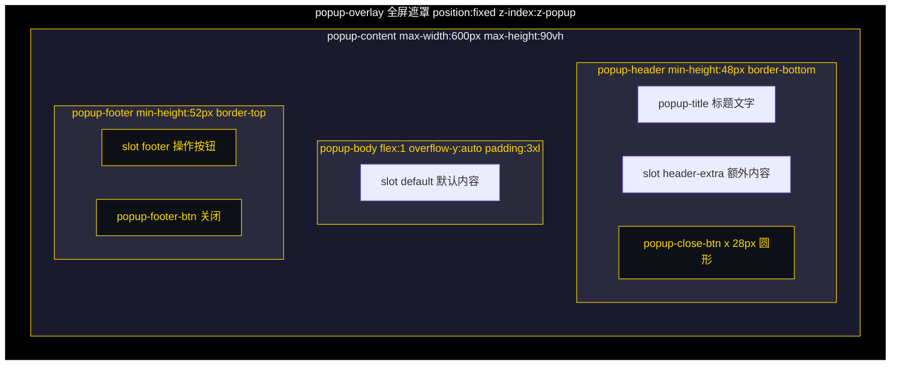

#### 1.1.4 通用样式（popup.less）

| 元素 | 样式 |
|------|------|
| .popup-overlay | position: fixed; top: 0; left: 0; width: 100%; height: 100%; background: @popup-overlay-bg; flex-center; z-index: @z-popup; padding: @spacing-4xl |
| .popup-content | background: @popup-bg; border-radius: @radius-xl; border: @border-card; max-width: 600px; width: 100%; max-height: 90vh; flex-col; position: relative |
| .popup-header | display: flex; align-items: center; padding: @spacing-xl @spacing-3xl; min-height: 48px; border-bottom: @border-sm; gap: @spacing-lg |
| .popup-title | font-size: @font-lg; color: @accent-color; font-weight: @font-weight-bold |
| .popup-close-btn | width: 28px; height: 28px; background: @white-10; border-radius: 50%; font-size: @font-xl; margin-left: auto |
| .popup-body | flex: 1; overflow-y: auto; padding: @spacing-3xl |
| .popup-footer | padding: @spacing-xl @spacing-3xl; border-top: @border-sm; flex-wrap: wrap; gap: @spacing-lg; min-height: 52px |
| .popup-footer-btn | padding: @spacing-lg @spacing-3xl; border: @border-card; border-radius: @radius-lg; font-size: @font-md; font-weight: @font-weight-bold; background: @white-10 |

#### 1.1.5 底部按钮变体

| 类名 | 背景色 | 文字色 |
|------|--------|--------|
| .popup-footer-btn（默认） | @white-10 | @text-primary |
| .popup-footer-btn.cancel | @white-10 | @text-primary |
| .popup-footer-btn.confirm | @accent-color | @color-text-dark |
| .popup-footer-btn.danger | @danger-color | @text-primary |
| .popup-footer-btn.warn | @warning-color | @text-primary |
| .popup-footer-btn.organize | @skill-blue | @text-primary |

#### 1.1.6 进出场动画

| 过渡 | 动画 |
|------|------|
| popup-enter-active | fadeIn（遮罩淡入） |
| popup-enter-active .popup-content | scaleIn 0.25s ease（内容缩放弹入） |
| popup-leave-active | fadeIn reverse（遮罩淡出） |

### 1.2 ConfirmPopup 确认弹窗

基于 BasePopup，`max-width="400px"`，`show-close=false`，`show-footer-close=false`。

#### 1.2.1 组件接口

| Prop | 类型 | 默认值 | 说明 |
|------|------|--------|------|
| visible | boolean | — | 是否显示 |
| title | string | '确认' | 标题 |
| message | string | — | 确认消息文本 |
| type | 'normal' \| 'danger' | 'normal' | 类型（danger 时确认按钮为红色） |
| action | string | 'unknown' | 操作标识，用于音效事件区分 |

| Emit | 说明 |
|------|------|
| confirm | 点击确认按钮 |
| cancel | 点击取消按钮或遮罩 |

#### 1.2.2 布局结构

```
BasePopup(max-width=400px, show-close=false, show-footer-close=false)
├── p.confirm-message  [mixin: popup-message-text()]
└── slot#footer
    ├── button.popup-footer-btn.cancel "取消"
    └── button.popup-footer-btn.confirm|danger "确认"
```

#### 1.2.3 界面布局草图

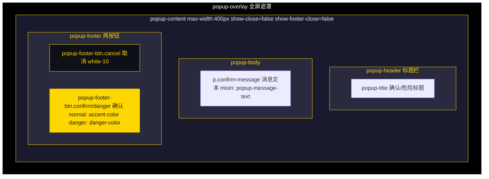

> danger 类型时确认按钮套用 `danger` 样式（红色）。

#### 1.2.4 事件总线

| 时机 | 事件 |
|------|------|
| onConfirm | UI_CLICK(source: 'confirm_ok') + CONFIRM_CONFIRMED(action) |
| onCancel | UI_CLICK(source: 'confirm_cancel') + CONFIRM_CANCELED(action) |

### 1.3 AlertPopup 提示弹窗

基于 BasePopup，`max-width="400px"`，`show-close=false`，`show-footer-close=false`。

#### 1.3.1 组件接口

| Prop | 类型 | 默认值 | 说明 |
|------|------|--------|------|
| visible | boolean | — | 是否显示 |
| title | string | '提示' | 标题 |
| message | string | — | 提示消息文本 |

| Emit | 说明 |
|------|------|
| close | 点击"确定"按钮 |

#### 1.3.2 布局结构

```
BasePopup(max-width=400px, show-close=false, show-footer-close=false)
├── p.alert-message  [mixin: popup-message-text()]
└── slot#footer
    └── button.popup-footer-btn.confirm "确定"
```

### 1.4 Toast 顶部浮动提示

单例模式（通过 useToast composable 模块级共享状态），非 BasePopup 容器。

#### 1.4.1 组件接口

| Prop | 类型 | 默认值 | 说明 |
|------|------|--------|------|
| visible | boolean | — | 是否显示 |
| message | string | — | 消息文本 |
| type | 'info' \| 'success' \| 'warning' \| 'danger' | 'info' | 类型 |
| icon | string | '' | 图标 emoji |

#### 1.4.2 布局与样式

| 属性 | 值 |
|------|-----|
| position | fixed |
| top | 120px |
| left | 50% |
| transform | translateX(-50%) |
| padding | @spacing-xl 24px |
| border-radius | @radius-lg |
| z-index | @z-toast |
| pointer-events | none |
| box-shadow | @shadow-card |

#### 1.4.3 界面布局草图

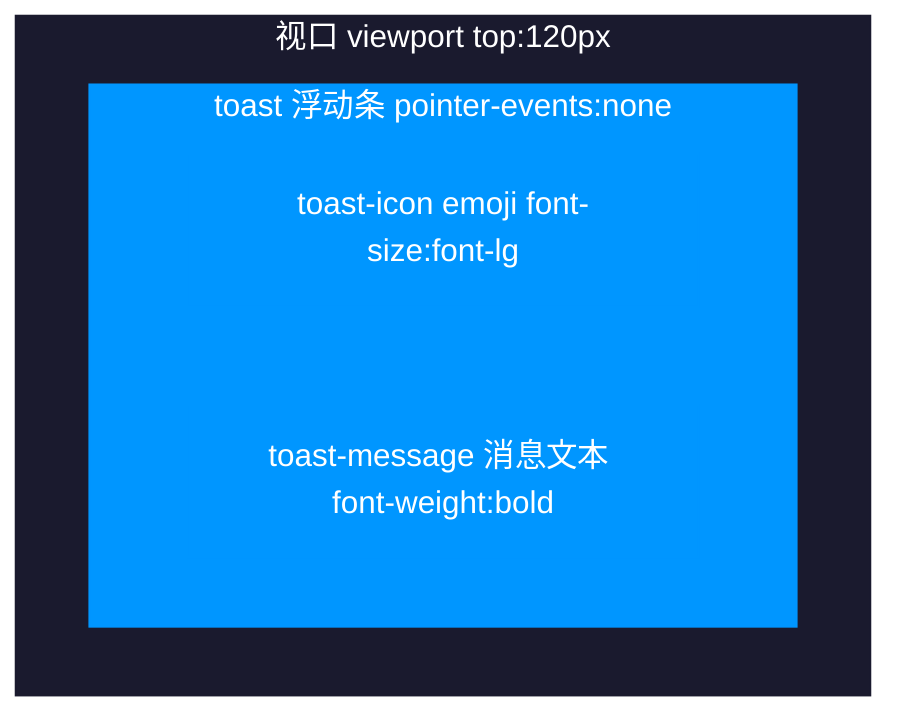

> 类型配色：`info` 蓝色 / `success` 绿色 / `warning` 橙色 / `danger` 红色（详见 1.4.4 类型背景色）。

#### 1.4.4 类型背景色

| 类型 | 背景色 |
|------|--------|
| info | rgba(0, 150, 255, 0.9) |
| success | rgba(76, 175, 80, 0.9) |
| warning | rgba(255, 152, 0, 0.9) |
| danger | rgba(255, 87, 34, 0.9) |

#### 1.4.5 动画

Transition name="toast"：toast-enter-active（toast-in 0.3s）、toast-leave-active（toast-out 0.3s）。

***

## 2. 商店弹窗

来源：`src/components/popup/ShopPopup.vue`

### 2.1 界面概述

商品交易界面，提供购买/出售双标签页，支持 8 种分类筛选、数量选择、金币闪烁动画。标题来自 Shop Store 的商店配置名称。

### 2.2 PC端设计

#### 2.2.1 布局结构

```
BasePopup(title=shopName || '商店')
├── slot#header-extra
│   └── gold-display (💰 金币数量, flash 动画)
└── slot#default → shop-content
    ├── shop-tabs
    │   ├── tab-btn "购买" [active: currentTab==='buy']
    │   └── tab-btn "出售" [active: currentTab==='sell']
    ├── category-tabs (8 个分类按钮)
    ├── item-list (max-height: 320px, overflow-y: auto)
    │   └── item-card x N  [购买: displayShopItems / 出售: displaySellItems]
    │       ├── ItemIcon(size=md, rarity)
    │       ├── card-info (name / desc / quantity|count)
    │       └── card-price (💰 价格)
    └── item-detail
        ├── detail-header (h3[rarity] + quality-badge)
        ├── detail-desc
        ├── detail-info (类型 / 单价|持有)
        ├── effect-info (效果文本)
        └── detail-actions
            ├── quantity-selector (- / input / +)
            └── action-btn buy|sell (💰 购买xN / 出售xN)
```

#### 2.2.2 界面布局草图

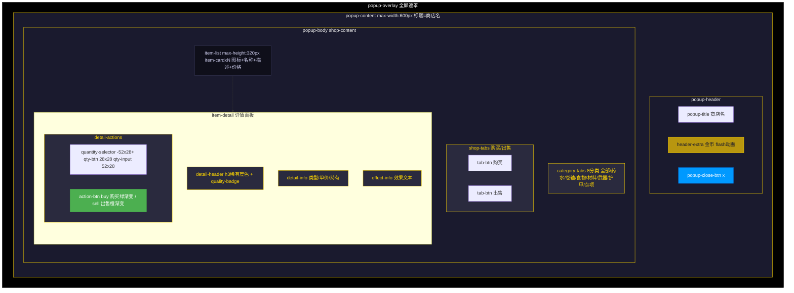

> 详情面板选中态：`item-card.selected` outline 2px @accent-color；按钮 buy 使用 `linear-gradient(135deg, @heal-hp, #45a049)`，sell 使用 `linear-gradient(135deg, #ff9800, #f57c00)`。

#### 2.2.3 分类选项

| 分类 ID | 名称 |
|---------|------|
| all | 全部 |
| potion | 药水 |
| scroll | 卷轴 |
| food | 食物 |
| material | 材料 |
| weapon | 武器 |
| armor | 护甲 |
| misc | 杂项 |

#### 2.2.4 元素尺寸

| 元素 | 尺寸 |
|------|------|
| item-list | max-height: 320px |
| qty-btn | 28px x 28px |
| qty-input | 52px x 28px |

#### 2.2.5 颜色样式

| 元素 | 样式 |
|------|------|
| tab-btn.active | background: @gold-bg-active; border-color: @accent-color; color: @accent-color |
| cat-btn.active | background: rgba(0, 153, 255, 0.2); border-color: @skill-blue; color: @skill-blue |
| item-card.selected | outline: 2px solid @accent-color; background: @gold-bg |
| action-btn.buy | linear-gradient(135deg, @heal-hp, #45a049) |
| action-btn.sell | linear-gradient(135deg, #ff9800, #f57c00) |
| gold-display.flash | animation: gold-flash 0.5s ease |

#### 2.2.6 稀有度颜色（h3 标题）

| 稀有度 | 颜色值 |
|--------|--------|
| common | @popup-text-color |
| uncommon | #1eff00 |
| rare | #0070dd |
| epic | #a335ee |
| legendary | #ff8000 |

### 2.3 移动端设计

弹窗容器自适应，item-list 与 item-detail 垂直排列，分类按钮 flex-wrap 换行。

### 2.4 交互说明

| 交互 | 触发方式 | 响应 |
|------|----------|------|
| 切换购买/出售 | 点击 tab-btn | 切换 currentTab，清除选中和数量 |
| 切换分类 | 点击 cat-btn | 筛选对应类别物品 |
| 选择商品 | 点击 item-card | 选中物品，底部详情区显示信息 |
| 调整数量 | 点击 -/＋ 或输入 qty-input | buyQuantity/sellQuantity 变更（受金币/库存/持有量限制） |
| 购买 | 点击 action-btn.buy | shopStore.buyItem，成功后金币闪烁动画 |
| 出售 | 点击 action-btn.sell | shopStore.sellItem，成功后金币闪烁动画 |

***

## 3. 任务看板弹窗

来源：`src/components/popup/QuestBoardPopup.vue`

### 3.1 界面概述

区域任务板，提供"可接取任务"和"可交付任务"双标签页，使用 DynamicScroller 虚拟滚动渲染任务卡片。

### 3.2 PC端设计

#### 3.2.1 布局结构

```
BasePopup(title='任务看板')
└── slot#default
    ├── quest-tabs
    │   ├── tab-btn "可接取任务" [active: currentTab==='available']
    │   └── tab-btn "可交付任务" [active: currentTab==='turnin']
    └── quest-list
        └── DynamicScroller (min-item-size: 120|100, max-height: 400px)
            └── quest-card.available|.turnin
                ├── quest-icon (BaseIcon 34px, gradient=gold)
                └── quest-content
                    ├── quest-header-row (h3 + quest-level|quest-status)
                    ├── quest-desc
                    ├── quest-objectives [仅 available]
                    │   └── objective (objective-text + objective-target)
                    ├── quest-rewards (💰金币 + ⭐经验 + 📦物品数)
                    └── accept-btn|claim-btn
```

#### 3.2.2 界面布局草图

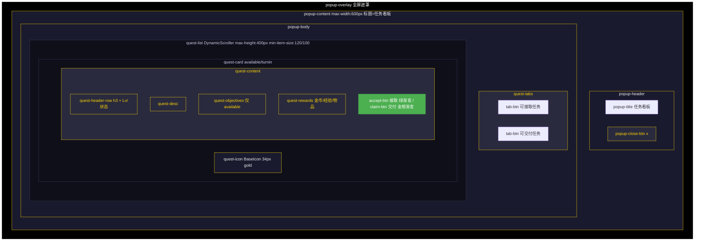

> `available` 卡片边框 `@skill-blue`，`turnin` 卡片边框 `@heal-hp`；`accept-btn` 绿色渐变，`claim-btn` 金橙渐变。

#### 3.2.3 任务卡片样式

| 卡片类型 | 边框色 | 按钮样式 |
|----------|--------|----------|
| quest-card.available | @skill-blue | accept-btn: linear-gradient(135deg, @heal-hp, #45a049) |
| quest-card.turnin | @heal-hp | claim-btn: linear-gradient(135deg, @accent-color, #ff8c00); color: @color-text-dark |

#### 3.2.4 任务图标映射

| 任务类型 | 图标名 |
|----------|--------|
| kill | crossed-swords |
| collect | chest |
| 默认 | notebook |

### 3.3 移动端设计

弹窗容器自适应，quest-scroller 内部虚拟滚动适配。

### 3.4 交互说明

| 交互 | 触发方式 | 响应 |
|------|----------|------|
| 切换标签 | 点击 tab-btn | 切换 available/turnin 列表 |
| 接取任务 | 点击 accept-btn | questStore.acceptQuestFromBoard，成功/失败显示 Toast |
| 交付任务 | 点击 claim-btn | questStore.turnInQuestToBoard，成功/失败显示 Toast |

***

## 4. 角色信息弹窗

来源：`src/components/popup/CharacterInfoPopup.vue`

### 4.1 界面概述

角色完整属性面板，展示角色基本信息、3 个 Tag 标签（阵营/种族/职业）、HP/MP/EXP 资源条、6 项核心属性、6 项次级属性、6 个装备槽位及装备详情。

### 4.2 PC端设计

#### 4.2.1 布局结构

```
BasePopup(title='角色信息')
└── slot#default → character-content
    ├── character-overview
    │   ├── character-basic
    │   │   ├── char-row (char-avatar 52x52 + char-name + char-level)
    │   │   └── char-details (Tagx3: faction / race / class)
    │   └── resource-bars (ResourceBarx3: HP / MP / EXP)
    ├── attributes-section (核心属性)
    │   └── core-attributes (grid 2列, 6 项)
    ├── secondary-section (次级属性)
    │   ├── secondary-grid (grid 2列, 6 项 + border-left 颜色)
    │   └── resource-stats (最大HP / 最大MP)
    └── equipment-section (装备)
        ├── equipment-grid (grid 3列, 6 槽位)
        │   ├── weaponSlots: weapon1(主手) / weapon2(副手)
        │   └── armorSlots: armor1 / armor2 / armor3 / armor4
        └── equipment-detail (选中装备详情或 EmptyState)
```

#### 4.2.2 界面布局草图

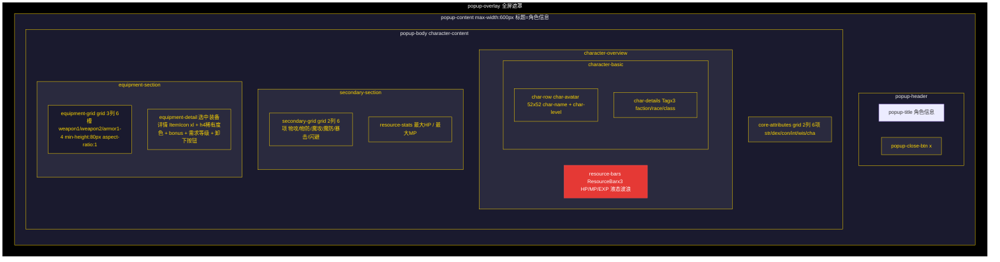

> 装备槽位 grid 3列：weapon1(主手) / weapon2(副手) / armor1-4；选中态 `equip-slot.selected` @gold-bg-strong；稀有度边框色：uncommon #1eff00 / rare #0070dd / epic #a335ee / legendary #ff8000。

#### 4.2.3 核心属性图标映射

| 属性键 | 名称 | 图标名 | 渐变 |
|--------|------|--------|------|
| str | 力量 | sword-clash | physical |
| dex | 敏捷 | dodge | dodge |
| con | 体质 | health-normal | blood |
| int | 智力 | brain | magic |
| wis | 感知 | eye-target | nature |
| cha | 魅力 | charm | gold |

#### 4.2.4 次级属性 border-left 颜色

| 属性 | 图标 | border-left 颜色 |
|------|------|------------------|
| 物理攻击 | sword-clash (physical) | @damage-physical |
| 物理防御 | shield (earth) | #4ecdc4 |
| 魔法攻击 | magic-swirl (magic) | #a29bfe |
| 魔法防御 | magic-shield (magic) | #fd79a8 |
| 暴击率 | explosion-rays (crit) | #fdcb6e |
| 闪避率 | dodge (dodge) | #74b9ff |

#### 4.2.5 装备槽样式

| 类名 | 样式 |
|------|------|
| .equip-slot | min-height: 80px; aspect-ratio: 1; grid 3列 |
| .equip-slot.equipped | background: rgba(255, 255, 255, 0.08) |
| .equip-slot.selected | background: @gold-bg-strong |
| .equip-slot.equip-anim-fill | animation: equip-slot-fill 0.6s ease |
| .equip-slot.equip-anim-empty | animation: equip-slot-empty 0.6s ease |

#### 4.2.6 装备详情

选中装备槽显示：ItemIcon(xl) + h4[rarity] + detail-rarity + 描述 + detail-stats(bonus 属性列表) + detail-requirement(需要等级) + "卸下"按钮（linear-gradient(135deg, #ff9800, #f57c00)）。

未选中时显示 EmptyState（icon='shield', text='点击装备槽位查看详情'）；空槽位显示 EmptyState（icon='empty-box', gradient='metal', text='槽位为空'）。

### 4.3 移动端设计

弹窗容器自适应，核心属性和次级属性保持 2 列网格，装备槽保持 3 列网格。

### 4.4 交互说明

| 交互 | 触发方式 | 响应 |
|------|----------|------|
| 选择装备槽 | 点击 equip-slot | 选中槽位，底部显示装备详情 |
| 卸下装备 | 点击"卸下"按钮 | equipmentStore.unequipItem，播放 equip-anim-empty 动画 |

***

## 5. 背包弹窗

来源：`src/components/popup/InventoryPopup.vue`

### 5.1 界面概述

背包物品管理界面，使用 RecycleScroller 虚拟网格渲染物品格子（maxSlots=50），支持 8 种分类筛选、整理背包、使用消耗品、装备武器/护甲、丢弃物品。

### 5.2 PC端设计

#### 5.2.1 布局结构

```
BasePopup(title='背包')
├── slot#header-extra
│   └── header-info (gold-display + inventory-count "X / 50")
├── slot#default → inventory-content
│   ├── category-tabs (8 个分类按钮)
│   ├── inventory-grid (RecycleScroller, useResponsiveGrid: 48px / gap 6)
│   │   └── item-slot x N
│   │       ├── ItemIcon(size=sm, rarity)
│   │       └── item-count [v-if count > 1]
│   └── item-detail
│       ├── detail-header (h3[rarity] + quality-badge)
│       ├── detail-desc
│       ├── detail-info (类型 / 数量 / 等级)
│       ├── bonus-info (bonus 属性列表)
│       ├── effect-info (EffectTag + effect-value)
│       └── detail-actions (use / equip / drop)
└── slot#footer
    └── button.popup-footer-btn.organize "整理背包"

ConfirmPopup(title='丢弃物品', type='danger')  [丢弃确认]
BasePopup(title='选择装备位置', max-width=360px)  [装备槽位选择]
└── slot#default → slot-select-content
    ├── slot-select-hint
    └── slot-options (slot-option-btn x N)
```

#### 5.2.2 界面布局草图

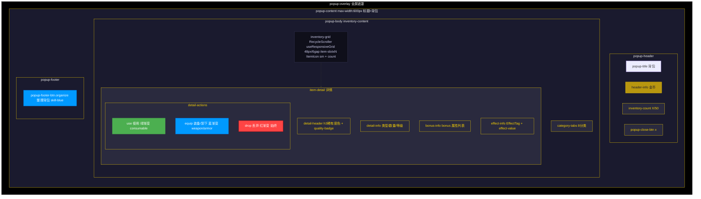

> 物品槽状态：`.equipped` outline 2px @heal-hp / `.selected` @gold-bg-strong / `.empty` 虚线边框 opacity:0.3。

**装备槽位选择子弹窗**（多槽位装备时弹出）：

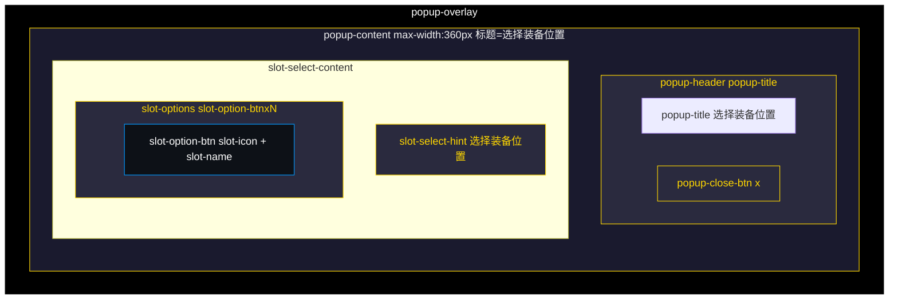

> 槽位名称：weapon1(主手) / weapon2(副手) / armor1-4(护甲槽1-4)。

#### 5.2.3 物品槽样式

| 类名 | 样式 |
|------|------|
| .item-slot | width/height: 100%; background: @white-05; animation: scaleIn 0.25s |
| .item-slot.empty | border: @border-dashed; opacity: 0.3 |
| .item-slot.equipped | outline: 2px solid @heal-hp; background: rgba(76, 175, 80, 0.2) |
| .item-slot.selected | background: @gold-bg-strong |
| .item-count | position: absolute; bottom: 2px; right: 3px; font-size: @font-2xs |

#### 5.2.4 操作按钮样式

| 按钮 | 条件 | 背景色 |
|------|------|--------|
| 使用 | info.consumable | linear-gradient(135deg, @heal-hp, #45a049) |
| 装备/卸下 | isEquipment(type) | linear-gradient(135deg, @skill-blue, #0066cc) |
| 丢弃 | 始终显示 | linear-gradient(135deg, #ff4444, #cc0000) |

#### 5.2.5 装备槽位名称

| 槽位键 | 名称 | 选择弹窗图标 |
|--------|------|-------------|
| weapon1 | 主手武器 | broadsword |
| weapon2 | 副手武器 | broadsword |
| armor1 | 护甲槽1 | checked-shield |
| armor2 | 护甲槽2 | checked-shield |
| armor3 | 护甲槽3 | checked-shield |
| armor4 | 护甲槽4 | checked-shield |

### 5.3 移动端设计

useResponsiveGrid 根据容器宽度自动计算列数：cols = Math.max(1, Math.floor((width + gap) / (minItemSize + gap)))，移动端列数减少。

### 5.4 交互说明

| 交互 | 触发方式 | 响应 |
|------|----------|------|
| 切换分类 | 点击 tab-btn | 筛选对应类别物品 |
| 选择物品 | 点击 item-slot | 选中物品，底部显示详情 |
| 整理背包 | 点击"整理背包" | organizeInventory + Toast 提示 |
| 使用物品 | 点击"使用" | useItemByIndex，播放 item-bounce 动画，Toast 显示效果 |
| 装备物品 | 点击"装备" | 单槽位直接装备；多槽位弹出选择弹窗 |
| 选择槽位 | 点击 slot-option-btn | equipmentStore.equipItem，播放 equip-anim-fill 动画 |
| 丢弃物品 | 点击"丢弃" | 弹出 ConfirmPopup 确认后 removeItemByIndex |

***

## 6. 技能弹窗

来源：`src/components/popup/SkillsPopup.vue`

### 6.1 界面概述

技能面板，展示 4 格战斗技能栏和已学习技能网格，支持将技能记忆/遗忘到战斗技能槽位。

### 6.2 PC端设计

#### 6.2.1 布局结构

```
BasePopup(title='技能面板')
└── slot#default → skills-content
    ├── skill-bar-section (已记忆技能)
    │   └── skill-bar (grid 4列)
    │       └── bar-slot x 4
    │           ├── BaseIcon(gradient=classId, size=24) + bar-name  [有技能]
    │           └── bar-empty "+"  [空槽位]
    ├── skills-grid-section (已学习技能)
    │   └── skills-grid (RecycleScroller, useResponsiveGrid: 48px / gap 6)
    │       └── skill-slot x N
    │           ├── BaseIcon(gradient=classId, size=24)
    │           ├── lock-badge (padlock)  [未解锁]
    │           └── equipped-badge (check-mark, heal)  [已装备]
    └── skill-detail
        ├── detail-top
        │   ├── detail-header (BaseIcon 36px + h3 + SkillTags)
        │   └── detail-actions (遗忘|记忆 按钮)
        ├── detail-desc
        └── detail-bottom
            ├── detail-effect (效果标签 + 效果值)
            └── detail-level-req (解锁等级 / 需要等级)
```

#### 6.2.2 界面布局草图

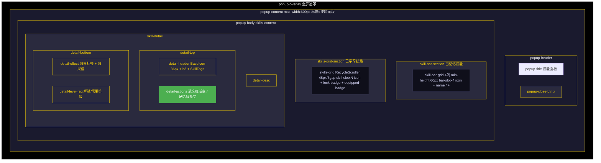

> 技能栏 `bar-slot.empty` 虚线边框；`bar-slot.selected` 金色边框 + box-shadow；网格 `skill-slot.locked` opacity:0.5；`skill-slot.equipped` 绿色边框。

#### 6.2.3 技能栏槽样式

| 类名 | 样式 |
|------|------|
| .bar-slot | min-height: 60px; animation: scaleIn 0.3s |
| .bar-slot.selected | border-color: @accent-color; background: @gold-bg-hover; box-shadow: 0 0 10px @gold-border |
| .bar-slot.empty | border-style: dashed; border-color: @color-dark-line |

#### 6.2.4 技能网格槽样式

| 类名 | 样式 |
|------|------|
| .skill-slot.equipped | border-color: @heal-hp; background: @green-bg-hover |
| .skill-slot.locked | opacity: @opacity-faded; cursor: not-allowed |
| .skill-slot.selected | background: @gold-bg-active |

#### 6.2.5 操作按钮样式

| 按钮 | 条件 | 背景色 |
|------|------|--------|
| 记忆 | canUnlock && !equipped | linear-gradient(135deg, @heal-hp, #45a049) |
| 遗忘 | isEquipped | linear-gradient(135deg, @damage-physical, #ee5a24) |

#### 6.2.6 等级要求样式

| 状态 | 图标 | 文字色 | 背景 |
|------|------|--------|------|
| 已解锁 | check-mark (heal) | @heal-hp | @green-bg + border rgba(76,175,80,0.2) |
| 未解锁 | padlock | @damage-physical | rgba(255,107,107,0.15) + border rgba(255,107,107,0.3) |

#### 6.2.7 效果值颜色

| 技能类型 | 颜色 |
|----------|------|
| physical_damage | @damage-physical |
| magic_damage | @damage-magic |
| heal | @heal-hp |

### 6.3 移动端设计

| 元素 | PC | 移动端 (max-width: 600px) |
|------|-----|--------------------------|
| bar-slot min-height | 60px | 50px |
| skills-scroller max-height | 180px | 130px |
| bar-slot padding | @spacing-lg @spacing-sm | @spacing-md @spacing-xs |

### 6.4 交互说明

| 交互 | 触发方式 | 响应 |
|------|----------|------|
| 选择技能栏槽 | 点击 bar-slot | 选中槽位，显示该槽技能详情 |
| 选择技能 | 点击 skill-slot | 选中技能，显示详情 |
| 记忆技能 | 点击"记忆" | equipSkill 到选中槽位或空槽位（无空位时替换槽位0） |
| 遗忘技能 | 点击"遗忘" | unequipSkill 从技能栏移除 |

***

## 7. 任务日志弹窗

来源：`src/components/popup/QuestPopup.vue`

### 7.1 界面概述

展示玩家当前进行中的任务列表（含进行中和可交付），支持查看目标进度和放弃任务。

### 7.2 PC端设计

#### 7.2.1 布局结构

```
BasePopup(title='任务日志')
└── slot#default
    ├── quest-list
    │   └── quest-card x N
    │       ├── BaseIcon(34px, gradient)
    │       └── quest-content
    │           ├── quest-header-row (h3 + quest-status)
    │           ├── quest-desc
    │           ├── objectives
    │           │   └── objective (checkbox + text + progress) [.completed]
    │           ├── quest-rewards (💰 + ⭐)
    │           └── quest-actions [v-if status !== 'completed']
    │               └── abandon-btn "放弃"
    └── EmptyState(icon='notebook', text='暂无进行中的任务')  [v-if 无任务]

ConfirmPopup(title='确认放弃', type='danger')  [放弃确认]
```

#### 7.2.2 界面布局草图

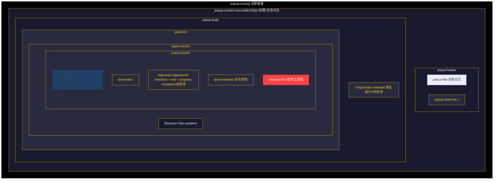

> 任务状态色：`in_progress` 蓝（@skill-blue）/ `completed` 绿（@heal-hp）；目标完成态 `.objective.completed` 绿背景。

**放弃任务确认子弹窗**（点击放弃后弹出 ConfirmPopup danger 类型，详见 1.2.3）。

#### 7.2.3 任务状态样式

| 状态 | 文本 | 背景 | 文字色 |
|------|------|------|--------|
| in_progress | 进行中 | rgba(0, 153, 255, 0.2) | @skill-blue |
| completed | 可交付 | rgba(76, 175, 80, 0.2) | @heal-hp |

#### 7.2.4 目标样式

| 类名 | 样式 |
|------|------|
| .objective.completed | background: rgba(76, 175, 80, 0.2) |
| .objective-checkbox (完成) | check-mark 图标 (heal) |
| .objective-checkbox (未完成) | empty-box 图标 |

#### 7.2.5 任务图标映射

| 任务类型 | 图标名 | 渐变 |
|----------|--------|------|
| kill | sword-clash | physical |
| collect | treasure-map | gold |
| 默认 | scroll-unfurled | gold |

#### 7.2.6 放弃按钮

abandon-btn：linear-gradient(135deg, @danger-color, #cc0000)。

### 7.3 移动端设计

弹窗容器自适应，任务卡片垂直排列。

### 7.4 交互说明

| 交互 | 触发方式 | 响应 |
|------|----------|------|
| 放弃任务 | 点击"放弃" | 弹出 ConfirmPopup 确认后 questStore.abandonQuest，Toast 提示 |

***

## 8. 冒险日志弹窗

来源：`src/components/popup/AdventureLogPopup.vue`

### 8.1 界面概述

展示当前区域冒险记录列表，支持按类型着色和清空日志。

### 8.2 PC端设计

#### 8.2.1 布局结构

```
BasePopup(title='冒险日志')
├── slot#default
│   ├── log-header [v-if currentArea]  ("{currentArea} - 冒险记录")
│   └── log-container (overflow-y: auto, custom-scrollbar)
│       └── log-entry x N  [class: log-type-{type}]
│           ├── log-time (monospace, format: MM-DD HH:mm:ss)
│           ├── log-icon (BaseIcon 16px)
│           └── log-message
│       └── EmptyState(icon='scroll-unfurled', text='暂无冒险记录')  [v-if 无日志]
└── slot#footer
    └── button.popup-footer-btn.danger "清空日志"

ConfirmPopup(title='清空日志', type='danger')  [清空确认]
```

#### 8.2.2 界面布局草图

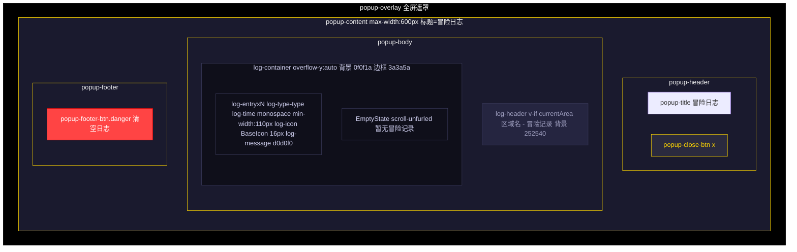

> 11 种日志类型对应不同背景色与图标（详见 8.2.3 日志类型颜色与图标）：info/combat/quest/item/level/death/resurrect/shop/skill/exploration/zone。

#### 8.2.3 日志类型颜色与图标

| 类型 | 图标名 | 渐变 | 背景色 |
|------|--------|------|--------|
| info | scroll-unfurled | earth | rgba(100, 100, 150, 0.1) |
| combat | crossed-swords | physical | rgba(200, 80, 80, 0.1) |
| quest | notebook | gold | rgba(80, 150, 200, 0.1) |
| item | chest | gold | rgba(150, 80, 200, 0.1) |
| level | level-up | gold | rgba(200, 180, 80, 0.1) |
| death | death-skull | debuff | rgba(180, 40, 40, 0.15) |
| resurrect | resurrection | gold | rgba(80, 200, 180, 0.1) |
| shop | shop | gold | rgba(200, 150, 80, 0.1) |
| skill | resurrection | gold | rgba(80, 200, 80, 0.1) |
| exploration | treasure-map | nature | rgba(80, 120, 200, 0.1) |
| zone | uncertainty | shadow | rgba(150, 100, 200, 0.1) |

#### 8.2.4 容器样式

| 元素 | 样式 |
|------|------|
| .log-header | color: #a0a0c0; background: #252540; border-radius: @radius-sm |
| .log-container | background: #0f0f1a; border: 1px solid #3a3a5a; border-radius: @radius-md |
| .log-time | color: #8a8aaa; font-family: monospace; min-width: 110px |
| .log-message | color: #d0d0f0 |

### 8.3 移动端设计

| 元素 | PC | 移动端 (max-width: 640px) |
|------|-----|--------------------------|
| log-entry font-size | @font-base | 12px |
| log-time min-width | 110px | 95px |
| log-time font-size | @font-sm | 11px |

### 8.4 交互说明

| 交互 | 触发方式 | 响应 |
|------|----------|------|
| 清空日志 | 点击"清空日志" | 弹出 ConfirmPopup 确认后 logStore.clearLogs |
| 关闭弹窗 | 点击关闭 | emit close |

***

## 9. 战斗弹窗

来源：`src/components/popup/CombatPopup.vue`

### 9.1 界面概述

回合制战斗全屏覆盖层，**不使用 BasePopup 容器**，采用独立的 combat-overlay 全屏遮罩。包含敌人 3x2 网格、玩家区域、战斗日志、行动按钮、战斗结果弹窗、物品选择弹窗，以及 Boss 出场演出、阶段转换、粒子特效等动画系统。

### 9.2 PC端设计

#### 9.2.1 布局结构

```
combat-overlay (全屏)
└── combat-container (width: 95%, max-width: 700px, max-height: 95vh)
    ├── screen-flash [v-show] (暴击闪白遮罩)
    ├── boss-intro-overlay [v-if showBossIntro] (Boss 出场演出)
    │   └── boss-intro-content (icon + name + lines)
    ├── phase-transition [v-if showPhaseTransition] (Boss 阶段转换)
    │   ├── phase-transition-backdrop
    │   └── phase-transition-content (label + text)
    ├── combat-header
    │   ├── combat-title ("首领战斗！" | "遭遇战斗！")
    │   ├── speed-toggle (1x | 2x)
    │   └── combat-turn ("第 N 回合")
    ├── combat-arena
    │   ├── enemy-grid (flex 1.5)
    │   │   └── enemy-row x 2 (back / front)
    │   │       └── enemy-slot x 3 (min-height: 100px)
    │   │           └── combatant.enemy-side [shake|crit-shake|dodge-blink|defeated|targeted]
    │   │               ├── combatant-avatar (BaseIcon 28px)
    │   │               ├── combatant-info (name + level + boss-badge)
    │   │               ├── combatant-bars (ResourceBar HP)
    │   │               ├── effects-indicator (effect-badge x N)
    │   │               └── floating-damage [v-show]
    │   ├── vs-divider [flash] (crossed-swords 20px)
    │   └── combatant.player-side [shake|crit-shake|dodge-blink]
    │       ├── combatant-avatar (BaseIcon 28px)
    │       ├── combatant-info (name + level)
    │       ├── combatant-bars
    │       │   ├── ResourceBar HP
    │       │   ├── ResourceBar MP
    │       │   ├── ClassResourceBar x N (职业专属资源)
    │       │   └── effects-indicator (effect-badge x N)
    │       └── floating-damage [v-show]
    ├── combat-log (log-entry x N)
    │   └── log-entry [log-{actorType}] (turn + msg + damage|heal + crit|dodge)
    └── combat-actions
        ├── primary-actions
        │   ├── attack-btn "普通攻击" (sword-clash)
        │   ├── item-btn "物品" (potion-ball)
        │   ├── skip-btn "跳过" (next-button)
        │   └── flee-btn "逃跑" (run) [disabled: hasBossEnemy]
        ├── skill-actions [v-if equippedSkills.length > 0]
        │   └── skill-btn x N (icon + name + effect + cost + target + cooldown)
        └── enemy-turn-overlay [v-if !isPlayerTurn && isFighting]

result-overlay [v-if combatResult] → result-popup
item-modal-overlay [v-if showItemModal] → item-modal
```

#### 9.2.2 界面布局草图

**主战斗界面**（独立 combat-overlay，非 BasePopup）：

```mermaid
flowchart TB
    subgraph overlay["combat-overlay 全屏 position:fixed width:100vw height:100vh background:rgba(0,0,0,0.92)"]
        subgraph container["combat-container width:95% max-width:700px max-height:95vh"]
            direction TB
            screenFlash["screen-flash v-show 暴击闪白遮罩 z-index:50"]
            bossIntro["boss-intro-overlay v-if showBossIntro boss-intro-icon + name + lines"]
            phaseTrans["phase-transition v-if showPhaseTransition backdrop + label + text"]
            subgraph header["combat-header"]
                direction LR
                combatTitle["combat-title 首领战斗/遭遇战斗"]
                speedToggle["speed-toggle 1x/2x 金色"]
                combatTurn["combat-turn 第N回合"]
            end
            subgraph arena["combat-arena"]
                direction LR
                subgraph enemyGrid["enemy-grid flex:1.5"]
                    direction TB
                    backRow["enemy-row back 3列 grid"]
                    frontRow["enemy-row front 3列 grid"]
                    enemySlot["enemy-slotx3 min-height:100px combatant.enemy-side avatar + name + level + boss-badge + ResourceBar HP + effects-indicator + floating-damage"]
                end
                vsDivider["vs-divider crossed-swords 20px flash"]
                subgraph playerSide["combatant.player-side"]
                    direction TB
                    playerAvatar["combatant-avatar BaseIcon 28px"]
                    playerInfo["combatant-info name + level"]
                    playerBars["combatant-bars ResourceBar HP 红 + ResourceBar MP 蓝 + ClassResourceBarxN 职业 + effects-indicator"]
                    playerFloat["floating-damage v-show"]
                end
            end
            combatLog["combat-log max-height:160px log-entryxN log-actorType turn + msg + damage/heal + crit/dodge"]
            subgraph actions["combat-actions"]
                direction TB
                subgraph primaryAct["primary-actions grid 4列"]
                    direction LR
                    atkBtn["attack-btn 普通攻击 物理渐变"]
                    itemBtn["item-btn 物品 治疗渐变"]
                    skipBtn["skip-btn 跳过 金属渐变"]
                    fleeBtn["flee-btn 逃跑 闪避渐变"]
                end
                subgraph skillAct["skill-actions v-if equippedSkills.length>0 grid 4列"]
                    direction LR
                    skillBtn["skill-btnxN icon + name + effect + cost + target + cooldown"]
                end
                enemyTurn["enemy-turn-overlay v-if 非玩家回合 敌人行动中"]
            end
        end
    end

    classDef overlayCls fill:#000000,stroke:#000,color:#fff
    classDef containerCls fill:#1a1a2e,stroke:#ffd700,color:#f0f0f0
    classDef regionCls fill:#2a2a3e,stroke:#ffd700,color:#ffd700
    classDef enemyCls fill:#3a1a1a,stroke:#e94560,color:#fff
    classDef playerCls fill:#1a3a1a,stroke:#4caf50,color:#fff
    classDef atkCls fill:#e94560,stroke:#e94560,color:#fff
    classDef itemCls fill:#4caf50,stroke:#4caf50,color:#fff
    classDef skipCls fill:#888,stroke:#bbb,color:#fff
    classDef fleeCls fill:#888,stroke:#888,color:#fff
    classDef skillCls fill:#8b5cf6,stroke:#a78bfa,color:#fff
    classDef vsCls fill:#ffd700,stroke:#b8960f,color:#1a1a2e
    classDef flashCls fill:#fff,stroke:#fff,color:#000

    class overlay overlayCls
    class container,header,arena,actions containerCls
    class screenFlash flashCls
    class bossIntro,phaseTrans overlayCls
    class enemyGrid,backRow,frontRow,enemySlot enemyCls
    class playerSide,playerAvatar,playerInfo,playerFloat playerCls
    class playerBars playerCls
    class vsDivider vsCls
    class primaryAct regionCls
    class atkBtn atkCls
    class itemBtn itemCls
    class skipBtn skipCls
    class fleeBtn fleeCls
    class skillBtn skillCls
    class combatLog containerCls
    class enemyTurn overlayCls
    class speedToggle,combatTurn regionCls
    class combatTitle enemyCls
```

**战斗结果弹窗**（v-if combatResult，叠加在主界面上）：

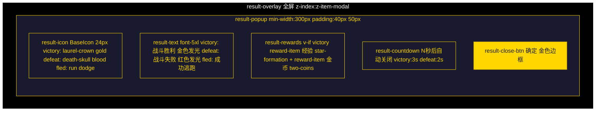

**物品选择子弹窗**（v-if showItemModal，叠加在主界面上）：

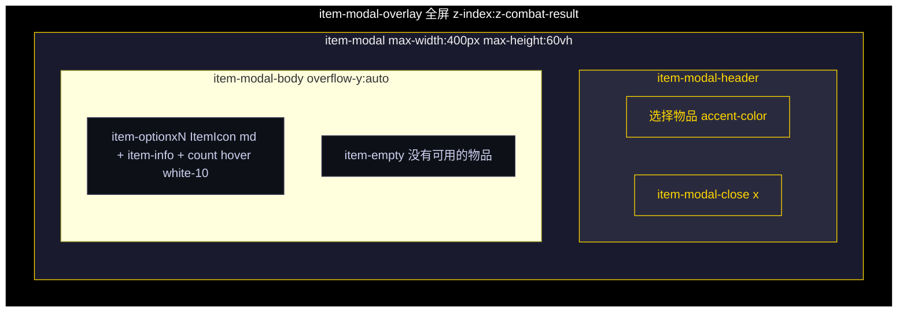

> 主战斗布局要点：敌人 3x2 网格（back/front x 3列）；玩家区 HP 红/MP 蓝/ClassResourceBar 职业专属；4 个主行动按钮 + 至多 4 个技能按钮；战斗日志倒序显示（最新在最上）。

#### 9.2.3 容器样式

| 元素 | 样式 |
|------|------|
| .combat-container | width: 95%; max-width: 700px; max-height: 95vh; background: @gradient-panel; border-radius: 16px |
| .result-popup | min-width: 300px; padding: 40px 50px |
| .item-modal | max-width: 400px; max-height: 60vh |

#### 9.2.4 战斗结果

| 结果 | result-text | result-icon 渐变 | 自动关闭 | 倒计时 |
|------|-------------|------------------|----------|--------|
| victory | 胜利 | gold | 3 秒 | 显示 |
| defeat | 失败 | blood | 2 秒 | 显示 |

victory 时显示奖励：经验（star-formation）+ 金币（two-coins）。

#### 9.2.5 行动按钮

| 按钮 | 图标 | 渐变 | 禁用条件 |
|------|------|------|----------|
| 普通攻击 | sword-clash | physical | !canAct |
| 物品 | potion-ball | heal | !canAct \|\| !hasConsumables |
| 跳过 | next-button | metal | !canAct |
| 逃跑 | run | dodge | !canAct \|\| hasBossEnemy |
| 技能 | skill.icon | — | !canAct \|\| MP不足 \|\| 冷却中 |

技能按钮额外显示：no-mp 类（MP不足）、on-cooldown 类（冷却中）、冷却剩余回合数。

#### 9.2.6 动画系统

来源：`src/modules/animation`（anime.js）

| 动画函数 | 用途 |
|----------|------|
| animateShake | 敌人/玩家受击震动 |
| animateCritShake | 暴击震动 |
| animateDodgeBlink | 闪避闪烁 |
| animateFloating | 浮动伤害数字 |
| animateScreenFlash | 屏幕闪白 |
| animateVsFlash | VS 分隔符闪光 |
| animateBossIntro | Boss 出场演出 |
| animatePhaseTransition | Boss 阶段转换 |
| animateResultPopup | 结果弹窗弹入 |
| animateMagicPulse | 魔法脉冲 |
| animateHealGlow | 治疗发光 |
| animateManaGlow | 法力发光 |
| animateCritBorderFlash | 暴击边框闪光 |
| createParticleBurst | 粒子爆发 |

#### 9.2.7 粒子配置

| 配置 | 用途 |
|------|------|
| PHYSICAL_PARTICLES | 物理伤害粒子 |
| MAGIC_PARTICLES | 魔法伤害粒子 |
| HEAL_PARTICLES | 治疗粒子 |
| MANA_PARTICLES | 法力粒子 |
| CRIT_PARTICLES | 暴击粒子 |

#### 9.2.8 事件监听

| 事件 | 响应 |
|------|------|
| COMBAT_CRITICAL_HIT | 暴击动画 |
| COMBAT_DEAL_DAMAGE | 伤害浮动数字 |
| COMBAT_DODGE | 闪避动画 |
| COMBAT_BOSS_INTRO | Boss 出场演出 |
| COMBAT_BOSS_PHASE | 阶段转换特效 |

### 9.3 移动端设计

| 元素 | PC | 移动端 (max-width: 600px) |
|------|-----|--------------------------|
| combat-arena | row 布局 | column 布局 |
| vs-divider | 显示 | 隐藏 |
| enemy-slot min-height | 100px | 80px |

### 9.4 交互说明

| 交互 | 触发方式 | 响应 |
|------|----------|------|
| 选择目标 | 点击 enemy-side | 设置 targetEnemyId |
| 普通攻击 | 点击 attack-btn | doAction('attack') |
| 使用物品 | 点击 item-btn | 打开 item-modal 选择物品 |
| 跳过回合 | 点击 skip-btn | doSkip |
| 逃跑 | 点击 flee-btn | doAction('flee') |
| 释放技能 | 点击 skill-btn | doSkill(skillId) |
| 切换速度 | 点击 speed-toggle | 1x ↔ 2x |
| 关闭结果 | 点击"确定"或自动关闭 | emit close(result) |

***

## 10. 系统弹窗

来源：`src/components/popup/SystemPopup.vue`

### 10.1 界面概述

系统菜单弹窗，提供音量设置入口和退出游戏功能。

### 10.2 PC端设计

#### 10.2.1 布局结构

```
BasePopup(title='系统', max-width=340px, show-footer-close=false)
├── slot#default → system-body
│   ├── button.system-btn.audio-btn "音量设置" (sound-on, gold)
│   └── button.system-btn.exit-btn "退出游戏" (exit-door, blood)
└── slot#footer
    └── button.popup-footer-btn "关闭"
```

#### 10.2.2 界面布局草图

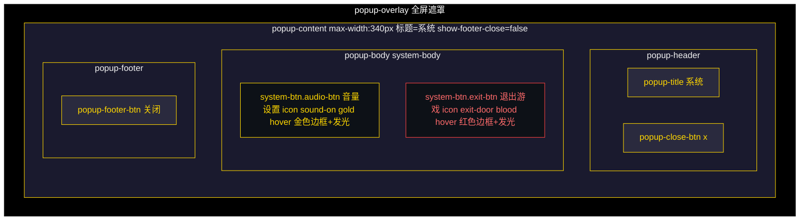

> system-btn 通用样式：padding:4xl 24px font-size:lg border-radius:10px hover translateY(-2px)。

#### 10.2.3 按钮样式

| 按钮 | 图标 | 渐变 | hover 样式 |
|------|------|------|-----------|
| 音量设置 | sound-on | gold | border-color: @accent-color; background: rgba(255,215,0,0.08); color: @accent-color; box-shadow: @gold-bg |
| 退出游戏 | exit-door | blood | border-color: @danger-color; background: rgba(255,68,68,0.1); color: #ff6b6b; box-shadow: rgba(255,68,68,0.1) |

system-btn 通用样式：padding: @spacing-4xl 24px; font-size: @font-lg; border-radius: 10px; hover 时 translateY(-2px)。

### 10.3 移动端设计

弹窗容器自适应，按钮垂直排列。

### 10.4 交互说明

| 交互 | 触发方式 | 响应 |
|------|----------|------|
| 打开音量设置 | 点击 audio-btn | emit close + emit open-audio |
| 退出游戏 | 点击 exit-btn | emit exit |
| 关闭 | 点击"关闭" | emit close |

***

## 11. 音量设置弹窗

来源：`src/components/popup/AudioSettingsPopup.vue`

### 11.1 界面概述

音量控制弹窗，提供主音量、音效音量、背景音乐音量的滑块控制，音效和背景音乐带独立开关，支持全局静音。

### 11.2 PC端设计

#### 11.2.1 布局结构

```
BasePopup(title='音量设置', max-width=420px, show-footer-close=false)
├── slot#default → audio-body
│   ├── slider-group "主音量" (musical-notes, gold)
│   │   ├── slider-label (icon + 名称 + 百分比)
│   │   └── audio-slider [disabled: muted]
│   ├── slider-group "音效音量" (musical-notes, gold)
│   │   ├── slider-label (icon + 名称 + 百分比)
│   │   └── slider-row
│   │       ├── audio-slider [disabled: !sfxEnabled || muted]
│   │       └── toggle-btn "开"|"关" [active: sfxEnabled]
│   ├── slider-group "背景音乐" (musical-notes, gold)
│   │   ├── slider-label (icon + 名称 + 百分比)
│   │   └── slider-row
│   │       ├── audio-slider [disabled: !bgmEnabled || muted]
│   │       └── toggle-btn "开"|"关" [active: bgmEnabled]
│   └── mute-row
│       └── mute-btn [muted] (sound-on|sound-off, gold)
└── slot#footer
    └── button.popup-footer-btn.confirm "确定"
```

#### 11.2.2 界面布局草图

```mermaid
flowchart TB
    subgraph overlay["popup-overlay 全屏遮罩"]
        subgraph container["popup-content max-width:420px 标题=音量设置 show-footer-close=false"]
            direction TB
            subgraph header["popup-header"]
                direction LR
                title["popup-title 音量设置"]
                close["popup-close-btn x"]
            end
            subgraph body["popup-body audio-body"]
                direction TB
                subgraph masterGroup["slider-group 主音量"]
                    direction TB
                    masterLabel["slider-label icon + 名称 + 百分比"]
                    masterSlider["audio-slider disabled:muted thumb 18px accent-color"]
                end
                subgraph sfxGroup["slider-group 音效音量"]
                    direction TB
                    sfxLabel["slider-label icon + 名称 + 百分比"]
                    subgraph sfxRow["slider-row"]
                        direction LR
                        sfxSlider["audio-slider disabled:非sfxEnabled或muted"]
                        sfxToggle["toggle-btn 开/关 active:sfxEnabled"]
                    end
                end
                subgraph bgmGroup["slider-group 背景音乐"]
                    direction TB
                    bgmLabel["slider-label icon + 名称 + 百分比"]
                    subgraph bgmRow["slider-row"]
                        direction LR
                        bgmSlider["audio-slider disabled:非bgmEnabled或muted"]
                        bgmToggle["toggle-btn 开/关 active:bgmEnabled"]
                    end
                end
                muteRow["mute-row border-top mute-btn muted sound-on/sound-off gold"]
            end
            subgraph footer["popup-footer"]
                confirmBtn["popup-footer-btn.confirm 确定 accent-color"]
            end
        end
    end

    classDef overlayCls fill:#000000,stroke:#000,color:#fff
    classDef containerCls fill:#1a1a2e,stroke:#ffd700,color:#f0f0f0
    classDef regionCls fill:#2a2a3e,stroke:#ffd700,color:#ffd700
    classDef sliderCls fill:#0d1117,stroke:#ffd700,color:#ffd700
    classDef confirmCls fill:#ffd700,stroke:#b8960f,color:#1a1a2e

    class overlay overlayCls
    class container,header,body,footer containerCls
    class masterGroup,masterLabel,sfxGroup,sfxLabel,bgmGroup,bgmLabel,muteRow,title regionCls
    class masterSlider,sfxRow,sfxSlider,sfxToggle,bgmRow,bgmSlider,bgmToggle sliderCls
    class close regionCls
    class confirmBtn confirmCls
```

> toggle-btn active 态：`border-color: @accent-color; background: @gold-bg; color: @accent-color`；mute-btn muted 态：红色边框 + 红色文字。

#### 11.2.3 滑块样式

| 元素 | 样式 |
|------|------|
| .audio-slider | height: 6px; background: @white-15; border-radius: @radius-xs |
| .audio-slider::-webkit-slider-thumb | width: 18px; height: 18px; border-radius: 50%; background: @accent-color; border: 2px solid #b8960f |
| .audio-slider:disabled | opacity: 0.3; cursor: not-allowed |
| .audio-slider:disabled thumb | background: @color-dim-gray; border-color: #444 |

#### 11.2.4 开关按钮样式

| 状态 | 样式 |
|------|------|
| .toggle-btn（默认） | min-width: 48px; background: @white-05; color: @color-dodge |
| .toggle-btn.active | border-color: @accent-color; background: @gold-bg; color: @accent-color |

#### 11.2.5 静音按钮样式

| 状态 | 样式 |
|------|------|
| .mute-btn（正常） | background: @white-05; color: #ccc |
| .mute-btn.muted | border-color: @danger-color; background: rgba(255,68,68,0.1); color: #ff6b6b |

#### 11.2.6 Store 数据

来源：`useAudioStore`

| 字段 | 类型 | 说明 |
|------|------|------|
| masterVolume | number | 主音量 (0~1) |
| sfxVolume | number | 音效音量 (0~1) |
| bgmVolume | number | 背景音乐音量 (0~1) |
| sfxEnabled | boolean | 音效开关 |
| bgmEnabled | boolean | 背景音乐开关 |
| muted | boolean | 全局静音 |

### 11.3 移动端设计

弹窗容器自适应，滑块和按钮垂直排列。

### 11.4 交互说明

| 交互 | 触发方式 | 响应 |
|------|----------|------|
| 调整主音量 | 拖动 audio-slider | store.setMasterVolume |
| 调整音效音量 | 拖动 audio-slider | store.updateSettings({ sfxVolume }) |
| 调整背景音乐 | 拖动 audio-slider | store.updateSettings({ bgmVolume }) |
| 切换音效开关 | 点击 toggle-btn | store.updateSettings({ sfxEnabled }) |
| 切换背景音乐开关 | 点击 toggle-btn | store.updateSettings({ bgmEnabled }) |
| 全局静音 | 点击 mute-btn | store.toggleMute |
| 关闭 | 点击"确定" | emit close |

***

## 12. 弹窗通用子组件

### 12.1 ItemIcon 物品图标

来源：`src/components/common/ItemIcon.vue`

| Prop | 类型 | 默认值 | 说明 |
|------|------|--------|------|
| icon | string | '' | 图标名 |
| fallback | string | 'uncertainty' | 回退图标名 |
| size | 'sm' \| 'md' \| 'lg' \| 'xl' | 'md' | 预设尺寸 |
| px | number | — | 自定义像素尺寸（优先于 size） |
| rarity | ItemRarity | — | 稀有度（边框颜色） |
| gradient | string | — | 渐变主题（优先于 rarity） |

尺寸映射：sm=20px, md=24px, lg=28px, xl=32px。

稀有度边框颜色：common=@color-fallback, uncommon=#1eff00, rare=#0070dd, epic=#a335ee, legendary=#ff8000（含 legendary-glow 呼吸发光动画）。

### 12.2 Tag 标签

来源：`src/components/common/Tag.vue`

| Prop | 类型 | 说明 |
|------|------|------|
| text | string | 标签文本 |
| type | 'race' \| 'class' \| 'faction' | 标签类型 |
| color | string | 自定义颜色（设置 --tag-color CSS 变量） |

样式：tag-race 背景 @white-20；tag-class/tag-faction 背景 var(--tag-color)。padding: 3px @spacing-lg; font-size: @font-sm; min-width: 40px; max-width: 80px。

### 12.3 EffectTag 效果标签

来源：`src/components/common/EffectTag.vue`

| Prop | 类型 | 说明 |
|------|------|------|
| type | string | 效果类型 |

| 类型 | 背景色 | 文字色 |
|------|--------|--------|
| physical_damage | @damage-physical-bg | @damage-physical |
| magic_damage | @damage-magic-bg | @damage-magic |
| health_restore | @heal-hp-bg | @heal-hp |
| mana_restore | @heal-mp-bg | @heal-mp |
| buff | @buff-bg | @buff-color |
| debuff | @debuff-bg | @debuff-color |

### 12.4 EmptyState 空状态

来源：`src/components/common/EmptyState.vue`

| Prop | 类型 | 默认值 | 说明 |
|------|------|--------|------|
| icon | string | — | 图标名 |
| text | string | — | 占位文字 |
| size | number | 32 | 图标尺寸 |
| gradient | string | — | 渐变 |

样式：padding: 32px; background: @overlay-mid; border: 2px dashed @popup-border-color; border-radius: @radius-md。

### 12.5 SkillTags 技能标签

来源：`src/components/common/SkillTags.vue`

| Prop | 类型 | 说明 |
|------|------|------|
| skill | Skill | 技能对象 |

展示内容：EffectTag(type) + MP 消耗标签 + 冷却时间标签 + 目标类型标签。

| 标签 | 背景色 | 文字色 |
|------|--------|--------|
| MP 消耗 | rgba(110, 155, 255, 0.15) | #6e9bff |
| 冷却时间 | rgba(255, 165, 0, 0.15) | #ffa500 |
| 目标类型 | rgba(160, 100, 255, 0.15) | #a064ff |

### 12.6 ResourceBar 资源条

来源：`src/components/common/ResourceBar.vue`

| Prop | 类型 | 默认值 | 说明 |
|------|------|--------|------|
| icon | string | — | 图标名（旧字段） |
| iconName | string | — | 图标名（新字段，优先） |
| iconGradient | string | — | 图标渐变 |
| name | string | — | 资源名称 |
| current | number | — | 当前值 |
| max | number | — | 最大值 |
| percent | number | — | 百分比 |
| type | string | 'hp' | 类型（hp/mp/exp） |

轨道高度 20px，含液态波浪层（慢速/快速）和粒子光点。

| 类型 | 填充渐变 |
|------|----------|
| hp | linear-gradient(90deg, #ff5252, #e53935) |
| mp | linear-gradient(90deg, #448aff, #2962ff) |
| exp | linear-gradient(90deg, #ffb300, #ff8f00) |

### 12.7 ClassResourceBar 职业专属资源条

来源：`src/components/common/ClassResourceBar.vue`

| Prop | 类型 | 说明 |
|------|------|------|
| resourceSystem | ResourceSystem | 职业资源系统对象 |

轨道高度 18px，含液态波浪层。

| 资源类型 | 名称 | 图标 | 渐变 | 填充渐变 |
|----------|------|------|------|----------|
| rage | 怒气 | flame | physical | linear-gradient(90deg, #ff4500, #cc3700) |
| energy | 能量 | lightning-bolt | gold | linear-gradient(90deg, #ffd700, #ffaa00) |
| combo_point | 连击 | archery-target | gold | linear-gradient(90deg, #ff8c00, #ff6500) |
| soul_shard | 碎片 | soul | debuff | linear-gradient(90deg, #9370db, #7b1fa2) |
| chi | 真气 | fist | heal | linear-gradient(90deg, #00ff96, #00b870) |
| mana | 法力 | magic-palm | mana | linear-gradient(90deg, #448aff, #2962ff) |
