# UI界面设计文档 - 弹窗界面

## 文档信息

| 项目 | 内容 |
|------|------|
| 标题 | UI界面设计文档 - 弹窗界面 |
| 版本 | v1.6 |
| 生成日期 | 2026年8月3日 |
| 适用平台 | PC端、移动端 |
| 更新说明 | 依据 src/components/popup 全部 10 个弹窗组件最新源码逐项核查：第 1-8 章（通用弹窗/商店/任务看板/角色信息/背包/技能面板/任务日志/冒险日志）与源码一致，维持原描述；修复第 9 章（系统设置）界面布局草图 mermaid 截断问题并补全移动端设计与交互说明；新增第 10 章（音量设置弹窗 AudioSettingsPopup）：settings 为只读 computed 代理 gameStore.gameSettings（P3-116），主音量/音效/背景音乐三滑块 + 独立开/关 + 全局静音，修改经 setMasterVolume/updateSettings/toggleMute 异步委托 gameStore.updateGameSettings 即时持久化；新增第 11 章（战斗弹窗 CombatPopup）：全屏覆盖层（非 BasePopup）、3×2 敌人网格与稳定 key（row / row-col / 敌人 e.id，P3-145）、技能栏（最多 4 技能）/物品/跳过/逃跑、战斗日志倒序渲染（log.timestamp + '-' + i）、Boss 出场演出（line + '-' + i）与阶段转换特效、战斗结果自动关闭（victory 3 秒、defeat/fled 2 秒）与结果图标渐变（victory gold / defeat debuff / fled dodge）、4 个战斗 composables（useCombatSpeed/useCombatAutoClose/useBossIntroOverlay/useCombatAnimations）经 @/modules/combat 公共入口联动 |

## 版本历史

| 版本 | 日期 | 变更内容 | 作者 |
|------|------|----------|------|
| v1.0 | 2026-07-10 | 首版：比对全部弹窗组件源码后重写，补全 CombatPopup/SystemPopup/AudioSettingsPopup，修正商店/任务看板/角色信息/背包/技能/任务日志/冒险日志弹窗描述 | System |
| v1.1 | 2026-07-10 | 新增各弹窗 mermaid 布局草图（共 16 张，覆盖 13 个弹窗，CombatPopup 含 3 子图、InventoryPopup 含 2 子图），同步顺延各弹窗小节编号 | System |
| v1.2 | 2026-07-10 | 修复 mermaid 渲染问题并对照源码重写布局 | System |
| v1.3 | 2026-08-03 | 依据最新源码修订：AudioSettingsPopup 音频设置收敛至 GameStore（P3-116）；CombatPopup v-for key 修复（P3-145）与战斗 composables 联动；修正战斗结果图标渐变与文案、补充 fled 自动关闭；补充各弹窗 EmptyState、ClassResourceBar、useResponsiveGrid 虚拟网格、稳定 key 与按钮禁用逻辑等源码细节 | System |
| v1.4 | 2026-08-03 | 补齐技能面板/任务日志/冒险日志/系统设置/音量设置/战斗六章（依据源码）；细化 P3-116 音频收敛（GameStore 只读 computed 代理与即时持久化）、P3-145 v-for 稳定 key（bossIntroLines/logsReversed/敌人网格）、战斗 composables 联动（@/modules/combat 公共入口）、战斗结果自动关闭（victory 3 秒、defeat/fled 2 秒）与图标渐变（defeat debuff）、InventoryPopup/SkillsPopup 的 useResponsiveGrid 虚拟网格等源码细节 | System |
| v1.5 | 2026-08-03 | 核查全部 10 个弹窗源码并补全正文第 6-11 章：修正 AdventureLogPopup 为滚动列表+清空日志（非分页）；补充 SkillsPopup 虚拟网格与 4 槽技能栏、QuestPopup 任务进度/放弃、SystemPopup 音量入口/退出、AudioSettingsPopup P3-116 GameStore 收敛、CombatPopup 稳定 key（P3-145）/composables 联动/Boss 演出/阶段转换/结果自动关闭；第 1-5 章与源码一致，维持原描述 | System |
| v1.6 | 2026-08-03 | 对照全部 10 个弹窗组件源码核查：第 1-8 章维持原描述；修复第 9 章系统设置 mermaid 截断并补全移动端与交互说明；新增第 10 章音量设置弹窗（AudioSettingsPopup，P3-116 GameStore 收敛）与第 11 章战斗弹窗（CombatPopup，P3-145 稳定 key、Boss 出场演出/阶段转换、战斗结果自动关闭、4 个战斗 composables 联动） | System |

***

## 1. 通用弹窗基础组件

来源：`src/components/common/BasePopup.vue`、`ConfirmPopup.vue`、`AlertPopup.vue`、`Toast.vue`，样式来源 `src/styles/popup.less`

### 1.1 BasePopup 通用弹窗容器

所有业务弹窗（商店/任务看板/角色信息/背包/技能/任务日志/冒险日志/系统/音量设置）均基于 BasePopup 容器组件（战斗弹窗 CombatPopup 为全屏覆盖层，不使用 BasePopup，详见第 11 章）。

#### 1.1.1 组件接口

| Prop | 类型 | 默认值 | 说明 |
|------|------|--------|------|
| visible | boolean | — | 是否显示 |
| title | string | '' | 标题文本 |
| maxWidth | string | '600px' | 内容区最大宽度 |
| showClose | boolean | true | 是否显示标题栏关闭按钮（x） |
| showFooterClose | boolean | true | 是否显示底部"关闭"按钮 |
| bodyClass | string | '' | 内容区附加类名 |

| Slot | 说明 |
|------|------|
| default | 弹窗主体内容 |
| header-extra | 标题栏右侧额外内容（如金币显示） |
| footer | 底部操作区按钮 |

| Emit | 说明 |
|------|------|
| close | 关闭弹窗（点击遮罩 self / 关闭按钮 / 底部关闭按钮触发） |

#### 1.1.2 布局结构

```
Transition(name="popup")
└── popup-overlay (点击 self 触发 close)
    └── popup-content (style: maxWidth)
        ├── popup-header
        │   ├── popup-title
        │   ├── slot[name="header-extra"]
        │   └── popup-close-btn (x)  [v-if showClose]
        ├── popup-body [class: bodyClass]
        │   └── slot (默认内容)
        └── popup-footer  [v-if $slots.footer || showFooterClose]
            ├── slot[name="footer"]
            └── popup-footer-btn "关闭"  [v-if showFooterClose]
```

#### 1.1.3 界面布局草图

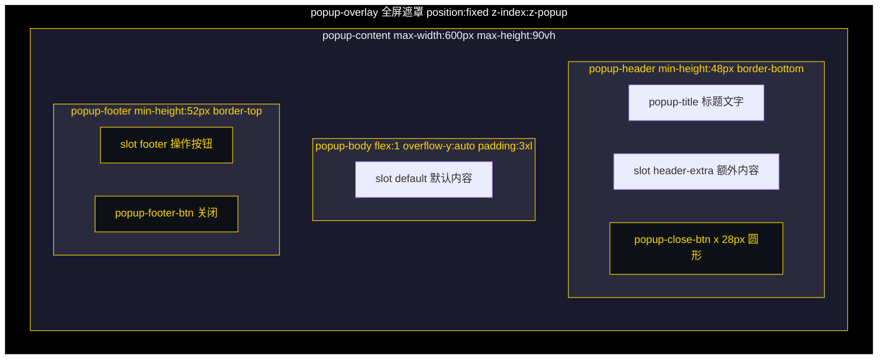

#### 1.1.4 通用样式（popup.less）

| 元素 | 样式 |
|------|------|
| .popup-overlay | position: fixed; top: 0; left: 0; width: 100%; height: 100%; background: @popup-overlay-bg; flex-center; z-index: @z-popup; padding: @spacing-4xl |
| .popup-content | background: @popup-bg; border-radius: @radius-xl; border: @border-card; max-width: 600px; width: 100%; max-height: 90vh; flex-col; position: relative |
| .popup-header | display: flex; align-items: center; padding: @spacing-xl @spacing-3xl; min-height: 48px; border-bottom: @border-sm; gap: @spacing-lg |
| .popup-title | font-size: @font-lg; color: @accent-color; font-weight: @font-weight-bold |
| .popup-close-btn | width: 28px; height: 28px; background: @white-10; border-radius: 50%; font-size: @font-xl; margin-left: auto |
| .popup-body | flex: 1; overflow-y: auto; padding: @spacing-3xl |
| .popup-footer | padding: @spacing-xl @spacing-3xl; border-top: @border-sm; flex-wrap: wrap; gap: @spacing-lg; min-height: 52px |
| .popup-footer-btn | padding: @spacing-lg @spacing-3xl; border: @border-card; border-radius: @radius-lg; font-size: @font-md; font-weight: @font-weight-bold; background: @white-10 |

#### 1.1.5 底部按钮变体

| 类名 | 背景色 | 文字色 |
|------|--------|--------|
| .popup-footer-btn（默认） | @white-10 | @text-primary |
| .popup-footer-btn.cancel | @white-10 | @text-primary |
| .popup-footer-btn.confirm | @accent-color | @color-text-dark |
| .popup-footer-btn.danger | @danger-color | @text-primary |
| .popup-footer-btn.warn | @warning-color | @text-primary |
| .popup-footer-btn.organize | @skill-blue | @text-primary |

#### 1.1.6 进出场动画

| 过渡 | 动画 |
|------|------|
| popup-enter-active | fadeIn（遮罩淡入） |
| popup-enter-active .popup-content | scaleIn 0.25s ease（内容缩放弹入） |
| popup-leave-active | fadeIn reverse（遮罩淡出） |

### 1.2 ConfirmPopup 确认弹窗

基于 BasePopup，`max-width="400px"`，`show-close=false`，`show-footer-close=false`。

#### 1.2.1 组件接口

| Prop | 类型 | 默认值 | 说明 |
|------|------|--------|------|
| visible | boolean | — | 是否显示 |
| title | string | '确认' | 标题 |
| message | string | — | 确认消息文本 |
| type | 'normal' \| 'danger' | 'normal' | 类型（danger 时确认按钮为红色） |
| action | string | 'unknown' | 操作标识，用于音效事件区分 |

| Emit | 说明 |
|------|------|
| confirm | 点击确认按钮 |
| cancel | 点击取消按钮或遮罩 |

#### 1.2.2 布局结构

```
BasePopup(max-width=400px, show-close=false, show-footer-close=false)
├── p.confirm-message  [mixin: popup-message-text()]
└── slot#footer
    ├── button.popup-footer-btn.cancel "取消"
    └── button.popup-footer-btn.confirm|danger "确认"
```

#### 1.2.3 界面布局草图

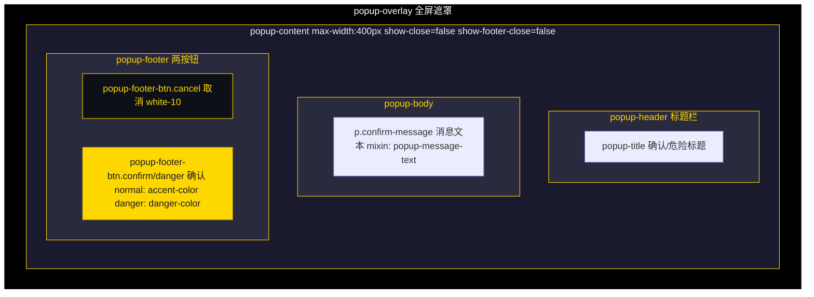

> danger 类型时确认按钮套用 `danger` 样式（红色）。

#### 1.2.4 事件总线

| 时机 | 事件 |
|------|------|
| onConfirm | UI_CLICK(source: 'confirm_ok') + CONFIRM_CONFIRMED(action) |
| onCancel | UI_CLICK(source: 'confirm_cancel') + CONFIRM_CANCELED(action) |

### 1.3 AlertPopup 提示弹窗

基于 BasePopup，`max-width="400px"`，`show-close=false`，`show-footer-close=false`。

#### 1.3.1 组件接口

| Prop | 类型 | 默认值 | 说明 |
|------|------|--------|------|
| visible | boolean | — | 是否显示 |
| title | string | '提示' | 标题 |
| message | string | — | 提示消息文本 |

| Emit | 说明 |
|------|------|
| close | 点击"确定"按钮 |

#### 1.3.2 布局结构

```
BasePopup(max-width=400px, show-close=false, show-footer-close=false)
├── p.alert-message  [mixin: popup-message-text()]
└── slot#footer
    └── button.popup-footer-btn.confirm "确定"
```

### 1.4 Toast 顶部浮动提示

单例模式（通过 useToast composable 模块级共享状态），非 BasePopup 容器。

#### 1.4.1 组件接口

| Prop | 类型 | 默认值 | 说明 |
|------|------|--------|------|
| visible | boolean | — | 是否显示 |
| message | string | — | 消息文本 |
| type | 'info' \| 'success' \| 'warning' \| 'danger' | 'info' | 类型 |
| icon | string | '' | 图标 emoji |

#### 1.4.2 布局与样式

| 属性 | 值 |
|------|-----|
| position | fixed |
| top | 120px |
| left | 50% |
| transform | translateX(-50%) |
| padding | @spacing-xl 24px |
| border-radius | @radius-lg |
| z-index | @z-toast |
| pointer-events | none |
| box-shadow | @shadow-card |

#### 1.4.3 界面布局草图

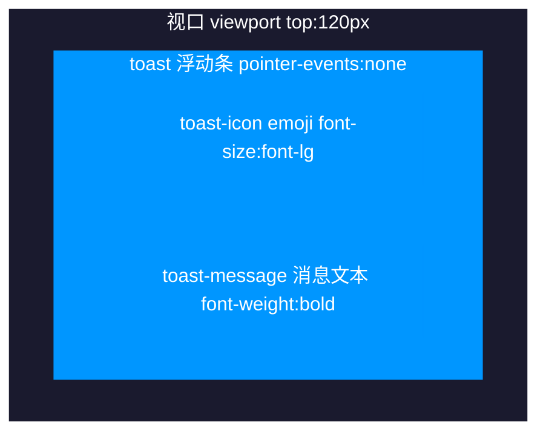

> 类型配色：`info` 蓝色 / `success` 绿色 / `warning` 橙色 / `danger` 红色（详见 1.4.4 类型背景色）。

#### 1.4.4 类型背景色

| 类型 | 背景色 |
|------|--------|
| info | rgba(0, 150, 255, 0.9) |
| success | rgba(76, 175, 80, 0.9) |
| warning | rgba(255, 152, 0, 0.9) |
| danger | rgba(255, 87, 34, 0.9) |

#### 1.4.5 动画

Transition name="toast"：toast-enter-active（toast-in 0.3s）、toast-leave-active（toast-out 0.3s）。
***

## 2. 商店弹窗

来源：`src/components/popup/ShopPopup.vue`

### 2.1 界面概述

商品交易界面，提供购买/出售双标签页，支持 8 种分类筛选、数量选择、金币闪烁动画。标题来自 Shop Store 的商店配置名称（`shopStore.getShopConfig(currentShopId).name`，兜底为"商店"）。

### 2.2 PC端设计

#### 2.2.1 布局结构

```
BasePopup(title=shopName || '商店')
├── slot#header-extra
│   └── gold-display (💰 金币数量, flash 动画)
└── slot#default → shop-content
    ├── shop-tabs
    │   ├── tab-btn "购买" [active: currentTab==='buy']
    │   └── tab-btn "出售" [active: currentTab==='sell']
    ├── category-tabs (8 个分类按钮)
    ├── item-list (max-height: 320px, overflow-y: auto, custom-scrollbar)
    │   └── item-card x N  [购买: displayShopItems / 出售: displaySellItems]
    │       ├── ItemIcon(size=md, rarity)
    │       ├── card-info (name / desc / quantity|count)
    │       └── card-price (💰 价格)
    └── item-detail
        ├── detail-header (h3[rarity] + quality-badge)
        ├── detail-desc
        ├── detail-info (类型 / 单价|持有)
        ├── effect-info (效果文本)
        ├── detail-actions
        │   ├── quantity-selector (- / input / +)
        │   └── action-btn buy|sell (💰 购买xN（总价） / 出售xN（总价）)  [buy disabled: 金币不足]
        └── EmptyState(icon='chest', text='点击物品查看详情')  [v-if 未选中物品]
```

#### 2.2.2 界面布局草图

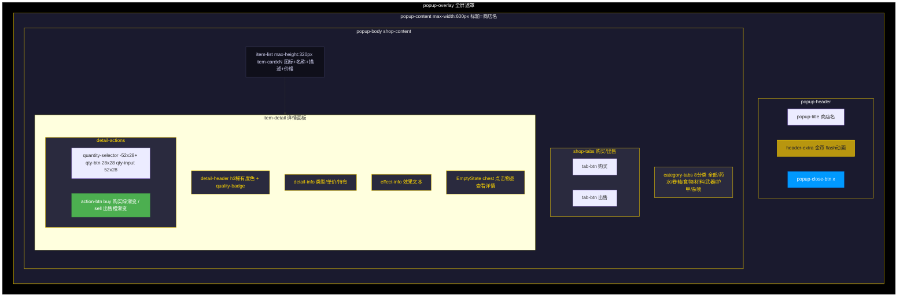

> 详情面板选中态：`item-card.selected` outline 2px @accent-color；按钮 buy 使用 `linear-gradient(135deg, @heal-hp, #45a049)`，sell 使用 `linear-gradient(135deg, #ff9800, #f57c00)`。

#### 2.2.3 分类选项

| 分类 ID | 名称 |
|---------|------|
| all | 全部 |
| potion | 药水 |
| scroll | 卷轴 |
| food | 食物 |
| material | 材料 |
| weapon | 武器 |
| armor | 护甲 |
| misc | 杂项 |

#### 2.2.4 元素尺寸

| 元素 | 尺寸 |
|------|------|
| item-list | max-height: 320px |
| qty-btn | 28px x 28px |
| qty-input | 52px x 28px |

#### 2.2.5 颜色样式

| 元素 | 样式 |
|------|------|
| tab-btn.active | background: @gold-bg-active; border-color: @accent-color; color: @accent-color |
| cat-btn.active | background: rgba(0, 153, 255, 0.2); border-color: @skill-blue; color: @skill-blue |
| item-card.selected | outline: 2px solid @accent-color; background: @gold-bg |
| action-btn.buy | linear-gradient(135deg, @heal-hp, #45a049) |
| action-btn.sell | linear-gradient(135deg, #ff9800, #f57c00) |
| gold-display.flash | animation: gold-flash 0.5s ease |

#### 2.2.6 稀有度颜色（h3 标题）

| 稀有度 | 颜色值 |
|--------|--------|
| common | @popup-text-color |
| uncommon | #1eff00 |
| rare | #0070dd |
| epic | #a335ee |
| legendary | #ff8000 |

### 2.3 移动端设计

弹窗容器自适应，item-list 与 item-detail 垂直排列，分类按钮 flex-wrap 换行。

### 2.4 交互说明

| 交互 | 触发方式 | 响应 |
|------|----------|------|
| 切换购买/出售 | 点击 tab-btn | 切换 currentTab，清除选中和数量 |
| 切换分类 | 点击 cat-btn | 筛选对应类别物品 |
| 选择商品 | 点击 item-card | 选中物品，底部详情区显示信息（key 稳定：购买 entry.id / 出售 item.itemId） |
| 调整数量 | 点击 -/＋ 或输入 qty-input | buyQuantity/sellQuantity 变更（受金币/库存/持有量限制，qty-btn 达边界时 disabled） |
| 购买 | 点击 action-btn.buy | shopStore.buyItem，成功后金币闪烁动画（金币不足时按钮 disabled） |
| 出售 | 点击 action-btn.sell | shopStore.sellItem，成功后金币闪烁动画 |

***

## 3. 任务看板弹窗

来源：`src/components/popup/QuestBoardPopup.vue`

### 3.1 界面概述

区域任务板，提供"可接取任务"和"可交付任务"双标签页，使用 DynamicScroller 虚拟滚动渲染任务卡片。任务板 ID 来源：props.boardId → 当前探索区域 ID → 'village' 兜底。

### 3.2 PC端设计

#### 3.2.1 布局结构

```
BasePopup(title='任务看板')
└── slot#default
    ├── quest-tabs
    │   ├── tab-btn "可接取任务" [active: currentTab==='available']
    │   └── tab-btn "可交付任务" [active: currentTab==='turnin']
    └── quest-list
        ├── DynamicScroller (min-item-size: 120|100, max-height: 400px, key-field="id")
        │   └── quest-card.available|.turnin
        │       ├── quest-icon (BaseIcon 34px, gradient=gold)  [turnin 固定 laurel-crown]
        │       └── quest-content
        │           ├── quest-header-row (h3 + quest-level|quest-status)
        │           ├── quest-desc
        │           ├── quest-objectives [仅 available]  [objective key=obj.key]
        │           │   └── objective (objective-text + objective-target)
        │           ├── quest-rewards (💰金币 + ⭐经验 + 📦物品数)
        │           └── accept-btn|claim-btn  [accept-btn disabled: 角色等级 < 任务等级]
        └── EmptyState [v-if 列表为空]
            ├── available: icon='notebook' text='暂无可接取的任务'
            └── turnin: icon='laurel-crown' text='暂无可交付的任务'
```

#### 3.2.2 界面布局草图

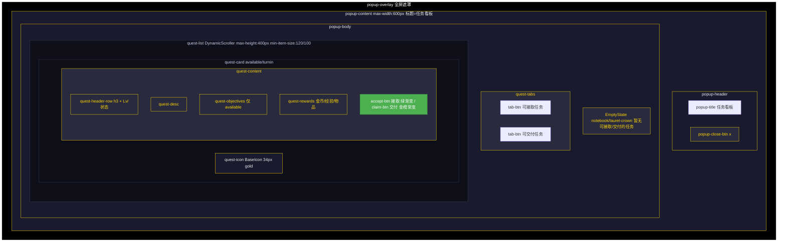

> `available` 卡片边框 `@skill-blue`，`turnin` 卡片边框 `@heal-hp`；`accept-btn` 绿色渐变，`claim-btn` 金橙渐变。列表与目标均使用稳定 key（DynamicScroller key-field="id"、objective key=obj.key）。

#### 3.2.3 任务卡片样式

| 卡片类型 | 边框色 | 按钮样式 |
|----------|--------|----------|
| quest-card.available | @skill-blue | accept-btn: linear-gradient(135deg, @heal-hp, #45a049) |
| quest-card.turnin | @heal-hp | claim-btn: linear-gradient(135deg, @accent-color, #ff8c00); color: @color-text-dark |

#### 3.2.4 任务图标映射

| 任务类型 | 图标名 |
|----------|--------|
| kill | crossed-swords |
| collect | chest |
| 默认 | notebook |

### 3.3 移动端设计

弹窗容器自适应，quest-scroller 内部虚拟滚动适配。

### 3.4 交互说明

| 交互 | 触发方式 | 响应 |
|------|----------|------|
| 切换标签 | 点击 tab-btn | 切换 available/turnin 列表 |
| 接取任务 | 点击 accept-btn | questStore.acceptQuestFromBoard，成功/失败显示 Toast（角色等级低于任务等级时按钮 disabled） |
| 交付任务 | 点击 claim-btn | questStore.turnInQuestToBoard，成功/失败显示 Toast |
***

## 4. 角色信息弹窗

来源：`src/components/popup/CharacterInfoPopup.vue`

### 4.1 界面概述

角色完整属性面板，展示角色基本信息、3 个 Tag 标签（阵营/种族/职业）、HP/MP/EXP 资源条及职业专属资源条、6 项核心属性、6 项次级属性、6 个装备槽位及装备详情。

### 4.2 PC端设计

#### 4.2.1 布局结构

```
BasePopup(title='角色信息')
└── slot#default → character-content
    ├── character-overview
    │   ├── character-basic
    │   │   ├── char-row (char-avatar 52x52 + char-name + char-level)
    │   │   └── char-details (Tagx3: faction / race / class)
    │   └── resource-bars
    │       ├── ResourceBar HP (health-normal / blood)
    │       ├── ResourceBar MP (magic-palm / mana)  [v-if showManaBar]
    │       ├── ClassResourceBar x N (职业专属资源)  [仅替代型职业: 怒气/能量等]
    │       └── ResourceBar EXP (star-formation / gold)
    ├── attributes-section (核心属性)
    │   └── core-attributes (grid 2列, 6 项)  [key=属性键]
    ├── secondary-section (次级属性)
    │   ├── secondary-grid (grid 2列, 6 项 + border-left 颜色)
    │   └── resource-stats (最大HP / 最大MP [v-if showManaBar])
    └── equipment-section (装备)
        ├── equipment-grid (grid 3列, 6 槽位)  [key=slot.key 稳定]
        │   ├── weaponSlots: weapon1(主手) / weapon2(副手)
        │   └── armorSlots: armor1 / armor2 / armor3 / armor4
        └── equipment-detail (选中装备详情或 EmptyState)
```

#### 4.2.2 界面布局草图

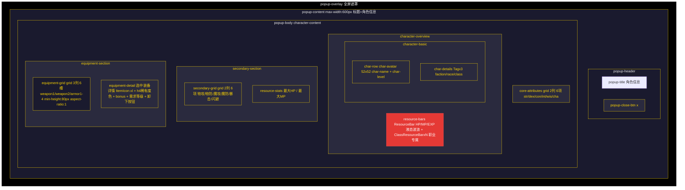

> 装备槽位 grid 3列：weapon1(主手) / weapon2(副手) / armor1-4；选中态 `equip-slot.selected` @gold-bg-strong；稀有度边框色：uncommon #1eff00 / rare #0070dd / epic #a335ee / legendary #ff8000。

#### 4.2.3 核心属性图标映射

| 属性键 | 名称 | 图标名 | 渐变 |
|--------|------|--------|------|
| str | 力量 | sword-clash | physical |
| dex | 敏捷 | dodge | dodge |
| con | 体质 | health-normal | blood |
| int | 智力 | brain | magic |
| wis | 感知 | eye-target | nature |
| cha | 魅力 | charm | gold |

#### 4.2.4 次级属性 border-left 颜色

| 属性 | 图标 | border-left 颜色 |
|------|------|------------------|
| 物理攻击 | sword-clash (physical) | @damage-physical |
| 物理防御 | shield (earth) | #4ecdc4 |
| 魔法攻击 | magic-swirl (magic) | #a29bfe |
| 魔法防御 | magic-shield (magic) | #fd79a8 |
| 暴击率 | explosion-rays (crit) | #fdcb6e |
| 闪避率 | dodge (dodge) | #74b9ff |

#### 4.2.5 装备槽样式

| 类名 | 样式 |
|------|------|
| .equip-slot | min-height: 80px; aspect-ratio: 1; grid 3列 |
| .equip-slot.equipped | background: rgba(255, 255, 255, 0.08) |
| .equip-slot.selected | background: @gold-bg-strong |
| .equip-slot.equip-anim-fill | animation: equip-slot-fill 0.6s ease |
| .equip-slot.equip-anim-empty | animation: equip-slot-empty 0.6s ease |

#### 4.2.6 装备详情

选中装备槽显示：ItemIcon(xl) + h4[rarity] + detail-rarity + 描述 + detail-stats(bonus 属性列表) + detail-requirement(需要等级) + "卸下"按钮（linear-gradient(135deg, #ff9800, #f57c00)）。

未选中时显示 EmptyState（icon='shield', text='点击装备槽位查看详情'）；空槽位显示 EmptyState（icon='empty-box', gradient='metal', text='槽位为空'）。

### 4.3 移动端设计

弹窗容器自适应，核心属性和次级属性保持 2 列网格，装备槽保持 3 列网格。

### 4.4 交互说明

| 交互 | 触发方式 | 响应 |
|------|----------|------|
| 选择装备槽 | 点击 equip-slot | 选中槽位，底部显示装备详情 |
| 卸下装备 | 点击"卸下"按钮 | equipmentStore.unequipItem，播放 equip-anim-empty 动画 |

***

## 5. 背包弹窗

来源：`src/components/popup/InventoryPopup.vue`

### 5.1 界面概述

背包物品管理界面，使用 RecycleScroller 虚拟网格渲染物品格子（maxSlots=50），支持 8 种分类筛选、整理背包、使用消耗品、装备武器/护甲、丢弃物品。

### 5.2 PC端设计

#### 5.2.1 布局结构

```
BasePopup(title='背包')
├── slot#header-extra
│   └── header-info (gold-display + inventory-count "X / 50")
├── slot#default → inventory-content
│   ├── category-tabs (8 个分类按钮)
│   ├── inventory-grid (RecycleScroller, useResponsiveGrid: 48px / gap 6, key-field="id")
│   │   └── item-slot x N  [条目 id 唯一: 物品 `item-${itemId}-${idx}` / 空槽 `empty-${i}`]
│   │       ├── ItemIcon(size=sm, rarity)
│   │       └── item-count [v-if count > 1]
│   └── item-detail
│       ├── detail-header (h3[rarity] + quality-badge)
│       ├── detail-desc
│       ├── detail-info (类型 / 数量 / 等级)
│       ├── bonus-info (bonus 属性列表)
│       ├── effect-info (EffectTag + effect-value)
│       ├── detail-actions (use / equip|unequip / drop)
│       └── EmptyState(icon='backpack', text='点击物品查看详情')  [v-if 未选中]
└── slot#footer
    └── button.popup-footer-btn.organize "整理背包"

ConfirmPopup(title='丢弃物品', type='danger')  [丢弃确认]
BasePopup(title='选择装备位置', max-width=360px)  [装备槽位选择]
└── slot#default → slot-select-content
    ├── slot-select-hint
    └── slot-options (slot-option-btn x N)
```

#### 5.2.2 界面布局草图

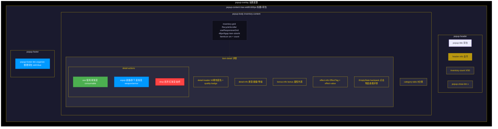

> 物品槽状态：`.equipped` outline 2px @heal-hp / `.selected` @gold-bg-strong / `.empty` 虚线边框 opacity:0.3。

**装备槽位选择子弹窗**（多槽位装备时弹出）：

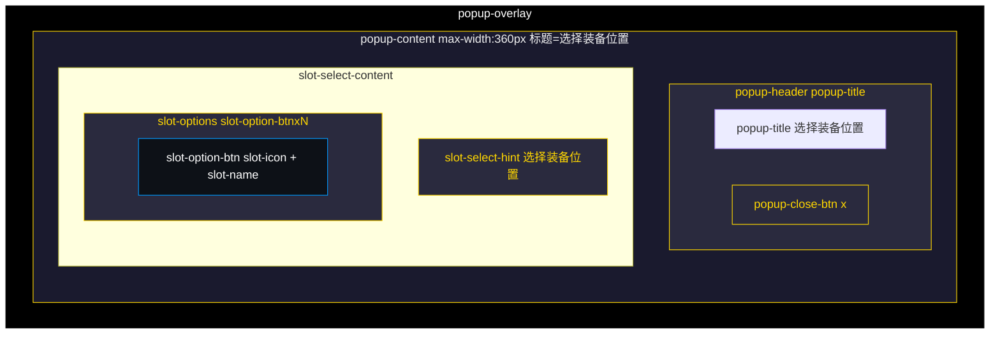

> 槽位名称：weapon1(主手) / weapon2(副手) / armor1-4(护甲槽1-4)。

#### 5.2.3 物品槽样式

| 类名 | 样式 |
|------|------|
| .item-slot | width/height: 100%; background: @white-05; animation: scaleIn 0.25s |
| .item-slot.empty | border: @border-dashed; opacity: 0.3 |
| .item-slot.equipped | outline: 2px solid @heal-hp; background: rgba(76, 175, 80, 0.2) |
| .item-slot.selected | background: @gold-bg-strong |
| .item-count | position: absolute; bottom: 2px; right: 3px; font-size: @font-2xs |

#### 5.2.4 操作按钮样式

| 按钮 | 条件 | 背景色 |
|------|------|--------|
| 使用 | info.consumable | linear-gradient(135deg, @heal-hp, #45a049) |
| 装备/卸下 | isEquipment(type) | linear-gradient(135deg, @skill-blue, #0066cc) |
| 丢弃 | 始终显示 | linear-gradient(135deg, #ff4444, #cc0000) |

#### 5.2.5 装备槽位名称

| 槽位键 | 名称 | 选择弹窗图标 |
|--------|------|-------------|
| weapon1 | 主手武器 | broadsword |
| weapon2 | 副手武器 | broadsword |
| armor1 | 护甲槽1 | checked-shield |
| armor2 | 护甲槽2 | checked-shield |
| armor3 | 护甲槽3 | checked-shield |
| armor4 | 护甲槽4 | checked-shield |

### 5.3 移动端设计

useResponsiveGrid 根据容器宽度自动计算列数：cols = Math.max(1, Math.floor((width + gap) / (minItemSize + gap)))，移动端列数减少。实现通过 ResizeObserver 监听容器宽度，并以 requestAnimationFrame 节流（P3-123）避免布局抖动，卸载时自动断开观察并清理未执行的 raf。

### 5.4 交互说明

| 交互 | 触发方式 | 响应 |
|------|----------|------|
| 切换分类 | 点击 tab-btn | 筛选对应类别物品 |
| 选择物品 | 点击 item-slot | 选中物品，底部显示详情 |
| 整理背包 | 点击"整理背包" | organizeInventory + Toast 提示 |
| 使用物品 | 点击"使用" | useItemByIndex，播放 item-bounce 动画，Toast 显示效果 |
| 装备物品 | 点击"装备" | 单槽位直接装备；多槽位弹出选择弹窗 |
| 选择槽位 | 点击 slot-option-btn | equipmentStore.equipItem，播放 equip-anim-fill 动画 |
| 丢弃物品 | 点击"丢弃" | 弹出 ConfirmPopup 确认后 removeItemByIndex |
***

## 6. 技能面板弹窗

来源：`src/components/popup/SkillsPopup.vue`

### 6.1 界面概述

角色技能管理界面，展示已记忆技能（战斗技能栏，4 槽位）与已学习技能列表（RecycleScroller 虚拟网格），支持将技能"记忆"到战斗技能槽位或"遗忘"。状态来源：useSkillStore（skillBarSlots/skillBar.slots）、useCharacterStore（classId/level）、useSkillDisplay（效果文本）。

### 6.2 PC端设计

#### 6.2.1 布局结构

```
BasePopup(title='技能面板')
└── slot#default → skills-content
    ├── skill-bar-section
    │   ├── h3 "已记忆技能 (战斗中使用)"
    │   └── skill-bar (grid 4列, :key=barRenderKey 记忆/遗忘后强制重渲染)
    │       └── bar-slot x 4  [key=index]
    │           ├── 已记忆: BaseIcon(24, gradient=classId) + bar-name
    │           └── 空槽: bar-empty "+"
    │           [选中态: .selected 金色边框; 空槽: .empty 虚线边框]
    ├── skills-grid-section
    │   ├── h3 "已学习技能"
    │   └── skills-grid → RecycleScroller (useResponsiveGrid: 48px / gap 6, key-field="id", max-height: 180px)
    │       └── skill-slot x N  [item: {id, skill}]
    │           ├── BaseIcon(24, gradient=classId)
    │           ├── lock-badge (padlock)  [v-if 未解锁: 角色等级 < unlockLevel]
    │           └── equipped-badge (check-mark, heal)  [v-if 已在技能栏]
    │           [状态: .equipped 绿边框 / .locked 半透明 / .selected 金底]
    └── skill-detail [选中技能详情, .locked 态整体变色]
        ├── EmptyState(icon='sword-clash', text='点击技能查看详情')  [v-if 未选中]
        └── 选中态
            ├── detail-top
            │   ├── detail-header (BaseIcon 36 + h3 + SkillTags)
            │   └── detail-actions
            │       ├── button.action-btn.forget "遗忘"  [v-if 已记忆, 红渐变]
            │       └── button.action-btn.memorize "记忆"  [v-else-if 可解锁, 绿渐变]
            ├── detail-desc
            └── detail-bottom
                ├── detail-effect (effect-label "效果:" + effect-value[type 配色])
                └── detail-level-req
                    ├── 未解锁: padlock + "需要等级 N" (红底)
                    └── 已解锁: check-mark + "解锁等级 N" (绿底)
```

#### 6.2.2 界面布局草图

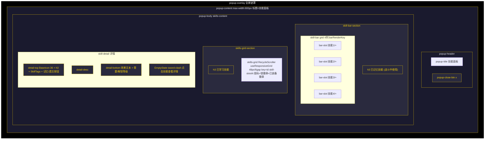

#### 6.2.3 技能槽样式

| 类名 | 样式 |
|------|------|
| .bar-slot | min-height: 60px; background: @white-05; border: @border-card; animation: scaleIn 0.3s |
| .bar-slot.selected | border-color: @accent-color; background: @gold-bg-hover; box-shadow: 0 0 10px @gold-border |
| .bar-slot.empty | border-style: dashed; border-color: @color-dark-line |
| .skill-slot | background: @white-05; border: @border-card; border-radius: @radius-sm; position: relative |
| .skill-slot.equipped | border-color: @heal-hp; background: @green-bg-hover |
| .skill-slot.locked | opacity: @opacity-faded; cursor: not-allowed |
| .skill-slot.selected | background: @gold-bg-active; border-color: transparent |
| .lock-badge | position: absolute; top: -2px; right: -2px |
| .equipped-badge | position: absolute; bottom: -2px; right: -2px; 圆形 @overlay-heavy 底 |

#### 6.2.4 详情按钮与效果配色

| 元素 | 条件 | 样式 |
|------|------|------|
| .action-btn.memorize | 可解锁且未记忆 | linear-gradient(135deg, @heal-hp, #45a049) |
| .action-btn.forget | 已记忆 | linear-gradient(135deg, @damage-physical, #ee5a24) |
| .effect-value.physical_damage | 物理伤害技能 | @damage-physical |
| .effect-value.magic_damage | 魔法伤害技能 | @damage-magic |
| .effect-value.heal | 治疗技能 | @heal-hp |
| .detail-level-req:has(.level-lock-icon) | 未解锁 | rgba(255,107,107,0.15) 底 + 红边框 |
| .detail-level-req:has(.level-unlock-icon) | 已解锁 | @green-bg 底 + 绿边框 |

### 6.3 移动端设计

skill-bar 缩小 gap/padding，bar-slot min-height 降至 50px，skills-scroller max-height 降至 130px。

### 6.4 交互说明

| 交互 | 触发方式 | 响应 |
|------|----------|------|
| 选择技能 | 点击 skill-slot | 选中技能显示详情（UI_CLICK source='skill_select'） |
| 选择技能栏槽位 | 点击 bar-slot | 记录目标槽位，若槽内已有技能则同时选中该技能（source='skill_bar_slot'） |
| 记忆技能 | 点击"记忆" | skillsStore.equipSkill 到选中槽或首个空槽；无空槽时自动替换技能栏第 1 槽；barRenderKey++ 重渲染（source='skill_memorize'） |
| 遗忘技能 | 点击"遗忘" | skillsStore.unequipSkill，清除选中；barRenderKey++（source='skill_forget'） |
| 数据加载 | onMounted | skillsStore.initialize(角色ID) + getSkillTemplatesByClass(classId) 按 unlockLevel 升序 |

***

## 7. 任务日志弹窗

来源：`src/components/popup/QuestPopup.vue`

### 7.1 界面概述

当前进行中任务列表，展示任务标题、状态、目标进度与奖励，支持放弃任务（ConfirmPopup 二次确认）。状态来源：useQuestStore（activeQuests/completedQuests/getQuestDefinition/getQuestInstance）。

### 7.2 PC端设计

#### 7.2.1 布局结构

```
BasePopup(title='任务日志')
└── slot#default
    ├── quest-list
    │   └── quest-card x N  [key=quest.questId, 入场动画 card-slide-in]
    │       ├── BaseIcon 34px (kill: sword-clash/physical; collect: treasure-map/gold; 默认: scroll-unfurled/gold)
    │       └── quest-content
    │           ├── quest-header-row (h3 + quest-status)
    │           │   └── in_progress: "进行中" 蓝底 / completed: "可交付" 绿底
    │           ├── quest-desc
    │           ├── objectives  [objective key=obj.key]
    │           │   └── objective [.completed 绿底]
    │           │       ├── objective-checkbox (完成: check-mark/heal / 未完成: empty-box)
    │           │       ├── objective-text
    │           │       └── objective-progress (current/target)
    │           ├── quest-rewards (💰金币 + ⭐经验)
    │           └── quest-actions  [v-if status !== 'completed']
    │               └── abandon-btn "放弃" (红渐变)
    └── EmptyState(icon='notebook', text='暂无进行中的任务')  [v-if 无任务]

ConfirmPopup(title='确认放弃', type='danger')  [放弃确认: "确定放弃此任务吗？放弃后任务进度将被清除。"]
```

#### 7.2.2 界面布局草图

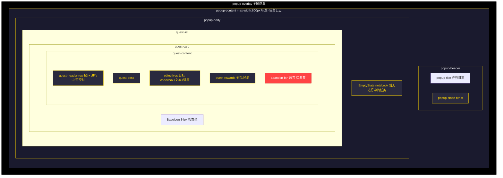

#### 7.2.3 任务状态配色

| 状态 | 文本 | 背景/文字色 |
|------|------|-------------|
| in_progress | 进行中 | rgba(0, 153, 255, 0.2) 底 / @skill-blue |
| completed | 可交付 | rgba(76, 175, 80, 0.2) 底 / @heal-hp |

### 7.3 移动端设计

弹窗容器自适应，任务卡片垂直排列。

### 7.4 交互说明

| 交互 | 触发方式 | 响应 |
|------|----------|------|
| 放弃任务 | 点击"放弃" | 弹出 ConfirmPopup 确认（source='quest_abandon_btn'） |
| 确认放弃 | 点击确认 | questStore.abandonQuest + Toast '已放弃任务'（⚠️）+ 刷新列表 |
| 数据加载 | onMounted / 弹窗打开 | questStore.init() |
***

## 8. 冒险日志弹窗

来源：`src/components/popup/AdventureLogPopup.vue`

### 8.1 界面概述

冒险记录展示界面，以滚动日志列表形式（非分页）按时间倒序/正序展示全部日志条目，支持按日志类型着色与清空日志（ConfirmPopup 二次确认）。状态来源：useLogStore（logs 计算属性直接引用 logStore.logs，日志变更即时刷新界面）。

### 8.2 PC端设计

#### 8.2.1 布局结构

```
BasePopup(title='冒险日志')
├── slot#default
│   ├── log-header  [v-if currentArea: "{{ currentArea }} - 冒险记录"（currentArea 兜底为"未知区域"）]
│   └── log-container (flex:1, overflow-y:auto, custom-scrollbar, 背景 #0f0f1a 边框 #3a3a5a)
│       └── log-entry x N  [key=log.id, class=`log-type-${log.type}`]
│           ├── log-time (MM-DD HH:mm:ss, monospace, min-width:110px, 色 #8a8aaa)
│           ├── log-icon (BaseIcon 16px: log.icon || getDefaultIcon(log.type))
│           └── log-message (flex:1, 色 #d0d0f0)
│       └── EmptyState(icon='scroll-unfurled', text='暂无冒险记录')  [v-if logs.length === 0]
└── slot#footer
    └── button.popup-footer-btn.danger "清空日志"  [source='log_clear_btn']

ConfirmPopup(title='清空日志', message='确定要清空所有冒险日志吗？此操作不可撤销。', type='danger')
```

#### 8.2.2 界面布局草图

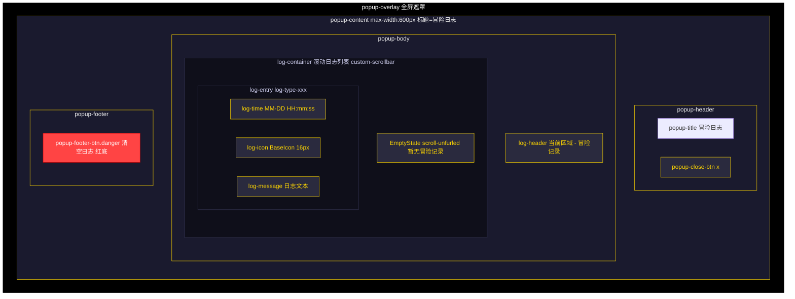

#### 8.2.3 日志类型着色

| 类型 | 背景色 |
|------|--------|
| log-type-info | rgba(100, 100, 150, 0.1) |
| log-type-combat | rgba(200, 80, 80, 0.1) |
| log-type-quest | rgba(80, 150, 200, 0.1) |
| log-type-item | rgba(150, 80, 200, 0.1) |
| log-type-level | rgba(200, 180, 80, 0.1) |
| log-type-death | rgba(180, 40, 40, 0.15) |
| log-type-resurrect | rgba(80, 200, 180, 0.1) |
| log-type-shop | rgba(200, 150, 80, 0.1) |
| log-type-skill | rgba(80, 200, 80, 0.1) |
| log-type-exploration | rgba(80, 120, 200, 0.1) |
| log-type-zone | rgba(150, 100, 200, 0.1) |

#### 8.2.4 默认图标映射（getDefaultIcon）

| 日志类型 | 图标名 | 渐变色 |
|----------|--------|--------|
| info | scroll-unfurled | earth |
| combat | crossed-swords | physical |
| quest | notebook | gold |
| item | chest | gold |
| level | level-up | gold |
| death | death-skull | debuff |
| resurrect | resurrection | gold |
| shop | shop | gold |
| skill | resurrection | gold |
| exploration | treasure-map | nature |
| zone | uncertainty | shadow |
| 其他/默认 | scroll-unfurled | earth |

### 8.3 移动端设计

`@media (max-width: 640px)`：log-entry 字体降至 12px，log-time min-width 降至 95px、字体 11px。

### 8.4 交互说明

| 交互 | 触发方式 | 响应 |
|------|----------|------|
| 滚动查看日志 | 拖动 log-container | 任意滚动（非分页），custom-scrollbar 样式 |
| 清空日志 | 点击"清空日志" | 弹出 ConfirmPopup 确认（source='log_clear_btn'） |
| 确认清空 | 点击确认 | logStore.clearLogs()，关闭确认弹窗 |
| 数据加载 | onMounted | nextTick 后 scrollToBottom 滚动到底部，展示最新日志 |

***

## 9. 系统设置弹窗

来源：`src/components/popup/SystemPopup.vue`

### 9.1 界面概述

游戏系统菜单，作为游戏主界面底部"系统"按钮的弹出面板，提供"音量设置"入口与"退出游戏"功能。基于 BasePopup 容器（max-width 340px，无底部"关闭"按钮自动生成，底部按钮由 slot#footer 提供）。状态来源：props.visible。

### 9.2 PC端设计

#### 9.2.1 布局结构

```
BasePopup(title='系统', max-width='340px', show-footer-close=false)
├── slot#default → system-body
│   ├── button.system-btn.audio-btn  [source='system_audio' → emit close + open-audio]
│   │   ├── BaseIcon(name='sound-on', gradient='gold', size=20)
│   │   └── span.system-btn-label "音量设置"
│   └── button.system-btn.exit-btn  [source='system_exit' → emit exit]
│       ├── BaseIcon(name='exit-door', gradient='blood', size=20)
│       └── span.system-btn-label "退出游戏"
└── slot#footer
    └── button.popup-footer-btn "关闭"  [source='system_close' → emit close]
```

#### 9.2.2 界面布局草图

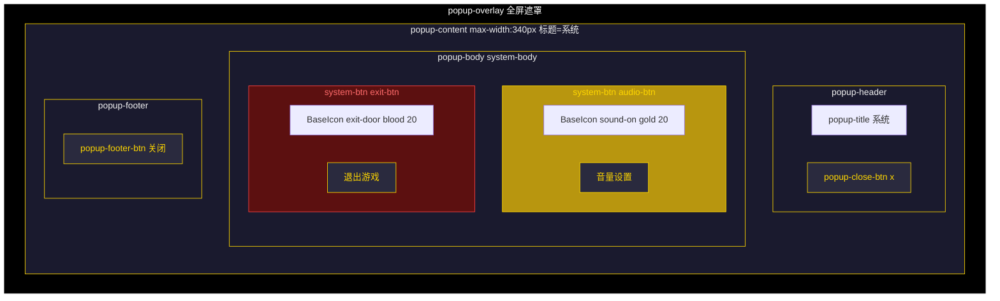

#### 9.2.3 按钮样式

| 元素 | 默认样式 | 悬停样式 |
|------|----------|----------|
| .system-btn | padding: @spacing-4xl 24px; border: @border-card; border-radius: 10px; background: rgba(255,255,255,0.04); color: #ccc; font-size: @font-lg; transition: all 0.25s | transform: translateY(-2px)（active 时归零） |
| .system-btn.audio-btn | 同 .system-btn | border-color: @accent-color; background: rgba(255,215,0,0.08); color: @accent-color; box-shadow: 0 4px 16px @gold-bg |
| .system-btn.exit-btn | 同 .system-btn; color: rgba(255,100,100,0.8) | border-color: @danger-color; background: rgba(255,68,68,0.1); color: #ff6b6b; box-shadow: 0 4px 16px rgba(255,68,68,0.1) |
| .system-body | flex-col; gap: @spacing-3xl; padding: @spacing-md @spacing-xs | — |

### 9.3 移动端设计

弹窗容器自适应（max-width 340px），按钮区域纵向排列，无额外移动端适配逻辑。

### 9.4 交互说明

| 交互 | 触发方式 | 响应 |
|------|----------|------|
| 打开音量设置 | 点击"音量设置" | UI_CLICK(source='system_audio')，emit close 关闭系统弹窗并 emit open-audio 打开音量设置弹窗 |
| 退出游戏 | 点击"退出游戏" | UI_CLICK(source='system_exit')，emit exit 交由父组件处理退出流程 |
| 关闭弹窗 | 点击"关闭" / 遮罩 / x | UI_CLICK(source='system_close')，emit close |
***

## 10. 音量设置弹窗

来源：`src/components/popup/AudioSettingsPopup.vue`

### 10.1 界面概述

音频设置界面，提供主音量、音效音量、背景音乐音量三个滑块及音效/背景音乐独立开关，支持全局静音切换。状态来源：useAudioStore（P3-116 收敛：`store.settings` 为只读 computed 代理 `gameStore.gameSettings`，所有修改经 `setMasterVolume` / `updateSettings` / `toggleMute` 异步委托 `gameStore.updateGameSettings` 即时持久化，不再直接访问 IndexedDB）。

### 10.2 PC端设计

#### 10.2.1 布局结构

```
BasePopup(title='音量设置', max-width='420px', show-footer-close=false)
├── slot#default → audio-body
│   ├── slider-group "主音量"
│   │   ├── slider-label (BaseIcon musical-notes/gold 20 + "主音量" + slider-value XX%)
│   │   └── input.audio-slider (range 0-100, :value=masterVolume*100, :disabled=muted, @input=onMasterVolumeChange)
│   ├── slider-group "音效音量"
│   │   ├── slider-label (BaseIcon musical-notes/gold 20 + "音效音量" + slider-value XX%)
│   │   └── slider-row
│   │       ├── input.audio-slider (range, :value=sfxVolume*100, :disabled=!sfxEnabled||muted, @input=onSfxVolumeChange)
│   │       └── button.toggle-btn [active: sfxEnabled] "开|关"  [@click=toggleSfx]
│   ├── slider-group "背景音乐"
│   │   ├── slider-label (BaseIcon musical-notes/gold 20 + "背景音乐" + slider-value XX%)
│   │   └── slider-row
│   │       ├── input.audio-slider (range, :value=bgmVolume*100, :disabled=!bgmEnabled||muted, @input=onBgmVolumeChange)
│   │       └── button.toggle-btn [active: bgmEnabled] "开|关"  [@click=toggleBgm]
│   └── mute-row
│       └── button.mute-btn [.muted: muted]  [@click=onMuteClick]
│           ├── BaseIcon (muted ? sound-off : sound-on, gradient=gold, size=20)
│           └── span "已静音|正常"
└── slot#footer
    └── button.popup-footer-btn.confirm "确定"  [source='audio_settings_close']
```

#### 10.2.2 界面布局草图

```mermaid
flowchart TB
    subgraph overlay["popup-overlay 全屏遮罩"]
        subgraph container["popup-content max-width:420px 标题=音量设置"]
            direction TB
            subgraph header["popup-header"]
                direction LR
                title["popup-title 音量设置"]
                close["popup-close-btn x"]
            end
            subgraph body["popup-body audio-body"]
                direction TB
                subgraph master["slider-group 主音量"]
                    direction TB
                    masterLabel["slider-label musical-notes 主音量 XX%"]
                    masterSlider["audio-slider range 0-100"]
                end
                subgraph sfx["slider-group 音效音量"]
                    direction TB
                    sfxLabel["slider-label musical-notes 音效音量 XX%"]
                    subgraph sfxRow["slider-row"]
                        direction LR
                        sfxSlider["audio-slider range"]
                        sfxToggle["toggle-btn 开/关"]
                    end
                end
                subgraph bgm["slider-group 背景音乐"]
                    direction TB
                    bgmLabel["slider-label musical-notes 背景音乐 XX%"]
                    subgraph bgmRow["slider-row"]
                        direction LR
                        bgmSlider["audio-slider range"]
                        bgmToggle["toggle-btn 开/关"]
                    end
                end
                subgraph mute["mute-row"]
                    muteBtn["mute-btn sound-on/off 正常/已静音"]
                end
            end
            subgraph footer["popup-footer"]
                confirmBtn["popup-footer-btn.confirm 确定 金色"]
            end
        end
    end

    classDef overlayCls fill:#000000,stroke:#000,color:#fff
    classDef containerCls fill:#1a1a2e,stroke:#ffd700,color:#f0f0f0
    classDef regionCls fill:#2a2a3e,stroke:#ffd700,color:#ffd700
    classDef sliderCls fill:#0f0f1a,stroke:#3a3a5a,color:#d0d0f0
    classDef toggleCls fill:#0d1117,stroke:#888,color:#888
    classDef confirmCls fill:#ffd700,stroke:#b8960f,color:#1a1a2e
    classDef mutedCls fill:#5c1010,stroke:#ff4444,color:#ff6b6b

    class overlay overlayCls
    class container,header,body,footer containerCls
    class masterLabel,sfxLabel,bgmLabel,sfxToggle,bgmToggle regionCls
    class master,sfx,bgm,mute sliderCls
    class confirmBtn confirmCls
    class close regionCls
```

#### 10.2.3 滑块与按钮样式

| 元素 | 样式 |
|------|------|
| .audio-slider | flex: 1; height: 6px; background: @white-15; border-radius: @radius-xs; -webkit-appearance: none |
| .audio-slider::-webkit-slider-thumb | 18px 圆形; background: @accent-color; border: 2px solid #b8960f; hover transform: scale(1.15) |
| .audio-slider:disabled | opacity: 0.3; cursor: not-allowed; thumb 变灰（@color-dim-gray） |
| .slider-label | flex; align-items: center; gap: @spacing-md; color: #ccc; font-size: @font-md |
| .slider-value | margin-left: auto; color: @accent-color; font-weight: @font-weight-bold; min-width: 36px; text-align: right |
| .toggle-btn | padding: @spacing-xs 14px; min-width: 48px; border: @border-sm; border-radius: @radius-sm; background: @white-05; color: @color-dodge; font-weight: @font-weight-bold |
| .toggle-btn.active | border-color: @accent-color; background: @gold-bg; color: @accent-color |
| .mute-btn | padding: @spacing-md 24px; border: @border-card; border-radius: @radius-lg; background: @white-05; color: #ccc; font-size: @font-md |
| .mute-btn.muted | border-color: @danger-color; background: rgba(255,68,68,0.1); color: #ff6b6b |
| .mute-row | flex; justify-content: center; padding-top: @spacing-xs; border-top: 1px solid rgba(255,255,255,0.06) |

#### 10.2.4 状态读写方式（P3-116）

| 操作 | 调用 | 说明 |
|------|------|------|
| 主音量 | store.setMasterVolume(value) | async，委托 gameStore.updateGameSettings 持久化，UI 事件中 fire-and-forget 调用（.catch 打印错误） |
| 音效/背景音乐音量 | store.updateSettings({ sfxVolume \| bgmVolume }) | 同上，局部更新 + 即时持久化 |
| 音效/背景音乐开关 | store.updateSettings({ sfxEnabled \| bgmEnabled }) | 同上 |
| 全局静音 | store.toggleMute() | async，翻转 muted 并持久化 |
| 读取 | store.settings | 只读 computed 代理 gameStore.gameSettings（P3 TS-14 使用 instanceof HTMLInputElement 守卫安全取值） |

### 10.3 移动端设计

弹窗容器自适应（max-width 420px），滑块纵向排列，无额外移动端适配逻辑。

### 10.4 交互说明

| 交互 | 触发方式 | 响应 |
|------|----------|------|
| 调整主音量 | 拖动主音量滑块 | setMasterVolume(value/100)，百分比实时显示；静音时滑块 disabled |
| 调整音效/背景音乐 | 拖动对应滑块 | updateSettings 局部更新；对应开关关闭或全局静音时 disabled |
| 切换音效/背景音乐 | 点击 toggle-btn | UI_CLICK(source='audio_toggle_sfx'/'audio_toggle_bgm') + updateSettings 翻转开关 |
| 全局静音 | 点击 mute-btn | UI_CLICK(source='audio_mute') + toggleMute，按钮显示"已静音/正常"并切换图标 |
| 关闭弹窗 | 点击"确定" / 遮罩 / x | UI_CLICK(source='audio_settings_close')，emit close |

***

## 11. 战斗弹窗

来源：`src/components/popup/CombatPopup.vue`

### 11.1 界面概述

回合制战斗界面，独立全屏覆盖层（不使用 BasePopup）。支持普通攻击、技能释放、物品使用、跳过、逃跑等行动，包含 3×2 敌人网格、战斗日志、浮动伤害数字、Boss 出场演出与阶段转换特效及战斗结果展示。状态来源：useCombatStore（enemies/enemyPositions/enemyEffects/targetEnemyId/turn/turnCount/combatLogs/combatResult/resourceSystems/playerEffects/expGained/goldGained/currentTarget/hasBossEnemy）、useCharacterStore、useSkillStore、useInventoryStore；视觉逻辑抽离为 4 个 composables（useCombatSpeed/useCombatAutoClose/useBossIntroOverlay/useCombatAnimations），经 `@/modules/combat` 公共入口导入（QA-5 阶段四，符合 ARCH-4）。

### 11.2 PC端设计

#### 11.2.1 布局结构

```
div.combat-overlay (fixed 100vw×100vh, bg rgba(0,0,0,0.92), z-index @z-combat-overlay)
└── div.combat-container (width 95%, max-width 700px, max-height 95vh, @gradient-panel, radius 16px)
    ├── div.screen-flash [v-show=screenFlash, class=screenFlashType]  ← 暴击屏幕闪白
    ├── div.boss-intro-overlay [v-if=showBossIntro]
    │   └── div.boss-intro-content (BaseIcon dragon 48 + 名字 + 台词逐行 line-0/1/2)
    ├── div.phase-transition [v-if=showPhaseTransition, class=phase-transition-{effect}]  ← Boss 阶段转换
    ├── div.combat-header
    │   ├── span.combat-title (hasBossEnemy ? "首领战斗！" : "遭遇战斗！")
    │   ├── button.speed-toggle (1x: single-arrow / 2x: double-arrow, gradient=lightning)
    │   └── span.combat-turn "第 X 回合"
    ├── div.combat-arena
    │   ├── div.enemy-grid (3×2 网格: row back/front × col 1-3)
    │   │   └── div.enemy-slot [key=`${row}-${col}`]
    │   │       ├── div.combatant.enemy-side [v-for=敌人, key=e.id]  ← 见 11.2.3
    │   │       └── div.combatant.enemy-empty (⬛ 空位)  [v-if 无敌人]
    │   ├── div.vs-divider [.flash] (BaseIcon crossed-swords/physical 20)
    │   └── div.combatant.player-side
    │       ├── avatar BaseIcon(playerIcon, 28) + name + Lv
    │       ├── ResourceBar 生命(hp) + 法力(mp)[showManaBar] + ClassResourceBar x N
    │       ├── effects-indicator (playerEffects Buff/Debuff 徽章)
    │       └── floating-damage (玩家浮动数字)
    ├── div.combat-log (倒序渲染 logsReversed, max-height 160px)
    │   └── div.log-entry [key=log.timestamp+'-'+i, class=log-{actorType}]
    └── div.combat-actions
        ├── div.action-row.primary-actions (4 列 grid)
        │   ├── attack-btn 普通攻击 [disabled=!canAct]
        │   ├── item-btn 物品 [disabled=!canAct || !hasConsumables]
        │   ├── skip-btn 跳过 [disabled=!canAct]
        │   └── flee-btn 逃跑 [disabled=!canAct || hasBossEnemy]
        ├── div.action-row.skill-actions [v-if=equippedSkills.length>0]  ← 技能按钮
        └── div.enemy-turn-overlay [v-if=!isPlayerTurn && isFighting] "敌人行动中..."

── 战斗结果弹窗 (combatStore.combatResult 时显示)
div.result-overlay → div.result-popup (anime.js 入场动画)
    ├── div.result-icon (victory: laurel-crown/gold, defeat: death-skull/debuff, fled: run/dodge)
    ├── div.result-text (战斗胜利！/ 战斗失败... / 成功逃跑！, result-victory/defeat/fled 配色)
    ├── div.result-rewards [v-if=victory] (经验 +expGained / 金币 +goldGained)
    ├── div.result-countdown (X 秒后自动关闭, v-if=autoCloseCountdown>0)
    └── button.result-close-btn "确定"

── 物品选择弹窗 (showItemModal 时显示)
div.item-modal-overlay → div.item-modal (max-width 400px, max-height 60vh)
    ├── div.item-modal-header (选择物品 + 关闭按钮 cancel)
    └── div.item-modal-body → item-option x N [key=item.itemId] (ItemIcon + 名称/描述 + x数量)
```

#### 11.2.2 界面布局草图

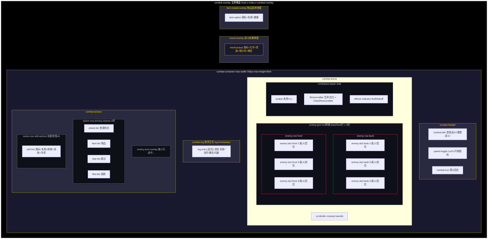

#### 11.2.3 敌人网格与稳定 key（P3-145）

| 层级 | v-for | key |
|------|-------|-----|
| 行 | `v-for="row in (['back', 'front'] as const)"` | row |
| 列 | `v-for="col in 3"` | `${row}-${col}` |
| 敌人 | `v-for="e in getEnemiesInSlot(row, col - 1)"` | e.id |
| Boss 演出台词 | `v-for="(line, i) in bossIntroLines"` | `line + '-' + i` |
| 战斗日志 | `v-for="(log, i) in logsReversed"` | `log.timestamp + '-' + i` |
| 技能栏 | `v-for="skill in equippedSkills"` | skill.id |
| 职业资源条 | `v-for="(sys, idx) in combatStore.resourceSystems"` | `'class-res-' + idx` |

敌人 combatant 状态类：`.shake`（受击震动）/ `.crit-shake`（暴击震动）/ `.dodge-blink`（闪避闪烁）/ `.defeated`（hp<=0，opacity 0.4 + grayscale）/ `.targeted`（targetEnemyId 命中且存活，金色边框发光）。空槽位 `.enemy-empty` 虚线边框显示"⬛ 空位"。Boss 敌人显示 `.boss-badge`（crowned-skull + "首领"）。效果徽章 `effect-{type}` 按增益（绿系）/减益（红系）分组着色，细分 poison/burn/stun/freeze/silence/vulnerable 等专属配色，展示剩余回合数。

#### 11.2.4 战斗日志

倒序渲染（logsReversed，带缓存的 computed：logs 引用未变时直接返回缓存数组），最新日志在最上，`watch(logs)` 后 nextTick 滚动到顶部。条目结构：`[回合]` + 消息 + 伤害（`-N`，physical-damage/magic-damage/crit-damage 配色与 pointy-sword/magic-swirl/sword-clash 图标）+ 治疗（`+N`，health-increase）+ "暴击！"/"闪避！"标记。消息按 actorType 着色：`log-player`/`log-enemy`/`log-system`。日志为空时显示"战斗即将开始..."。

#### 11.2.5 行动按钮

| 按钮 | 图标（渐变） | 禁用条件 |
|------|--------------|----------|
| 普通攻击 | sword-clash（physical） | !canAct |
| 物品 | potion-ball（heal） | !canAct \|\| !hasConsumables |
| 跳过 | next-button（metal） | !canAct |
| 逃跑 | run（dodge） | !canAct \|\| combatStore.hasBossEnemy |
| 技能 | skill.icon | !canAct \|\| !canCastSkill \|\| isOnCooldown |

技能按钮展示：图标 + 名称 + 效果文本（`skill-effect-{type}` 配色）+ 消耗（`skill-cost`，专属资源名或 N MP）+ 目标类型（`skill-target`，非单体的 all_enemies/self/ally）+ 冷却剩余（`skill-cooldown` 橙色）。canCastSkill 同时检查 MP（mpCost 可选，undefined 视为 0）与专属资源（ResourceSystemFactory.hasEnough）。技能列表取 equippedSkills 前 4 个，无装备时用 unlockedSkills 前 4 个。敌人回合时显示 `.enemy-turn-overlay`（"敌人行动中..."，uncertainty/shadow 图标，pulse 动画）。

#### 11.2.6 Boss 演出与阶段转换

- **出场演出**（useBossIntroOverlay，COMBAT_BOSS_INTRO 事件触发）：`.boss-intro-overlay` 全屏暗色遮罩 + backdrop-filter blur，内容含 48px 图标（dragon 渐变）、名称（金色文字辉光）、逐行台词（line-0/1/2，逐行滑入），动画由 anime.js 驱动（初始 opacity 0 / scale 0 / translateY）。
- **阶段转换**（useCombatAnimations，COMBAT_BOSS_PHASE 事件触发）：`.phase-transition-{effect}` 五种特效（darken 暗色 / flame 火焰 / freeze 冰冻 / lightning 雷电 / shake 震动），背景径向渐变遮罩 + "阶段转换"标签 + 阶段名称大字号（各特效专属配色与辉光），由 anime.js 驱动闪现与缩放进入。

#### 11.2.7 战斗结果

| 结果 | 文案 | 图标 | 渐变 | 文本配色 |
|------|------|------|------|----------|
| victory | 战斗胜利！ | laurel-crown | gold | @accent-color + 金色辉光 |
| defeat | 战斗失败... | death-skull | debuff | @color-danger-accent + 红色辉光 |
| fled | 成功逃跑！ | run | dodge | @color-dodge |

胜利时展示奖励行（`+expGained 经验` star-formation / `+goldGained 金币` two-coins）。结果弹窗由 anime.js `animateResultPopup` 播放入场动画（图标弹跳、文字滑入、奖励逐行滑入）。`useCombatAutoClose` 自动关闭：`combatResult === 'victory'` 延迟 3 秒，defeat/fled 延迟 2 秒，倒计时显示"X 秒后自动关闭"；点击"确定"（handleClose）立即关闭并 emit close（携带 result）。onUnmounted 清理自动关闭定时器与全部动画定时器。

#### 11.2.8 物品选择弹窗

战斗中点击"物品"（hasConsumables 时）打开 `.item-modal`：列表为背包中可消耗物品（item-option，key=item.itemId，ItemIcon 稀有度 + 名称/描述 + x数量），空列表显示"没有可用的物品"。点击条目调用 playerAction({ type: 'item', itemId })，按 HP/MP 差值计算恢复量并播放治疗特效，伤害型物品（卷轴等）播放震动/闪避/浮动数字/粒子特效。关闭按钮与遮罩点击（source='combat_item_modal_close'）关闭弹窗。

#### 11.2.9 战斗 composables 联动（QA-5 阶段四）

| Composable | 职责 | 关键暴露 |
|------------|------|----------|
| useCombatSpeed | 战斗倍速 | combatSpeed（只读 computed，1 或 2）+ toggleSpeed |
| useCombatAutoClose | 结果自动关闭 | autoCloseCountdown + scheduleAutoClose + clearAutoClose + handleClose（回调 emit close） |
| useBossIntroOverlay | Boss 出场演出 | showBossIntro / bossIntroIcon / bossIntroName / bossIntroLines / onBossIntro / dispose |
| useCombatAnimations | 战斗视觉特效 | 震动/闪避/浮动数字/屏幕闪白/VS 闪光/阶段转换状态与触发器 + onCritHit/onEnemyDealDamage/onDodge/onBossPhase/applyCombatDamageEffects |

组件 onMounted 注册事件（COMBAT_CRITICAL_HIT / COMBAT_DEAL_DAMAGE / COMBAT_DODGE / COMBAT_BOSS_INTRO / COMBAT_BOSS_PHASE），onUnmounted 统一解绑并清理定时器。动画定时器经 setAnimTimer 统一登记，卸载时 clearAllAnimationTimers 防泄漏（isUnmounted 守卫异步回调）。

### 11.3 移动端设计

`@media (max-width: 600px)`：combat-arena 纵向排列、vs-divider 隐藏、敌人网格保持 3 列（gap 4px，槽位 min-height 80px）、combat-log max-height 降至 120px、action-row 保持 4 列（字体 11px，padding 8px 4px）、技能按钮缩小（图标 16px/名称 10px/效果与消耗 9px）、浮动数字 18px（crit 24px）。

### 11.4 交互说明

| 交互 | 触发方式 | 响应 |
|------|----------|------|
| 选择目标 | 点击敌人 combatant | canAct 且存活时设置 targetEnemyId，金色高亮（source 无事件，仅状态） |
| 普通攻击 | 点击"普通攻击" | UI_CLICK(source='combat_attack') + playerAction({type:'attack'})，applyCombatDamageEffects 播放特效 |
| 使用技能 | 点击 skill-btn | UI_CLICK(source='combat_skill') + playerAction({type:'skill', skillId})，按技能类型播放物理/魔法特效，治疗技能触发 heal-glow 与粒子 |
| 使用物品 | 点击"物品" → 选择条目 | UI_CLICK(source='combat_item_btn'/'combat_use_item') + playerAction({type:'item'})，HP/MP 恢复或伤害特效 |
| 跳过回合 | 点击"跳过" | UI_CLICK(source='combat_skip') + skipTurn，内部 endPlayerTurn 自动调度敌人回合 |
| 逃跑 | 点击"逃跑" | UI_CLICK(source='combat_flee') + playerAction({type:'flee'})，Boss 战时禁用 |
| 倍速切换 | 点击 speed-toggle | toggleSpeed 在 1x/2x 间切换（图标 single-arrow/double-arrow） |
| 战斗结束 | 自动 / 点击"确定" | 结果弹窗 anime.js 入场 + victory 3 秒 / defeat·fled 2 秒自动关闭，或点击"确定"立即 emit close(result) |
| 回合恢复 | watch(turn) | 敌人回合结束切回 player 且无结果时恢复 isAnimating=false，可继续操作 |
