# 项目架构图

## 文档信息

| 项目 | 内容 |
|------|------|
| 标题 | 项目架构图 |
| 版本 | v5.0 |
| 生成日期 | 2026年8月13日 |
| 所属目录 | `doc/project/` |
| 关联文档 | MODULE_FUNCTIONS.md、DEPENDENCY_GRAPH.md、DATA_ARCHITECTURE_OVERVIEW.md |
| 更新说明 | admin 模块升级：AdminQueryService 从 src/services/ 迁入 modules/admin/queryService.ts（services 目录减至 4 个）；admin 后台组件群新增 DashboardPanel/ImportDialog/fields/ 子组件；数据持久化 v3 表名修正（config_class_equipment/config_set_definitions）；AdminQueryService 从服务层架构表中移除 |

---

## 概述

本文档通过 Mermaid 图表系统化呈现「战争艺术：地下城」项目的整体架构、模块内部分层、关键子系统设计与数据持久化方案，为开发与维护提供可视化参考。

当前 `src/modules/` 下共 21 个子模块目录：admin、animation、audio、base、boss、bus、character、combat、console、data、enemy、equipment、exploration、game、inventory、item-template、log、map、quest、shop、skill。其中 game 模块（P3-116）为全局游戏状态唯一持有者。

---

## 一、系统整体架构图

下图展示项目自上而下的七层架构，每层标注其代表性成员，箭头表示调用方向（上层 → 下层）。

```mermaid
graph TD
    %% ===== 第一层：UI 组件层（Vue Components）=====
    subgraph L1[UI 组件层 Vue Components]
        direction LR
        L1A[GameMain 游戏主界面]
        L1B[CharacterCreate 角色创建]
        L1C[CharacterSelect 角色选择]
        L1D[ExplorationView 探索视图]
        L1E[MapView 地图视图]
        L1F[popup 弹窗组件群<br/>CombatPopup/InventoryPopup/SkillsPopup/<br/>ShopPopup/QuestPopup/QuestBoardPopup/<br/>AdventureLogPopup/AudioSettingsPopup/<br/>CharacterInfoPopup/SystemPopup]
        L1G[common 通用组件群<br/>AlertPopup/BasePopup/BaseIcon/ClassResourceBar/<br/>ConfirmPopup/EffectTag/EmptyState/ItemIcon/<br/>ResourceBar/RiskIndicator/SkillTags/Tag/Toast]
        L1H[admin 后台组件群<br/>AdminLayout/DashboardPanel/<br/>AdminTable/AdminForm/ConfigManager/<br/>ImportDialog + fields/ 7 子组件]
    end

    %% ===== 第二层：Composables 层 =====
    subgraph L2[Composables 层]
        direction LR
        L2A[useSkillDisplay 技能展示]
        L2B[useToast 全局提示]
        L2C[useResponsiveGrid 响应式网格]
    end

    %% ===== 第 2.5 层：服务层=====
    subgraph L2S[服务层 Services]
        direction LR
        L2S1[CrossModuleQuery<br/>跨模块查询]
        L2S2[GameBootstrap<br/>初始化编排]
        L2S3[ErrorHandler<br/>统一错误处理]
        L2S4[CharacterLifecycleService<br/>角色生命周期服务]
    end

    %% AdminQueryService 已迁入 modules/admin/queryService.ts

    %% ===== 第三层：玩法核心层 =====
    subgraph L3[玩法核心层]
        direction LR
        L3A[combat 战斗]
        L3B[exploration 探索]
        L3C[map 地图]
        L3D[shop 商店]
    end

    %% ===== 第四层：核心数据层 =====
    subgraph L4[核心数据层]
        direction LR
        L4A[character 角色]
        L4B[inventory 背包]
        L4C[equipment 装备]
        L4D[skill 技能]
        L4E[quest 任务]
    end

    %% ===== 第五层：辅助模块层 =====
    subgraph L5[辅助模块层]
        direction LR
        L5A[log 冒险日志]
        L5B[enemy 敌人]
        L5C[boss Boss]
    end

    %% ===== 第六层：基础设施层 =====
    subgraph L6[基础设施层]
        direction LR
        L6A[data 数据核心]
        L6B[bus 事件总线]
        L6C[base 基础数据]
        L6D[admin 后台管理]
        L6E[audio 音频]
        L6F[animation 动画]
        L6G[item-template 统一物品模板]
        L6H[game 全局状态<br/>useGameStore]
    end

    %% ===== 第七层：工具与配置层 =====
    subgraph L7[工具与配置层]
        direction LR
        L7A[utils/calculations 计算工具]
        L7B[config/* 配置<br/>character/combat-colors/<br/>database/inventory]
        L7C[data/config_* 静态数据<br/>config_bosses/config_classes/<br/>config_class_equipment/config_class_passives/<br/>config_class_talents/config_equipmentItems/<br/>config_factions/config_set_definitions/config_items/<br/>config_locations/config_mobs/config_quests/<br/>config_races/config_shops/config_skills]
    end

    %% ===== 层间调用关系 =====
    L1 --> L2
    L1 --> L2S
    L1 --> L3
    L1 --> L4
    L2 --> L4
    L2S --> L3
    L2S --> L4
    L2S --> L6
    L3 --> L2S
    L3 --> L4
    L3 --> L5
    L4 --> L5
    L5 --> L6
    L4 --> L6
    L3 --> L6
    L6 --> L7
    L4 --> L7

    %% ===== 样式定义 =====
    classDef uiLayer fill:#ffe0b2,stroke:#e65100,color:#000
    classDef compLayer fill:#fff9c4,stroke:#f57f17,color:#000
    classDef svcLayer fill:#f8bbd0,stroke:#ad1457,color:#000
    classDef playLayer fill:#c5e1a5,stroke:#33691e,color:#000
    classDef dataLayer fill:#b3e5fc,stroke:#01579b,color:#000
    classDef auxLayer fill:#d1c4e9,stroke:#311b92,color:#000
    classDef infraLayer fill:#ffccbc,stroke:#bf360c,color:#000
    classDef toolLayer fill:#cfd8dc,stroke:#37474f,color:#000

    class L1A,L1B,L1C,L1D,L1E,L1F,L1G,L1H uiLayer
    class L2A,L2B,L2C compLayer
    class L2S1,L2S2,L2S3,L2S4,L2S5 svcLayer
    class L3A,L3B,L3C,L3D playLayer
    class L4A,L4B,L4C,L4D,L4E dataLayer
    class L5A,L5B,L5C auxLayer
    class L6A,L6B,L6C,L6D,L6E,L6F,L6G,L6H infraLayer
    class L7A,L7B,L7C toolLayer
```

**分层说明**：

| 层级 | 职责 | 主要成员 |
|------|------|----------|
| UI 组件层 | 用户交互与视图渲染 | GameMain、CharacterCreate/Select、ExplorationView、MapView、popup/、common/（含 BaseIcon/ClassResourceBar/RiskIndicator）、admin/ |
| Composables 层 | 跨组件复用的组合式逻辑 | useSkillDisplay、useToast、useResponsiveGrid |
| 服务层 | 跨模块查询、初始化编排、错误处理、角色生命周期 | CrossModuleQuery、GameBootstrap、ErrorHandler、CharacterLifecycleService（AdminQueryService 已迁入 modules/admin/queryService.ts） |
| 玩法核心层 | 游戏核心玩法编排 | combat、exploration、map、shop |
| 核心数据层 | 角色相关业务数据管理 | character、inventory、equipment、skill、quest |
| 辅助模块层 | 为玩法层提供辅助能力 | log、enemy、boss |
| 基础设施层 | 数据/事件/音频/全局状态/物品模板等基础能力 | data、bus、base、admin（含 AdminQueryService）、audio、animation、item-template、game（全局状态唯一持有者，P3-116） |
| 工具与配置层 | 纯函数工具与静态配置 | utils/calculations、config/*、data/config_*（含 config_class_equipment/config_class_passives/config_class_talents/config_set_definitions） |

**服务层说明**：`services/ItemTemplateCache.ts` 已删除（P3-116），物品模板统一缓存收敛到 `modules/item-template`。`AdminQueryService` 从 `src/services/` 迁入 `modules/admin/queryService.ts`。services 目录现存 4 个服务。

---

## 二、模块内部分层架构

每个业务模块遵循统一的 5 层结构，自顶向下依次为入口、类型、持久化、状态、服务。下图展示标准调用关系。

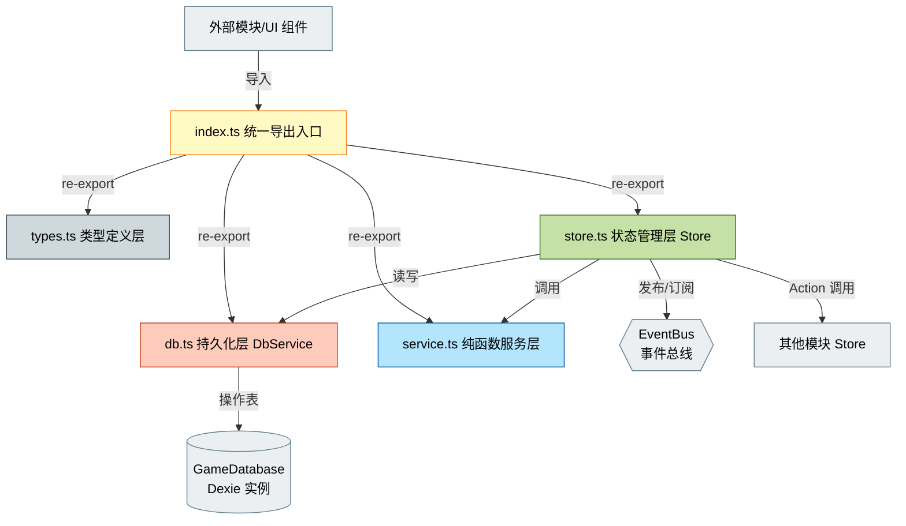

**各层职责说明**：

| 文件 | 职责 | 约束 |
|------|------|------|
| `index.ts` | 统一导出入口，聚合对外暴露的 API | 不含业务逻辑 |
| `types.ts` | 类型定义、枚举、接口 | 不含运行时逻辑 |
| `db.ts` | DbService 持久化层，封装表读写 | 不持有响应式状态 |
| `store.ts` | Pinia Store，响应式状态与 Action 编排 | 唯一数据源 |
| `service.ts` | 纯函数服务层，无副作用计算 | 不调用 DB、不 emit 事件 |

**特例说明**：

| 模块 | 结构差异 |
|------|----------|
| `game`（P3-116） | 仅含 index/types/store 三层，无 db.ts 与 service.ts。全局状态直接委托 data 模块的 `gameStateHelper` 持久化到 runtime_gameState 表（详见第九节） |
| `console` | 非五层结构，采用 framework.ts（框架核心）+ commands/（7 个命令文件：character/inventory/combat/skill/exploration/quest/system）的命令注册表模式，由 `initConsole()` 挂载到 window.cmd |
| `item-template` | 含 cache.ts（unifiedItemTemplateCache 统一物品模板缓存），承接原 services/ItemTemplateCache 的职责 |

---

## 三、战斗模块架构详解

战斗模块通过 composables 拆分降低复杂度，并包含 effects、ai、resources、forms、pets 五大子系统。战斗上下文（combatContext.ts）将 combat 对 character/skill/quest/log/enemy/inventory 六个外部 Store 的依赖收口为单一接口，并拆分为只读的 `ICombatQuery` 与写入的 `ICombatCommand`。

### 3.1 Composables 组合架构

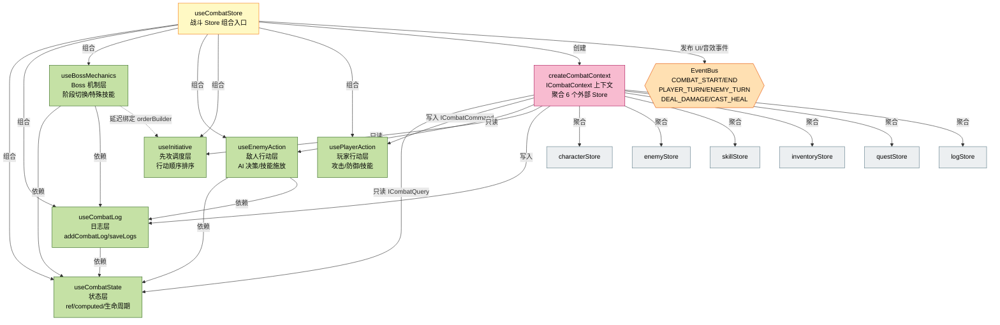

**战斗上下文（combatContext.ts）读写分离设计**：

| 接口 | 职责 | 暴露内容 | 适用场景 |
|------|------|----------|----------|
| `ICombatQuery` | 只读查询 | character 只读属性（name/classId/hp/maxHp/attributes/effectiveStats）、skill.getSkill、enemy 查询方法、inventory.getItemInfo | 只读 composable（编译期保证无副作用） |
| `ICombatCommand` | 写入命令 | character 状态变更（takeDamage/gainExp/gainGold/handleDeath/receiveHeal/changeMp）、skill.castSkill/tickCooldowns、enemy 状态变更、quest.onEnemyKilled、log.addLogEntry、inventory.useItem/addItem | 需要修改外部状态的 composable |
| `ICombatContext` | 完整上下文 | `ICombatQuery & ICombatCommand` 交集类型 | 向后兼容所有现有 composable |

### 3.2 Effects 子系统（Buff/Debuff 效果系统）

采用「管线 → 容器 → 处理器」的三层结构，支持 15 种内置效果。

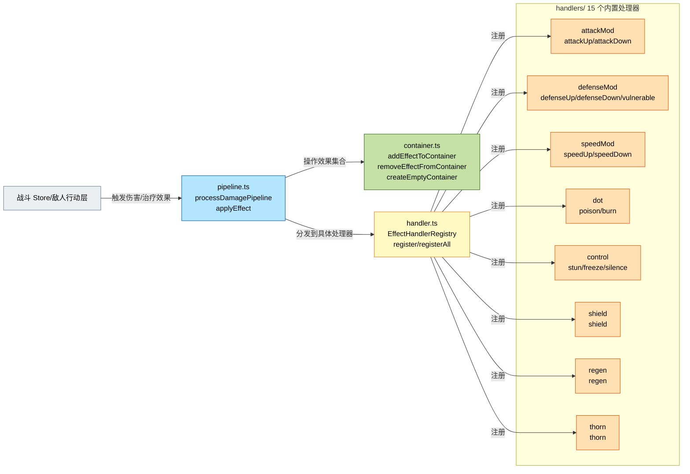

### 3.3 AI 子系统（策略模式）

采用策略模式实现敌人 AI，支持四种行为策略与三种目标选择器。

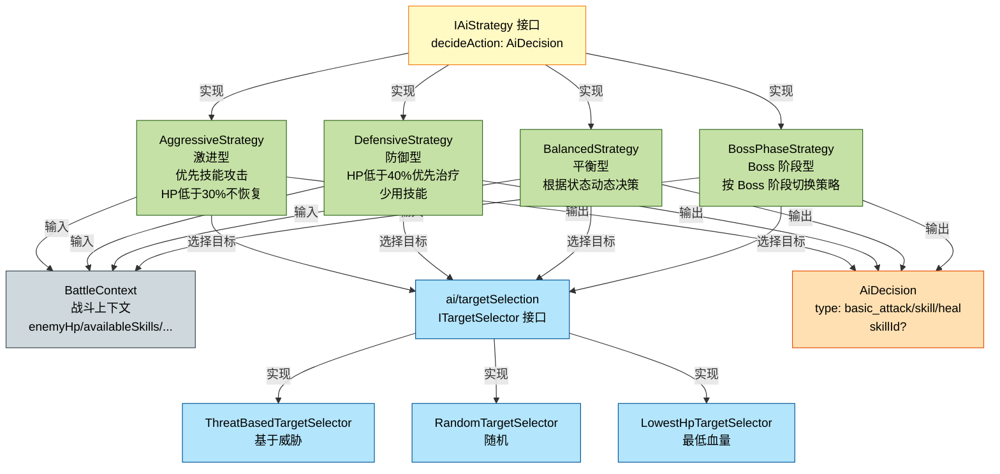

### 3.4 战斗子模块架构图

战斗模块内部包含 `resources / forms / pets / effects / ai / composables` 六大子目录，配合 `combatContext.ts` 上下文工厂，形成完整的职业差异化与战斗扩展能力。下图展示各子模块之间的协作关系。

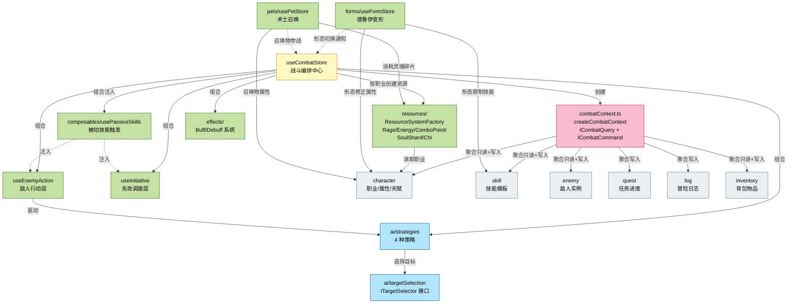

**子模块协作说明**：

| 子模块 | 类型 | 协作方式 |
|--------|------|----------|
| `combatContext.ts` | 上下文工厂 | `createCombatContext` 聚合 character/skill/enemy/quest/log/inventory 六个外部 Store，拆分为 `ICombatQuery`（只读）与 `ICombatCommand`（写入），是 combat 模块内唯一引用外部 Store 的位置 |
| `resources/` | 资源系统 | `ResourceSystemFactory` 按角色职业创建对应资源系统（怒气/能量/连击点/灵魂碎片/真气），由 combat Store 持有并在回合内消耗/回复 |
| `composables/usePassiveSkills` | 被动技能 | 作为组合式函数被 combat Store 创建，再注入到 `useEnemyAction` 与 `useInitiative`，在敌人行动与先攻调度时触发被动效果 |
| `forms/` | 德鲁伊变形 | 独立 `useFormStore`，形态切换时修正角色属性、限制可用技能，并通知 combat Store 重建先攻 |
| `pets/` | 术士召唤 | 独立 `usePetStore`，召唤物属性基于角色计算，消耗灵魂碎片资源，参战行动由 combat Store 驱动 |
| `ai/targetSelection` | 目标选择 | 实现 `ITargetSelector` 接口（ThreatBased/Random/LowestHp 三种），被 4 种 AI 策略调用以选择攻击目标 |
| `effects/` | 效果系统 | 既有三层结构（管线-容器-处理器），由 combat Store 与敌人行动层驱动 |

---

## 四、探索模块架构详解

探索模块采用「Store 编排 + Service 纯函数 + events.ts 注册表」模式，通过 UI 回调与 EventBus 与外部交互。事件处理器注册表（events.ts）采用两层注册表模式，将事件类型与处理函数的映射关系从 store.ts 中解耦。P3-153 后，`currentCharacterId` 已收敛到 GameStore，explorationStore 通过只读 computed 代理访问。

```mermaid
graph TD
    %% ===== Store 层 =====
    store[useExplorationStore<br/>状态编排层<br/>currentAreaId/grid/playerPosition]

    %% ===== Service 纯函数层 =====
    subgraph service[service.ts 纯函数集]
        direction TB
        s1[generateGrid 生成网格]
        s2[findStartPosition 寻找起点]
        s3[updateAccessibleCells 更新可达格]
        s4[generateTrapDamage 陷阱伤害]
        s5[generateRandomEvent 随机事件]
        s5a[generateMultiOptionEvent 多选项事件]
        s6[generateCampHeal 营地治疗]
        s7[generateItemForCell 格子物品]
        s8[computeEventProbability 事件概率]
        s9[buildItemPool 物品池]
    end

    %% ===== events.ts 注册表层 =====
    subgraph events[events.ts 事件处理器注册表]
        direction TB
        e1[effectHandlers<br/>RandomEventEffectType 处理器<br/>heal/mana/exp/damage/mpLoss/gold]
        e2[cellEventHandlers<br/>CellType 格子事件处理器<br/>treasure/trap/event/rest]
        e3[applyEventEffect 分发函数]
        e4[dispatchCellEvent 分发函数]
    end

    %% ===== UI 回调机制 =====
    uiCb[registerUICallbacks<br/>UI 回调注册]
    uiComp[GameMain/ExplorationView<br/>UI 组件]

    %% ===== EventBus 监听 =====
    bus{{EventBus}}
    combatEnd[COMBAT_END 事件]
    onBattleResult[onBattleResult 处理函数]

    %% ===== 跨模块交互 =====
    triggerBattle[triggerBattle 触发战斗]
    combatPopup[CombatPopup 战斗弹窗]
    charStore[characterStore]
    invStore[inventoryStore]
    logStore[logStore]
    gameStore[gameStore<br/>currentCharacterId 代理]
    crossModuleQuery[CrossModuleQuery 跨模块查询]

    %% ===== 持久化 =====
    db[(explorationDbService)]

    %% ===== 调用关系 =====
    store -->|调用纯函数| s1
    store -->|调用纯函数| s2
    store -->|调用纯函数| s3
    store -->|调用纯函数| s9

    store -->|分发格子事件| e4
    e4 -->|查找处理器| e2
    e2 -->|内部调用| e3
    e3 -->|查找处理器| e1
    e2 -->|调用纯函数| s4
    e2 -->|调用纯函数| s5
    e2 -->|调用纯函数| s5a
    e2 -->|调用纯函数| s6
    e2 -->|调用纯函数| s7

    store -->|读写| db

    %% ===== UI 回调链 =====
    uiComp -->|注册回调| uiCb
    uiCb -->|持有| store
    store -->|触发回调| uiComp

    %% ===== EventBus 监听链 =====
    store -->|订阅| bus
    bus -->|派发| combatEnd
    combatEnd -->|触发| onBattleResult
    onBattleResult -->|更新| store

    %% ===== 跨模块查询 =====
    store -->|crossModuleQuery| crossModuleQuery
    crossModuleQuery -->|查询| charStore
    crossModuleQuery -->|查询| invStore

    %% ===== 全局状态代理（P3-153）=====
    store -->|只读代理| gameStore

    %% ===== 跨模块战斗交互 =====
    store -->|triggerBattle| triggerBattle
    triggerBattle -->|打开| combatPopup
    combatPopup -->|战斗结束发布| combatEnd

    %% ===== 跨模块 Store 调用 =====
    e2 -->|takeDamage/receiveHeal/gainGold| charStore
    e2 -->|addItem| invStore
    e2 -->|addLogEntry| logStore

    %% ===== 样式 =====
    classDef storeLayer fill:#c5e1a5,stroke:#33691e,color:#000
    classDef svcLayer fill:#b3e5fc,stroke:#01579b,color:#000
    classDef evtLayer fill:#f8bbd0,stroke:#ad1457,color:#000
    classDef uiLayer fill:#ffe0b2,stroke:#e65100,color:#000
    classDef busLayer fill:#fff9c4,stroke:#f57f17,color:#000
    classDef cbLayer fill:#d1c4e9,stroke:#311b92,color:#000
    classDef extLayer fill:#eceff1,stroke:#607d8b,color:#000

    class store storeLayer
    class s1,s2,s3,s4,s5,s5a,s6,s7,s8,s9 svcLayer
    class e1,e2,e3,e4 evtLayer
    class uiCb,uiComp,combatPopup uiLayer
    class bus busLayer
    class combatEnd,onBattleResult,triggerBattle cbLayer
    class charStore,invStore,logStore,gameStore,crossModuleQuery,db extLayer
```

**探索模块关键机制说明**：

| 机制 | 说明 |
|------|------|
| 纯函数服务层 | `service.ts` 提供 generateGrid/findStartPosition/updateAccessibleCells/generateTrapDamage/generateRandomEvent/generateMultiOptionEvent/generateCampHeal/generateItemForCell/computeEventProbability/buildItemPool 等无副作用函数 |
| 两层事件注册表 | `events.ts` 的 `cellEventHandlers`（按格子类型）+ `effectHandlers`（按效果类型），由 `dispatchCellEvent` / `applyEventEffect` 分发，与 store.ts 解耦 |
| UI 回调 | `registerUICallbacks` 注册回调对象，探索触发战斗/营地/物品/随机事件等时回调 UI 组件展示 |
| EventBus 联动 | 订阅 `COMBAT_END` 事件，通过 `onBattleResult` 结算战斗结果并更新探索状态 |
| 全局状态代理 | P3-153 后 `currentCharacterId` 为只读 computed 代理 `gameStore.currentCharacterId`，由 GameBootstrap/角色模块先设置再进入探索 |
| 持久化 | 经 `explorationDbService` 读写 `char_exploration` 表（绑定角色 ID） |

---

## 五、数据持久化架构

数据库基于 Dexie 封装 IndexedDB，`GameDatabase` 单例（`db`）统一持有 27 张表，按数据性质分为三类：配置表（config_*，游戏定义数据，所有角色共享）、角色表（char_*，绑定角色 ID，每个角色独立）、运行时表（runtime_*，日志与临时状态）。

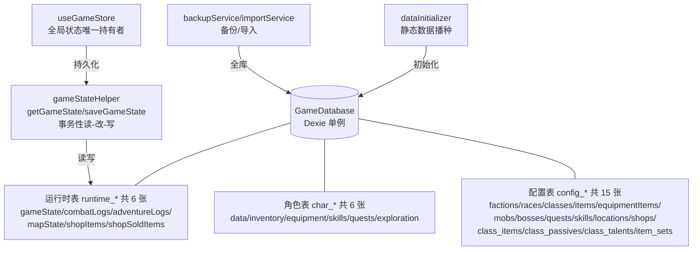

**数据库版本演进（core.ts）**：

| 版本 | 变更 |
|------|------|
| v1 | 初始建表：11 张 config_* + 6 张 char_* + 5 张 runtime_* |
| v2 | 新增 `runtime_shopSoldItems`（BIZ-16 商店回购列表持久化） |
| v3 | 新增 `config_class_equipment` / `config_class_passives` / `config_class_talents` / `config_set_definitions`（DATA-4 职业专属配置持久化，供 admin 后台编辑） |

**27 张表清单**：

| 类别 | 数量 | 表名 |
|------|------|------|
| 配置表 config_* | 15 | config_factions、config_races、config_classes、config_items、config_equipmentItems、config_mobs、config_bosses、config_quests、config_skills、config_locations、config_shops、config_class_equipment、config_class_passives、config_class_talents、config_set_definitions |
| 角色表 char_* | 6 | char_data、char_inventory、char_equipment、char_skills、char_quests、char_exploration |
| 运行时表 runtime_* | 6 | runtime_gameState、runtime_combatLogs、runtime_adventureLogs、runtime_mapState、runtime_shopItems、runtime_shopSoldItems |

**runtime_gameState 表（P3-116 收敛）**：全局游戏状态唯一落地点，`id='gameState'` 单条记录，字段含 currentCharacterId/currentShopId/lastPlayedAt/initializedAt/gameSettings。P3-116 后原 `audio_settings` 键的数据在 GameStore 初始化时迁移合并到 `gameSettings` 字段并删除旧键；`settings`（soundEnabled/musicEnabled）与 `maxLevel` 字段已废弃，仅保留向后兼容。

---

## 六、事件总线架构

事件总线由 `bus` 模块提供：`GameEvents` 枚举定义全部事件名常量，`GameEventPayloadMap` 接口建立「事件名 → 载荷类型」的编译期映射，`EventBus` 类实现 `IEventBus` 接口（on/off/emit/once/onGroup/clearGroup/clearAll/removeEvent），全局单例 `eventBus` 供各模块发布订阅。

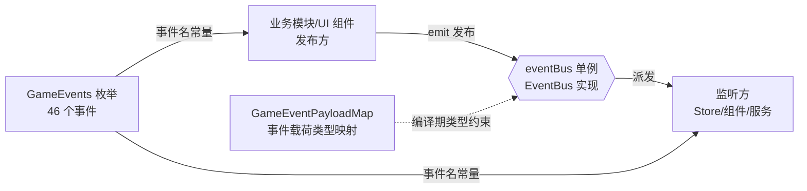

**事件分组统计（共 46 个）**：

| 分组 | 数量 | 事件 |
|------|------|------|
| 角色 | 6 | CHARACTER_CREATED / CHARACTER_DELETED / CHARACTER_LOGOUT / CHARACTER_LEVEL_UP / CHARACTER_DEATH / CHARACTER_RESURRECTED |
| 战斗 | 8 | COMBAT_START / COMBAT_END / COMBAT_PLAYER_TURN / COMBAT_ENEMY_TURN / COMBAT_DEAL_DAMAGE / COMBAT_CAST_HEAL / COMBAT_CRITICAL_HIT / COMBAT_DODGE |
| 探索 | 8 | EXPLORATION_START / EXPLORATION_END / EXPLORATION_CELL_EXPLORED / EXPLORATION_BATTLE_TRIGGERED / EXPLORATION_CAMP_USED / EXPLORATION_ITEM_FOUND / EXPLORATION_TRAP_TRIGGERED / EXPLORATION_RANDOM_EVENT |
| 区域 | 1 | ZONE_ENTERED |
| 商店 | 3 | SHOP_OPENED / SHOP_TRANSACTION / SHOP_CLOSED |
| 任务 | 4 | QUEST_BOARD_OPENED / QUEST_ACCEPTED / QUEST_COMPLETED / QUEST_REWARDED |
| 技能 | 2 | SKILL_LEARNED / SKILL_CAST |
| 游戏数据 | 1 | GAME_DATA_UPDATED |
| 日志 | 1 | LOG_ENTRY_ADDED |
| UI | 5 | UI_PANEL_OPENED / UI_PANEL_CLOSED / UI_CLICK / CONFIRM_CONFIRMED / CONFIRM_CANCELED |
| 物品 | 2 | ITEM_DROPPED / INVENTORY_FULL |
| 战斗补充 | 3 | COMBAT_SKIP_TURN / COMBAT_BOSS_INTRO / COMBAT_BOSS_PHASE |
| 存档 | 2 | DATA_EXPORTED / DATA_IMPORTED |

---

## 七、服务层架构

`src/services/` 目录提供跨模块的通用服务，现存 4 个服务（原 `ItemTemplateCache.ts` 已删除 ARCH-1，`AdminQueryService` 已迁入 `modules/admin/queryService.ts`）。

| 服务 | 职责 |
|------|------|
| `CrossModuleQuery` | 跨模块查询，向战斗/探索等玩法层提供角色、物品等联合查询能力 |
| `GameBootstrap` | 游戏初始化编排，按依赖顺序并行初始化各模块 Store（P3-128 四层并行：log+inventory → 注入回调 → equipment+skill+map → exploration → quest），并统一清理（Disposable 接口） |
| `ErrorHandler` | 统一错误处理入口（errorHandler） |
| `CharacterLifecycleService` | 角色生命周期服务（CHR-4），收口角色创建/删除的跨模块持久化逻辑 |

> **注**：`AdminQueryService` 原列于此表，已迁入 `modules/admin/queryService.ts`，作为 admin 模块的一部分导出，收口控制台命令模块对 enemy/boss/inventory/equipment DbService 的查询依赖（CHR-5）。

---

## 八、音频模块架构

P3-116 后音频模块不再直接访问 IndexedDB：`audio/db.ts` 已删除（audioDbService 移除），音频设置收敛到 `GameStore.gameSettings`，`useAudioStore.settings` 为只读 computed 代理，修改统一经 `gameStore.updateGameSettings()` 触发持久化。P3-141 后 `audioService`（依赖 Tone.js）不再从模块入口静态导出，仅在 main.ts 中通过动态 import 懒加载。

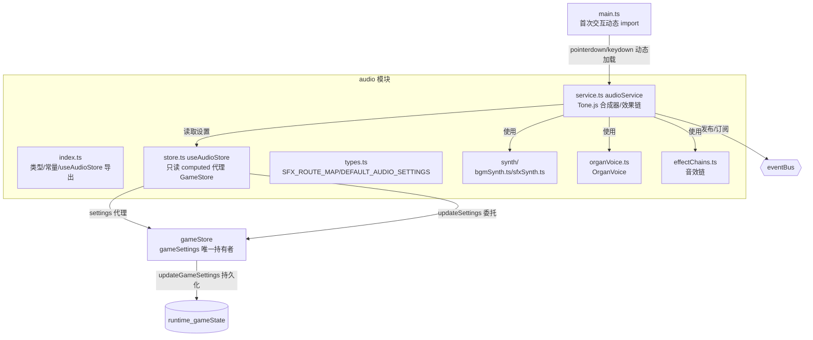

**依赖关系（P3-116 重构后）**：audio 模块仅依赖 `bus` + `game` 两个模块，不再依赖 `data`；持久化职责完全由 GameStore 承担。`useAudioStore` 提供 updateSettings/toggleMute 等 setter（内部委托 gameStore.updateGameSettings）与 flushSave（委托 gameStore.flushPersist，向后兼容接口）。

---

## 九、全局状态收敛与启动流程

### 9.1 game 模块（全局状态唯一持有者，P3-116）

`src/modules/game/` 仅含 index/types/store 三层，无 db.ts 与 service.ts。`useGameStore` 收敛原散落在 character/db.ts、shop/db.ts、audio/db.ts 中的 GameState 操作，成为全局游戏状态的唯一持有者。

| 内容 | 说明 |
|------|------|
| 状态 | currentCharacterId、currentShopId、gameSettings、lastPlayedAt、initializedAt、isInitialized |
| Action | initialize（迁移旧 audio_settings 键 → 加载 gameState 记录 → 恢复状态）、setCurrentCharacterId、setCurrentShopId、updateGameSettings、flushPersist |
| 查询辅助 | getCurrentCharacterId / getCurrentShopId / getGameSettings（同步快照） |
| 持久化 | 经 data 模块 `gameStateHelper`（getGameState/saveGameState，事务性读-改-写）写入 `runtime_gameState` 表 id='gameState' |
| 消费方 | characterStore.currentCharacterId、shopStore.currentShopId、explorationStore.currentCharacterId（P3-153）、audioStore.settings 均为只读 computed 代理；修改统一走 gameStore.setXxx()/updateGameSettings() 触发持久化 |

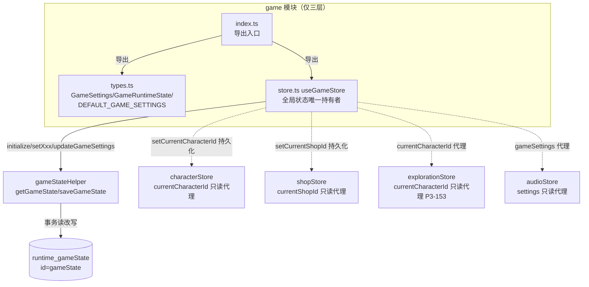

### 9.2 启动流程

启动时序分为两个阶段：main.ts 负责「打开数据库 → 初始化数据 → 挂载应用」，App.vue 挂载后按依赖顺序初始化各模块 Store（P3-127：数据初始化移至 mount 之前完成，App.vue 不再重复调用）。

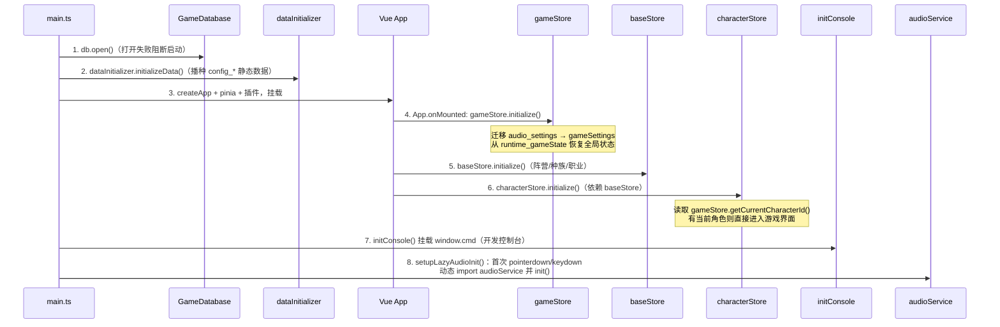

### 9.3 顶层导出（ARCH-6）

`src/modules/index.ts` 已从 `export *` 改为显式命名导出（ARCH-6），消除 `export *` 的「重名静默覆盖/歧义排除」隐患，重名问题在编译期直接报错；新增 game 段导出（`useGameStore` / `GameSettings` / `GameRuntimeState` / `DEFAULT_GAME_SETTINGS`）。audio 段按 P3-141 约定不导出 `audioService`（避免静态引用拉入 Tone.js），仅导出类型、`SFX_ROUTE_MAP`、`DEFAULT_AUDIO_SETTINGS`、`useAudioStore`。

---

## 版本历史

| 日期 | 版本 | 作者 | 说明 |
|------|------|------|------|
| 2026-08-03 | v4.0 | System | 依据 P3-116「全局状态收敛与持久化重构」源码核验全文：新增 game 模块、音频依赖修正、顶层显式导出（ARCH-6）；补全第四节探索模块架构图（原文档截断）；新增数据持久化/事件总线/服务层/音频模块/全局状态收敛与启动流程章节；模块目录 21 个、数据库 27 张表、事件总线 46 个事件 |
