# 项目架构图

## 文档信息

| 项目 | 内容 |
|------|------|
| 标题 | 项目架构图 |
| 版本 | v1.0 |
| 生成日期 | 2026年7月6日 |
| 所属目录 | `doc/project/` |
| 关联文档 | MODULE_FUNCTIONS.md、DEPENDENCY_GRAPH.md、DATA_ARCHITECTURE_OVERVIEW.md |

---

## 概述

本文档通过 Mermaid 图表系统化呈现「战争艺术：地下城」项目的整体架构、模块内部分层、关键子系统设计与数据持久化方案，为开发与维护提供可视化参考。

---

## 一、系统整体架构图

下图展示项目自上而下的七层架构，每层标注其代表性成员，箭头表示调用方向（上层 → 下层）。

```mermaid
graph TD
    %% ===== 第一层：UI 组件层（Vue Components）=====
    subgraph L1[UI 组件层 Vue Components]
        direction LR
        L1A[GameMain 游戏主界面]
        L1B[CharacterCreate 角色创建]
        L1C[CharacterSelect 角色选择]
        L1D[ExplorationView 探索视图]
        L1E[MapView 地图视图]
        L1F[popup 弹窗组件群<br/>CombatPopup/InventoryPopup/SkillsPopup/<br/>ShopPopup/QuestPopup/QuestBoardPopup/<br/>AdventureLogPopup/AudioSettingsPopup/<br/>CharacterInfoPopup/SystemPopup]
        L1G[common 通用组件群<br/>AlertPopup/BasePopup/ConfirmPopup/<br/>EffectTag/EmptyState/ItemIcon/<br/>ResourceBar/SkillTags/Tag/Toast]
        L1H[admin 后台组件群<br/>AdminForm/AdminLayout/<br/>AdminTable/ConfigManager]
    end

    %% ===== 第二层：Composables 层 =====
    subgraph L2[Composables 层]
        direction LR
        L2A[useSkillDisplay 技能展示]
        L2B[useToast 全局提示]
    end

    %% ===== 第 2.5 层：服务层=====
    subgraph L2S[服务层 Services]
        direction LR
        L2S1[CrossModuleQuery<br/>跨模块查询]
        L2S2[GameBootstrap<br/>初始化编排]
        L2S3[ItemTemplateCache<br/>物品模板缓存]
        L2S4[ErrorHandler<br/>统一错误处理]
    end

    %% ===== 第三层：玩法核心层 =====
    subgraph L3[玩法核心层]
        direction LR
        L3A[combat 战斗]
        L3B[exploration 探索]
        L3C[map 地图]
        L3D[shop 商店]
    end

    %% ===== 第四层：核心数据层 =====
    subgraph L4[核心数据层]
        direction LR
        L4A[character 角色]
        L4B[inventory 背包]
        L4C[equipment 装备]
        L4D[skill 技能]
        L4E[quest 任务]
    end

    %% ===== 第五层：辅助模块层 =====
    subgraph L5[辅助模块层]
        direction LR
        L5A[log 冒险日志]
        L5B[enemy 敌人]
        L5C[boss Boss]
    end

    %% ===== 第六层：基础设施层 =====
    subgraph L6[基础设施层]
        direction LR
        L6A[data 数据核心]
        L6B[bus 事件总线]
        L6C[base 基础数据]
        L6D[admin 后台管理]
        L6E[audio 音频]
        L6F[animation 动画]
    end

    %% ===== 第七层：工具与配置层 =====
    subgraph L7[工具与配置层]
        direction LR
        L7A[utils/calculations 计算工具]
        L7B[config/* 配置<br/>character/combat-colors/<br/>database/inventory]
        L7C[data/config_* 静态数据<br/>config_bosses/config_classes/<br/>config_equipmentItems/config_factions/<br/>config_items/config_locations/<br/>config_mobs/config_quests/<br/>config_races/config_shops/<br/>config_skills]
    end

    %% ===== 层间调用关系 =====
    L1 --> L2
    L1 --> L2S
    L1 --> L3
    L1 --> L4
    L2 --> L4
    L2S --> L3
    L2S --> L4
    L3 --> L2S
    L3 --> L4
    L3 --> L5
    L4 --> L5
    L5 --> L6
    L4 --> L6
    L3 --> L6
    L6 --> L7
    L4 --> L7

    %% ===== 样式定义 =====
    classDef uiLayer fill:#ffe0b2,stroke:#e65100,color:#000
    classDef compLayer fill:#fff9c4,stroke:#f57f17,color:#000
    classDef svcLayer fill:#f8bbd0,stroke:#ad1457,color:#000
    classDef playLayer fill:#c5e1a5,stroke:#33691e,color:#000
    classDef dataLayer fill:#b3e5fc,stroke:#01579b,color:#000
    classDef auxLayer fill:#d1c4e9,stroke:#311b92,color:#000
    classDef infraLayer fill:#ffccbc,stroke:#bf360c,color:#000
    classDef toolLayer fill:#cfd8dc,stroke:#37474f,color:#000

    class L1A,L1B,L1C,L1D,L1E,L1F,L1G,L1H uiLayer
    class L2A,L2B compLayer
    class L2S1,L2S2,L2S3,L2S4 svcLayer
    class L3A,L3B,L3C,L3D playLayer
    class L4A,L4B,L4C,L4D,L4E dataLayer
    class L5A,L5B,L5C auxLayer
    class L6A,L6B,L6C,L6D,L6E,L6F infraLayer
    class L7A,L7B,L7C toolLayer
```

**分层说明**：

| 层级 | 职责 | 主要成员 |
|------|------|----------|
| UI 组件层 | 用户交互与视图渲染 | GameMain、CharacterCreate/Select、ExplorationView、MapView、popup/、common/、admin/ |
| Composables 层 | 跨组件复用的组合式逻辑 | useSkillDisplay、useToast |
| 服务层 | 跨模块查询、初始化编排、缓存与错误处理 | CrossModuleQuery、GameBootstrap、ItemTemplateCache、ErrorHandler |
| 玩法核心层 | 游戏核心玩法编排 | combat、exploration、map、shop |
| 核心数据层 | 角色相关业务数据管理 | character、inventory、equipment、skill、quest |
| 辅助模块层 | 为玩法层提供辅助能力 | log、enemy、boss |
| 基础设施层 | 数据/事件/音频等基础能力 | data、bus、base、admin、audio、animation |
| 工具与配置层 | 纯函数工具与静态配置 | utils/calculations、config/*、data/config_* |

---

## 二、模块内部分层架构

每个业务模块遵循统一的 5 层结构，自顶向下依次为入口、类型、持久化、状态、服务。下图展示标准调用关系。

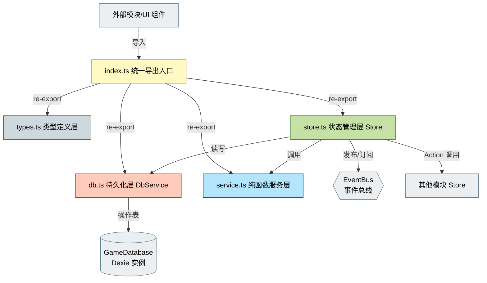

**各层职责说明**：

| 文件 | 职责 | 约束 |
|------|------|------|
| `index.ts` | 统一导出入口，聚合对外暴露的 API | 不含业务逻辑 |
| `types.ts` | 类型定义、枚举、接口 | 不含运行时逻辑 |
| `db.ts` | DbService 持久化层，封装表读写 | 不持有响应式状态 |
| `store.ts` | Pinia Store，响应式状态与 Action 编排 | 唯一数据源 |
| `service.ts` | 纯函数服务层，无副作用计算 | 不调用 DB、不 emit 事件 |

---

## 三、战斗模块架构详解

战斗模块通过 composables 拆分降低复杂度，并包含 effects 与 ai 两个子系统。

### 3.1 Composables 组合架构

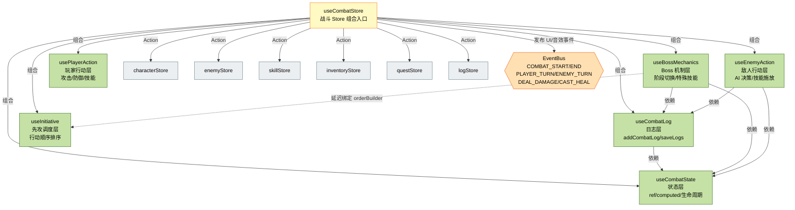

### 3.2 Effects 子系统（Buff/Debuff 效果系统）

采用「管线 → 容器 → 处理器」的三层结构，支持 15 种内置效果。

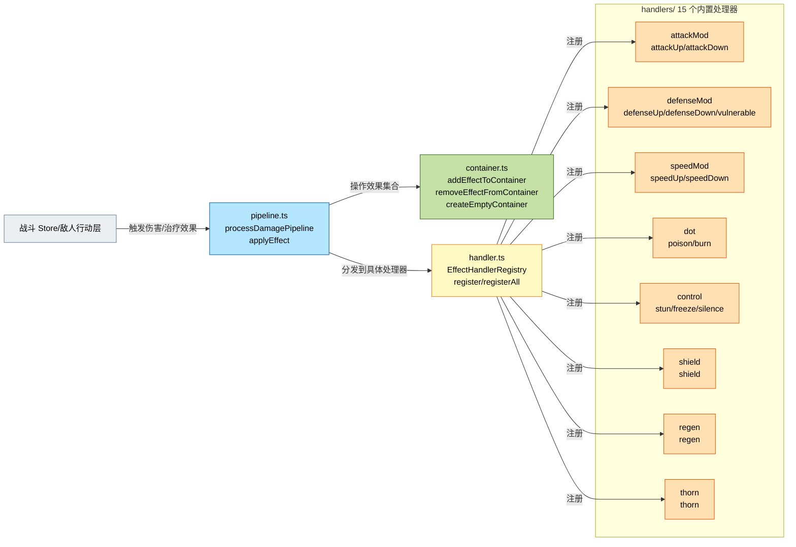

### 3.3 AI 子系统（策略模式）

采用策略模式实现敌人 AI，支持四种行为策略。

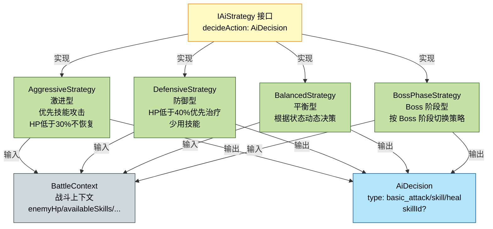

### 3.4 战斗子模块架构图

战斗模块内部包含 `resources / forms / pets` 三大子目录，配合既有的 `composables / effects / ai`，形成完整的职业差异化与战斗扩展能力。下图展示各子模块之间的协作关系。

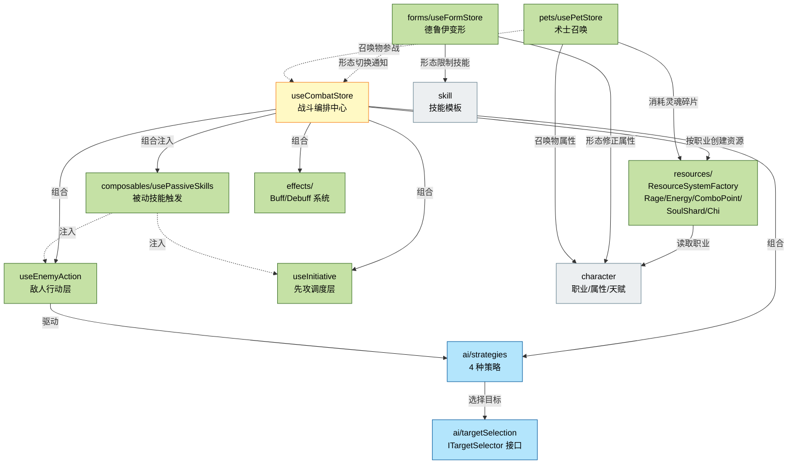

**子模块协作说明**：

| 子模块 | 类型 | 协作方式 |
|--------|------|----------|
| `resources/` | 资源系统 | `ResourceSystemFactory` 按角色职业创建对应资源系统（怒气/能量/连击点/灵魂碎片/真气），由 combat Store 持有并在回合内消耗/回复 |
| `composables/usePassiveSkills` | 被动技能 | 作为组合式函数被 combat Store 创建，再注入到 `useEnemyAction` 与 `useInitiative`，在敌人行动与先攻调度时触发被动效果 |
| `forms/` | 德鲁伊变形 | 独立 `useFormStore`，形态切换时修正角色属性、限制可用技能，并通知 combat Store 重建先攻 |
| `pets/` | 术士召唤 | 独立 `usePetStore`，召唤物属性基于角色计算，消耗灵魂碎片资源，参战行动由 combat Store 驱动 |
| `ai/targetSelection` | 目标选择 | 实现 `ITargetSelector` 接口，被 4 种 AI 策略调用以选择攻击目标，为多角色队伍预留扩展点 |
| `effects/` | 效果系统 | 既有三层结构（管线-容器-处理器），由 combat Store 与敌人行动层驱动 |

---

## 四、探索模块架构详解

探索模块采用「Store 编排 + Service 纯函数」模式，通过 UI 回调与 EventBus 与外部交互。

```mermaid
graph TD
    %% ===== Store 层 =====
    store[useExplorationStore<br/>状态编排层<br/>currentAreaId/grid/playerPosition]

    %% ===== Service 纯函数层 =====
    subgraph service[service.ts 纯函数集]
        direction TB
        s1[generateGrid 生成网格]
        s2[findStartPosition 寻找起点]
        s3[updateAccessibleCells 更新可达格]
        s4[generateTrapDamage 陷阱伤害]
        s5[generateRandomEvent 随机事件]
        s6[generateCampHeal 营地治疗]
        s7[generateItemForCell 格子物品]
        s8[computeEventProbability 事件概率]
        s9[buildItemPool 物品池]
    end

    %% ===== UI 回调机制 =====
    uiCb[registerUICallbacks<br/>UI 回调注册]
    uiComp[GameMain/ExplorationView<br/>UI 组件]

    %% ===== EventBus 监听 =====
    bus{{EventBus}}
    combatEnd[COMBAT_END 事件]
    onBattleResult[onBattleResult 处理函数]

    %% ===== 跨模块交互 =====
    triggerBattle[triggerBattle 触发战斗]
    combatPopup[CombatPopup 战斗弹窗]
    charStore[characterStore]
    invStore[inventoryStore]
    logStore[logStore]

    %% ===== 持久化 =====
    db[(explorationDbService)]

    %% ===== 调用关系 =====
    store -->|调用纯函数| s1
    store -->|调用纯函数| s2
    store -->|调用纯函数| s3
    store -->|调用纯函数| s4
    store -->|调用纯函数| s5
    store -->|调用纯函数| s6
    store -->|调用纯函数| s7
    store -->|调用纯函数| s8
    store -->|调用纯函数| s9

    store -->|读写| db

    %% ===== UI 回调链 =====
    uiComp -->|注册回调| uiCb
    uiCb -->|持有| store
    store -->|触发回调| uiComp

    %% ===== EventBus 监听链 =====
    store -->|订阅| bus
    bus -->|派发| combatEnd
    combatEnd -->|触发| onBattleResult
    onBattleResult -->|更新| store

    %% ===== 跨模块战斗交互 =====
    store -->|triggerBattle| triggerBattle
    triggerBattle -->|打开| combatPopup
    combatPopup -->|战斗结束发布| combatEnd

    %% ===== 跨模块 Store 调用 =====
    store -->|takeDamage/receiveHeal/gainGold| charStore
    store -->|addItem| invStore
    store -->|addLogEntry| logStore

    %% ===== 样式 =====
    classDef storeLayer fill:#c5e1a5,stroke:#33691e,color:#000
    classDef svcLayer fill:#b3e5fc,stroke:#01579b,color:#000
    classDef uiLayer fill:#ffe0b2,stroke:#e65100,color:#000
    classDef busLayer fill:#fff9c4,stroke:#f57f17,color:#000
    classDef ext fill:#eceff1,stroke:#607d8b,color:#000
    classDef dbLayer fill:#ffccbc,stroke:#bf360c,color:#000

    class store storeLayer
    class s1,s2,s3,s4,s5,s6,s7,s8,s9 svcLayer
    class uiCb,uiComp,combatPopup uiLayer
    class bus,combatEnd,onBattleResult busLayer
    class triggerBattle,charStore,invStore,logStore ext
    class db dbLayer
```

**关键机制说明**：

| 机制 | 说明 |
|------|------|
| Store → Service | Store 调用 Service 纯函数完成网格生成、概率计算等无副作用运算 |
| UI 回调（registerUICallbacks） | 替代部分 EventBus 数据事件，由 GameMain/ExplorationView 注册回调，Store 触发后由 UI 响应 |
| EventBus 监听 | Store 订阅 `COMBAT_END` 事件，由 `onBattleResult` 处理战斗结果回调 |
| 跨模块战斗闭环 | `triggerBattle` → `CombatPopup` → 战斗结束发布 `COMBAT_END` → `onBattleResult` 更新探索状态 |

---

## 五、数据持久化架构

采用「Dexie → DBService → 模块 DbService → IndexedDB」四层结构，共 22 张表。

```mermaid
graph TD
    %% ===== 消费层 =====
    subgraph consumers[各模块 Store]
        direction LR
        cChar[characterStore]
        cInv[inventoryStore]
        cEquip[equipmentStore]
        cSkill[skillStore]
        cQuest[questStore]
        cCombat[combatStore]
        cExp[explorationStore]
        cLog[logStore]
        cMap[mapStore]
        cShop[shopStore]
        cEnemy[enemyStore]
        cBoss[bossStore]
    end

    %% ===== 模块 DbService 层 =====
    subgraph dbServices[各模块 DbService]
        direction LR
        dChar[character/db]
        dInv[inventory/db]
        dEquip[equipment/db]
        dSkill[skill/db]
        dQuest[quest/db]
        dCombat[combat/db]
        dExp[exploration/db]
        dLog[log/db]
        dMap[map/db]
        dShop[shop/db]
        dEnemy[enemy/db]
        dBoss[boss/db]
    end

    %% ===== 数据核心层 =====
    dbService[DBService<br/>withRetry 重试机制<br/>指数退避]
    gameDB[GameDatabase<br/>Dexie 实例<br/>单例模式]

    %% ===== 底层存储 =====
    indexedDB[(IndexedDB<br/>浏览器数据库)]

    %% ===== 22 张表 =====
    subgraph tables[22 张数据表]
        direction TB
        subgraph config[配置表 config_* 11张]
            direction LR
            t1[config_factions 阵营]
            t2[config_races 种族]
            t3[config_classes 职业]
            t4[config_items 物品]
            t5[config_equipmentItems 装备模板]
            t6[config_mobs 怪物]
            t7[config_bosses Boss]
            t8[config_quests 任务定义]
            t9[config_skills 技能模板]
            t10[config_locations 地点]
            t11[config_shops 商店配置]
        end
        subgraph char[角色表 char_* 6张]
            direction LR
            t12[char_data 角色数据]
            t13[char_inventory 背包]
            t14[char_equipment 装备]
            t15[char_skills 技能]
            t16[char_quests 任务进度]
            t17[char_exploration 探索状态]
        end
        subgraph runtime[运行时表 runtime_* 5张]
            direction LR
            t18[runtime_gameState 游戏状态]
            t19[runtime_combatLogs 战斗日志]
            t20[runtime_adventureLogs 冒险日志]
            t21[runtime_mapState 地图状态]
            t22[runtime_shopItems 商店物品]
        end
    end

    %% ===== 调用链 =====
    cChar --> dChar
    cInv --> dInv
    cEquip --> dEquip
    cSkill --> dSkill
    cQuest --> dQuest
    cCombat --> dCombat
    cExp --> dExp
    cLog --> dLog
    cMap --> dMap
    cShop --> dShop
    cEnemy --> dEnemy
    cBoss --> dBoss

    dChar --> dbService
    dInv --> dbService
    dEquip --> dbService
    dSkill --> dbService
    dQuest --> dbService
    dCombat --> dbService
    dExp --> dbService
    dLog --> dbService
    dMap --> dbService
    dShop --> dbService
    dEnemy --> dbService
    dBoss --> dbService

    dbService --> gameDB
    gameDB --> indexedDB

    gameDB --> t1
    gameDB --> t2
    gameDB --> t3
    gameDB --> t4
    gameDB --> t5
    gameDB --> t6
    gameDB --> t7
    gameDB --> t8
    gameDB --> t9
    gameDB --> t10
    gameDB --> t11
    gameDB --> t12
    gameDB --> t13
    gameDB --> t14
    gameDB --> t15
    gameDB --> t16
    gameDB --> t17
    gameDB --> t18
    gameDB --> t19
    gameDB --> t20
    gameDB --> t21
    gameDB --> t22

    %% ===== 样式 =====
    classDef consumerLayer fill:#c5e1a5,stroke:#33691e,color:#000
    classDef dbSvcLayer fill:#b3e5fc,stroke:#01579b,color:#000
    classDef coreLayer fill:#fff9c4,stroke:#f57f17,color:#000
    classDef storageLayer fill:#ffccbc,stroke:#bf360c,color:#000
    classDef configTable fill:#ffe0b2,stroke:#e65100,color:#000
    classDef charTable fill:#d1c4e9,stroke:#311b92,color:#000
    classDef runtimeTable fill:#cfd8dc,stroke:#37474f,color:#000

    class cChar,cInv,cEquip,cSkill,cQuest,cCombat,cExp,cLog,cMap,cShop,cEnemy,cBoss consumerLayer
    class dChar,dInv,dEquip,dSkill,dQuest,dCombat,dExp,dLog,dMap,dShop,dEnemy,dBoss dbSvcLayer
    class dbService,gameDB coreLayer
    class indexedDB storageLayer
    class t1,t2,t3,t4,t5,t6,t7,t8,t9,t10,t11 configTable
    class t12,t13,t14,t15,t16,t17 charTable
    class t18,t19,t20,t21,t22 runtimeTable
```

**表分类说明**：

| 类别 | 前缀 | 数量 | 共享范围 | 用途 |
|------|------|------|----------|------|
| 配置表 | `config_*` | 11 | 所有角色共享 | 游戏静态定义数据（阵营/种族/职业/物品/装备/怪物/Boss/任务/技能/地点/商店） |
| 角色表 | `char_*` | 6 | 绑定 characterId | 每个角色独立的数据（角色/背包/装备/技能/任务/探索） |
| 运行时表 | `runtime_*` | 5 | 全局或会话级 | 日志与临时状态（游戏状态/战斗日志/冒险日志/地图状态/商店物品） |

---

## 六、Vue 组件树

下图展示从 App.vue 根组件到各视图与弹窗组件的完整层级关系。

```mermaid
graph TD
    %% ===== 根组件 =====
    app[App.vue<br/>应用根组件<br/>管理界面状态切换]

    %% ===== 顶层视图 =====
    charSelect[CharacterSelect<br/>角色选择]
    charCreate[CharacterCreate<br/>角色创建弹窗]
    gameMain[GameMain<br/>游戏主界面]
    adminLayout[AdminLayout<br/>后台管理布局]

    %% ===== GameMain 子视图 =====
    mapView[MapView<br/>地图视图]
    explorationView[ExplorationView<br/>探索视图]

    %% ===== GameMain 弹窗组件 =====
    combatPopup[CombatPopup<br/>战斗弹窗]
    inventoryPopup[InventoryPopup<br/>背包弹窗]
    skillsPopup[SkillsPopup<br/>技能弹窗]
    shopPopup[ShopPopup<br/>商店弹窗]
    questPopup[QuestPopup<br/>任务弹窗]
    questBoardPopup[QuestBoardPopup<br/>任务面板弹窗]
    adventureLogPopup[AdventureLogPopup<br/>冒险日志弹窗]
    audioSettingsPopup[AudioSettingsPopup<br/>音频设置弹窗]
    characterInfoPopup[CharacterInfoPopup<br/>角色信息弹窗]
    systemPopup[SystemPopup<br/>系统弹窗]

    %% ===== 通用组件 =====
    resourceBar[ResourceBar<br/>资源条]
    confirmPopup[ConfirmPopup<br/>确认弹窗]
    toast[Toast 全局提示]

    %% ===== Admin 子组件 =====
    configManager[ConfigManager<br/>配置管理]
    adminForm[AdminForm<br/>后台表单]
    adminTable[AdminTable<br/>后台表格]

    %% ===== 组件树关系 =====
    app -->|v-if 角色选择| charSelect
    app -->|v-if 角色创建| charCreate
    app -->|v-if 游戏中| gameMain
    app -->|v-if 后台管理| adminLayout
    app -->|全局| confirmPopup
    app -->|全局| toast

    gameMain -->|tab=map| mapView
    gameMain -->|tab=explore| explorationView
    gameMain -->|底部导航| combatPopup
    gameMain -->|底部导航| inventoryPopup
    gameMain -->|底部导航| skillsPopup
    gameMain -->|底部导航| shopPopup
    gameMain -->|底部导航| questPopup
    gameMain -->|底部导航| questBoardPopup
    gameMain -->|底部导航| adventureLogPopup
    gameMain -->|底部导航| audioSettingsPopup
    gameMain -->|底部导航| characterInfoPopup
    gameMain -->|底部导航| systemPopup
    gameMain -->|头部| resourceBar

    adminLayout -->|包含| configManager
    adminLayout -->|包含| adminForm
    adminLayout -->|包含| adminTable

    %% ===== 样式 =====
    classDef root fill:#fff9c4,stroke:#f57f17,color:#000
    classDef view fill:#c5e1a5,stroke:#33691e,color:#000
    classDef popup fill:#ffe0b2,stroke:#e65100,color:#000
    classDef common fill:#b3e5fc,stroke:#01579b,color:#000
    classDef admin fill:#d1c4e9,stroke:#311b92,color:#000

    class app root
    class charSelect,charCreate,gameMain,adminLayout,mapView,explorationView view
    class combatPopup,inventoryPopup,skillsPopup,shopPopup,questPopup,questBoardPopup,adventureLogPopup,audioSettingsPopup,characterInfoPopup,systemPopup popup
    class resourceBar,confirmPopup,toast common
    class configManager,adminForm,adminTable admin
```

---

## 七、事件总线架构

EventBus 采用类型安全的发布/订阅模式，支持分组管理与生命周期控制。

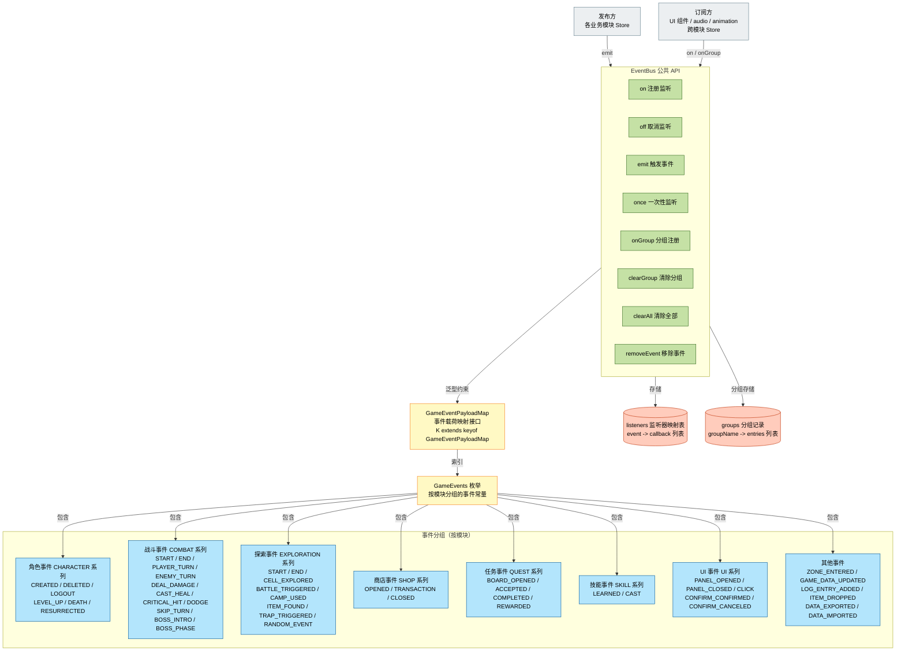

**类型安全设计要点**：

| 设计点 | 说明 |
|--------|------|
| `GameEvents` 枚举 | 按模块分组的事件名常量，避免字符串硬编码 |
| `GameEventPayloadMap` 接口 | 为每个事件定义对应的载荷类型，emit/on 双方通过泛型 `K extends keyof GameEventPayloadMap` 在编译期严格匹配 |
| 无载荷事件 | 使用 `null` 类型（如 `COMBAT_PLAYER_TURN`） |
| 复杂载荷 | 使用具体接口（如 `EnemyInstance`、`LocationData`） |
| 分组管理 | `onGroup` 注册、`clearGroup` 批量清理，便于模块级生命周期管理 |
| 单例模式 | `eventBus` 全局唯一实例，所有模块共享 |

---

## 八、职业差异化系统架构图

项目围绕「职业」建立了一套完整的差异化能力体系，涵盖资源系统、被动技能、天赋树、专属装备、变形与召唤六大子系统。下图展示各子系统如何由职业标识驱动，并与数据文件、角色模块及战斗模块联动。

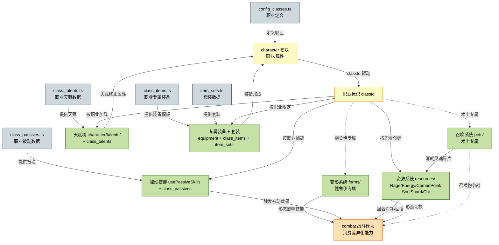

**子系统与数据源对照**：

| 子系统 | 实现位置 | 数据来源 | 适用职业 |
|--------|----------|----------|----------|
| 资源系统 | `combat/resources/` | `config_classes.ts`（职业资源类型） | 战士-怒气、盗贼-能量/连击点、术士-灵魂碎片、武僧-真气 |
| 被动技能 | `combat/composables/usePassiveSkills.ts` | `class_passives.ts` | 全职业（按职业配置不同被动） |
| 天赋树 | `character/talents/` | `class_talents.ts` | 全职业（按职业配置不同天赋树） |
| 专属装备 | `equipment` + 数据层 | `class_items.ts`、`item_sets.ts` | 全职业（按职业限定装备与套装） |
| 变形 | `combat/forms/` | `forms/druid_forms.ts` | 德鲁伊专属 |
| 召唤 | `combat/pets/` | `pets/warlock_pets.ts` | 术士专属 |

**联动关系说明**：

| 联动 | 说明 |
|------|------|
| 职业 → 子系统 | `classId` 作为驱动因子，决定资源系统类型、可加载的被动/天赋/装备，以及是否启用变形或召唤 |
| 召唤 → 资源 | 术士召唤宠物消耗灵魂碎片，`pets` 与 `resources/SoulShardSystem` 联动 |
| 天赋/装备 → 角色 | 天赋修正角色属性、装备提供加成，最终汇入 `character` 模块作为战斗计算基准 |
| 变形/召唤 → 战斗 | 形态切换通知战斗模块重建先攻；召唤物参战行动由战斗模块驱动 |
| 被动技能 → 战斗 | `usePassiveSkills` 在敌人行动与先攻调度时触发被动效果 |

---

**文档结束**
