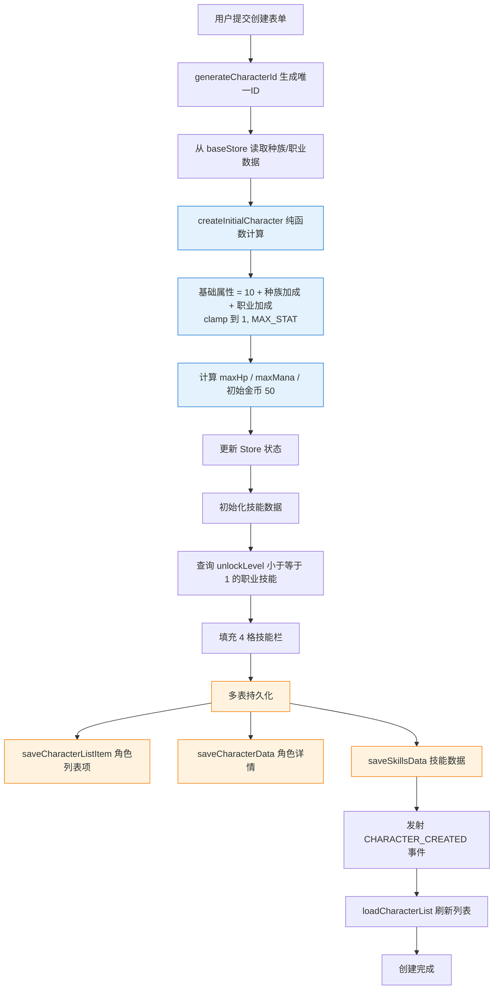
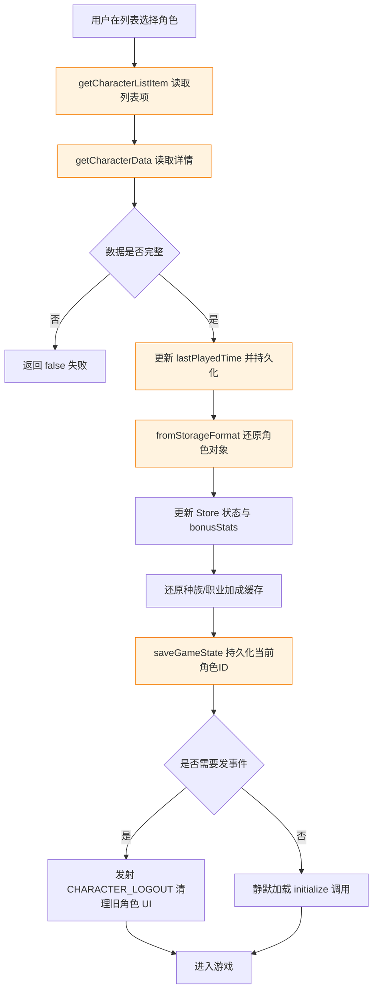
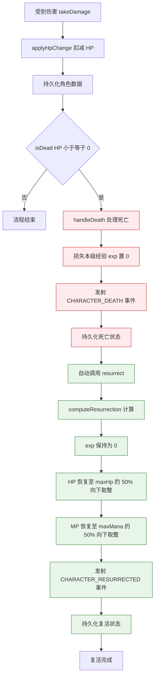
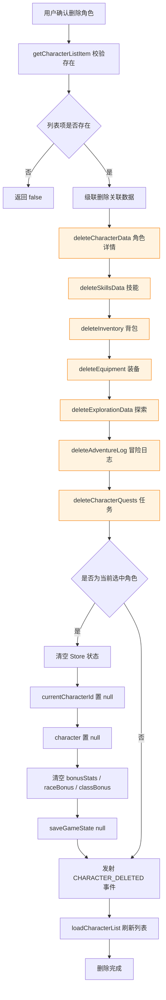
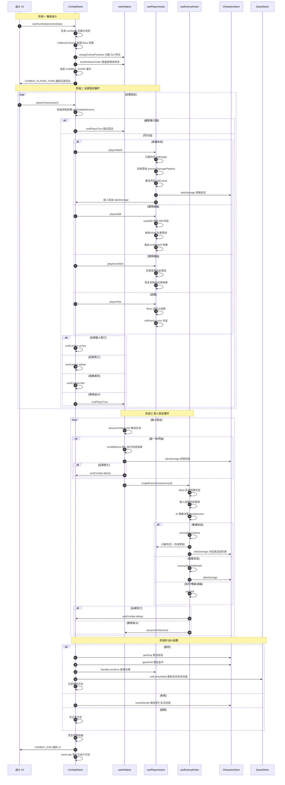
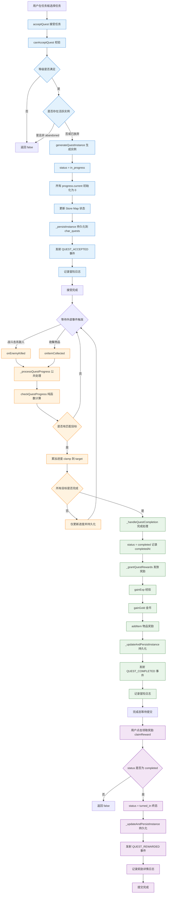
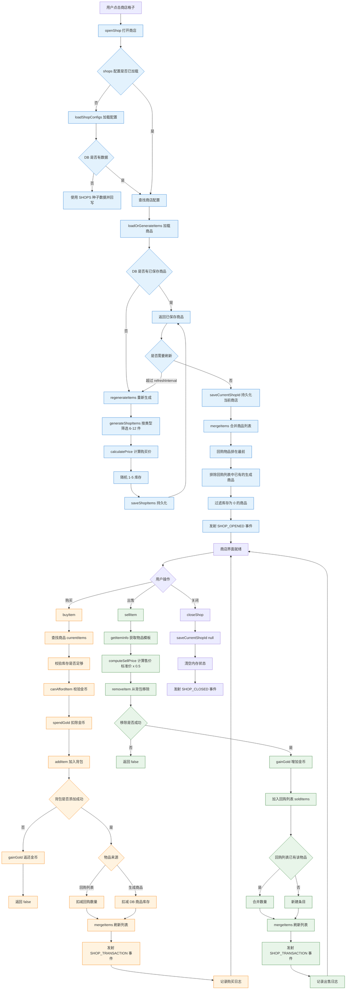
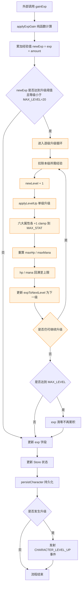
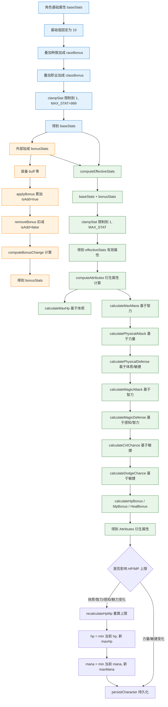

# 业务流程梳理

## 文档信息

| 项目 | 内容 |
|------|------|
| 标题 | 业务流程梳理 |
| 版本 | v1.0 |
| 生成日期 | 2026年7月6日 |
| 所属目录 | `doc/project/` |
| 关联文档 | 01_MODULE_FUNCTIONS.md、02_DEPENDENCY_GRAPH.md、各模块设计文档 |

---

## 概述

本文档梳理项目 `wow_dnd` 的核心业务流程，覆盖角色生命周期、战斗、探索、任务、商店交易、成长系统与数据备份恢复七大领域。每个流程均以 Mermaid 图表呈现，并附关键实现位置说明，便于开发与缺陷定位。

模块统一遵循分层架构：`service.ts`（纯函数层）→ `store.ts`（编排层，负责状态/持久化/事件）→ `db.ts`（持久层）。下文流程图中出现的"Store Action"均指编排层入口。

---

## 一、角色生命周期流程

### 1.1 角色创建流程

角色创建由 `characterStore.createCharacter` 编排，依次完成基础数据获取、纯函数计算、技能初始化与多表持久化。



**关键实现**：`src/modules/character/store.ts` 的 `createCharacter`、`src/modules/character/service.ts` 的 `createInitialCharacter` 与 `computeInitialStats`。

### 1.2 角色选择流程



**关键实现**：`src/modules/character/store.ts` 的 `selectCharacter`，`emitEvent` 参数控制是否触发 UI 事件（`initialize` 静默调用时传 `false`）。

### 1.3 角色死亡复活流程

死亡复活由 `characterStore.takeDamage` 触发，经 `handleDeath` 完成经验清零与事件通知后，自动调用 `resurrect` 恢复至 50% 生命/法力。



**关键实现**：`src/modules/character/store.ts` 的 `handleDeath` 与 `resurrect`，`src/modules/character/service.ts` 的 `computeResurrection`。

### 1.4 角色删除流程

删除操作执行严格的级联清理，确保所有关联数据一并移除，避免孤儿数据残留。



**关键实现**：`src/modules/character/store.ts` 的 `deleteCharacter`，跨模块调用各模块 `db.ts` 的删除接口。

---

## 二、战斗全流程

战斗流程由 `combatStore` 编排，拆分至 `useInitiative`、`usePlayerAction`、`useEnemyAction`、`useBossMechanics` 等 Composable。采用速度制先攻：玩家与所有敌人按速度降序交替行动。



**关键实现**：
- 编排入口：`src/modules/combat/store.ts` 的 `startCombat`、`playerAction`、`endCombat`
- 先攻调度：`src/modules/combat/composables/useInitiative.ts`（`buildInitiativeOrder` 按速度降序，`advanceToNextUnit` 推进，`tickAllEffects` 在新一轮开始时统一结算）
- 玩家行动：`src/modules/combat/composables/usePlayerAction.ts`（攻击/技能/物品/逃跑四类分支）
- 敌人 AI：`src/modules/combat/composables/useEnemyAction.ts`（策略模式 `AggressiveStrategy` / `DefensiveStrategy` / `BalancedStrategy` / `BossPhaseStrategy`）

---

## 三、探索全流程

探索流程由 `explorationStore` 编排，区域进入时生成 10×10 网格并放置固定事件，玩家翻格子触发对应分支处理。

```mermaid
flowchart TD
    A[用户选择地点] --> B[enterArea 进入区域]
    B --> C[loadAreaConfig 加载区域配置]
    C --> C1[从 config_locations 读取地点数据]
    C1 --> C2[computeEventProbability 按等级生成概率]
    C2 --> C3[buildItemPool 筛选物品池]
    C3 --> C4[读取怪物池与 Boss 池]
    C4 --> D[pickRandomShop 随机选商店]
    D --> E[getQuestRequiredMonsters 获取任务怪物]
    E --> F[过滤掉 Boss 怪物]
    F --> G[generateGrid 生成 10x10 网格]
    G --> G1[placeFixedEvents 放置固定事件]
    G1 --> G1a[起点 随机边缘]
    G1a --> G1b[商店 + 任务板 两个角落]
    G1b --> G1c[营地 非相邻位置]
    G1c --> G1d[Boss 中心区域]
    G1d --> G2[优先放置任务怪物]
    G2 --> G3[剩余空格按概率随机填充]
    G3 --> H[findStartPosition 找到起点]
    H --> I[updateAccessibleCells 更新可访问状态]
    I --> J[persistState 持久化]
    J --> K[发射 EXPLORATION_START 与 ZONE_ENTERED]
    K --> L[记录冒险日志]
    L --> M[探索进行中]

    M --> N[用户点击格子 revealGrid]
    N --> O{格子类型判断}
    O -- 怪物/Boss --> P1[triggerBattle 触发战斗]
    P1 --> P1a[记录 pendingBattleCell]
    P1a --> P1b[等待 COMBAT_END 事件]
    P1b --> P1c{战斗结果}
    P1c -- 胜利 --> P1d[标记格子 completed]
    P1c -- 胜利且为 Boss --> P1e[bossDefeated 置 true]
    P1c -- 失败/逃跑 --> P1f[保留 monsterId 可再挑战]
    P1d --> P1g[updateAccessibleCells]
    P1e --> P1g
    P1f --> P1g
    P1g --> P1h[checkCompletion 完成检查]

    O -- 商店/任务板 --> P2[标记 visited]
    P2 --> P2a[发射 EXPLORATION_CELL_EXPLORED]
    P2a --> P2b[UI 回调打开对应面板]
    P2b --> P1h

    O -- 宝箱 --> P3[generateItemForCell 随机物品]
    P3 --> P3a[addItem 加入背包]
    P3a --> P3b[兜底 物品不存在转金币经验]
    P3b --> P3c[标记 completed]
    P3c --> P1h

    O -- 陷阱 --> P4[generateTrapDamage 计算伤害]
    P4 --> P4a[takeDamage 扣减 HP]
    P4a --> P4b[标记 completed]
    P4b --> P1h

    O -- 随机事件 --> P5[generateRandomEvent 六种效果]
    P5 --> P5a{效果类型}
    P5a -- heal --> P5b1[receiveHeal 恢复 HP]
    P5a -- mana --> P5b2[changeMp 恢复 MP]
    P5a -- exp --> P5b3[gainExp 获得经验]
    P5a -- damage --> P5b4[takeDamage 受到伤害]
    P5a -- mpLoss --> P5b5[changeMp 损失 MP]
    P5a -- gold --> P5b6[gainGold 获得金币]
    P5b1 --> P5c[标记 completed]
    P5b2 --> P5c
    P5b3 --> P5c
    P5b4 --> P5c
    P5b5 --> P5c
    P5b6 --> P5c
    P5c --> P1h

    O -- 营地 --> P6{营地是否已使用}
    P6 -- 是 --> P7[无操作]
    P6 -- 否 --> P6a[generateCampHeal 完全恢复]
    P6a --> P6b[receiveHeal + changeMp]
    P6b --> P6c[campUsed 置 true]
    P6c --> P6d[标记 completed]
    P6d --> P1h

    P1h --> Q{探索是否完成}
    Q -- 击败 Boss 或 全部格子已访问 --> R[explorationComplete 置 true]
    Q -- 否 --> M
    R --> S[探索完成]

    classDef battle fill:#ffebee,stroke:#c62828
    classDef shop fill:#e3f2fd,stroke:#1976d2
    classDef instant fill:#fff3e0,stroke:#f57c00
    class P1,P1a,P1b,P1c,P1d,P1e,P1f,P1g,P1h battle
    class P2,P2a,P2b shop
    class P3,P3a,P3b,P3c,P4,P4a,P4b,P5,P5a,P5b1,P5b2,P5b3,P5b4,P5b5,P5b6,P5c,P6,P6a,P6b,P6c,P6d instant
```

**关键实现**：
- 编排入口：`src/modules/exploration/store.ts` 的 `enterArea`、`revealGrid`、`onBattleResult`
- 网格生成：`src/modules/exploration/service.ts` 的 `generateGrid`（固定事件放置策略：起点边缘、商店/任务板角落、营地非相邻、Boss 中心区域）
- 战斗结果回写：通过 `eventBus.on(COMBAT_END)` 监听，调用 `onBattleResult` 处理格子状态

---

## 四、任务全流程

任务流程由 `questStore` 编排，奖励在完成时自动发放，`claimReward` 仅做状态转换。



**关键实现**：
- 编排入口：`src/modules/quest/store.ts` 的 `acceptQuest`、`onEnemyKilled`、`onItemCollected`、`completeQuest`、`claimReward`
- 进度计算：`src/modules/quest/service.ts` 的 `checkQuestProgress`（按 `enemyId` 或 `itemId` 匹配目标，累加并 `Math.min` 限幅）
- 设计要点：奖励在 `_handleQuestCompletion` 中通过 `_grantQuestRewards` 自动发放，`claimReward` 仅做 `completed → turned_in` 状态转换，避免重复发奖

---

## 五、商店交易流程

商店流程由 `shopStore` 编排，支持商品按需生成、定期刷新、买卖差价（出售价为购买价 50%）与回购追踪。



**回购机制说明**：
- `soldItems` 采用二级 Map 结构：`shopId → itemId → SoldItemEntry`，每个商店独立维护回购列表
- 出售时同物品多次出售会合并数量，购买时从回购列表优先扣减
- `mergeItems` 合并时回购物品排在列表最前，且生成商品中排除已在回购列表的物品，避免重复展示
- 回购物品以出售价（标准价 × 0.5）上架，玩家可原价买回

**关键实现**：
- 编排入口：`src/modules/shop/store.ts` 的 `openShop`、`buyItem`、`sellItem`、`closeShop`、`refreshShop`
- 价格计算：`src/modules/shop/service.ts` 的 `calculatePrice`（稀有度倍率：普通 1× / 优秀 2× / 稀有 5× / 史诗 10× / 传说 20×，出售价为购买价 50%）

---

## 六、成长系统流程

成长系统涵盖经验升级与属性加成两条主线，由 `characterStore` 编排，核心计算委托给 `service.ts` 纯函数。

### 6.1 经验值与升级流程



### 6.2 属性加成与衍生属性计算



**关键实现**：
- 升级循环：`src/modules/character/service.ts` 的 `applyExpGain`（逐级消耗经验，连升多级时全属性叠加）、`applyLevelUp`（每级六大属性各 +1，HP/MP 重算回满）
- 属性加成：`computeEffectiveStats`（base + bonus）、`computeAttributes`（衍生属性）、`recalculateHpMp`（上限变化时修正当前值）
- 上限常量：`MAX_LEVEL = 20`、`MAX_STAT = 999`（见 `src/config/character.ts`）

---

## 七、数据备份恢复流程

数据备份恢复由 `data` 模块的 `BackupService` 与 `ImportService` 提供，`characterStore` 仅作薄委托。手动备份导出 JSON 文件，自动备份存入 localStorage（保留 5 份），导入时执行多重校验。

```mermaid
flowchart TD
    subgraph 手动备份
        A1[用户点击导出存档] --> B1[exportBackup]
        B1 --> C1[createBackup 构建备份对象]
        C1 --> C1a[collectAllData 收集全量数据]
        C1a --> C1a1[角色表 char_data/inventory/quests 等]
        C1a1 --> C1a2[运行时表 combatLogs/adventureLogs/gameState]
        C1a2 --> C1a3[配置表 factions/races/classes/items 等]
        C1a3 --> C1b[calculateChecksum 计算校验和]
        C1b --> C1c[组装 BackupFile 含 version/timestamp/checksum]
        C1c --> D1[序列化为 JSON Blob]
        D1 --> D1a[创建下载链接 a.download]
        D1a --> E1[触发浏览器下载]
        E1 --> F1[文件保存完成]
    end

    subgraph 自动备份
        A2[触发自动备份 createAutoBackup] --> B2[createBackup 构建备份对象]
        B2 --> C2[getAutoBackups 读取现有列表]
        C2 --> C2a[从 localStorage 读取 wow_dnd_auto_backups]
        C2a --> D2[新备份 unshift 插入列表头部]
        D2 --> E2{数量是否超过 5}
        E2 -- 是 --> F2[pop 移除最旧备份]
        E2 -- 否 --> G2[JSON.stringify 序列化]
        F2 --> G2
        G2 --> H2[localStorage.setItem 写回]
        H2 --> I2[自动备份完成]
    end

    subgraph 导入恢复
        A3[用户选择备份文件] --> B3[importBackup]
        B3 --> C3[validateBackup 校验]
        C3 --> C3a[FileReader 读取文件]
        C3a --> C3b[JSON.parse 解析]
        C3b --> C3c{格式校验<br/>是否包含 version 字段}
        C3c -- 否 --> X3[返回 备份文件格式错误]
        C3c -- 是 --> C3d[calculateChecksum 重算校验和]
        C3d --> C3e{checksum 校验<br/>是否与文件中一致}
        C3e -- 否 --> X3a[返回 备份文件已损坏]
        C3e -- 是 --> C3f[checkVersionCompatibility 版本校验]
        C3f --> C3g{版本是否在 supportedVersions 中}
        C3g -- 否 --> X3b[返回 版本过旧请更新游戏]
        C3g -- 是 --> C3h[校验通过返回成功]
        C3h --> D3[importData 导入数据]
        D3 --> D3a[开启 db.transaction 事务]
        D3a --> D3b[逐表 bulkPut 写入]
        D3b --> D3b1[char_data 角色详情]
        D3b1 --> D3b2[char_inventory 背包]
        D3b2 --> D3b3[char_quests 任务进度]
        D3b3 --> D3b4[char_equipment 装备]
        D3b4 --> D3b5[char_skills 技能]
        D3b5 --> D3b6[char_exploration 探索]
        D3b6 --> D3b7[runtime_combatLogs 战斗日志]
        D3b7 --> D3b8[runtime_adventureLogs 冒险日志]
        D3b8 --> D3b9[config_locations 地点配置]
        D3b9 --> D3b10[config_shops 商店配置]
        D3b10 --> D3b11[config_factions/races/classes 等]
        D3b11 --> D3b12[runtime_gameState/mapState/shopItems]
        D3b12 --> E3a[记录 importedStores 成功列表]
        D3b12 --> E3b[记录 skippedStores 跳过列表 空数据]
        E3a --> F3[返回 ImportResult]
        E3b --> F3
        F3 --> G3[导入完成]
    end

    classDef validate fill:#fff3e0,stroke:#f57c00
    classDef persist fill:#e3f2fd,stroke:#1976d2
    class C3,C3a,C3b,C3c,C3d,C3e,C3f,C3g,C3h validate
    class D3,D3a,D3b,D3b1,D3b2,D3b3,D3b4,D3b5,D3b6,D3b7,D3b8,D3b9,D3b10,D3b11,D3b12 persist
```



**关键实现**：
- 备份服务：`src/modules/data/service.ts` 的 `BackupService`（`createBackup` 收集全量数据 + `calculateChecksum` 计算校验和，`exportBackup` 通过 Blob + `a.download` 触发下载）
- 自动备份：`createAutoBackup` 使用 localStorage 存储，`MAX_AUTO_BACKUPS = 5`，超过时 `pop` 移除最旧
- 导入校验：`ImportService.validateBackup` 执行格式校验 → checksum 校验 → 版本兼容性校验（`supportedVersions: ['v1.0']`）
- 数据导入：`importData` 在单个 `db.transaction` 中逐表 `bulkPut`，记录 `importedStores` 与 `skippedStores`（数据为空的表跳过）
- 配置常量：`src/config/database.ts` 的 `BACKUP_CONFIG`（`autoBackupKey: 'wow_dnd_auto_backups'`、`maxAutoBackups: 5`、`backupVersion: 'v1.0'`）

---

## 附录：跨模块通信约定

| 通信方式 | 适用场景 | 示例 |
|----------|----------|------|
| 直接 Store Action 调用 | 数据变更类跨模块操作 | `combatStore` 调用 `characterStore.gainExp`、`questStore.onEnemyKilled` |
| EventBus 事件 | UI 刷新 / 音效触发 / 通知类 | `CHARACTER_LEVEL_UP`、`COMBAT_START`、`QUEST_COMPLETED` |
| UI 回调注册 | 探索模块跨模块数据事件 | `explorationStore.registerUICallbacks` 替代 EventBus 传递数据 |
| DB 层直接调用 | 持久化查询类跨模块 | `explorationStore` 调用 `questDbService.getQuestDefinitionsByBoard` |

**设计原则**：数据变更走 Store Action，EventBus 不传递数据变更通知，仅用于 UI/音效类事件。
