# 数据流梳理

## 文档信息

| 项目 | 内容 |
|------|------|
| 标题 | 项目数据流梳理 |
| 版本 | v3.0 |
| 生成日期 | 2026年7月10日 |
| 所属目录 | `doc/project/` |
| 关联文档 | `MODULE_FUNCTIONS.md`、`DEPENDENCY_GRAPH.md`、`DATA_ARCHITECTURE_OVERVIEW.md`、`EVENT_BUS_DESIGN.md` |
| 更新说明 | 本次基于源码全面比对修正：services 聚合层补全为 6 个服务（新增 `CharacterLifecycleService`、`AdminQueryService`）；被动技能数据来源修正为 `config_class_passives.ts`，覆盖 13 职业共 39 个被动；天赋树数据来源修正为 `config_class_talents.ts`，结构为 3 系 3 层（tier2 需 3 点、tier3 需 6 点、单天赋最多 5 点）；角色删除级联清理流修正为通过 `characterLifecycleService.cascadeDeleteCharacter` 并行删除 6 个模块数据；角色切换数据流补充 `gameBootstrap.dispose()` 清理范围（combat/exploration/audio 三个 Disposable Store + `clearInventoryCallbacks`）；战斗数据流补充 `ICombatContext` 上下文注入说明；探索数据流补充 `events.ts` 注册表分发架构。 |

---

## 概述

本文档以 Mermaid 图表形式梳理 `wow_dnd` 项目的核心数据流向，覆盖全局分层架构、五大核心业务场景、数据持久化机制、EventBus 事件分发与 Vue 响应式链路。

项目遵循统一分层模式：**Vue 组件 → Store Action → Service 纯函数 → Store 状态更新 → DB 持久化 → EventBus 通知 → UI 重渲染**。EventBus 仅承载 UI/音效/通知类事件，模块间的数据变更一律通过直接调用 Store Action 完成。

---

## 一、全局数据流向

下图展示项目所有业务流的统一数据流向。从用户在 Vue 组件中的交互开始，经过 Store 编排、Service 计算、状态更新、DB 持久化，最终通过 EventBus 触发 UI 重渲染。`src/services/` 聚合层（CrossModuleQuery / GameBootstrap / ItemTemplateCache / ErrorHandler / CharacterLifecycleService / AdminQueryService）将跨模块查询、初始化编排、缓存、错误处理、角色生命周期与管理后台查询从 Store 中收口。

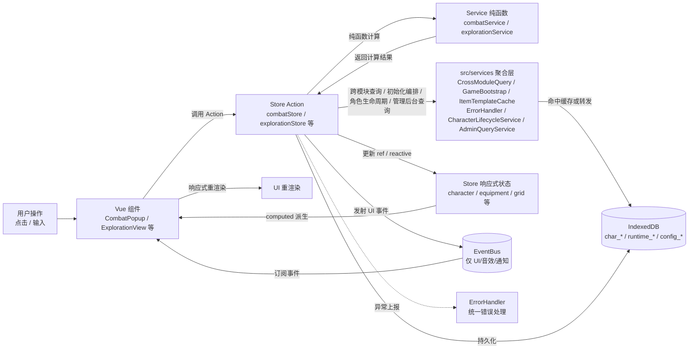

**services 聚合层职责**：

| 服务 | 职责 | 消费方 |
|------|------|--------|
| `CrossModuleQuery` | 收口探索模块对 map/inventory/quest/shop 的跨模块查询，避免 Store 直接依赖各模块 DbService | explorationStore |
| `GameBootstrap` | 按依赖顺序统一编排各 Store 初始化与逆序清理，管理 Disposable 接口的 Store 资源释放 | App.vue / 角色切换入口 |
| `ItemTemplateCache` | 物品模板懒加载内存缓存，首次查询后命中内存 | CrossModuleQuery / inventoryStore |
| `ErrorHandler` | 统一错误处理入口，提供 `tryAsync`（Result 类型）/ `wrapAsync`（toast+日志）/ `report`（手动上报）三层 API | 全模块 Store |
| `CharacterLifecycleService` | 收口角色创建（`initializeCharacterSkills`）与删除（`cascadeDeleteCharacter`）流程中的跨模块持久化，消除 character Store 对 6 个模块 DbService 的直接依赖 | characterStore |
| `AdminQueryService` | 收口控制台命令模块对 enemy/boss/inventory/equipment DbService 的查询依赖，统一管理后台的数据查询入口 | console 命令模块 |

**关键约定**：

| 调用方向 | 通信方式 | 说明 |
|----------|----------|------|
| 组件 → Store | 直接调用 Action | 单向数据流，组件不直接修改状态 |
| Store → Service | 直接调用纯函数 | Service 无副作用，只负责计算 |
| Store → services 层 | 直接调用聚合服务 | 跨模块查询/缓存/编排/错误处理/角色生命周期/管理后台查询收口于此 |
| Store → DB | 直接调用 db.ts | 异步持久化，不阻塞主线程 |
| Store → Store | 直接调用 Action | 跨模块数据变更通过 Store Action（非 EventBus） |
| Store → 组件 | EventBus + computed | UI 通知走 EventBus，状态变更走响应式 |

---

## 二、核心业务数据流

### 2.1 战斗数据流

下图展示一次玩家普通攻击的完整数据流向。攻击动作通过 `createCombatContext()` 工厂在 combat Store 初始化时注入的 `ICombatContext`（聚合 character/skill/enemy/quest/log/inventory 六个外部 Store）访问跨模块数据，combat 内部所有 composable 仅依赖此接口，不再直接 import 具体 Store。攻击命中的关键节点接入了资源系统钩子（`onAttack`/`onDamaged`/`onKill`/`onTurnStart`）与被动技能触发（详见 2.6 / 2.7），德鲁伊变形与术士召唤作为可选子系统在 `startCombat` 阶段初始化。

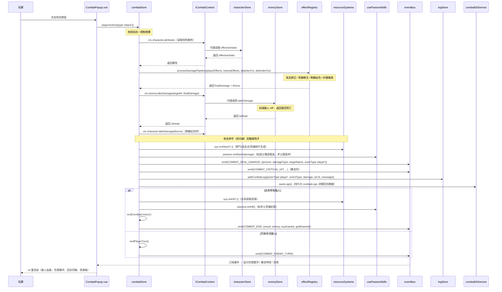

**战斗子系统集成点**：

| 触发时机 | 资源系统钩子 | 被动技能触发 | 说明 |
|----------|-------------|-------------|------|
| `startCombat` | `ResourceSystemFactory.create(classId)` + `reset()` | `loadPassives()` + `onCombatStart()` | 按职业创建资源系统实例（怒气/能量+连击点/灵魂碎片/真气），加载并触发战斗开始被动 |
| 玩家攻击/技能命中 | `sys.onAttack?.()` | `passive.onAttack(damage)` | 生成资源 + 触发吸血/腐蚀等被动；技能施放前经 `canCastSkill`/`consumeSkillResource` 检查与消耗专属资源 |
| 玩家受伤（`applyEnemyDamageToPlayer`） | `sys.onDamaged?.(amount)` | `passive.onDamaged(amount)` | 受伤获取怒气 + 触发复仇类被动；附带 `on_low_hp`（HP<30%）检查 |
| 玩家回合开始（`advanceToNextUnit`） | `sys.onTurnStart?.()` | `passive.onTurnStart()` | 能量/真气被动回复 + 回合开始被动（含低血量检查） |
| 战斗胜利（`endCombat('victory')`） | `sys.onKill?.()` | `passive.onKill()` | 击杀获取资源 + 击杀类被动 |
| 德鲁伊变形（可选） | — | — | `useFormStore.switchTo` 消耗 1 回合切换形态，修改属性倍率、解锁/锁定技能、恢复 10% 生命 |
| 术士召唤（可选） | `SoulShardSystem.consume(cost)` | — | `usePetStore.summon` 消耗灵魂碎片召唤恶魔，召唤物独立 AI 行动（`petTakeAction`） |

**数据流关键点**：

1. **ICombatContext 上下文注入**：`createCombatContext()` 是 combat 模块内唯一引用外部 Store 的位置，将六个外部 Store 聚合为 `ICombatContext`（完整 = `ICombatQuery` 只读 + `ICombatCommand` 写入）。combat 内部所有 composable 通过此接口访问外部数据，不直接 import Store，实现模块间静态解耦与可独立测试。Store 计算属性通过 getter 代理，确保响应式追踪不丢失。
2. **效果管线**（`effectRegistry`）：在伤害结算前依次处理攻击修正、防御修正、护盾、荆棘、控制等效果，是战斗计算的核心。
3. **多 Store 协同**：通过 `ICombatContext` 代理调用 characterStore（属性/受伤）、enemyStore（敌人受伤）、logStore（日志）、combatDbService（持久化）。
4. **事件分类**：`COMBAT_DEAL_DAMAGE`、`COMBAT_CRITICAL_HIT`、`COMBAT_DODGE` 等仅用于 UI 与音效，不承载状态变更。
5. **日志职责分离**：`combatLogs`（combatStore 内存 + runtime_combatLogs 表）记录详细回合数据（伤害/暴击/被动触发等），`adventureLogs`（logStore + runtime_adventureLogs 表）记录战斗摘要条目，二者职责明确分离。
6. **先攻回调注入**：Boss 机制层通过 `boss.setInitiativeCallback(initiative.buildInitiativeOrder)` 在 initiative 就位后注入先攻顺序重建回调（`IBossContext` 接口注入，实现 combat ↔ boss 解耦）。

---

### 2.2 探索数据流

下图展示玩家翻开格子的数据流向。根据格子类型分为三条路径：战斗、商店/任务板、即时结算。区域进入阶段对地点/物品/任务/商店的查询统一经 `crossModuleQuery` 收口，物品模板命中 `ItemTemplateCache` 内存缓存。即时结算路径通过 `events.ts` 注册表分发（`cellEventHandlers` 按 `CellType` 查找处理器，`effectHandlers` 按 `RandomEventEffectType` 查找效果处理器）。

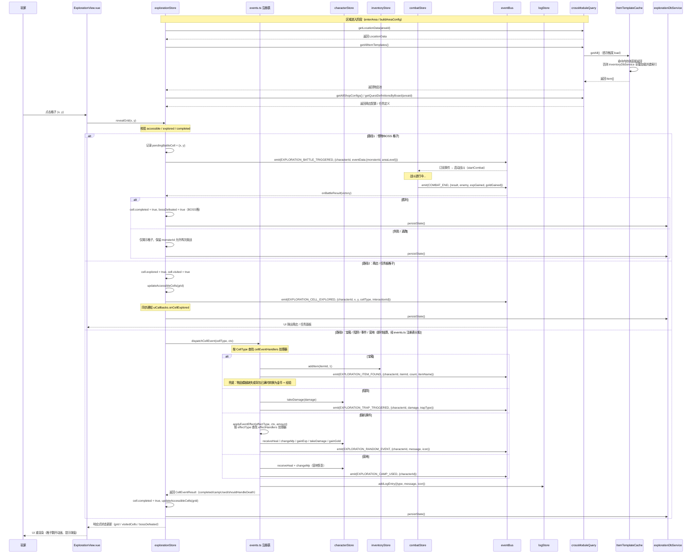

**数据流关键点**：

1. **跨模块查询收口**：区域进入阶段对地点、物品、任务、商店的查询一律经 `crossModuleQuery`，探索 Store 不再直接 import `mapDbService`/`questDbService`/`shopDbService`/`inventoryDbService`，仅保留对自身 `explorationDbService` 的持久化调用。
2. **物品模板缓存**：`crossModuleQuery.getAllItemTemplates` 内部走 `itemTemplateCache`，首次加载后构建 `id → Item` 索引，后续查询命中内存；模板变更时调用 `invalidate()` 失效后下次自动重载。
3. **三条路径互斥**：通过 `cell.type` 判断走战斗、面板或即时结算分支。
4. **events.ts 注册表分发**：即时结算路径通过 `dispatchCellEvent(cellType, ctx)` 按 `CellType` 查找 `cellEventHandlers`（注册了 treasure/trap/event/rest 四种）；随机事件效果通过 `applyEventEffect(effectType, ctx, amount)` 按 `RandomEventEffectType` 查找 `effectHandlers`（注册了 heal/mana/exp/damage/mpLoss/gold 六种）。未注册的 cell 类型（monster/boss/shop/board/start/empty）走 store.ts 的专用路径。新增事件类型只需在 `events.ts` 注册处理器，无需修改 store.ts。
5. **战斗回调机制**：`pendingBattleCell` 暂存战斗格坐标，`COMBAT_END` 事件触发 `onBattleResult` 完成格子状态收尾。
6. **UI 回调替代 EventBus**：探索模块通过 `uiCallbacks` 同步通知 UI（如 `onItemFound`、`onTrapTriggered`、`onMultiOptionEvent`、`onRandomEvent`），EventBus 仅用于跨模块音效/动画。
7. **失败可重试**：战斗失败时仅揭示格子，不清除 `monsterId`，玩家可再次挑战。
8. **宝箱兜底奖励**：物品模板缺失或背包已满时，通过 `grantFallbackReward` 转换为金币 + 经验奖励，避免玩家探索收益为零。

---

### 2.3 装备穿戴数据流

下图展示装备穿戴时的属性同步流程。核心是先卸旧装（移除旧 bonus + 放回背包）再装新装（写入槽位 + 应用新 bonus），通过 computed 链自动重算 `effectiveStats`。装备模块通过 `setInventoryCallbacks` 注入的回调将卸下的装备放回背包，避免对 inventory Store 的静态依赖。

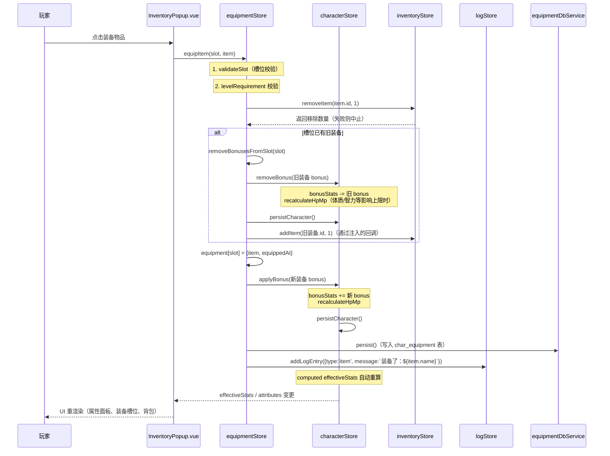

**属性同步链路**：

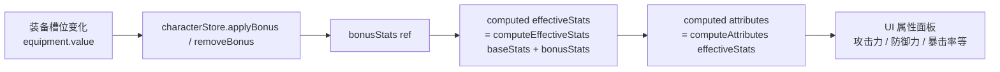

**数据流关键点**：

1. **回滚保护**：第 4 步 `doUnequip` 异常时，通过 catch 块将已移除的物品放回背包，避免装备丢失。
2. **HP/MP 重算**：仅当 `con`/`int`/`wis`/`cha` 变化时调用 `recalculateHpMp`，避免力量/敏捷变化引发不必要计算。
3. **持久化分离**：装备 ID 映射存 `char_equipment` 表，完整装备属性存内存 `equipmentTemplates` Map（按 ID 查询）。
4. **回调注入解耦**：装备卸下时放回背包通过 `setInventoryCallbacks` 注入的 `addItem` 回调完成，由 `gameBootstrap.initialize` 在 inventory 初始化后注入，消除 equipment → inventory 的静态依赖；`gameBootstrap.dispose` 时调用 `clearInventoryCallbacks` 清除引用，避免角色切换后回调指向旧 Store 实例。

---

### 2.4 技能施放数据流

下图展示技能施放的数据流向。技能模块负责校验、消耗法力、计算效果值，最终由调用方（combatStore）应用到目标。combatStore 通过 `ICombatContext.skill` 访问 skillStore 的方法。

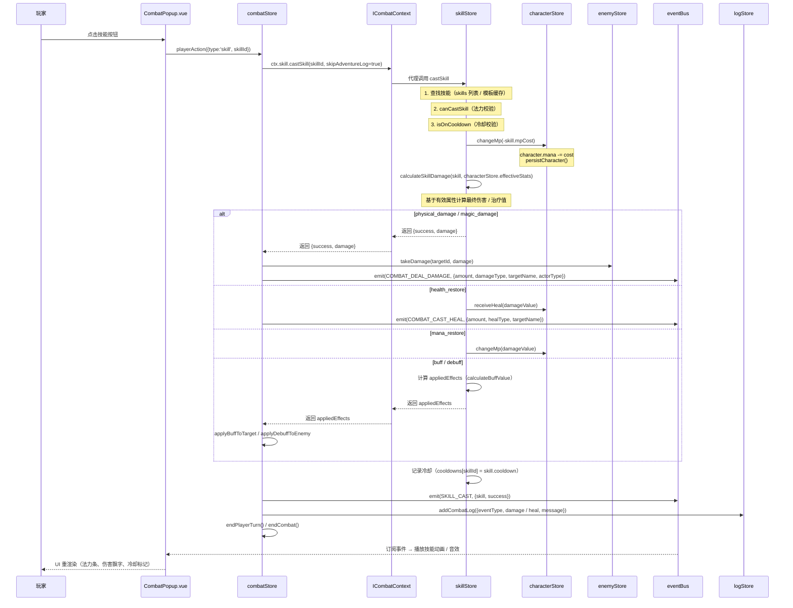

**数据流关键点**：

1. **职责分离**：skillStore 仅负责计算与法力消耗，目标应用由 combatStore 完成（战斗场景）或 characterStore 完成（恢复类技能）。
2. **双场景适配**：`skipAdventureLog` 参数区分战斗场景（仅记战斗日志）与探索场景（记冒险日志）。
3. **效果传递**：buff/debuff 通过 `appliedEffects` 数组传回调用方，由 combatStore 决定施加到玩家还是敌人。
4. **上下文代理**：combatStore 通过 `ICombatContext.skill.castSkill` / `getSkill` / `tickCooldowns` / `resetCooldowns` 访问 skillStore，不直接 import skillStore。

---

### 2.5 商店购买数据流

下图展示商店购买的原子性保障流程。通过"先扣金币后加物品，加物品失败则返还金币"的模式确保数据一致性。

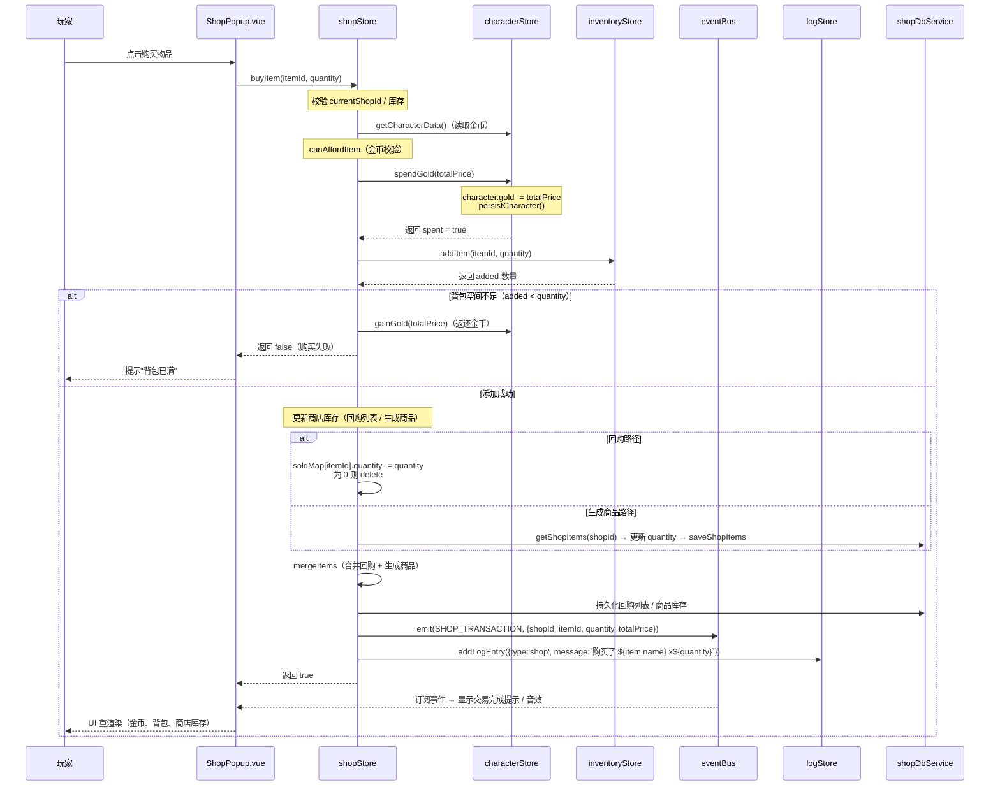

**数据流关键点**：

1. **原子性保障**：扣金币成功后立即加物品，加物品失败时通过 `gainGold` 返还金币，确保不会"扣钱没发货"。
2. **双路径库存**：回购列表（内存 Map）与生成商品（DB 表）分别管理，购买时根据物品来源选择扣减路径。
3. **金币变更专用 Action**：`spendGold` 内部包含 `canAffordGold` 校验，避免并发场景下超额扣减。

---

### 2.6 职业资源系统数据流

下图展示职业专属资源系统在战斗中的生成与消耗流程。资源系统由 `ResourceSystemFactory.create(classId)` 在战斗开始时按职业创建实例（战士怒气、潜行者能量+连击点、术士灵魂碎片、武僧真气；其他职业回退默认 MP 系统），通过战斗事件钩子被动生成资源，技能施放时检查并消耗。

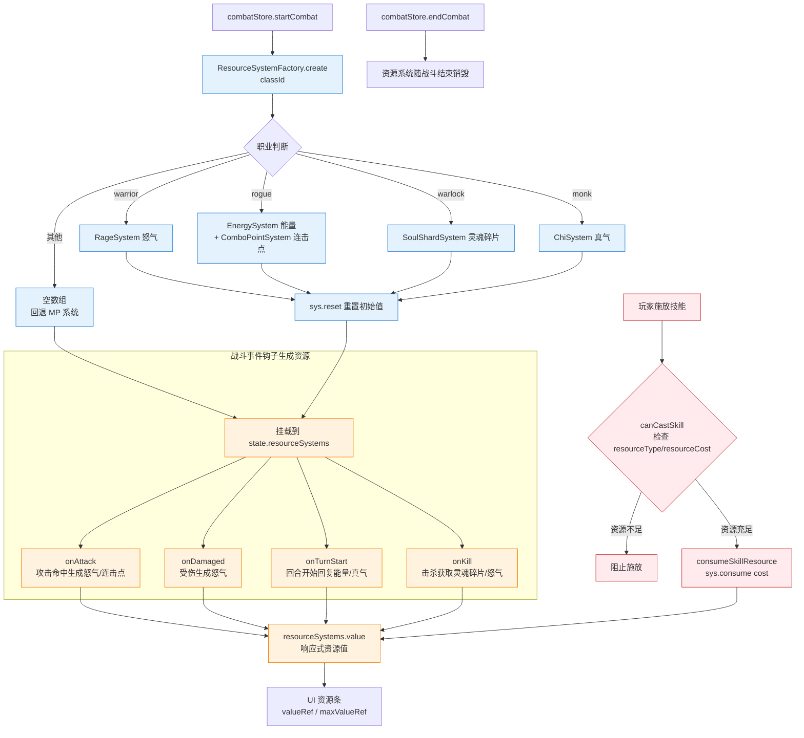

**数据流关键点**：

1. **工厂模式创建**：`ResourceSystemFactory.create` 返回 `ResourceSystem[]`，潜行者等双资源职业返回多实例数组，未实现专属资源的职业返回空数组由战斗 Store 回退 MP 系统。
2. **钩子驱动生成**：资源生成不主动调用，而是由 combatStore 在 `onAttack`/`onDamaged`/`onTurnStart`/`onKill` 等时机遍历 `resourceSystems.value` 调用对应钩子，各实现类按 `ResourceSource` 差异化处理获取量上限。
3. **响应式资源条**：每个资源系统暴露 `valueRef`/`maxValueRef`，UI 直接绑定渲染资源条，无需 EventBus 中转。
4. **技能消耗预留扩展**：`canCastSkill`/`consumeSkillResource` 通过 `skill.resourceType`/`resourceCost` 字段匹配资源系统类型并检查/扣减；当前 `Skill` 类型尚未包含这两个字段，接口扩展后自动生效。

---

### 2.7 被动技能数据流

下图展示职业被动技能在战斗事件中的触发流程。被动数据来源于 `src/data/config_class_passives.ts`（13 职业各 3 个被动，共 39 个），由 `usePassiveSkills` Composable 在战斗开始时加载并按触发时机执行。

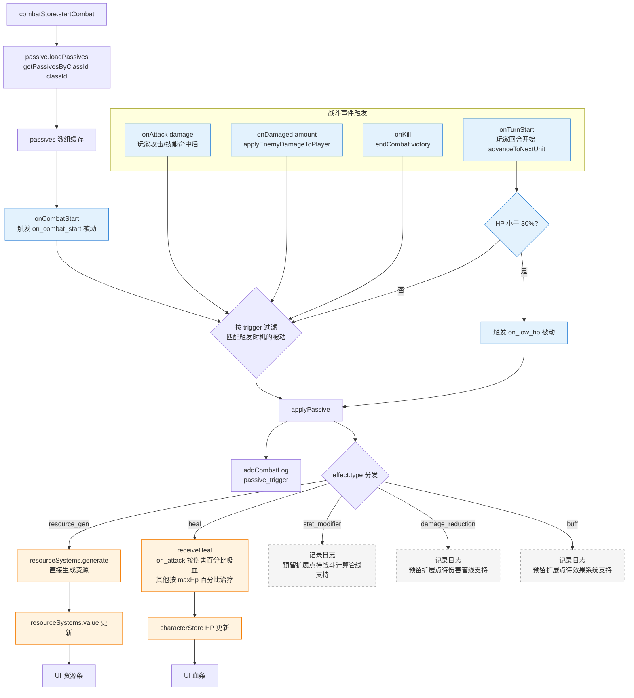

**数据流关键点**：

1. **数据驱动**：被动定义集中在 `src/data/config_class_passives.ts`（`CLASS_PASSIVES` 常量，13 职业各 3 个被动共 39 个），`getPassivesByClassId(classId)` 返回当前职业的被动列表，战斗开始时加载一次缓存到 `passives` 数组。
2. **触发时机映射**：每个被动通过 `trigger` 字段（`on_combat_start`/`on_turn_start`/`on_attack`/`on_damaged`/`on_low_hp`/`on_kill`/`passive`）声明触发时机，`usePassiveSkills` 在对应战斗事件中过滤并执行。
3. **效果分发**：`applyPassive` 按 `effect.type` 分发——`resource_gen` 直接调用资源系统生成、`heal` 调用 `characterStore.receiveHeal`（攻击吸血按伤害百分比、其他按 maxHp 百分比），其余三类（`stat_modifier`/`damage_reduction`/`buff`）当前仅记录日志，预留扩展点待战斗计算管线/效果系统支持后自动生效。
4. **与资源系统协同**：`resource_gen` 类被动直接调用 `resourceSystems.generate`，是资源系统除战斗钩子外的另一资源来源（如术士灵魂虹吸在击杀时额外获取灵魂碎片）。
5. **低血量检查**：`on_low_hp` 被动在 `onTurnStart` 与 `onDamaged` 后检查一次（HP < 30%），不在 `onAttack` 后触发（避免吸血后误触）。

---

### 2.8 天赋树数据流

下图展示天赋点分配与效果应用流程。天赋系统由 `character/talents` 模块的 `useTalentStore` 管理，每个职业 3 系天赋树，每系 3 层（tier 1/2/3），升级时获得天赋点（每 2 级 1 点），分配点数解锁天赋节点，效果通过计算属性回灌角色属性与战斗计算。

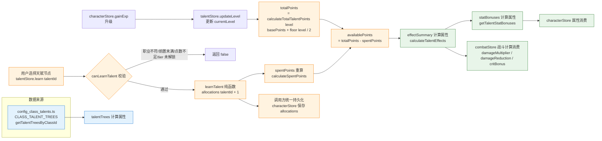

**数据流关键点**：

1. **点数计算**：总天赋点 `totalPoints = calculateTotalTalentPoints(level) = basePoints(0) + floor(level / pointsPerLevel(2))`，每 2 级获得 1 点；`availablePoints = totalPoints - spentPoints`，`spentPoints` 由 `calculateSpentPoints(allocations)` 汇总各天赋当前等级。配置常量集中在 `TALENT_POINT_RULES`：
   - `pointsPerLevel: 2`（每 2 级 1 点）
   - `basePoints: 0`（等级 1 初始 0 点）
   - `maxPointsPerTalent: 5`（单天赋最多 5 点，覆盖 `Talent.maxRank`）
   - `tier2Requirement: 3`（解锁第 2 层需该系投入 3 点）
   - `tier3Requirement: 6`（解锁第 3 层需该系投入 6 点）
2. **3 系 3 层结构**：每个职业 3 系天赋树，每系 3 层（`tier: 1 | 2 | 3`），`tier` 需逐层解锁（该系累计投入达 `tier2Requirement`/`tier3Requirement` 才可学习下一层）。`Talent.maxRank` 通常为 3-5，但单天赋实际可分配点数受 `maxPointsPerTalent` 上限约束。
3. **纯函数校验与更新**：`learn` 调用 `canLearnTalent`（校验职业匹配、前置节点 `requires`、可用点数、tier 解锁条件）后由 `learnTalent` 纯函数返回新的 `allocations` 对象，Store 仅替换引用，不直接持久化（由调用方 `characterStore` 统一存档）。
4. **效果回灌**：`effectSummary`（`calculateTalentEffects`）聚合所有已学天赋效果，输出 `statBonuses`/`damageMultiplier`/`damageReduction`/`critBonus`/`resourceBonuses`/`specialEffects`/`skillEnhancements`，供 `characterStore` 属性系统与 `combatStore` 战斗计算消费。
5. **响应式驱动**：`allocations` 为响应式 `ref`，任何分配变更自动触发 `effectSummary`/`statBonuses`/`availablePoints` 重算，下游消费者自动更新。
6. **生命周期**：`initialize(classId, level, savedAllocations)` 进入角色时加载，`reset()` 退出角色时清空，`updateLevel(level)` 升级时同步等级重算可用点数。

---

## 三、数据持久化流

### 3.1 初始化数据流

下图展示应用启动时的数据加载顺序。先初始化基础数据，再初始化角色模块，最后通过 EventBus 通知各 Store 重新加载。

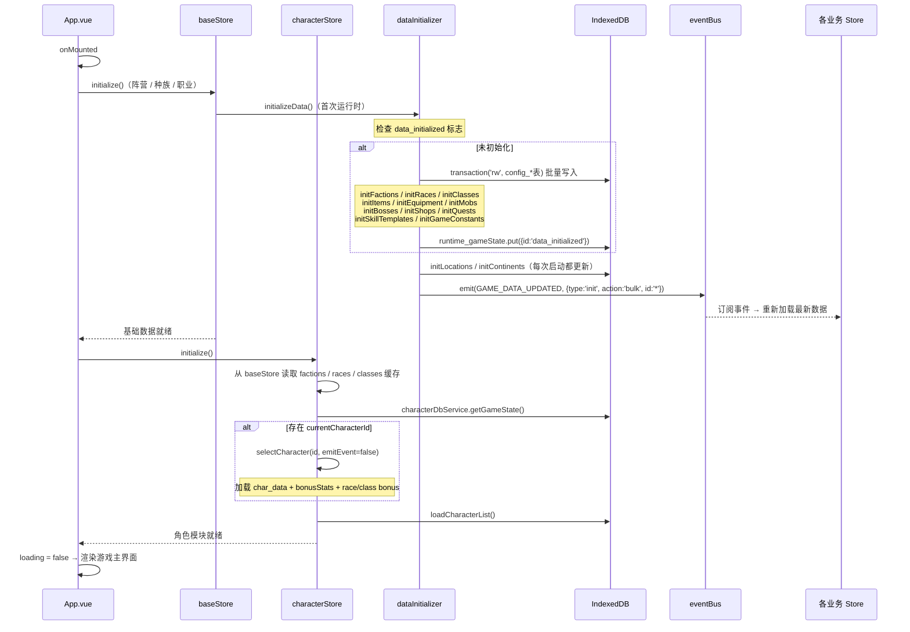

**数据流关键点**：

1. **事务原子性**：所有配置表初始化在单个 Dexie 事务中完成，中途失败则整体回滚。
2. **幂等性**：`data_initialized` 标志避免重复初始化；`initLocations`/`initContinents` 每次启动都执行以便更新地图配置。
3. **事件通知**：`GAME_DATA_UPDATED` 事件触发各 Store 重新加载，确保内存数据与 DB 一致。

---

### 3.2 角色切换数据流

下图展示切换角色时的数据加载与卸载流程。旧角色数据通过响应式清空自动卸载，新角色数据按 `char_*` 表逐表加载。各业务 Store 的初始化由 `gameBootstrap.initialize(characterId)` 按依赖顺序统一编排，退出角色时 `gameBootstrap.dispose()` 按逆序清理实现了 `Disposable` 接口的 Store。

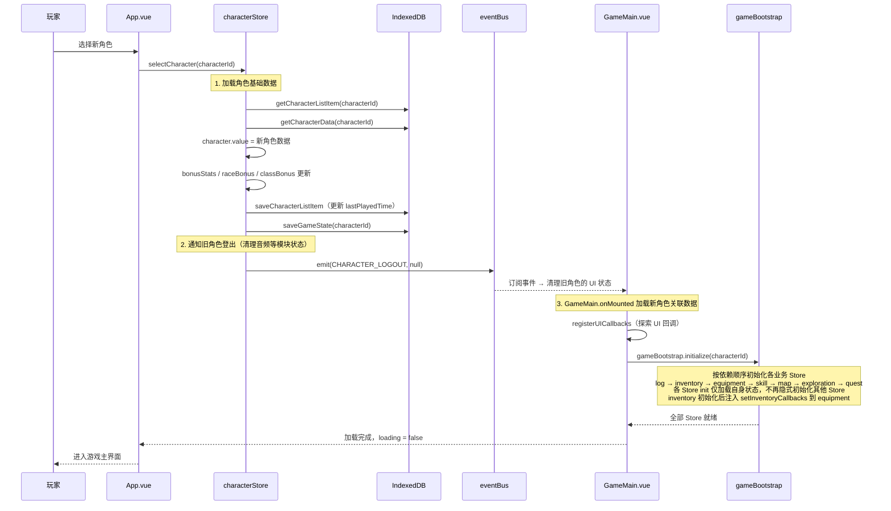

**角色退出时的 dispose 清理流**：

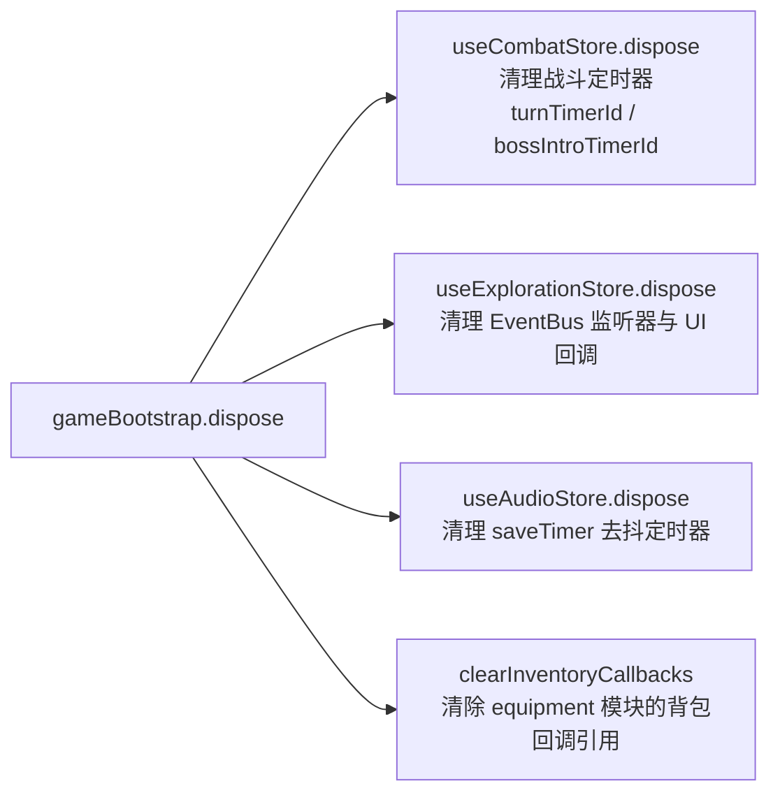

**角色删除的级联清理流**：

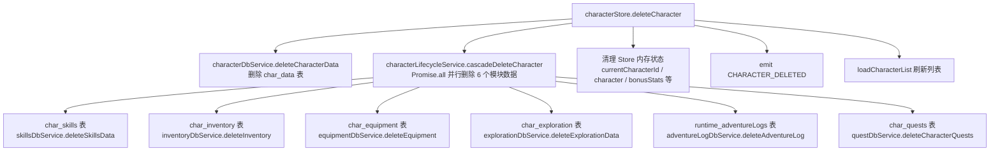

**数据流关键点**：

1. **数据隔离**：所有 `char_*` 表以 `characterId` 为索引，切换角色时按 ID 加载，互不干扰。
2. **登出事件**：`CHARACTER_LOGOUT` 用于清理音频等模块状态，不直接清空数据（由新角色加载覆盖）。
3. **级联删除收口**：删除角色时，`char_data` 表由 `characterDbService.deleteCharacterData` 删除，其余 6 张关联表（skill/inventory/equipment/exploration/log/quest）的删除由 `characterLifecycleService.cascadeDeleteCharacter` 通过 `Promise.all` 并行执行，消除 character Store 对 6 个模块 DbService 的直接依赖（CHR-4 修复）。
4. **统一初始化编排**：各业务 Store（log/inventory/equipment/skill/map/exploration/quest）的初始化由 `gameBootstrap.initialize(characterId)` 按依赖顺序统一编排（log → inventory → equipment → skill → map → exploration → quest），各 Store 的 `init` 仅加载自身状态，不再隐式初始化其他 Store。
5. **回调注入与清理**：`gameBootstrap.initialize` 在 inventory 初始化完成后、equipment 初始化前调用 `setInventoryCallbacks(inventoryStore.addItem, inventoryStore.removeItem)` 注入回调；`gameBootstrap.dispose` 调用 `clearInventoryCallbacks` 清除引用，避免角色切换后回调指向旧 Store 实例（A1/G1 修复）。
6. **Disposable 接口清理**：`gameBootstrap.dispose` 按初始化逆序清理实现了 `Disposable` 接口的 Store（combatStore 清理战斗定时器、explorationStore 清理 EventBus 监听器与 UI 回调、audioStore 清理 saveTimer 去抖定时器）。新增可释放 Store 时将其加入 disposables 列表，TypeScript 在编译期校验 dispose 方法签名（ARCH-8 修复）。

---

### 3.3 自动备份流

下图展示数据变更触发自动备份的流程。备份存储在 `localStorage` 中，保留最近 5 份。

```mermaid
flowchart LR
    %% 自动备份流程
    Trigger[存档变更触发<br/>backupService.createAutoBackup] --> Create[createBackup<br/>收集所有数据表]
    Create --> Collect[collectAllData<br/>角色表 + 运行时表 + 配置表]
    Collect --> Checksum[calculateChecksum<br/>简单哈希校验和]
    Checksum --> Build[构建 BackupFile<br/>version + timestamp + checksum + data]
    Build --> Read[getAutoBackups<br/>读取现有备份列表]
    Read --> Unshift[unshift 新备份到列表头部]
    Unshift --> Check{备份数量 > 5?}
    Check -->|是| Pop[pop 移除最旧备份]
    Check -->|否| Save
    Pop --> Save[localStorage.setItem<br/>键名 wow_dnd_auto_backups]
    Save --> Done[备份完成]
```

**备份文件结构**：

```typescript
interface BackupFile {
  version: string;           // 备份格式版本
  timestamp: number;         // 备份时间戳
  checksum: string;          // 简单哈希校验和（非 SHA-256）
  gameVersion: string;       // 游戏版本号
  data: BackupData;          // 完整游戏数据（角色表 + 运行时表 + 配置表）
}
```

**数据流关键点**：

1. **存储位置**：自动备份存 `localStorage`（键名 `wow_dnd_auto_backups`），手动备份导出为 JSON 文件下载。
2. **保留策略**：`unshift` 新备份到头部，超过 `MAX_AUTO_BACKUPS`（5）时 `pop` 最旧备份。
3. **校验和算法**：使用简单哈希（`(hash << 5) - hash + char`），非加密强度，仅用于完整性校验。
4. **命名格式**：手动备份文件名 `wow_dnd_backup_{ISO时间戳}.json`（如 `wow_dnd_backup_2026-07-06T08-30-00-000Z.json`）。

---

## 四、EventBus 事件数据流

EventBus 仅承载 UI/音效/通知类事件。下表列出所有事件的发布方 → 订阅方 → 处理动作映射。

### 角色模块事件

| 发布方 | 事件名 | 订阅方 | 处理动作 |
|--------|--------|--------|----------|
| characterStore | `CHARACTER_CREATED` | UI 组件 | 刷新角色列表 + 显示创建成功提示 |
| characterStore | `CHARACTER_DELETED` | UI 组件 | 刷新角色列表 + 显示删除提示 |
| characterStore | `CHARACTER_LOGOUT` | 音频模块 / UI 组件 | 清理旧角色音频状态 + 重置 UI |
| characterStore | `CHARACTER_LEVEL_UP` | GameMain / UI 组件 | 播放升级动画 + 升级音效 + 通知 |
| characterStore | `CHARACTER_DEATH` | UI 组件 | 显示死亡界面 |
| characterStore | `CHARACTER_RESURRECTED` | UI 组件 | 显示复活提示 + 恢复血量动画 |

### 战斗模块事件

| 发布方 | 事件名 | 订阅方 | 处理动作 |
|--------|--------|--------|----------|
| combatStore | `COMBAT_START` | UI 组件 | 显示战斗界面 + 播放战斗开始音效 |
| combatStore | `COMBAT_END` | explorationStore / UI 组件 | 探索模块消费战斗结果 + 显示结算弹窗 |
| combatStore | `COMBAT_PLAYER_TURN` | UI 组件 | 高亮玩家行动按钮 + 回合切换音效 |
| combatStore | `COMBAT_ENEMY_TURN` | UI 组件 | 禁用玩家操作 + 敌人回合动画 |
| combatStore | `COMBAT_DEAL_DAMAGE` | UI 组件 | 显示伤害飘字 + 伤害音效 |
| combatStore | `COMBAT_CAST_HEAL` | UI 组件 | 显示治疗飘字 + 治疗音效 |
| combatStore | `COMBAT_CRITICAL_HIT` | UI 组件 | 暴击视觉特效 + 暴击音效 |
| combatStore | `COMBAT_DODGE` | UI 组件 | 闪避视觉特效 + 闪避音效 |
| combatStore | `COMBAT_SKIP_TURN` | UI 组件 | 显示跳过回合提示 |
| combatStore | `COMBAT_BOSS_INTRO` | UI 组件 | 播放 Boss 出场动画 |
| combatStore | `COMBAT_BOSS_PHASE` | UI 组件 | Boss 阶段转换特效 |

### 探索模块事件

| 发布方 | 事件名 | 订阅方 | 处理动作 |
|--------|--------|--------|----------|
| explorationStore | `EXPLORATION_START` | UI 组件 | 显示探索界面 + 探索开始音效 |
| explorationStore | `EXPLORATION_END` | UI 组件 | 关闭探索界面 + 结束提示 |
| explorationStore | `EXPLORATION_CELL_EXPLORED` | UI 组件 | 格子翻开动画 + 音效 |
| explorationStore | `EXPLORATION_BATTLE_TRIGGERED` | combatStore | 启动战斗（startCombat） |
| explorationStore | `EXPLORATION_CAMP_USED` | UI 组件 | 营地恢复动画 + 音效 |
| explorationStore | `EXPLORATION_ITEM_FOUND` | UI 组件 | 物品发现提示弹窗 |
| explorationStore | `EXPLORATION_TRAP_TRIGGERED` | UI 组件 | 陷阱触发特效 + 受伤音效 |
| explorationStore | `EXPLORATION_RANDOM_EVENT` | UI 组件 | 随机事件提示弹窗 |

### 商店模块事件

| 发布方 | 事件名 | 订阅方 | 处理动作 |
|--------|--------|--------|----------|
| shopStore | `SHOP_OPENED` | UI 组件 | 显示商店界面 + 打开音效 |
| shopStore | `SHOP_CLOSED` | UI 组件 | 关闭商店界面 |
| shopStore | `SHOP_TRANSACTION` | UI 组件 | 交易完成提示 + 金币变化动画 |

### 任务模块事件

| 发布方 | 事件名 | 订阅方 | 处理动作 |
|--------|--------|--------|----------|
| questStore | `QUEST_BOARD_OPENED` | UI 组件 | 显示任务看板 |
| questStore | `QUEST_ACCEPTED` | UI 组件 | 接受任务提示 + 刷新任务列表 |
| questStore | `QUEST_COMPLETED` | UI 组件 | 任务完成通知 + 庆祝音效 |
| questStore | `QUEST_REWARDED` | UI 组件 | 奖励领取提示 + 物品/金币动画 |

### 技能模块事件

| 发布方 | 事件名 | 订阅方 | 处理动作 |
|--------|--------|--------|----------|
| skillStore | `SKILL_LEARNED` | UI 组件 | 技能学习提示 + 刷新技能列表 |
| skillStore | `SKILL_CAST` | UI 组件 | 播放技能施放动画 + 音效 |

### 通用事件

| 发布方 | 事件名 | 订阅方 | 处理动作 |
|--------|--------|--------|----------|
| mapStore | `ZONE_ENTERED` | UI 组件 | 显示区域进入提示 + 背景切换 |
| dataInitializer | `GAME_DATA_UPDATED` | 各业务 Store | 重新加载最新数据（baseStore 等） |
| logStore | `LOG_ENTRY_ADDED` | UI 组件 | 冒险日志列表追加新条目 |
| UI 组件 | `UI_PANEL_OPENED` | 音频模块 | 播放面板打开音效 |
| UI 组件 | `UI_PANEL_CLOSED` | 音频模块 | 播放面板关闭音效 |
| UI 组件 | `UI_CLICK` | 音频模块 | 播放通用点击音效 |
| ConfirmPopup | `CONFIRM_CONFIRMED` | 触发方组件 | 执行确认后的回调动作 |
| ConfirmPopup | `CONFIRM_CANCELED` | 触发方组件 | 执行取消后的回调动作 |
| inventoryStore | `ITEM_DROPPED` | UI 组件 | 物品丢弃提示 + 刷新背包 |
| dataService | `DATA_EXPORTED` | UI 组件 | 导出成功提示 |
| dataService | `DATA_IMPORTED` | UI 组件 | 导入成功提示 + 刷新所有数据 |

---

## 五、响应式数据流

下图展示角色属性的 Vue computed 派生链。`effectiveStats` 是核心派生节点，所有属性面板、战斗计算、技能效果都依赖此 computed。

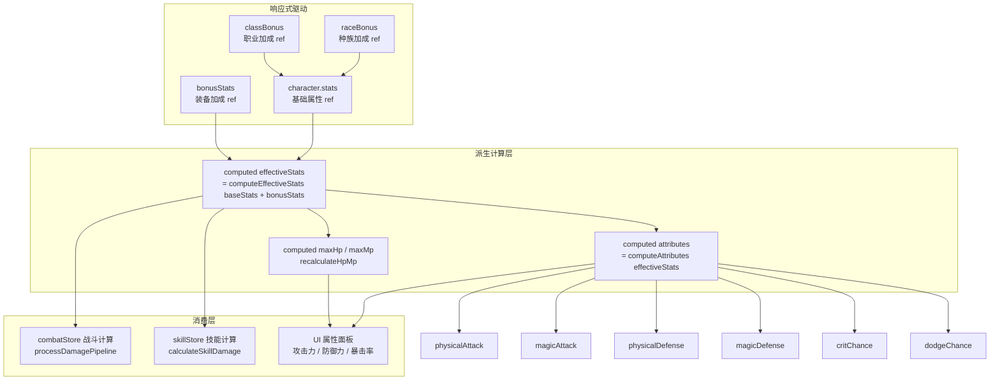

**响应式链路关键点**：

1. **单一数据源**：`character.stats`（基础）与 `bonusStats`（加成）是所有属性的源头，任何修改自动触发下游重算。
2. **computeEffectiveStats**：纯函数，输入基础属性与加成属性，输出合并后的有效属性（`base + bonus`）。
3. **computeAttributes**：纯函数，将六维属性（str/dex/con/int/wis/cha）转换为战斗属性（攻击/防御/暴击/闪避等）。
4. **多消费者**：`effectiveStats` 同时被 combatStore（伤害计算）、skillStore（技能效果）、UI（属性面板）消费，确保数据一致。
5. **HP/MP 联动**：当 `con`/`int`/`wis`/`cha` 变化时，`recalculateHpMp` 基于新的 `effectiveStats` 重算上限，避免属性变化后血量上限不匹配。

**装备变化触发的完整响应式链**：

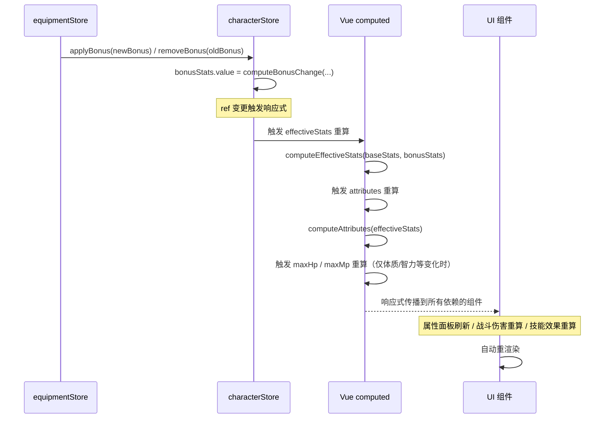

---

## 六、数据流设计原则总结

| 原则 | 实现方式 | 示例 |
|------|----------|------|
| 单一数据源 | 每个 Store 是其领域数据的唯一持有者 | characterStore 持有 character ref |
| 单向数据流 | 组件 → Store → Service → DB | 组件不直接修改 ref，必须调用 Action |
| 纯函数计算 | Service 层无副作用，只负责计算 | combatService / skillService / explorationService |
| 跨模块直调 | 模块间数据变更通过 Store Action | combatStore 通过 ICombatContext 代理调用 characterStore.takeDamage |
| 上下文注入解耦 | combat 模块通过 ICombatContext 聚合外部 Store，不直接 import | createCombatContext 是 combat 内唯一引用外部 Store 的位置 |
| 跨模块查询收口 | 探索/管理后台的跨模块查询通过 services 层聚合 | crossModuleQuery / adminQueryService |
| 角色生命周期收口 | 角色 create/delete 的跨模块持久化通过 CharacterLifecycleService | initializeCharacterSkills / cascadeDeleteCharacter |
| 注册表分发 | 探索事件处理器集中在 events.ts 注册表 | cellEventHandlers / effectHandlers |
| EventBus 仅通知 | UI/音效/通知走 EventBus，不传数据变更 | COMBAT_DEAL_DAMAGE 仅用于伤害飘字 |
| 响应式驱动 UI | computed 链自动传播状态变化 | effectiveStats → attributes → UI |
| 持久化分离 | DB 操作集中在 db.ts，Store 编排 | characterDbService / combatDbService |
| 原子性保障 | 关键操作通过回滚机制保证一致性 | 商店购买失败返还金币 / 装备卸载失败放回背包 |

---

**文档结束**
