# 模块依赖关系梳理

## 文档信息

| 项目 | 内容 |
|------|------|
| 标题 | 模块依赖关系梳理 |
| 版本 | v4.0 |
| 生成日期 | 2026年8月3日 |
| 所属目录 | `doc/project/` |
| 关联文档 | MODULE_FUNCTIONS.md、DATA_ARCHITECTURE_OVERVIEW.md、ARCHITECTURE_DIAGRAMS.md |
| 更新说明 | 本次基于源码逐项复核更新：① 矩阵补全 `console` 行（命令子模块经各模块 Store 访问数据：character/inventory/equipment/skill/quest/log/enemy/map/shop/combat，模板查询类经 adminQueryService 收口，不直接 import 任何 DbService）并修正 `boss` 行 data 列（boss/db.ts 经 data/core 的 DBService 基类访问数据库）；② 全景图移除源码中不存在的 `animation → bus`、`admin → bus` 边，补充 `console → character` 边；③ 补充 P3-141 说明：audioService 不再从 modules 聚合入口 re-export（避免经 `@/modules` 静态引用拉入 Tone.js），仅由 main.ts 动态 import 加载。P3-116 全局状态收敛内容经复核与源码一致（GameStore 持有 currentCharacterId/currentShopId/gameSettings/lastPlayedAt/initializedAt，经 gameStateHelper 持久化至 runtime_gameState 表，audio/db.ts 已删除，services 目录现存 5 个服务）。 |

---

## 概述

本文档基于源码 `import` 关系与 Store Action 调用链，梳理 21 个模块（含 `item-template` 统一物品模板层、`game` 全局状态模块）之间的依赖关系，识别循环依赖、跨层调用、隐式耦合等问题，为架构优化提供依据。

依赖关系分为三类：
- **静态依赖**：通过 `import` 引入的类型、函数、Store（编译期确定）
- **运行时依赖**：通过 Store Action 调用、EventBus 发布订阅、回调注入（运行期发生）
- **数据层依赖**：通过 DbService 跨模块直接查询（绕过 Store）

---

## 一、模块依赖全景图

```mermaid
graph TD
    %% 基础设施层
    data[data 数据核心]
    bus[bus 事件总线]
    base[base 基础数据]
    admin[admin 后台管理]
    audio[audio 音频]
    animation[animation 动画]

    %% 核心数据层
    game[game 全局状态]
    character[character 角色]
    inventory[inventory 背包]
    equipment[equipment 装备]
    skill[skill 技能]
    quest[quest 任务]
    itemTemplate[item-template<br/>统一物品模板层]

    %% 玩法核心层
    combat[combat 战斗]
    exploration[exploration 探索]
    map[map 地图]
    shop[shop 商店]

    %% 辅助层
    log[log 冒险日志]
    enemy[enemy 敌人]
    boss[boss Boss]
    console[console 控制台]

    %% 服务层
    crossModuleQuery[CrossModuleQuery<br/>跨模块查询]
    gameBootstrap[GameBootstrap<br/>初始化编排]
    errorHandler[ErrorHandler<br/>错误处理]
    characterLifecycle[CharacterLifecycleService<br/>角色生命周期]
    adminQuery[AdminQueryService<br/>管理后台查询]

    %% 基础设施依赖
    base --> data
    base --> bus
    admin --> data
    audio --> bus
    audio --> game
    animation --> config[config/*]

    %% 全局状态依赖（P3-116：GameStore 收敛全局状态）
    game --> data
    character --> game
    shop --> game
    exploration --> game

    %% 核心数据层依赖
    character --> data
    character --> bus
    character --> base
    character --> calculations[utils/calculations]
    character --> characterLifecycle

    inventory --> data
    inventory --> bus
    inventory --> character
    inventory --> itemTemplate

    equipment --> data
    equipment --> bus
    equipment --> character
    equipment -.->|setInventoryCallbacks 回调注入| inventory

    skill --> data
    skill --> bus
    skill --> character

    quest --> data
    quest --> bus
    quest --> character
    quest -.->|setQuestExternalCallbacks 回调注入| inventory
    inventory -.->|onItemCollected 回调| quest

    itemTemplate --> inventory_db[inventory/db]
    itemTemplate --> equipment_db[equipment/db]

    %% 玩法核心层依赖
    combat --> data
    combat --> bus
    combat --> combatContext[combatContext.ts<br/>ICombatContext 工厂]
    combatContext --> character
    combatContext --> enemy
    combatContext --> skill
    combatContext --> inventory
    combatContext --> quest
    combatContext --> log
    combat -.->|IBossContext 接口注入| boss

    exploration --> data
    exploration --> bus
    exploration --> character
    exploration --> inventory
    exploration --> game
    exploration --> enemy
    exploration --> crossModuleQuery
    exploration --> log
    exploration --> eventsTS[events.ts<br/>注册表分发]
    exploration -.->|监听COMBAT_END| combat

    map --> data
    map --> bus

    shop --> data
    shop --> bus
    shop --> character
    shop --> inventory
    shop --> log
    shop --> game

    %% 辅助层依赖
    log --> data
    log --> bus

    enemy --> data
    enemy --> skill

    boss --> enemy
    boss --> bus

    console --> character
    console --> adminQuery

    %% 服务层依赖
    crossModuleQuery --> map_db[map/db]
    crossModuleQuery --> quest_db[quest/db]
    crossModuleQuery --> shop_db[shop/db]
    crossModuleQuery --> equipment_db2[equipment/db]
    crossModuleQuery --> itemTemplate
    characterLifecycle --> skill_db[skill/db]
    characterLifecycle --> inventory_db3[inventory/db]
    characterLifecycle --> equipment_db3[equipment/db]
    characterLifecycle --> exploration_db[exploration/db]
    characterLifecycle --> log_db[log/db]
    characterLifecycle --> quest_db2[quest/db]
    adminQuery --> enemy_db[enemy/db]
    adminQuery --> boss_db[boss/db]
    adminQuery --> inventory_db4[inventory/db]
    adminQuery --> equipment_db4[equipment/db]
    gameBootstrap -.->|编排 Layer1 并行初始化| log
    gameBootstrap -.->|编排 Layer1 + 注入 setInventoryExternalCallbacks| inventory
    gameBootstrap -.->|编排 Layer2 + 注入 setInventoryCallbacks| equipment
    gameBootstrap -.->|编排 Layer2| skill
    gameBootstrap -.->|编排 Layer2| map
    gameBootstrap -.->|编排 Layer3| exploration
    gameBootstrap -.->|编排 Layer4 + 注入 setQuestExternalCallbacks| quest
    gameBootstrap -.->|dispose 清理| combat
    gameBootstrap -.->|dispose 清理| exploration
    gameBootstrap -.->|dispose 清理| audio
    gameBootstrap -.->|dispose: clearInventoryCallbacks| equipment
    gameBootstrap -.->|dispose: 清空双向回调| inventory
    gameBootstrap -.->|dispose: 清空双向回调| quest
    gameBootstrap -.->|注入 setBossCreateFn / dispose 清空| enemy
    gameBootstrap -.->|bossDbService/createBossInstance| boss
    errorHandler --> useToast[composables/useToast]

    %% 样式
    classDef infra fill:#e1f5fe,stroke:#0288d1
    classDef core fill:#f3e5f5,stroke:#7b1fa2
    classDef gameplay fill:#fff3e0,stroke:#ef6c00
    classDef aux fill:#e8f5e9,stroke:#388e3c
    classDef service fill:#fce4ec,stroke:#c2185b
    classDef bridge fill:#e0f2f1,stroke:#00695c

    class data,bus,base,admin,audio,animation infra
    class character,inventory,equipment,skill,quest,itemTemplate,game core
    class combat,exploration,map,shop gameplay
    class log,enemy,boss,console aux
    class crossModuleQuery,gameBootstrap,errorHandler,characterLifecycle,adminQuery service
    class combatContext,eventsTS bridge
```

> 说明：虚线表示 EventBus 事件监听、运行时编排调用（如 GameBootstrap → 各 Store initialize）、接口注入（如 IBossContext、setInventoryCallbacks、setInventoryExternalCallbacks、setQuestExternalCallbacks、setBossCreateFn）或 dispose 清理；`xxx_db` 表示直接 import 其他模块的 DbService（跨层数据查询，已收口到服务层或 item-template 模块）。服务层（粉色节点）收口跨模块查询、初始化编排、缓存、错误处理、角色生命周期与管理后台查询。`game`（紫色节点）是全局状态唯一持有者（P3-116），character/shop/exploration/audio 通过 gameStore 代理 currentCharacterId/currentShopId/gameSettings，game 仅依赖 data。`combatContext.ts`（青色节点）是 combat 模块内唯一引用 6 个外部 Store 的位置（S2 修复）。`events.ts`（青色节点）是探索模块的事件处理器注册表（ARCH-11 修复）。物品模板缓存统一收敛于 item-template 模块的 `unifiedItemTemplateCache`（ARCH-1 修复，原 services/ItemTemplateCache 已删除）。`console` 命令子模块经各模块 Store 访问数据，模板查询类经 `AdminQueryService` 收口（CHR-5 修复）。`animation` 与 `admin` 仅依赖 data/config/utils 层，不依赖 bus。另 P3-141：`audioService` 不再从 modules 聚合入口 re-export（避免经 `@/modules` 静态引用拉入 Tone.js，gzip 后约 50KB+），仅由 main.ts 通过动态 `import('@/modules/audio/service')` 加载。

---

## 二、分层依赖关系

### 2.1 分层架构依赖方向

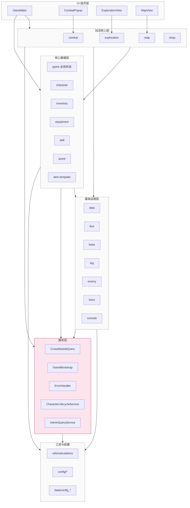

### 2.2 依赖方向规范

| 方向 | 是否允许 | 说明 |
|------|----------|------|
| 上层 → 下层 | 允许 | UI → 玩法层 → 数据层 → 基础层 |
| 同层之间 | 谨慎 | 玩法层之间通过 EventBus 或 Store 调用 |
| 下层 → 上层 | 禁止 | 基础层不应依赖玩法层 |
| 跨层跳级 | 谨慎 | UI 直接调核心数据层 Store 是允许的 |
| 模块 → 服务层 | 允许 | 跨模块查询/缓存/编排/生命周期/管理后台查询收口于服务层 |
| 模块 → item-template | 允许 | inventory 通过 item-template 聚合物品模板（单向，无循环） |
| 模块 → game | 允许 | 全局状态（currentCharacterId/currentShopId/gameSettings）通过 GameStore 统一代理（P3-116） |

---

## 三、模块依赖矩阵

### 3.1 静态依赖矩阵（import 关系）

下表行表示"依赖方"，列表示"被依赖方"。`S` 表示 Store 依赖，`D` 表示 DbService 依赖，`T` 表示类型/工具依赖，`C` 表示通过 combatContext 聚合的依赖，`R` 表示通过回调注入的运行时依赖。

| 依赖方 \ 被依赖方 | data | bus | character | inventory | equipment | skill | quest | log | enemy | map | shop | combat | boss | game |
|---|---|---|---|---|---|---|---|---|---|---|---|---|---|---|
| character | S | S | - | - | - | - | - | - | - | - | - | - | - | S |
| inventory | S | - | S | - | - | - | - | S | - | - | - | - | - | - |
| equipment | S | - | S | -（R） | - | - | - | S | - | - | - | - | - | - |
| skill | S | S | S | - | - | - | - | S | - | - | - | - | - | - |
| quest | S | S | S | R | - | - | - | S | - | - | - | - | - | - |
| item-template | - | - | - | D | D | - | - | - | - | - | - | - | - | - |
| combat | S | S | C | C | - | C | C | C | C | - | - | - | -（IBossContext） | - |
| exploration | S | S | S | S | - | - | - | S | S | - | - | - | - | S |
| map | S | S | - | - | - | - | - | - | - | - | - | - | - | - |
| shop | S | S | S | S | - | - | - | S | - | - | - | - | - | S |
| enemy | S | - | - | - | - | S | - | - | - | - | - | - | - | - |
| boss | S | S | - | - | - | - | - | - | S | - | - | - | - | - |
| log | S | S | - | - | - | - | - | - | - | - | - | - | - | - |
| console | - | - | S | S | S | S | S | S | S | S | S | S | - | - |
| audio | - | S | - | - | - | - | - | - | - | - | - | - | - | S |
| game | S | - | - | - | - | - | - | - | - | - | - | - | - | - |

> 说明：
> - `equipment` 的 `inventory` 列标记为 `R`：表示通过 `setInventoryCallbacks` 回调注入的运行时依赖（非静态 import），由 `gameBootstrap.initialize` 在 inventory 初始化后注入 `addItem`/`removeItem`/`flushPersist` 回调（A1/G1 + DB-1/DB-2 修复）。
> - `quest` 的 `inventory` 列标记为 `R`：表示通过 `setQuestExternalCallbacks` 回调注入的运行时依赖（ARCH-2 修复），quest 的 `acceptQuest`/`_grantQuestRewards` 经注入的 `getInventoryItemCount`/`addItemToInventory` 回调访问背包，不再静态 import inventory；inventory 通过 `setInventoryExternalCallbacks` 注入 `onItemCollected` 回调反向通知 quest，双向回调切断循环依赖。
> - `combat` 的多个列标记为 `C`：表示通过 `combatContext.ts` 聚合的依赖（非 combat/store.ts 直接 import）。`createCombatContext()` 是 combat 模块内唯一引用 6 个外部 Store 的位置（S2 修复）；combat/store 另直接依赖 `log/service.generateLogId`。
> - `combat` 的 `boss` 列标记为 `IBossContext`：表示通过接口注入解耦（S3 修复），combat/store.ts 实现 `IBossContext` 接口并注入到 `useBossMechanics`，boss 不再直接 import combat Store（combat 经 composables 静态依赖 boss 的 BossPhaseManager/processBossPhaseMechanics 等机制函数为单向使用）。
> - `item-template` 模块单向依赖 `inventory/db` + `equipment/db`，消除原 inventory ↔ equipment 双向依赖（A1/G1 修复）。
> - `character`/`shop`/`exploration`/`audio` 的 `game` 列标记为 `S`：表示通过 `useGameStore()` 代理全局状态（P3-116），game 仅依赖 data 持久化全局状态。
> - `map` 不再依赖 `character` Store（initialize 通过参数传入 characterId）；`exploration` 新增依赖 `enemy`（`migrateExplorationGrid` 网格迁移）。
> - `console` 命令子模块经各模块 Store 访问数据（character/framework.ts + commands/*.ts），模板查询类经 `adminQueryService` 收口（CHR-5 修复），console 不直接 import 任何 DbService。
> - `boss` 的 `data` 列标记为 `S`：boss/db.ts 经 `data/core` 的 DBService 基类访问数据库（本次复核修正）。
> - `character` 不再直接依赖 6 个模块的 DbService，通过 `characterLifecycleService` 收口级联删除/初始化（CHR-4 修复）。
> - `audio` 的 `data` 列标记为 `-`：音频设置持久化已迁移到 GameStore，`audio/db.ts` 删除（P3-116 修复）；另 P3-141：`audioService` 不再从 modules 聚合入口导出，由 main.ts 动态 import 加载（避免静态拉入 Tone.js）。
> - `animation` 与 `admin` 未列入矩阵行：animation 仅依赖 `config/combat-colors` 与 `utils/rng`（不依赖 bus/data）；admin 仅依赖 `data/core`（db/service）。

### 3.2 运行时调用矩阵（Store Action 调用）

| 调用方 \ 被调用方 | character | inventory | equipment | skill | quest | log | enemy | combat |
|---|---|---|---|---|---|---|---|---|
| combat（经 ICombatContext） | takeDamage/gainExp/gainGold/handleDeath/receiveHeal/changeMp | useItem/addItem/getItemInfo | - | castSkill/tickCooldowns/resetCooldowns/getSkill | onEnemyKilled | addLogEntry | createEnemy/takeDamage/deleteEnemy/useSkill/getAvailableSkills/calculateDamage/tickCooldowns | - |
| exploration | takeDamage/receiveHeal/changeMp/gainGold/gainExp | addItem/getItemInfo | - | - | - | addLogEntry | - | - |
| inventory | receiveHeal/changeMp/applyBonus | - | - | - | -（回调注入 onItemCollected） | addLogEntry | - | - |
| equipment | applyBonus/removeBonus | -（回调注入 addItem） | - | - | - | addLogEntry | - | - |
| skill | changeMp/receiveHeal | - | - | - | - | addLogEntry | - | - |
| quest | gainExp/gainGold | -（回调注入 getInventoryItemCount/addItemToInventory） | - | - | - | addLogEntry | - | - |
| shop | spendGold/gainGold | addItem/removeItem/getItemInfo | - | - | - | addLogEntry | - | - |
| boss（经 IBossContext） | getPlayerName | - | - | - | - | - | createMinion | rebuildInitiativeOrder |

> 说明：
> - `combat` 的所有跨模块调用通过 `ICombatContext` 代理（S2 修复），`ICombatQuery` 提供只读访问，`ICombatCommand` 提供写入操作。
> - `boss` 的跨模块调用通过 `IBossContext` 接口注入（S3 修复），接口含 `getPlayerName`/`createMinion`/`rebuildInitiativeOrder` 三个方法。
> - `equipment` 调用 `inventory.addItem` 通过 `setInventoryCallbacks` 注入的回调完成（A1/G1 修复），非静态 import。
> - `quest` 与 `inventory` 的双向调用均通过回调注入完成（ARCH-2 修复）：quest 经 `setQuestExternalCallbacks` 注入的 `getInventoryItemCount`/`addItemToInventory` 访问背包；inventory 经 `setInventoryExternalCallbacks` 注入的 `onItemCollected` 通知 quest 推进 collect 任务进度。

---

## 四、关键依赖链分析

### 4.1 战斗模块依赖链

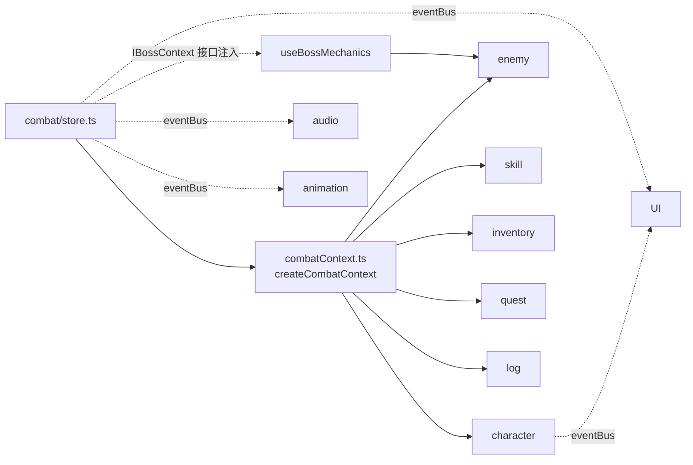

**分析**：
- 战斗模块是最复杂的依赖中心，但通过对 6 个外部 Store 的依赖收口到 `combatContext.ts`（S2 修复），combat/store.ts 本身不再直接 import 外部 Store（仅直接依赖 `log/service.generateLogId` 与类型 import）
- `ICombatContext` 进一步拆分为 `ICombatQuery`（只读）与 `ICombatCommand`（写入），composable 可按需声明读/写意图
- `boss` 与 `combat` 的双向依赖已通过 `IBossContext` 接口注入解耦（S3 修复）：combat/store.ts 实现 `IBossContext` 接口并注入到 `useBossMechanics`，boss 不再直接 import combat Store
- 战斗模块通过 composables 拆分（resources / forms / pets / effects / ai）缓解了复杂度

#### 4.1.1 战斗子模块依赖

战斗模块拆分为 `resources / forms / pets / effects / ai / composables` 六大子目录，combat/store 静态依赖 `ai`、`effects`、`forms`、`pets`、`resources`、`composables` 子模块，子模块依赖关系如下：

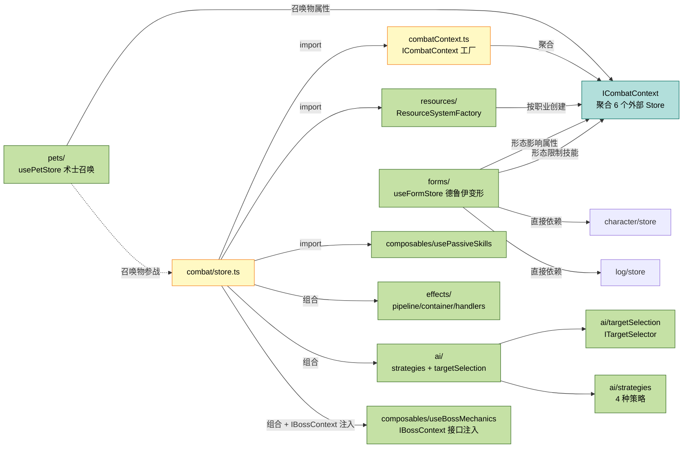

**子模块职责与依赖说明**：

| 子模块 | 职责 | 对外依赖 |
|--------|------|----------|
| `combatContext.ts` | 聚合 6 个外部 Store 为 `ICombatContext`（`ICombatQuery` + `ICombatCommand`），是 combat 内唯一引用外部 Store 的位置 | character/skill/enemy/quest/log/inventory Store |
| `composables/useBossMechanics` | Boss 机制逻辑，通过 `IBossContext` 接口注入外部依赖 | IBossContext 接口（由 combat/store.ts 实现） |
| `resources/` | 职业资源系统（怒气/能量/连击点/灵魂碎片/真气），由 `ResourceSystemFactory` 按职业创建 | 无外部模块 import（职业类型由调用方传入，纯内部资源系统） |
| `composables/usePassiveSkills` | 被动技能触发逻辑，作为组合式函数注入到敌人行动与先攻调度 | 被注入到 useEnemyAction、useInitiative |
| `forms/` | 德鲁伊变形系统，独立 `useFormStore`，管理形态切换与属性修正 | character（useCharacterStore）、log（useLogStore/generateLogId）、ICombatContext（经 store 传入） |
| `pets/` | 术士召唤系统，独立 `usePetStore`，管理召唤物生成与行动 | 无外部模块 import（仅内部 warlockPets） |
| `ai/targetSelection` | AI 目标选择策略，抽象为 `ITargetSelector` 接口 | 无外部模块依赖 |
| `effects/` | Buff/Debuff 效果系统（管线-容器-处理器三层结构） | 无外部模块依赖 |

### 4.2 探索模块依赖链

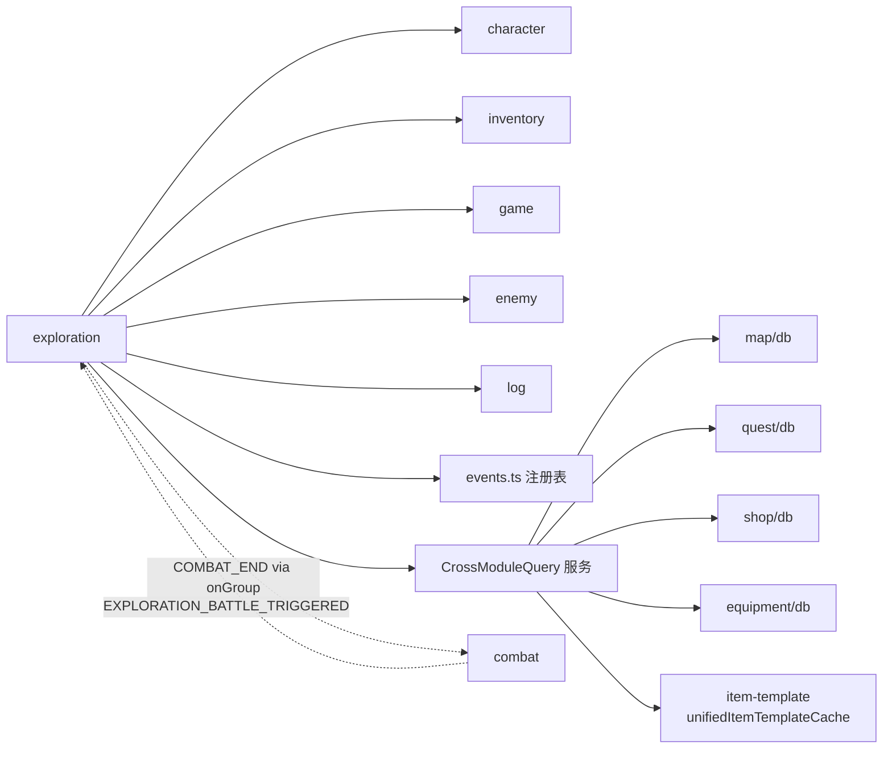

**分析**：
- 探索模块通过 EventBus 与战斗模块双向通信（探索触发战斗，战斗结束通知探索）
- 跨层调用已抽取到 `CrossModuleQuery` 服务，探索 Store 仅依赖该服务单例；物品模板查询统一经 item-template 模块的 `unifiedItemTemplateCache` 命中内存缓存（ARCH-1 修复：原 `services/ItemTemplateCache` 已删除，避免双重缓存数据不一致）
- 探索模块通过 `useGameStore()` 代理 currentCharacterId（P3-116），并通过 `enemy` 模块的 `migrateExplorationGrid` 迁移旧版探索网格
- 即时结算路径通过 `events.ts` 注册表分发（`cellEventHandlers` 按 `CellType` 查找，`effectHandlers` 按 `RandomEventEffectType` 查找），新增事件类型只需在 `events.ts` 注册处理器，无需修改 store.ts（ARCH-11 修复）
- 事件监听使用 `eventBus.onGroup('exploration', ...)` 分组订阅，`dispose` 时 `clearGroup('exploration')` 统一清理

### 4.3 角色模块依赖链

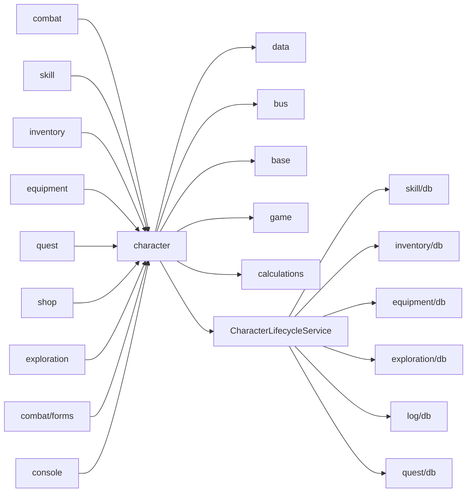

**分析**：
- 角色模块是**被依赖最多的模块**（combat（经 ICombatContext）/skill/inventory/equipment/quest/shop/exploration/combat-forms/console 等依赖它）
- 角色模块本身只依赖基础设施层 + `game` 全局状态 + `CharacterLifecycleService`，依赖方向正确
- 角色创建/删除的跨模块持久化通过 `CharacterLifecycleService` 收口（CHR-4 修复），character Store 不再直接 import 6 个模块的 DbService
- 高扇入意味着角色模块的任何改动都会影响全局，需要特别谨慎

### 4.4 装备-背包依赖链（A1/G1 修复后）

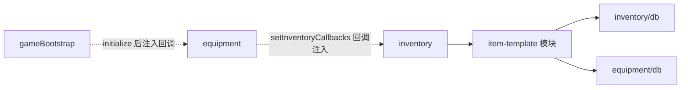

**分析**：
- `inventory` 通过 `item-template` 模块的 `unifiedItemTemplateCache` 获取合并后的物品模板（普通物品 + 装备），不再直接 import `equipmentDbService`
- `equipment` 卸下装备放回背包通过 `setInventoryCallbacks` 注入的 `addItem`/`removeItem` 回调完成，不再直接 import `inventory/store`；回调同时注入 `flushPersist`（DB-1/DB-2 修复：装备持久化失败回滚时等待背包持久化完成）
- `item-template` 模块单向依赖 `inventory/db` + `equipment/db`，无循环
- 回调注入由 `gameBootstrap.initialize` 在 inventory 初始化后、equipment 初始化前调用 `setInventoryCallbacks` 完成；`dispose` 时调用 `clearInventoryCallbacks` 清除引用

---

## 五、循环依赖与耦合问题识别

### 5.1 已识别的循环/双向依赖

| 编号 | 涉及模块 | 依赖类型 | 严重程度 | 状态 | 描述 |
|------|----------|----------|----------|------|------|
| C1 | combat ↔ boss | 静态双向 | 中 | ✅ 已解耦（S3） | 原 combat 调用 boss 的 initBossFeatures，boss 调用 combat 的 Store。已通过 `IBossContext` 接口注入解耦：combat/store.ts 实现 `IBossContext` 接口（`getPlayerName`/`createMinion`/`rebuildInitiativeOrder`）并注入到 `useBossMechanics`，boss 不再直接 import combat Store |
| C2 | exploration ↔ combat | 事件双向 | 低 | ⚠️ 设计如此 | 通过 EventBus 双向通信（EXPLORATION_BATTLE_TRIGGERED + COMBAT_END）。使用 `onGroup('exploration')` 分组订阅，`dispose` 时 `clearGroup('exploration')` 统一清理。这是合理的业务耦合 |
| C3 | inventory ↔ equipment | 静态双向 | 中 | ✅ 已修复（A1/G1） | 原 equipment 调 inventory.addItem；inventory 加载装备模板时调 equipmentDbService。已通过 `unifiedItemTemplateCache`（item-template 模块）+ `setInventoryCallbacks` 回调注入修复：inventory 通过 item-template 获取模板，equipment 通过回调访问 inventory |
| C4 | combat ↔ skill | 静态双向 | 低 | ✅ 已收口（S2） | 原 combat 调 skill.castSkill；skill 的 castSkill 返回伤害供 combat 使用。已通过 `ICombatContext.skill` 代理收口，combat 不再直接 import skillStore |
| C5 | inventory ↔ quest | 静态双向 | 低 | ✅ 已修复（ARCH-2） | 原 quest 的 acceptQuest（计算 collect 初始进度）与 _grantQuestRewards（发放物品奖励）需操作背包数据，直接 import useInventoryStore 形成循环依赖；inventory 在 addItem 成功时需通知 quest 推进进度。已通过 `setInventoryExternalCallbacks`（注入 `onItemCollected`）+ `setQuestExternalCallbacks`（注入 `getInventoryItemCount`/`addItemToInventory`）双向回调注入修复，由 GameBootstrap 统一编排，保持同步语义且消除静态依赖 |

### 5.2 循环依赖详解

#### C1: combat ↔ boss 双向依赖（已解耦）

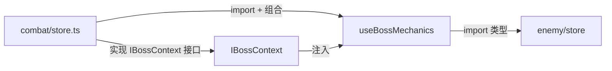

**修复方案（S3）**：
- `combat/store.ts` 实现 `IBossContext` 接口（`getPlayerName`/`createMinion`/`rebuildInitiativeOrder`）
- `useBossMechanics` 接收 `bossCtx: IBossContext` 参数，不再直接 import `useCharacterStore` 和 `useEnemyStore`
- `rebuildInitiativeOrder` 替代了原 `setInitiativeCallback` hack，语义更清晰
- Boss 机制可独立测试（仅 mock `IBossContext` 接口而非完整 Pinia Store 链路）

#### C3: inventory ↔ equipment 双向依赖（已修复）

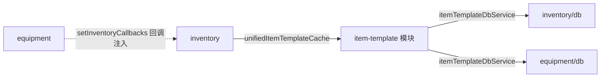

**修复方案（A1/G1）**：
- 新增 `item-template` 模块，聚合 `config_items`（普通物品）与 `config_equipmentItems`（装备）查询
- `inventory/store.ts` 通过 `unifiedItemTemplateCache.getAll()` 获取合并后的模板，不再直接 import `equipmentDbService`
- `equipment/store.ts` 通过 `setInventoryCallbacks` 注入的 `addItem`/`removeItem`/`flushPersist` 回调访问 inventory，不再直接 import `inventory/store`
- 回调注入由 `gameBootstrap.initialize` 完成，`dispose` 时 `clearInventoryCallbacks` 清除引用
- 依赖方向：`inventory → item-template → inventory.db + equipment.db`（单向，无循环）；`equipment -.→ inventory`（运行时回调，非静态依赖）

#### C5: inventory ↔ quest 双向依赖（已修复）

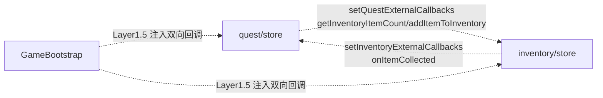

**修复方案（ARCH-2）**：
- 新增 `setInventoryExternalCallbacks`/`clearInventoryExternalCallbacks`（inventory 模块）与 `setQuestExternalCallbacks`/`clearQuestExternalCallbacks`（quest 模块）两组回调注入函数
- quest 的 `acceptQuest`/`_grantQuestRewards` 经注入的 `getInventoryItemCount`/`addItemToInventory` 回调访问背包
- inventory 的 `addItem` 成功时经注入的 `onItemCollected` 回调通知 quest 推进 collect 任务进度
- 不使用 EventBus（物品收集是同步语义）也不使用跨 Store 直接调用（会引入静态循环依赖），由 `gameBootstrap.initialize` 在 Layer 1.5 统一注入、`dispose` 时清空

---

## 六、跨层调用问题

### 6.1 玩法层直接访问持久层

探索模块的跨层调用已通过 `src/services/CrossModuleQuery.ts` 单例服务收口，探索 Store 仅依赖该服务，不再直接 import 其他模块的 DbService。物品模板查询统一经 item-template 模块的 `unifiedItemTemplateCache` 命中内存缓存（ARCH-1 修复：原 `services/ItemTemplateCache` 已删除，避免双重缓存数据不一致）。

跨模块查询收口情况：

| 调用位置 | 当前被调用方 | 用途 |
|----------|----------|------|
| `buildAreaConfig` | `crossModuleQuery.getAllItemTemplates()` | 构建物品池（经 unifiedItemTemplateCache 缓存） |
| `loadAreaConfig` | `crossModuleQuery.getLocationData()` | 加载地点数据 |
| `getQuestRequiredMonsters` | `crossModuleQuery.getQuestDefinitionsByBoard()` | 获取任务怪物 |
| `pickRandomShop` | `crossModuleQuery.getAllShopConfigs()` | 随机选商店 |

### 6.1.1 CHR-4 character 直接依赖多模块 DbService（已修复）

`src/modules/character/store.ts` 原直接 import 了 6 个其他模块的 DbService，现已通过 `CharacterLifecycleService` 收口（CHR-4 修复）。

**修复后的依赖结构**：

```typescript
// character/store.ts（修复后）
import { characterDbService } from './db';
import { characterLifecycleService } from '@/services/CharacterLifecycleService';
```

**收口情况**：

| 调用位置 | 原被调用方 | 现被调用方 | 用途 |
|----------|----------|----------|------|
| `createCharacter` | `skillsDbService.saveSkillsData()` / `getSkillTemplatesByClass()` | `characterLifecycleService.initializeCharacterSkills(id, classId)` | 初始化角色技能（查询模板 + 填充技能栏 + 持久化） |
| `deleteCharacter` | 6 个模块 DbService 的 delete 方法 | `characterLifecycleService.cascadeDeleteCharacter(id)` | 级联删除 6 个模块数据（Promise.allSettled 并行） |

**CharacterLifecycleService 内部依赖**：

| 方法 | 被调用方 | 用途 |
|----------|----------|----------|
| `initializeCharacterSkills` | `skillsDbService.getSkillTemplatesByClass` / `saveSkillsData` | 查询技能模板 + 持久化技能数据 |
| `cascadeDeleteCharacter` | `skillsDbService.deleteSkillsData` | 删除 char_skills 表 |
| `cascadeDeleteCharacter` | `inventoryDbService.deleteInventory` | 删除 char_inventory 表 |
| `cascadeDeleteCharacter` | `equipmentDbService.deleteEquipment` | 删除 char_equipment 表 |
| `cascadeDeleteCharacter` | `explorationDbService.deleteExplorationData` | 删除 char_exploration 表 |
| `cascadeDeleteCharacter` | `adventureLogDbService.deleteAdventureLog` | 删除 runtime_adventureLogs 表 |
| `cascadeDeleteCharacter` | `questDbService.deleteCharacterQuests` | 删除 char_quests 表 |

### 6.1.2 CHR-5 console 直接依赖多模块 DbService（已修复）

`src/modules/console/`（管理后台入口）原直接 import 了 4 个模块的 DbService，现已通过 `AdminQueryService` 收口（CHR-5 修复）。

**修复后的依赖结构**：

```typescript
// modules/console/commands/inventory.ts（修复后）
import { adminQueryService } from '@/services/AdminQueryService';
```

**收口情况**：

| 调用位置 | 原被调用方 | 现被调用方 | 用途 |
|----------|----------|----------|------|
| `item` 命令（无参数） | `inventoryDbService.getAllItemTemplates` / `equipmentDbService.getAllEquipmentTemplates` | `adminQueryService.queryAllItemTemplates()` | 列出所有物品模板（消耗品 + 装备） |
| `item` 命令（按 ID） | `inventoryDbService.getItemTemplate` / `equipmentDbService.getEquipmentTemplate` | `adminQueryService.queryItemTemplate(itemId)` | 按ID查物品模板（先查消耗品，未命中再查装备） |
| `spawn` 命令（无参数） | `enemyDbService.getAllEnemyTemplates` / `bossDbService.getAllBossTemplates` | `adminQueryService.queryAllEnemyTemplates()` | 列出所有敌人模板（普通怪物 + Boss） |

### 6.2 Store 初始化顺序耦合

初始化顺序由 `src/services/GameBootstrap.ts` 统一编排，各 Store 的 `init` 仅负责加载自身状态，不再隐式初始化其他 Store。

**`GameBootstrap.initialize(characterId)` 初始化顺序（P3-128 分层并行）**：

```
Layer 1（并行）    ：log + inventory
Layer 1.5（同步）  ：注入回调（setInventoryCallbacks / setInventoryExternalCallbacks /
                     setQuestExternalCallbacks / setBossCreateFn）
Layer 2（并行）    ：equipment + skill + map
Layer 3            ：exploration
Layer 4            ：quest
```

- 各 Store 的 `init` 仅加载自身状态，不再隐式初始化其他 Store（EXP-5 修复）
- Layer 1.5 注入的回调（A1/G1、ARCH-2、阶段四/TS-2 修复）：
  - `setInventoryCallbacks(inventoryStore.addItem, inventoryStore.removeItem, inventoryStore.flushPersist)`：装备模块经回调操作背包（含 DB-1/DB-2 flushPersist）
  - `setInventoryExternalCallbacks({ onItemCollected: questStore.onItemCollected })`：inventory 通知 quest 收集进度
  - `setQuestExternalCallbacks({ getInventoryItemCount, addItemToInventory })`：quest 经回调访问背包
  - `setBossCreateFn(...)`：enemy 模块经回调创建 Boss 实例（切断 enemy → boss 静态依赖）

**`GameBootstrap.dispose()` 清理范围**（按初始化逆序）：

| 清理对象 | 清理内容 |
|----------|----------|
| `useCombatStore().dispose()` | 清理战斗定时器（turnTimerId / bossIntroTimerId） |
| `useExplorationStore().dispose()` | 清理 EventBus 监听器（`clearGroup('exploration')`）与 UI 回调 |
| `useAudioStore().dispose()` | P3-116 后去抖定时器已移除，保留为空操作（满足 Disposable 接口） |
| `clearInventoryCallbacks()` | 清除 equipment 模块的背包回调引用（A1/G1 修复：避免角色切换后回调指向旧 Store 实例） |
| `clearInventoryExternalCallbacks()` / `clearQuestExternalCallbacks()` | 清除 inventory ↔ quest 双向回调引用（ARCH-2 修复） |
| `setBossCreateFn(null)` | 清除 enemy 模块的 Boss 创建回调引用（阶段四：避免回调泄漏） |

> 仅清理显式实现了 `Disposable` 接口的 Store，TypeScript 在编译期校验 dispose 方法签名（ARCH-8 修复）。

---

## 七、EventBus 事件依赖图

### 7.1 事件发布订阅关系

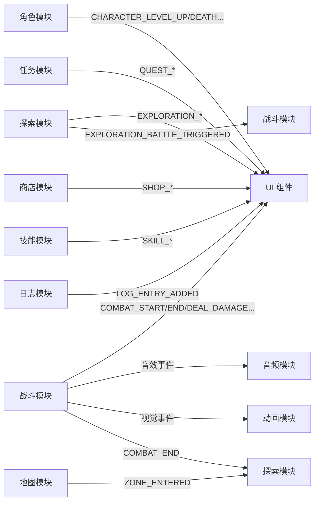

### 7.2 事件依赖统计

| 事件类型 | 发布方 | 订阅方 | 数量 |
|----------|--------|--------|------|
| 战斗事件 | combat | UI、audio、animation、exploration | 11 |
| 探索事件 | exploration | UI、combat | 7 |
| 角色事件 | character | UI | 6 |
| 通用事件 | 多个 | UI | 11 |
| 任务事件 | quest | UI | 4 |
| 商店事件 | shop | UI | 3 |
| 技能事件 | skill | UI | 2 |

---

## 八、依赖关系优化建议

### 8.1 短期优化（低风险）

| 编号 | 问题 | 建议 | 优先级 | 状态 |
|------|------|------|--------|------|
| O9 | character/store.ts 直接依赖 6 个模块 DbService | 抽取 CharacterLifecycleService 收口级联删除/初始化 | 高 | ✅ 已修复（CHR-4） |
| O10 | modules/console.ts 直接依赖 4 个模块 DbService | 通过各模块 Store或 AdminQueryService 访问 | 中 | ✅ 已修复（CHR-5） |
| O11 | inventory ↔ quest 双向静态依赖 | 通过 setInventoryExternalCallbacks / setQuestExternalCallbacks 双向回调注入切断循环依赖 | 中 | ✅ 已修复（ARCH-2） |

### 8.2 中期优化（中等风险）

| 编号 | 问题 | 建议 | 优先级 | 状态 |
|------|------|------|--------|------|
| O4 | boss 与 combat 双向耦合 | 定义 IBossContext 接口反向解耦 | 中 | ✅ 已修复（S3） |
| O5 | inventory ↔ equipment 双向依赖 | 抽取物品模板统一管理层，equipment 和 inventory 都从该层获取模板 | 中 | ✅ 已修复（A1/G1，item-template 模块 + setInventoryCallbacks） |
| O6 | combat 模块依赖广度大 | 引入 CombatContext 聚合角色/敌人/技能/背包的查询接口，减少直接依赖 | 低 | ✅ 已修复（S2，ICombatContext 读写分离） |

### 8.3 长期优化（高风险）

| 编号 | 问题 | 建议 | 优先级 |
|------|------|------|--------|
| O7 | 模块间直接 Store 调用导致强耦合 | 引入依赖注入容器或服务定位器模式 | 低 |
| O8 | 缺少模块边界强制约束 | 引入 ESLint 规则禁止跨层 import（如 `no-restricted-imports`） | 中 |

---

## 九、已完成的依赖优化总结

| 修复编号 | 问题 | 修复方案 | 涉及文件 |
|----------|------|----------|----------|
| CHR-4 | character Store 直接依赖 6 个模块 DbService | 新增 `CharacterLifecycleService`，收口 `initializeCharacterSkills` 与 `cascadeDeleteCharacter` | `src/services/CharacterLifecycleService.ts`、`src/modules/character/store.ts` |
| CHR-5 | console 直接依赖 4 个模块 DbService | 新增 `AdminQueryService`，收口物品/敌人模板查询 | `src/services/AdminQueryService.ts`、`src/modules/console/commands/inventory.ts`、`combat.ts` |
| S2 | combat 模块直接 import 6 个外部 Store | 新增 `combatContext.ts`，聚合为 `ICombatContext`（`ICombatQuery` + `ICombatCommand` 读写分离） | `src/modules/combat/combatContext.ts`、`src/modules/combat/store.ts` |
| S3 | combat ↔ boss 双向静态耦合 | 新增 `IBossContext` 接口，combat/store.ts 实现接口并注入到 `useBossMechanics` | `src/modules/combat/composables/useBossMechanics.ts`、`src/modules/combat/store.ts` |
| A1/G1 | inventory ↔ equipment 双向依赖 | 新增 `item-template` 模块（`unifiedItemTemplateCache`）+ `setInventoryCallbacks` 回调注入 | `src/modules/item-template/*`、`src/modules/inventory/store.ts`、`src/modules/equipment/store.ts` |
| EXP-5 | 探索模块隐式初始化其他 Store | 新增 `GameBootstrap`，统一编排初始化顺序与逆序 dispose 清理 | `src/services/GameBootstrap.ts` |
| EXP-4 | 探索模块跨模块查询分散 | 新增 `CrossModuleQuery`，收口 map/inventory/quest/shop 查询 | `src/services/CrossModuleQuery.ts` |
| PERF-1 | 探索模块每次 buildAreaConfig 全表扫描 | 物品模板懒加载内存缓存统一收敛于 `unifiedItemTemplateCache`（ARCH-1 后替代原 `services/ItemTemplateCache`） | `src/modules/item-template/cache.ts` |
| ARCH-1 | services/ItemTemplateCache 与模块缓存双重缓存 | 删除 `services/ItemTemplateCache`，统一走 item-template 模块的 `unifiedItemTemplateCache` | `src/services/CrossModuleQuery.ts`（删除 `src/services/ItemTemplateCache.ts`） |
| ARCH-2 | inventory ↔ quest 双向静态依赖 | 新增 `setInventoryExternalCallbacks` / `setQuestExternalCallbacks` 双向回调注入 | `src/modules/inventory/store.ts`、`src/modules/quest/store.ts`、`src/services/GameBootstrap.ts` |
| ARCH-6 | modules 聚合入口 `export *` 重名静默覆盖风险 | 改为显式命名导出，重名在编译期直接报错 | `src/modules/index.ts` |
| ARCH-7 | item-template 聚合层引入循环依赖风险 | 聚合层直接引用 `inventory/db` 与 `equipment/db` 内部文件，避免走公共入口的循环 | `src/modules/item-template/db.ts` |
| ARCH-8 | dispose 使用 `as unknown as` 断言无类型安全 | 定义 `Disposable` 接口，TypeScript 编译期校验 dispose 签名 | `src/services/GameBootstrap.ts` |
| ARCH-11 | 探索事件处理器分散在 store.ts 的 switch 语句 | 新增 `events.ts`，注册表模式分发（`cellEventHandlers` + `effectHandlers`） | `src/modules/exploration/events.ts`、`src/modules/exploration/store.ts` |
| P3-116 | 音频设置散落 audio/db.ts 且直接操作 IndexedDB | 新增 `game` 模块 `GameStore` 收敛全局状态（currentCharacterId/currentShopId/gameSettings），删除 `audio/db.ts`，audio 仅依赖 bus + game | `src/modules/game/*`、`src/modules/audio/store.ts` |
| P3-128 | GameBootstrap 7 步串行初始化耗时 | 按依赖重组为 4 层并行初始化 + 回调注入层 | `src/services/GameBootstrap.ts` |
| P3-141 | modules 聚合入口静态导出 audioService 拉入 Tone.js | audioService 不再从 modules 入口 re-export，由 main.ts 动态 `import('@/modules/audio/service')` 加载 | `src/modules/audio/index.ts`、`src/modules/index.ts`、`src/main.ts` |

---

## 十、版本历史

| 日期 | 版本 | 作者 | 变更说明 |
|------|------|------|----------|
| 2026-08-03 | v4.0 | System | 基于源码逐项复核修正：矩阵补全 console 行（命令子模块经各模块 Store 访问数据）并修正 boss 行 data 列；全景图移除源码中不存在的 animation → bus、admin → bus 边，补充 console → character 边；补充 P3-141（audioService 由 main.ts 动态 import 加载）；P3-116 全局状态收敛内容复核一致 |
| 2026-08-03 | v3.0 | System | 新增 `game` 全局状态模块节点（P3-116）；audio 移除 data 依赖（audio/db.ts 删除）；ARCH-1 统一物品模板缓存；ARCH-2 inventory ↔ quest 双向回调注入；GameBootstrap 分层并行初始化（P3-128）；ARCH-6 显式命名导出；map 移除 character 依赖；exploration 新增 enemy 依赖 |
| 2026-07-10 | v2.0 | System | 服务层补全 6 个服务；新增 item-template 模块；CHR-4/CHR-5/S2/S3/A1/G1 等修复 |

---

**文档结束**