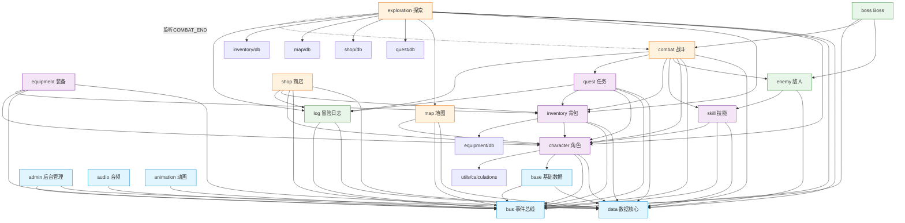
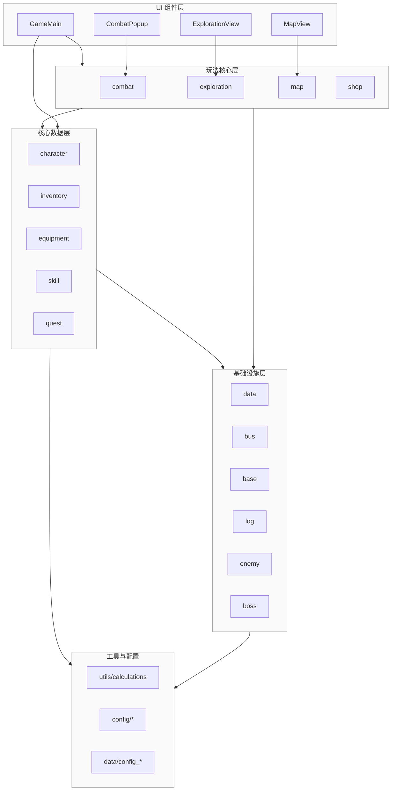
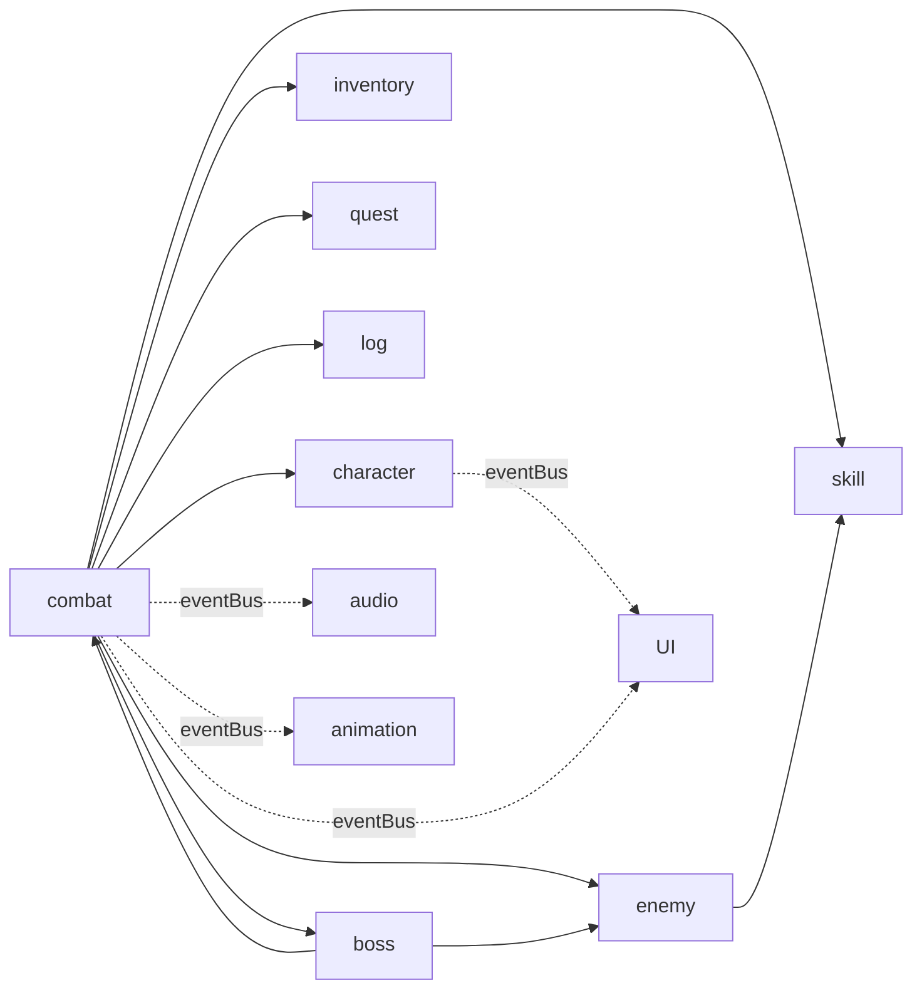
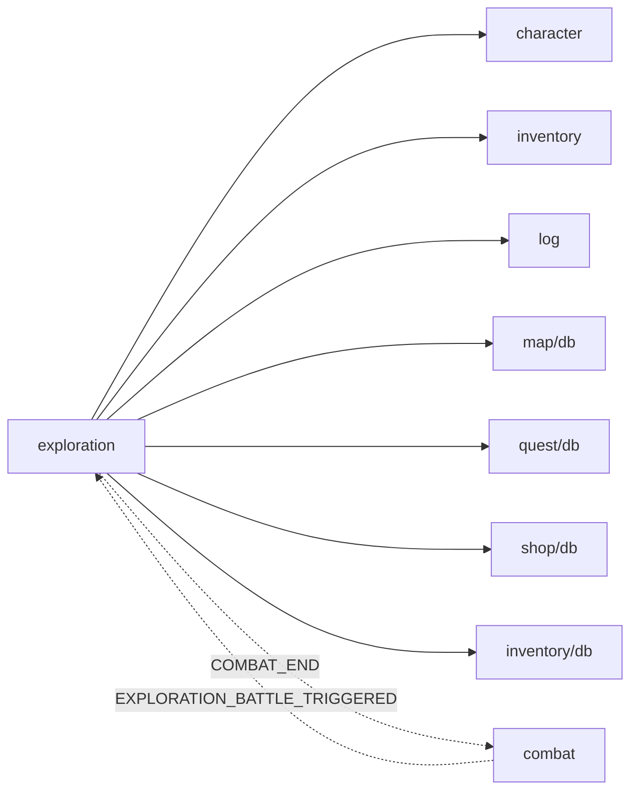
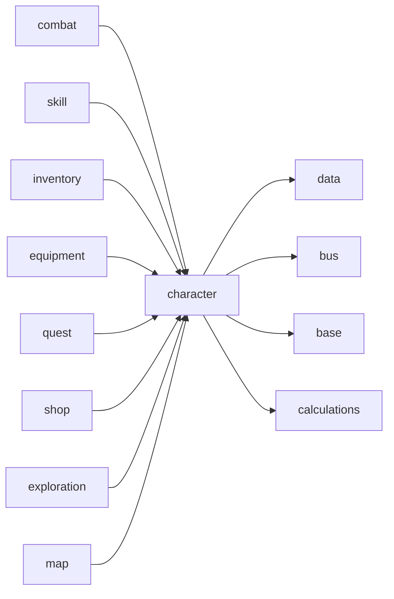
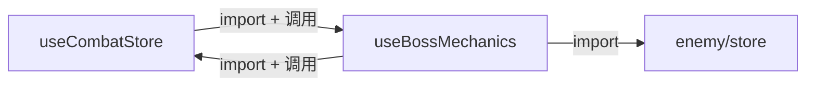
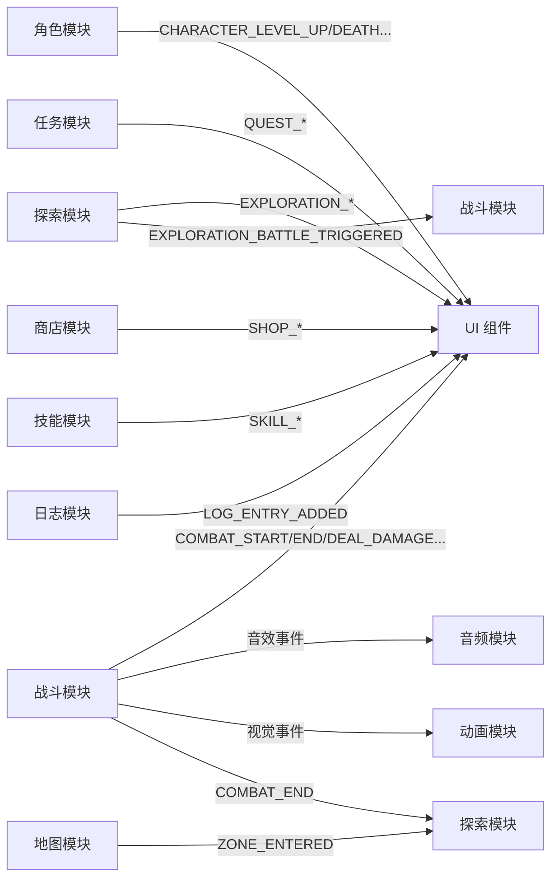

# 模块依赖关系梳理

## 文档信息

| 项目 | 内容 |
|------|------|
| 标题 | 模块依赖关系梳理 |
| 版本 | v1.0 |
| 生成日期 | 2026年7月6日 |
| 所属目录 | `doc/project/` |
| 关联文档 | 01_MODULE_FUNCTIONS.md、DATA_ARCHITECTURE_OVERVIEW.md |

---

## 概述

本文档基于源码 `import` 关系与 Store Action 调用链，梳理 18 个模块之间的依赖关系，识别循环依赖、跨层调用、隐式耦合等问题，为架构优化提供依据。

依赖关系分为三类：
- **静态依赖**：通过 `import` 引入的类型、函数、Store（编译期确定）
- **运行时依赖**：通过 Store Action 调用、EventBus 发布订阅（运行期发生）
- **数据层依赖**：通过 DbService 跨模块直接查询（绕过 Store）

---

## 一、模块依赖全景图



> 说明：虚线表示 EventBus 事件监听；`xxx_db` 表示直接 import 其他模块的 DbService（跨层数据查询）。

---

## 二、分层依赖关系

### 2.1 分层架构依赖方向



### 2.2 依赖方向规范

| 方向 | 是否允许 | 说明 |
|------|----------|------|
| 上层 → 下层 | 允许 | UI → 玩法层 → 数据层 → 基础层 |
| 同层之间 | 谨慎 | 玩法层之间通过 EventBus 或 Store 调用 |
| 下层 → 上层 | 禁止 | 基础层不应依赖玩法层 |
| 跨层跳级 | 谨慎 | UI 直接调核心数据层 Store 是允许的 |

---

## 三、模块依赖矩阵

### 3.1 静态依赖矩阵（import 关系）

下表行表示"依赖方"，列表示"被依赖方"。`S` 表示 Store 依赖，`D` 表示 DbService 依赖，`T` 表示类型/工具依赖。

| 依赖方 \ 被依赖方 | data | bus | character | inventory | equipment | skill | quest | log | enemy | map | shop | combat |
|---|---|---|---|---|---|---|---|---|---|---|---|---|
| character | S | S | - | - | - | - | - | - | - | - | - | - |
| inventory | S | - | S | - | D | - | - | S | - | - | - | - |
| equipment | S | - | S | S | - | - | - | S | - | - | - | - |
| skill | S | S | S | - | - | - | - | S | - | - | - | - |
| quest | S | S | S | S | - | - | - | S | - | - | - | - |
| combat | S | S | S | S | - | S | S | S | S | - | - | - |
| exploration | S | S | S | S | - | - | D | S | - | D | D | - |
| map | S | S | S | - | - | - | - | - | - | - | - | - |
| shop | S | S | S | S | - | - | - | S | - | - | - | - |
| enemy | S | - | - | - | - | S | - | - | - | - | - | - |
| boss | - | S | - | - | - | - | - | - | S | - | - | S |
| log | S | S | - | - | - | - | - | - | - | - | - | - |

### 3.2 运行时调用矩阵（Store Action 调用）

| 调用方 \ 被调用方 | character | inventory | equipment | skill | quest | log | enemy | combat |
|---|---|---|---|---|---|---|---|---|
| combat | takeDamage/gainExp/gainGold/handleDeath/receiveHeal | useItem/addItem | - | castSkill/tickCooldowns | onEnemyKilled | addLogEntry | createEnemy/takeDamage/deleteEnemy/useSkill | - |
| exploration | takeDamage/receiveHeal/changeMp/gainGold/gainExp | addItem/getItemInfo | - | - | - | addLogEntry | - | - |
| inventory | receiveHeal/changeMp/applyBonus | - | - | - | - | addLogEntry | - | - |
| equipment | applyBonus/removeBonus | addItem | - | - | - | addLogEntry | - | - |
| skill | changeMp/receiveHeal | - | - | - | - | addLogEntry | - | - |
| quest | gainExp/gainGold | addItem | - | - | - | addLogEntry | - | - |
| shop | spendGold/gainGold | addItem/removeItem/getItemInfo | - | - | - | addLogEntry | - | - |

---

## 四、关键依赖链分析

### 4.1 战斗模块依赖链



**分析**：
- 战斗模块是最复杂的依赖中心，直接依赖 7 个模块
- `boss` 与 `combat` 存在双向依赖（combat 调用 boss 的 initBossFeatures，boss 调用 combat 的 Store）
- 战斗模块通过 composables 拆分缓解了复杂度，但依赖广度不变

### 4.2 探索模块依赖链



**分析**：
- 探索模块通过 EventBus 与战斗模块双向通信（探索触发战斗，战斗结束通知探索）
- 探索模块直接 import 了 4 个模块的 DbService（map/quest/shop/inventory），绕过 Store 层
- 这是**架构违规**：玩法层不应直接访问其他模块的持久层

### 4.3 角色模块依赖链



**分析**：
- 角色模块是**被依赖最多的模块**（8 个模块依赖它）
- 角色模块本身只依赖基础设施层，依赖方向正确
- 高扇入意味着角色模块的任何改动都会影响全局，需要特别谨慎

---

## 五、循环依赖与耦合问题识别

### 5.1 已识别的循环/双向依赖

| 编号 | 涉及模块 | 依赖类型 | 严重程度 | 描述 |
|------|----------|----------|----------|------|
| C1 | combat ↔ boss | 静态双向 | 中 | combat 调用 boss 的 initBossFeatures，boss 调用 combat 的 Store |
| C2 | exploration ↔ combat | 事件双向 | 低 | 通过 EventBus 双向通信（EXPLORATION_BATTLE_TRIGGERED + COMBAT_END） |
| C3 | inventory ↔ equipment | 静态双向 | 中 | equipment 调 inventory.addItem；inventory 加载装备模板时调 equipmentDbService |
| C4 | combat ↔ skill | 静态双向 | 低 | combat 调 skill.castSkill；skill 的 castSkill 返回伤害供 combat 使用 |

### 5.2 循环依赖详解

#### C1: combat ↔ boss 双向依赖



**问题**：
- `combat/store.ts` 通过 composables 引入 `useBossMechanics`
- `boss` 模块的 composables 内部又调用 `useCombatStore()` 获取状态
- 这形成了一个紧耦合的循环，boss 模块无法独立测试和复用

**缓解措施**：
- 当前通过 `orderBuilder` 延迟绑定机制缓解了初始化顺序问题
- 但根本上 boss 模块应作为 combat 的子模块，或通过接口解耦

#### C3: inventory ↔ equipment 双向依赖


**问题**：
- equipment Store 调用 inventory Store 的 addItem（装备卸下时放回背包）
- inventory Store 加载物品模板时，从 equipmentDbService 获取装备模板
- 数据流向不清晰：装备模板既属于 equipment 又被 inventory 引用

---

## 六、跨层调用问题

### 6.1 玩法层直接访问持久层

探索模块 `exploration/store.ts` 中存在多处跨模块 DbService 调用：

```typescript
// exploration/store.ts 中的跨层调用
import { mapDbService } from '../map/db';           // 跨模块访问 map 持久层
import { inventoryDbService } from '../inventory/db'; // 跨模块访问 inventory 持久层
import { questDbService } from '../quest/db';       // 跨模块访问 quest 持久层
import { shopDbService } from '../shop/db';         // 跨模块访问 shop 持久层
```

**违规点**：
| 调用位置 | 被调用方 | 用途 | 应改为 |
|----------|----------|------|--------|
| `buildAreaConfig` | `inventoryDbService.getAllItemTemplates()` | 构建物品池 | 通过 inventoryStore 或专门服务 |
| `loadAreaConfig` | `mapDbService.getLocationData()` | 加载地点数据 | 通过 mapStore |
| `getQuestRequiredMonsters` | `questDbService.getQuestDefinitionsByBoard()` | 获取任务怪物 | 通过 questStore |
| `pickRandomShop` | `shopDbService.getAllShopConfigs()` | 随机选商店 | 通过 shopStore |

**影响**：
- 绕过 Store 层导致状态不一致风险（Store 缓存与 DB 不同步）
- 增加模块间隐式耦合，难以追踪数据来源
- 单元测试困难（需要 mock DbService 而非 Store）

### 6.2 Store 初始化顺序耦合

探索模块 `init()` 方法内部调用了其他 Store 的初始化：

```typescript
// exploration/store.ts init() 方法
async function init(characterId: string): Promise<void> {
  currentCharacterId.value = characterId;
  useLogStore().initialize(characterId);          // 隐式初始化 log
  const inventoryStore = useInventoryStore();
  await inventoryStore.initialize(characterId);   // 隐式初始化 inventory
  // ...
}
```

**问题**：
- 初始化顺序硬编码在探索模块中，无法灵活调整
- 如果 log/inventory 的 initialize 改变签名或行为，探索模块会受影响
- 应由上层（App.vue 或 GameMain.vue）统一编排初始化顺序

---

## 七、EventBus 事件依赖图

### 7.1 事件发布订阅关系



### 7.2 事件依赖统计

| 事件类型 | 发布方 | 订阅方 | 数量 |
|----------|--------|--------|------|
| 战斗事件 | combat | UI、audio、animation、exploration | 11 |
| 探索事件 | exploration | UI、combat | 7 |
| 角色事件 | character | UI | 6 |
| 通用事件 | 多个 | UI | 11 |
| 任务事件 | quest | UI | 4 |
| 商店事件 | shop | UI | 3 |
| 技能事件 | skill | UI | 2 |

---

## 八、依赖关系优化建议

### 8.1 短期优化（低风险）

| 编号 | 问题 | 建议 | 优先级 |
|------|------|------|--------|
| O1 | exploration 跨模块 DbService 调用 | 改为通过对应 Store 的 Action 或专门的查询接口 | 高 |
| O2 | exploration.init 隐式初始化其他 Store | 移到 GameMain.vue 统一编排初始化顺序 | 中 |
| O3 | combatListenerRegistered 全局标志 | 改为 onGroup 分组订阅，切换角色时 clearGroup | 中 |

### 8.2 中期优化（中等风险）

| 编号 | 问题 | 建议 | 优先级 |
|------|------|------|--------|
| O4 | boss 与 combat 双向耦合 | 将 boss 作为 combat 的子目录（`combat/boss/`），或定义 IBossContext 接口反向解耦 | 中 |
| O5 | inventory ↔ equipment 双向依赖 | 抽取物品模板统一管理层，equipment 和 inventory 都从该层获取模板 | 中 |
| O6 | combat 模块依赖广度大 | 引入 CombatContext 聚合角色/敌人/技能/背包的查询接口，减少直接依赖 | 低 |

### 8.3 长期优化（高风险）

| 编号 | 问题 | 建议 | 优先级 |
|------|------|------|--------|
| O7 | 模块间直接 Store 调用导致强耦合 | 引入依赖注入容器或服务定位器模式 | 低 |
| O8 | 缺少模块边界强制约束 | 引入 ESLint 规则禁止跨层 import（如 `no-restricted-imports`） | 中 |

详见 [06_MODULE_ISSUES_AND_FIXES.md](./06_MODULE_ISSUES_AND_FIXES.md) 和 [07_UPGRADE_PLAN.md](./07_UPGRADE_PLAN.md)。

---

**文档结束**
